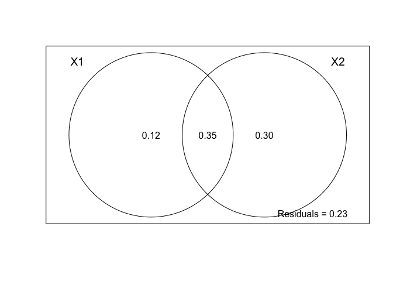
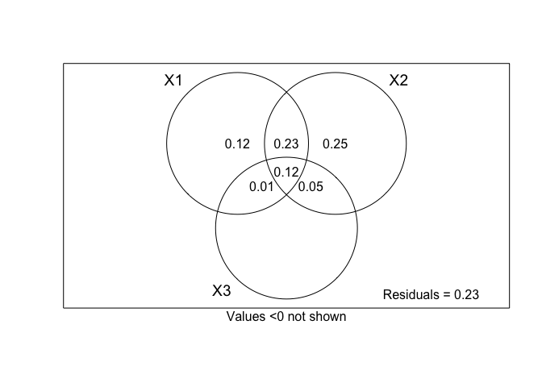
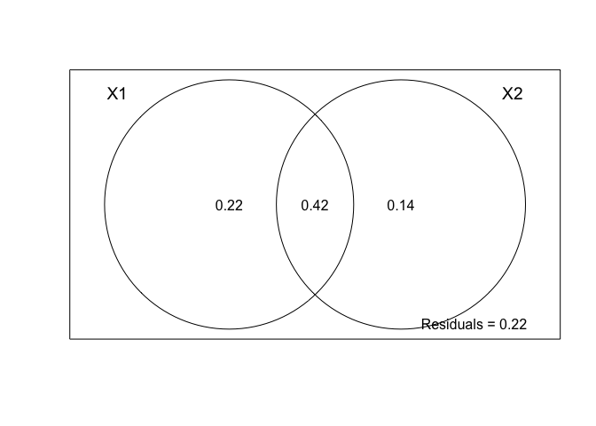
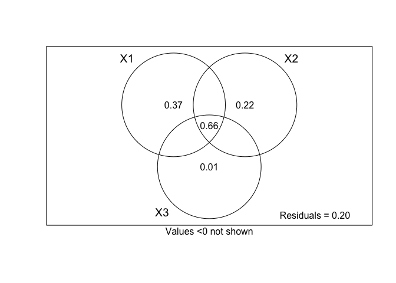

Predict Anaerobe Abundance
================
Emily Lacroix
25 JAN 2023

- <a href="#set-up" id="toc-set-up">Set-up</a>
  - <a href="#load-libraries" id="toc-load-libraries">Load libraries</a>
  - <a href="#file-names" id="toc-file-names">File names</a>
  - <a href="#import" id="toc-import">Import</a>
  - <a href="#join-it-all-together" id="toc-join-it-all-together">Join it
    all together</a>
- <a href="#all-sites---predict-anaerobe-copy-number"
  id="toc-all-sites---predict-anaerobe-copy-number">All sites - predict
  anaerobe copy number</a>
  - <a href="#backward-selection-multiple-linear-regression"
    id="toc-backward-selection-multiple-linear-regression">Backward
    selection, multiple linear regression</a>
  - <a href="#variance-partitioning-o2-supply-and-o2-demand"
    id="toc-variance-partitioning-o2-supply-and-o2-demand">Variance
    partitioning: O2 supply and O2 demand</a>
    - <a href="#check-partitions-for-multi-collinearities"
      id="toc-check-partitions-for-multi-collinearities">Check partitions for
      multi-collinearities</a>
    - <a href="#varpart" id="toc-varpart">VarPart</a>
  - <a href="#variance-partitioning-o2-supply-o2-demand-management"
    id="toc-variance-partitioning-o2-supply-o2-demand-management">Variance
    Partitioning: O2 supply, O2 demand, management</a>
    - <a href="#significance-testing---using-rda"
      id="toc-significance-testing---using-rda">Significance testing - using
      RDA</a>
- <a href="#crec-only---predict-anaerobe-copy-number"
  id="toc-crec-only---predict-anaerobe-copy-number">CREC only - predict
  anaerobe copy number</a>
  - <a href="#backward-selection-multiple-linear-regression-1"
    id="toc-backward-selection-multiple-linear-regression-1">Backward
    selection, multiple linear regression</a>
  - <a href="#variance-partitioning---o2-supply-and-demand"
    id="toc-variance-partitioning---o2-supply-and-demand">Variance
    Partitioning - O2 Supply and Demand</a>
    - <a href="#check-partitions-for-multi-collinearities-1"
      id="toc-check-partitions-for-multi-collinearities-1">Check partitions
      for multi-collinearities</a>
    - <a href="#varpart-1" id="toc-varpart-1">VarPart</a>
  - <a href="#variance-partitioning-o2-supply-demand-and-management"
    id="toc-variance-partitioning-o2-supply-demand-and-management">Variance
    Partitioning: O2 supply, demand, and management</a>
    - <a href="#significance-testing-using-rda"
      id="toc-significance-testing-using-rda">Significance testing using
      RDA</a>

# Set-up

## Load libraries

``` r
library(MASS)
library(MuMIn)
library(car)
library(vegan)
library(psych)
library(Hmisc)
library(readxl)
library(lme4)
library(outliers)
library(tidyverse)

conflicted::conflict_prefer("select", "dplyr")
conflicted::conflict_prefer("filter", "dplyr")
```

## File names

``` r
all_data_excel <- "AllData_03AUG.xlsx"
```

## Import

``` r
mineral <- 
  all_data_excel %>% 
  read_xlsx(sheet = "mineral_protection") %>% 
  select(sample, perc_clay) %>% 
  separate(sample, into = c("site", "till", "amend", "rep")) %>% 
  mutate(
    landscape_position = if_else(site == "GR", amend, NA_character_),
    across(amend, ~if_else(site == "GR", "U", .)),
    across(rep, as.numeric)
  )

sixteenS_abund <-
  all_data_excel %>% 
  read_xlsx(sheet = "dna_ddpcr", na = "NA") %>% 
  distinct(site, till, amend, landscape_position, rep, copies_per_g_sixteenS)

anaerobe_copies_total <- 
  all_data_excel %>% 
  read_xlsx(sheet = "anaerobe_copies", na = "NA") %>% 
  add_row( #adding blank rows for GR-NT-F for now
    site = "GR",
    till = "NT",
    amend = "U",
    landscape_position = "F",
    rep = c(1,3),
    anaerobe_copies_per_g = NA_real_
  )

climate <- 
  all_data_excel %>% 
  read_xlsx(sheet = "climate", na = "NA") %>% 
  rename(rep = field_rep)


root_mass_bd <-
  all_data_excel %>% 
  read_xlsx(sheet = "gravimetric", na = "NA") %>% 
  mutate(
    avg_plant_mass_per_cm3 = plant_mass_2_mm / volume_cm3
  ) %>% 
    group_by(site, till, amend, landscape_position, field_rep) %>% 
    summarise(
      avg_plant_mass_per_cm3 = mean(avg_plant_mass_per_cm3, na.rm = TRUE),
      avg_bd = mean(bd, na.rm = TRUE)
    ) %>% 
  rename(rep = field_rep)


c_n <- 
  all_data_excel %>% 
  read_xlsx(sheet = "c_n", na = "NA") %>%
  rename(
    amend = amend_pos,
    rep = field_rep
  ) %>% 
  mutate(
    landscape_position = if_else(site == "GR", amend, NA_character_),
    across(amend, ~if_else(site == "GR", "U", .)),
  )

anaerobe_matrix <- #WO-UN-U-2 outlier already removed. 
  all_data_excel %>% 
  read_xlsx(sheet = "dna_ddpcr", na = "NA") %>% 
  group_by(
    site, till, amend, landscape_position, rep, target_gene
  ) %>% 
  summarise(
    copies_per_g = mean(copies_per_g, na.rm = TRUE),
    prop = mean(prop, na.rm = TRUE)
  ) %>% 
  pivot_wider(
    id_cols = c(site, till, amend, landscape_position, rep),
    names_from = target_gene,
    values_from = c(copies_per_g, prop)
  )

aggregate_est <- 
  all_data_excel %>% 
  read_xlsx(sheet = "agg_est") %>% 
  select(site, till, amend, landscape_position, rep, wsa_perc)
```

## Join it all together

``` r
all_data <- 
  mineral %>% 
  left_join(
    sixteenS_abund, 
    by = c("site", "till", "amend", "landscape_position", "rep")
  ) %>% 
  left_join(
    anaerobe_copies_total,
    by = c("site", "till", "amend", "landscape_position", "rep")
  ) %>% 
  left_join(
    climate,
    by = c("site", "till", "amend", "landscape_position", "rep")
  ) %>% 
  left_join(
    root_mass_bd,
    by = c("site", "till", "amend", "landscape_position", "rep")
  ) %>% 
  left_join(
    c_n,
    by = c("site", "till", "amend", "landscape_position", "rep")
  ) %>% 
  left_join(
    anaerobe_matrix,
    by = c("site", "till", "amend", "landscape_position", "rep")
  ) %>% 
  left_join(
    aggregate_est,
    by = c("site", "till", "amend", "landscape_position", "rep")  
  ) %>% 
  filter(!(site == "GR" & landscape_position == "F" & rep %in% c(1,3))) %>% 
  rowid_to_column() %>% 
  arrange(site, till, amend, landscape_position, rep) %>% 
  ungroup() %>% 
  select(-landscape_position) %>% 
  na.omit() %>% 
  mutate(
    across(till, ~factor(., levels = c("UN", "NT", "MT", "CT"))),
    across(amend, ~factor(., levels = c("U", "A"))),
    sqrt_anaerobe_copies_per_g = sqrt(anaerobe_copies_per_g)
  ) 
```

# All sites - predict anaerobe copy number

## Backward selection, multiple linear regression

``` r
multiple_reg_data <-
  all_data %>% 
  select(
    -c(
      site,
      rowid, 
      sample, 
      starts_with("prop"),
      copies_per_g_dsrAB,
      copies_per_g_gltA,
      copies_per_g_mcrA,
      copies_per_g_nirK,
      copies_per_g_nirS,
      sqrt_anaerobe_copies_per_g,
      # not considered in this dataset
      gdd0,
      gdd10, 
      #everything below this comment was sequentially deleted based on VIF
      mat_c,
      map_mm,
      precip_in_7, 
      precip_in_14,
      precip_in_10,
      npoc_mg_c_g_soil,
      perc_clay,
      avg_perc_n

      )
  )

# Fit the full model 
full.model <- lm(anaerobe_copies_per_g ~., data = multiple_reg_data)

# Stepwise regression model
step.model <- stepAIC(full.model, direction = "backward", trace = FALSE)

summary(step.model)
```

    ## 
    ## Call:
    ## lm(formula = anaerobe_copies_per_g ~ amend + copies_per_g_sixteenS + 
    ##     mean_wfps + avg_bd + avg_perc_c + ppm_n_nox, data = multiple_reg_data)
    ## 
    ## Residuals:
    ##       Min        1Q    Median        3Q       Max 
    ## -31589646 -13007244   -888627  11684282  50166773 
    ## 
    ## Coefficients:
    ##                         Estimate Std. Error t value Pr(>|t|)    
    ## (Intercept)            3.353e+08  6.119e+07   5.480 2.54e-06 ***
    ## amendA                -1.208e+07  8.391e+06  -1.439  0.15782    
    ## copies_per_g_sixteenS  3.300e-02  5.623e-03   5.869 7.23e-07 ***
    ## mean_wfps              5.856e+05  1.936e+05   3.024  0.00434 ** 
    ## avg_bd                -2.272e+08  3.897e+07  -5.830 8.19e-07 ***
    ## avg_perc_c            -1.114e+07  6.209e+06  -1.795  0.08028 .  
    ## ppm_n_nox              5.690e+06  2.047e+06   2.779  0.00826 ** 
    ## ---
    ## Signif. codes:  0 '***' 0.001 '**' 0.01 '*' 0.05 '.' 0.1 ' ' 1
    ## 
    ## Residual standard error: 22050000 on 40 degrees of freedom
    ## Multiple R-squared:  0.7841, Adjusted R-squared:  0.7517 
    ## F-statistic: 24.21 on 6 and 40 DF,  p-value: 7.067e-12

``` r
vif(step.model)
```

    ##                 amend copies_per_g_sixteenS             mean_wfps 
    ##              1.220029              1.783793              2.293885 
    ##                avg_bd            avg_perc_c             ppm_n_nox 
    ##              3.108592              3.247166              1.121683

## Variance partitioning: O2 supply and O2 demand

### Check partitions for multi-collinearities

Variables with VIF \> 5 were eliminated stepwise, with the highest VIF
variables being deleted in each iteration. Deleted variables are left as
comments in the script so users can easily reproduce process.

``` r
varpart_anaerobe_copies <- 
      all_data %>% 
      arrange(rowid) %>% 
      select(-c(site, till, rep)) %>% 
      na.omit() %>% 
      pull(anaerobe_copies_per_g)

varpart_site_data <- 
  all_data %>% 
  arrange(rowid) %>% 
  select(
    -c(
      site, rep, sample, rowid
    )
  ) %>% 
  na.omit() 
```

``` r
o2.supply.lm <- 
  lm(
    varpart_anaerobe_copies
    ~ avg_bd + 
      perc_clay +
      wsa_perc +
      mean_wfps,
      #map_mm, 
      #precip_in_7,
    data = varpart_site_data
  )

summary(o2.supply.lm)
```

    ## 
    ## Call:
    ## lm(formula = varpart_anaerobe_copies ~ avg_bd + perc_clay + wsa_perc + 
    ##     mean_wfps, data = varpart_site_data)
    ## 
    ## Residuals:
    ##       Min        1Q    Median        3Q       Max 
    ## -58854790 -14737690  -2840907  14636530  82741826 
    ## 
    ## Coefficients:
    ##               Estimate Std. Error t value Pr(>|t|)    
    ## (Intercept)  284593733   70440960   4.040 0.000222 ***
    ## avg_bd      -267784176   37016403  -7.234 6.73e-09 ***
    ## perc_clay      4193101    1322030   3.172 0.002831 ** 
    ## wsa_perc        818570     453966   1.803 0.078542 .  
    ## mean_wfps       921617     264131   3.489 0.001151 ** 
    ## ---
    ## Signif. codes:  0 '***' 0.001 '**' 0.01 '*' 0.05 '.' 0.1 ' ' 1
    ## 
    ## Residual standard error: 26260000 on 42 degrees of freedom
    ## Multiple R-squared:  0.6785, Adjusted R-squared:  0.6479 
    ## F-statistic: 22.16 on 4 and 42 DF,  p-value: 6.836e-10

``` r
vif(o2.supply.lm)
```

    ##    avg_bd perc_clay  wsa_perc mean_wfps 
    ##  1.977284  5.002131  4.285061  3.009275

``` r
o2.demand.lm <- 
  lm(
    varpart_anaerobe_copies  ~ 
      copies_per_g_sixteenS +
      npoc_mg_c_g_soil +
      #avg_perc_c +
      mat_c +
      avg_plant_mass_per_cm3,
    data = varpart_site_data
  )

summary(o2.demand.lm)
```

    ## 
    ## Call:
    ## lm(formula = varpart_anaerobe_copies ~ copies_per_g_sixteenS + 
    ##     npoc_mg_c_g_soil + mat_c + avg_plant_mass_per_cm3, data = varpart_site_data)
    ## 
    ## Residuals:
    ##       Min        1Q    Median        3Q       Max 
    ## -48022700 -22584303  -9074602  14713264  77625603 
    ## 
    ## Coefficients:
    ##                          Estimate Std. Error t value Pr(>|t|)    
    ## (Intercept)             3.664e+07  1.972e+07   1.858   0.0702 .  
    ## copies_per_g_sixteenS   3.660e-02  8.338e-03   4.389 7.51e-05 ***
    ## npoc_mg_c_g_soil        5.753e+05  1.319e+06   0.436   0.6650    
    ## mat_c                  -7.738e+05  1.234e+06  -0.627   0.5339    
    ## avg_plant_mass_per_cm3 -3.894e+08  2.230e+09  -0.175   0.8622    
    ## ---
    ## Signif. codes:  0 '***' 0.001 '**' 0.01 '*' 0.05 '.' 0.1 ' ' 1
    ## 
    ## Residual standard error: 32230000 on 42 degrees of freedom
    ## Multiple R-squared:  0.5156, Adjusted R-squared:  0.4695 
    ## F-statistic: 11.18 on 4 and 42 DF,  p-value: 2.897e-06

``` r
vif(o2.demand.lm)
```

    ##  copies_per_g_sixteenS       npoc_mg_c_g_soil                  mat_c 
    ##               1.836051               2.279328               1.357368 
    ## avg_plant_mass_per_cm3 
    ##               1.665260

### VarPart

``` r
anaerobe_mod <-
  varpart(
    varpart_anaerobe_copies,
    # Oxygen Demand - X1
    ~ copies_per_g_sixteenS +
      npoc_mg_c_g_soil +
      mat_c +
      avg_plant_mass_per_cm3,
    # Oxygen Supply - X2
    ~ avg_bd + 
      perc_clay + 
      wsa_perc +
      mean_wfps,
    data = 
      varpart_site_data,
    scale = FALSE 
  )

plot(anaerobe_mod)
```

<!-- -->

## Variance Partitioning: O2 supply, O2 demand, management

NOTE: the variable `till` represents both cultivation status and tillage
practice.

``` r
anaerobe_mod_mng <-
  varpart(
    varpart_anaerobe_copies,
    # Oxygen Demand - X1
    ~ copies_per_g_sixteenS +
      npoc_mg_c_g_soil +
      mat_c +
      avg_plant_mass_per_cm3,
    # Oxygen Supply - X2
    ~ avg_bd + 
      perc_clay + 
      wsa_perc +
      mean_wfps,
    # Management - X3
    ~ till + amend,
    data = 
      varpart_site_data,
    scale = FALSE 
  )

plot(anaerobe_mod_mng)
```

<!-- -->

### Significance testing - using RDA

First, see what is testable

``` r
anaerobe_mod_mng
```

    ## 
    ## Partition of variance in RDA 
    ## 
    ## Call: varpart(Y = varpart_anaerobe_copies, X = ~copies_per_g_sixteenS +
    ## npoc_mg_c_g_soil + mat_c + avg_plant_mass_per_cm3, ~avg_bd + perc_clay
    ## + wsa_perc + mean_wfps, ~till + amend, data = varpart_site_data, scale
    ## = FALSE)
    ## 
    ## Explanatory tables:
    ## X1:  ~copies_per_g_sixteenS + npoc_mg_c_g_soil + mat_c + avg_plant_mass_per_cm3
    ## X2:  ~avg_bd + perc_clay + wsa_perc + mean_wfps
    ## X3:  ~till + amend 
    ## 
    ## No. of explanatory tables: 3 
    ## Total variation (SS): 9.0073e+16 
    ##             Variance: 1.9581e+15 
    ## No. of observations: 47 
    ## 
    ## Partition table:
    ##                       Df R.square Adj.R.square Testable
    ## [a+d+f+g] = X1         4  0.51562      0.46948     TRUE
    ## [b+d+e+g] = X2         4  0.67847      0.64785     TRUE
    ## [c+e+f+g] = X3         4  0.24633      0.17455     TRUE
    ## [a+b+d+e+f+g] = X1+X2  8  0.80897      0.76875     TRUE
    ## [a+c+d+e+f+g] = X1+X3  8  0.60408      0.52073     TRUE
    ## [b+c+d+e+f+g] = X2+X3  8  0.71332      0.65297     TRUE
    ## [a+b+c+d+e+f+g] = All 12  0.82876      0.76833     TRUE
    ## Individual fractions                                   
    ## [a] = X1 | X2+X3       4               0.11536     TRUE
    ## [b] = X2 | X1+X3       4               0.24759     TRUE
    ## [c] = X3 | X1+X2       4              -0.00042     TRUE
    ## [d]                    0               0.23082    FALSE
    ## [e]                    0               0.05167    FALSE
    ## [f]                    0               0.00554    FALSE
    ## [g]                    0               0.11777    FALSE
    ## [h] = Residuals                        0.23167    FALSE
    ## Controlling 1 table X                                  
    ## [a+d] = X1 | X3        4               0.34618     TRUE
    ## [a+f] = X1 | X2        4               0.12090     TRUE
    ## [b+d] = X2 | X3        4               0.47841     TRUE
    ## [b+e] = X2 | X1        4               0.29927     TRUE
    ## [c+e] = X3 | X1        4               0.05125     TRUE
    ## [c+f] = X3 | X2        4               0.00512     TRUE
    ## ---
    ## Use function 'rda' to test significance of fractions of interest

#### Full model

``` r
# RDA of full model, gives us the fractions of [a+b+c+d+e+f+g]
rda.all <- 
  rda(
    varpart_anaerobe_copies ~ 
      copies_per_g_sixteenS +
      npoc_mg_c_g_soil +
      avg_plant_mass_per_cm3 +
      avg_bd + 
      perc_clay + 
      mean_wfps +
      wsa_perc +
      till + 
      amend,
    data = varpart_site_data,
    scale = FALSE
  )

anova(rda.all)
```

    ## Permutation test for rda under reduced model
    ## Permutation: free
    ## Number of permutations: 999
    ## 
    ## Model: rda(formula = varpart_anaerobe_copies ~ copies_per_g_sixteenS + npoc_mg_c_g_soil + avg_plant_mass_per_cm3 + avg_bd + perc_clay + mean_wfps + wsa_perc + till + amend, data = varpart_site_data, scale = FALSE)
    ##          Df   Variance      F Pr(>F)    
    ## Model    11 1.6052e+15 14.475  0.001 ***
    ## Residual 35 3.5286e+14                  
    ## ---
    ## Signif. codes:  0 '***' 0.001 '**' 0.01 '*' 0.05 '.' 0.1 ' ' 1

#### Marginal effects

O2 demand

``` r
# RDA for O2 demand: a+d+f+g
rda.o2.demand <- 
    rda(
      varpart_anaerobe_copies ~ 
      copies_per_g_sixteenS +
      npoc_mg_c_g_soil +
      avg_plant_mass_per_cm3,
    data = varpart_site_data,
    scale = FALSE
  )


anova(rda.o2.demand)
```

    ## Permutation test for rda under reduced model
    ## Permutation: free
    ## Number of permutations: 999
    ## 
    ## Model: rda(formula = varpart_anaerobe_copies ~ copies_per_g_sixteenS + npoc_mg_c_g_soil + avg_plant_mass_per_cm3, data = varpart_site_data, scale = FALSE)
    ##          Df   Variance      F Pr(>F)    
    ## Model     3 1.0007e+15 14.983  0.001 ***
    ## Residual 43 9.5736e+14                  
    ## ---
    ## Signif. codes:  0 '***' 0.001 '**' 0.01 '*' 0.05 '.' 0.1 ' ' 1

O2 supply

``` r
# RDA for O2 demand: b+d+g+e

rda.o2.supply <- 
    rda(
      varpart_anaerobe_copies ~ 
      avg_bd + 
      perc_clay + 
      wsa_perc +
      mean_wfps, 
    data = varpart_site_data,
    scale = FALSE
  )

anova(rda.o2.supply)
```

    ## Permutation test for rda under reduced model
    ## Permutation: free
    ## Number of permutations: 999
    ## 
    ## Model: rda(formula = varpart_anaerobe_copies ~ avg_bd + perc_clay + wsa_perc + mean_wfps, data = varpart_site_data, scale = FALSE)
    ##          Df   Variance      F Pr(>F)    
    ## Model     4 1.3285e+15 22.157  0.001 ***
    ## Residual 42 6.2959e+14                  
    ## ---
    ## Signif. codes:  0 '***' 0.001 '**' 0.01 '*' 0.05 '.' 0.1 ' ' 1

Management

``` r
#RDA for f+g+e+c

rda.mng <- 
    rda(
      varpart_anaerobe_copies ~ 
      till + amend,
    data = varpart_site_data,
    scale = FALSE
  )

anova(rda.mng)
```

    ## Permutation test for rda under reduced model
    ## Permutation: free
    ## Number of permutations: 999
    ## 
    ## Model: rda(formula = varpart_anaerobe_copies ~ till + amend, data = varpart_site_data, scale = FALSE)
    ##          Df   Variance      F Pr(>F)  
    ## Model     4 4.8235e+14 3.4319  0.016 *
    ## Residual 42 1.4758e+15                
    ## ---
    ## Signif. codes:  0 '***' 0.001 '**' 0.01 '*' 0.05 '.' 0.1 ' ' 1

#### Partial effects

\[X1\] = o2 demand ALONE

``` r
#[a]
rda.o2.demand.part <- 
  rda(
      varpart_anaerobe_copies ~ 
      copies_per_g_sixteenS +
      npoc_mg_c_g_soil +
      avg_plant_mass_per_cm3 + 
      Condition(till + amend) + 
      Condition(      
          avg_bd + 
          perc_clay + 
          wsa_perc +
          mean_wfps),
    data = varpart_site_data,
    scale = FALSE
  )

anova(rda.o2.demand.part)
```

    ## Permutation test for rda under reduced model
    ## Permutation: free
    ## Number of permutations: 999
    ## 
    ## Model: rda(formula = varpart_anaerobe_copies ~ copies_per_g_sixteenS + npoc_mg_c_g_soil + avg_plant_mass_per_cm3 + Condition(till + amend) + Condition(avg_bd + perc_clay + wsa_perc + mean_wfps), data = varpart_site_data, scale = FALSE)
    ##          Df   Variance      F Pr(>F)    
    ## Model     3 2.0849e+14 6.8933  0.001 ***
    ## Residual 35 3.5286e+14                  
    ## ---
    ## Signif. codes:  0 '***' 0.001 '**' 0.01 '*' 0.05 '.' 0.1 ' ' 1

\[X2\] supply alone

``` r
rda.o2.supply.part <- 
  rda(
    varpart_anaerobe_copies ~ 
      avg_bd + 
      perc_clay + 
      wsa_perc +
      mean_wfps +
      Condition(
        copies_per_g_sixteenS +
          npoc_mg_c_g_soil +
          avg_plant_mass_per_cm3 
      ) + 
      Condition(till + amend),
    data = varpart_site_data,
    scale = FALSE
  )

anova(rda.o2.supply.part)
```

    ## Permutation test for rda under reduced model
    ## Permutation: free
    ## Number of permutations: 999
    ## 
    ## Model: rda(formula = varpart_anaerobe_copies ~ avg_bd + perc_clay + wsa_perc + mean_wfps + Condition(copies_per_g_sixteenS + npoc_mg_c_g_soil + avg_plant_mass_per_cm3) + Condition(till + amend), data = varpart_site_data, scale = FALSE)
    ##          Df   Variance      F Pr(>F)    
    ## Model     4 4.6589e+14 11.553  0.001 ***
    ## Residual 35 3.5286e+14                  
    ## ---
    ## Signif. codes:  0 '***' 0.001 '**' 0.01 '*' 0.05 '.' 0.1 ' ' 1

\[X3\] Management alone

``` r
rda.o2.mngmnt.part <- 
  rda(
    varpart_anaerobe_copies ~ 
      till +
      amend +
      Condition(
          avg_bd + 
          perc_clay + 
          wsa_perc +
          mean_wfps 
      ) +
      Condition(
        copies_per_g_sixteenS +
          npoc_mg_c_g_soil +
          avg_plant_mass_per_cm3 
      ),
    data = varpart_site_data,
    scale = FALSE
  )

anova(rda.o2.mngmnt.part)
```

    ## Permutation test for rda under reduced model
    ## Permutation: free
    ## Number of permutations: 999
    ## 
    ## Model: rda(formula = varpart_anaerobe_copies ~ till + amend + Condition(avg_bd + perc_clay + wsa_perc + mean_wfps) + Condition(copies_per_g_sixteenS + npoc_mg_c_g_soil + avg_plant_mass_per_cm3), data = varpart_site_data, scale = FALSE)
    ##          Df   Variance      F Pr(>F)
    ## Model     4 2.9748e+13 0.7377  0.583
    ## Residual 35 3.5286e+14

O2 demand AND management

``` r
rda.o2.mngmnt.demand.part <- 
  rda(
    varpart_anaerobe_copies ~ 
      till +
      amend +
      copies_per_g_sixteenS +
      npoc_mg_c_g_soil +
      avg_plant_mass_per_cm3 + 
    Condition(
      avg_bd + 
        perc_clay + 
        mean_wfps +
        wsa_perc 
    ),
    data = varpart_site_data,
    scale = FALSE
  )


anova(rda.o2.mngmnt.demand.part)
```

    ## Permutation test for rda under reduced model
    ## Permutation: free
    ## Number of permutations: 999
    ## 
    ## Model: rda(formula = varpart_anaerobe_copies ~ till + amend + copies_per_g_sixteenS + npoc_mg_c_g_soil + avg_plant_mass_per_cm3 + Condition(avg_bd + perc_clay + mean_wfps + wsa_perc), data = varpart_site_data, scale = FALSE)
    ##          Df   Variance      F Pr(>F)   
    ## Model     7 2.7673e+14 3.9212  0.005 **
    ## Residual 35 3.5286e+14                 
    ## ---
    ## Signif. codes:  0 '***' 0.001 '**' 0.01 '*' 0.05 '.' 0.1 ' ' 1

O2 supply AND management

``` r
rda.o2.mngmnt.supp.part <- 
  rda(
    varpart_anaerobe_copies ~ 
      till +
      amend +
      avg_bd + 
      perc_clay + 
      mean_wfps +
      wsa_perc +
      Condition(
        copies_per_g_sixteenS +
          npoc_mg_c_g_soil +
          avg_perc_c +
          mat_c +
          avg_plant_mass_per_cm3 
      ),
    data = varpart_site_data,
    scale = FALSE
  )


anova(rda.o2.mngmnt.supp.part)
```

    ## Permutation test for rda under reduced model
    ## Permutation: free
    ## Number of permutations: 999
    ## 
    ## Model: rda(formula = varpart_anaerobe_copies ~ till + amend + avg_bd + perc_clay + mean_wfps + wsa_perc + Condition(copies_per_g_sixteenS + npoc_mg_c_g_soil + avg_perc_c + mat_c + avg_plant_mass_per_cm3), data = varpart_site_data, scale = FALSE)
    ##          Df   Variance      F Pr(>F)    
    ## Model     8 6.5495e+14 9.3826  0.001 ***
    ## Residual 33 2.8795e+14                  
    ## ---
    ## Signif. codes:  0 '***' 0.001 '**' 0.01 '*' 0.05 '.' 0.1 ' ' 1

# CREC only - predict anaerobe copy number

## Backward selection, multiple linear regression

NOTE: variables with VIF \> 5 were eliminated

``` r
multiple_reg_data_crec <-
  all_data %>% 
  filter(site == "CREC") %>% 
  select(
    -c(
      site,
      rowid, 
      rep,
      sample, 
      starts_with("prop"),
      copies_per_g_dsrAB,
      copies_per_g_gltA,
      copies_per_g_mcrA,
      copies_per_g_nirK,
      copies_per_g_nirS,
      map_mm,
      mat_c,
      gdd0, #we do not include growing degree days in this dataset/analysis
      gdd10, #we do not include growing degree days in this dataset/analysis
      precip_in_7,
      precip_in_14,
      precip_in_10,
      count, #removing variables that do not vary across CREC
      sqrt_anaerobe_copies_per_g, #removing autocorrelated variable
      #removing variables with high VIF
      avg_bd, 
      npoc_mg_c_g_soil,
      avg_perc_c
      )
  ) 

# Fit the full model 
full.model.crec <- lm(anaerobe_copies_per_g ~., data = multiple_reg_data_crec)

# Stepwise regression model
step.model.crec <- stepAIC(full.model.crec, direction = "backward", trace = FALSE)

summary(step.model.crec)
```

    ## 
    ## Call:
    ## lm(formula = anaerobe_copies_per_g ~ till + perc_clay + copies_per_g_sixteenS + 
    ##     avg_plant_mass_per_cm3 + ppm_n_nh4 + ppm_n_nox, data = multiple_reg_data_crec)
    ## 
    ## Residuals:
    ##       Min        1Q    Median        3Q       Max 
    ## -24476577  -7709267   2287884   6383947  31050238 
    ## 
    ## Coefficients:
    ##                          Estimate Std. Error t value Pr(>|t|)   
    ## (Intercept)             1.107e+08  6.249e+07   1.772  0.11021   
    ## tillNT                  8.269e+07  5.900e+07   1.402  0.19454   
    ## tillMT                  4.858e+07  4.601e+07   1.056  0.31852   
    ## tillCT                  5.561e+07  5.345e+07   1.040  0.32530   
    ## perc_clay              -9.765e+06  3.660e+06  -2.668  0.02572 * 
    ## copies_per_g_sixteenS   4.199e-02  1.149e-02   3.653  0.00529 **
    ## avg_plant_mass_per_cm3  1.093e+10  6.548e+09   1.669  0.12940   
    ## ppm_n_nh4              -1.029e+07  9.487e+06  -1.085  0.30627   
    ## ppm_n_nox               3.577e+06  2.843e+06   1.258  0.23988   
    ## ---
    ## Signif. codes:  0 '***' 0.001 '**' 0.01 '*' 0.05 '.' 0.1 ' ' 1
    ## 
    ## Residual standard error: 16290000 on 9 degrees of freedom
    ## Multiple R-squared:  0.8776, Adjusted R-squared:  0.7688 
    ## F-statistic: 8.067 on 8 and 9 DF,  p-value: 0.002559

``` r
vif(step.model.crec)
```

    ##                             GVIF Df GVIF^(1/(2*Df))
    ## till                   45.236252  3        1.887619
    ## perc_clay               2.425661  1        1.557453
    ## copies_per_g_sixteenS   6.917036  1        2.630026
    ## avg_plant_mass_per_cm3 13.334230  1        3.651606
    ## ppm_n_nh4               1.806506  1        1.344063
    ## ppm_n_nox               2.210734  1        1.486854

## Variance Partitioning - O2 Supply and Demand

### Check partitions for multi-collinearities

``` r
varpart_anaerobe_copies_crec <- 
      all_data %>% 
      filter(site == "CREC") %>% 
      arrange(rowid) %>% 
      select(-c(site, till, rep)) %>% 
      na.omit() %>% 
      pull(sqrt_anaerobe_copies_per_g)

varpart_site_data_crec <- 
  all_data %>% 
  filter(site == "CREC") %>% 
  arrange(rowid) %>% 
  select(
    -c(
      site, rep, sample, rowid
    )
  ) %>% 
  na.omit() 


anaerobe_mod_crec <-
  varpart(
    varpart_anaerobe_copies_crec,
    # Oxygen Demand - X1
    ~ copies_per_g_sixteenS +
      npoc_mg_c_g_soil +
      avg_perc_c +
      avg_plant_mass_per_cm3,
    # Oxygen Supply - X2
    ~ avg_bd + 
      perc_clay + 
      wsa_perc +
      mean_wfps,
    data = 
      varpart_site_data_crec,
    scale = FALSE 
  )

plot(anaerobe_mod_crec)
```

<!-- -->

``` r
crec.o2.demand.lm <- 
lm(varpart_anaerobe_copies_crec ~ 
     copies_per_g_sixteenS +
     npoc_mg_c_g_soil +
     avg_perc_c +
     avg_plant_mass_per_cm3,
   data = varpart_site_data_crec
)

summary(crec.o2.demand.lm)
```

    ## 
    ## Call:
    ## lm(formula = varpart_anaerobe_copies_crec ~ copies_per_g_sixteenS + 
    ##     npoc_mg_c_g_soil + avg_perc_c + avg_plant_mass_per_cm3, data = varpart_site_data_crec)
    ## 
    ## Residuals:
    ##     Min      1Q  Median      3Q     Max 
    ## -1472.7  -686.9  -180.2   510.5  2041.4 
    ## 
    ## Coefficients:
    ##                          Estimate Std. Error t value Pr(>|t|)    
    ## (Intercept)             5.831e+03  8.478e+02   6.877 1.12e-05 ***
    ## copies_per_g_sixteenS   1.348e-06  3.620e-07   3.722  0.00256 ** 
    ## npoc_mg_c_g_soil        7.263e+01  8.685e+01   0.836  0.41814    
    ## avg_perc_c              7.243e+00  6.040e+02   0.012  0.99061    
    ## avg_plant_mass_per_cm3 -3.330e+04  1.497e+05  -0.222  0.82740    
    ## ---
    ## Signif. codes:  0 '***' 0.001 '**' 0.01 '*' 0.05 '.' 0.1 ' ' 1
    ## 
    ## Residual standard error: 1045 on 13 degrees of freedom
    ## Multiple R-squared:  0.7284, Adjusted R-squared:  0.6449 
    ## F-statistic: 8.717 on 4 and 13 DF,  p-value: 0.001199

``` r
vif(crec.o2.demand.lm)
```

    ##  copies_per_g_sixteenS       npoc_mg_c_g_soil             avg_perc_c 
    ##               1.667681               4.707264               4.193508 
    ## avg_plant_mass_per_cm3 
    ##               1.693478

``` r
crec.o2.supply.lm <- 
lm(varpart_anaerobe_copies_crec
    ~ avg_bd + 
      perc_clay + 
      wsa_perc +
      mean_wfps,
   data = varpart_site_data_crec
)

summary(crec.o2.supply.lm)
```

    ## 
    ## Call:
    ## lm(formula = varpart_anaerobe_copies_crec ~ avg_bd + perc_clay + 
    ##     wsa_perc + mean_wfps, data = varpart_site_data_crec)
    ## 
    ## Residuals:
    ##     Min      1Q  Median      3Q     Max 
    ## -2457.1  -538.2  -124.8   644.1  2120.6 
    ## 
    ## Coefficients:
    ##               Estimate Std. Error t value Pr(>|t|)   
    ## (Intercept)  29618.839   7541.102   3.928  0.00173 **
    ## avg_bd      -16162.067   3959.638  -4.082  0.00130 **
    ## perc_clay     -150.877    230.160  -0.656  0.52356   
    ## wsa_perc        -4.661     70.841  -0.066  0.94854   
    ## mean_wfps      154.830     68.012   2.277  0.04038 * 
    ## ---
    ## Signif. codes:  0 '***' 0.001 '**' 0.01 '*' 0.05 '.' 0.1 ' ' 1
    ## 
    ## Residual standard error: 1164 on 13 degrees of freedom
    ## Multiple R-squared:  0.6631, Adjusted R-squared:  0.5594 
    ## F-statistic: 6.397 on 4 and 13 DF,  p-value: 0.004507

``` r
vif(crec.o2.supply.lm)
```

    ##    avg_bd perc_clay  wsa_perc mean_wfps 
    ##  2.620546  1.878592  1.292227  2.538434

### VarPart

## Variance Partitioning: O2 supply, demand, and management

``` r
anaerobe_mod_crec_mng <-
  varpart(
    varpart_anaerobe_copies_crec,
    # Oxygen Demand - X1
    ~ copies_per_g_sixteenS +
      npoc_mg_c_g_soil +
      avg_perc_c +
      avg_plant_mass_per_cm3,
    # Oxygen Supply - X2
    ~ avg_bd + 
      perc_clay + 
      wsa_perc +
      mean_wfps,
    # Management - X3
    ~ till + amend,
    data = 
      varpart_site_data_crec,
    scale = FALSE 
  )

plot(anaerobe_mod_crec_mng)
```

<!-- -->

### Significance testing using RDA

``` r
# RDA of full model, gives us the fractions of [a+b+c+d+e+f+g]
rda.all.crec <- 
  rda(
    varpart_anaerobe_copies_crec ~ 
      copies_per_g_sixteenS +
      npoc_mg_c_g_soil +
      avg_perc_c +
      avg_plant_mass_per_cm3 +
      avg_bd + 
      perc_clay +
      wsa_perc +
      mean_wfps +
      till + 
      amend,
    data = varpart_site_data_crec,
    scale = FALSE
  )

anova(rda.all.crec)
```

    ## Permutation test for rda under reduced model
    ## Permutation: free
    ## Number of permutations: 999
    ## 
    ## Model: rda(formula = varpart_anaerobe_copies_crec ~ copies_per_g_sixteenS + npoc_mg_c_g_soil + avg_perc_c + avg_plant_mass_per_cm3 + avg_bd + perc_clay + wsa_perc + mean_wfps + till + amend, data = varpart_site_data_crec, scale = FALSE)
    ##          Df Variance      F Pr(>F)  
    ## Model    12  2890107 6.5067  0.032 *
    ## Residual  5   185073                
    ## ---
    ## Signif. codes:  0 '***' 0.001 '**' 0.01 '*' 0.05 '.' 0.1 ' ' 1

#### Marginal effects

O2 demand

``` r
# RDA for O2 demand: a+d+f+g
rda.o2.demand.crec <- 
    rda(
      varpart_anaerobe_copies_crec ~ 
      copies_per_g_sixteenS +
      npoc_mg_c_g_soil +
      avg_perc_c +
      mat_c +
      avg_plant_mass_per_cm3,
    data = varpart_site_data_crec,
    scale = FALSE
  )


anova(rda.o2.demand.crec)
```

    ## Permutation test for rda under reduced model
    ## Permutation: free
    ## Number of permutations: 999
    ## 
    ## Model: rda(formula = varpart_anaerobe_copies_crec ~ copies_per_g_sixteenS + npoc_mg_c_g_soil + avg_perc_c + mat_c + avg_plant_mass_per_cm3, data = varpart_site_data_crec, scale = FALSE)
    ##          Df Variance      F Pr(>F)  
    ## Model     5  2240041 6.4374  0.011 *
    ## Residual 12   835140                
    ## ---
    ## Signif. codes:  0 '***' 0.001 '**' 0.01 '*' 0.05 '.' 0.1 ' ' 1

O2 supply

``` r
# RDA for O2 demand: b+d+g+e

rda.o2.supply.crec <- 
    rda(
      varpart_anaerobe_copies_crec ~ 
      avg_bd + 
      perc_clay + 
      wsa_perc +
      mean_wfps,
    data = varpart_site_data_crec,
    scale = FALSE
  )

anova(rda.o2.supply.crec)
```

    ## Permutation test for rda under reduced model
    ## Permutation: free
    ## Number of permutations: 999
    ## 
    ## Model: rda(formula = varpart_anaerobe_copies_crec ~ avg_bd + perc_clay + wsa_perc + mean_wfps, data = varpart_site_data_crec, scale = FALSE)
    ##          Df Variance      F Pr(>F)   
    ## Model     4  2039148 6.3967  0.005 **
    ## Residual 13  1036033                 
    ## ---
    ## Signif. codes:  0 '***' 0.001 '**' 0.01 '*' 0.05 '.' 0.1 ' ' 1

Management

``` r
#RDA for f+g+e+c

rda.mng.crec <- 
    rda(
      varpart_anaerobe_copies_crec ~ 
      till + amend,
    data = varpart_site_data_crec,
    scale = FALSE
  )

anova(rda.mng.crec)
```

    ## Permutation test for rda under reduced model
    ## Permutation: free
    ## Number of permutations: 999
    ## 
    ## Model: rda(formula = varpart_anaerobe_copies_crec ~ till + amend, data = varpart_site_data_crec, scale = FALSE)
    ##          Df Variance      F Pr(>F)  
    ## Model     4  1755904 4.3256   0.02 *
    ## Residual 13  1319277                
    ## ---
    ## Signif. codes:  0 '***' 0.001 '**' 0.01 '*' 0.05 '.' 0.1 ' ' 1

#### Partial effects

\[X1\] = o2 demand ALONE

``` r
#[a]
rda.o2.demand.part.crec <- 
  rda(
      varpart_anaerobe_copies_crec ~ 
      copies_per_g_sixteenS +
      npoc_mg_c_g_soil +
      avg_perc_c +
      avg_plant_mass_per_cm3 + 
      Condition(till + amend) + 
      Condition(      
          avg_bd + 
          perc_clay + 
          mean_wfps +
          wsa_perc
          ),
    data = varpart_site_data_crec,
    scale = FALSE
  )

anova(rda.o2.demand.part.crec)
```

    ## Permutation test for rda under reduced model
    ## Permutation: free
    ## Number of permutations: 999
    ## 
    ## Model: rda(formula = varpart_anaerobe_copies_crec ~ copies_per_g_sixteenS + npoc_mg_c_g_soil + avg_perc_c + avg_plant_mass_per_cm3 + Condition(till + amend) + Condition(avg_bd + perc_clay + mean_wfps + wsa_perc), data = varpart_site_data_crec, scale = FALSE)
    ##          Df Variance      F Pr(>F)  
    ## Model     4   755327 5.1015  0.061 .
    ## Residual  5   185073                
    ## ---
    ## Signif. codes:  0 '***' 0.001 '**' 0.01 '*' 0.05 '.' 0.1 ' ' 1

\[X2\] supply alone

``` r
rda.o2.supply.part.crec <- 
  rda(
    varpart_anaerobe_copies_crec ~ 
      avg_bd + 
      perc_clay + 
      mean_wfps +
      wsa_perc +
      Condition(
        copies_per_g_sixteenS +
          npoc_mg_c_g_soil +
          avg_perc_c +
          mat_c +
          avg_plant_mass_per_cm3 
      ) + 
      Condition(till + amend),
    data = varpart_site_data_crec,
    scale = FALSE
  )

anova(rda.o2.supply.part.crec)
```

    ## Permutation test for rda under reduced model
    ## Permutation: free
    ## Number of permutations: 999
    ## 
    ## Model: rda(formula = varpart_anaerobe_copies_crec ~ avg_bd + perc_clay + mean_wfps + wsa_perc + Condition(copies_per_g_sixteenS + npoc_mg_c_g_soil + avg_perc_c + mat_c + avg_plant_mass_per_cm3) + Condition(till + amend), data = varpart_site_data_crec, scale = FALSE)
    ##          Df Variance      F Pr(>F)
    ## Model     4   501461 2.7095  0.108
    ## Residual  4   185073

\[X3\] Management alone

``` r
rda.o2.mngmnt.part.crec <- 
  rda(
    varpart_anaerobe_copies_crec ~ 
      till +
      amend +
      Condition(
          avg_bd + 
          perc_clay + 
          mean_wfps +
          wsa_perc 
      ) +
      Condition(
        copies_per_g_sixteenS +
          npoc_mg_c_g_soil +
          avg_perc_c +
          mat_c +
          avg_plant_mass_per_cm3 
      ),
    data = varpart_site_data_crec,
    scale = FALSE
  )

anova(rda.o2.mngmnt.part.crec)
```

    ## Permutation test for rda under reduced model
    ## Permutation: free
    ## Number of permutations: 999
    ## 
    ## Model: rda(formula = varpart_anaerobe_copies_crec ~ till + amend + Condition(avg_bd + perc_clay + mean_wfps + wsa_perc) + Condition(copies_per_g_sixteenS + npoc_mg_c_g_soil + avg_perc_c + mat_c + avg_plant_mass_per_cm3), data = varpart_site_data_crec, scale = FALSE)
    ##          Df Variance      F Pr(>F)
    ## Model     4   169059 0.9135  0.437
    ## Residual  4   185073
