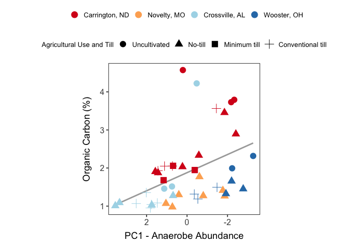
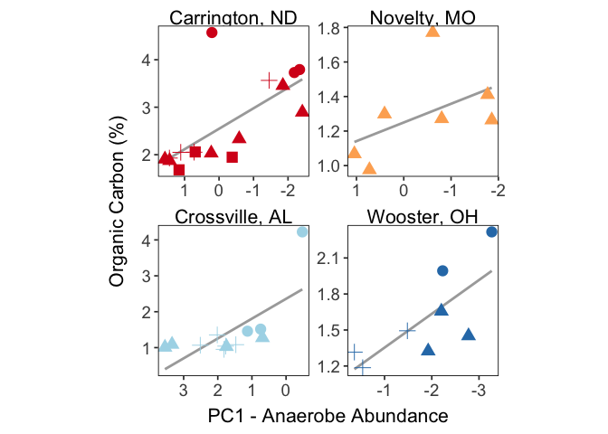
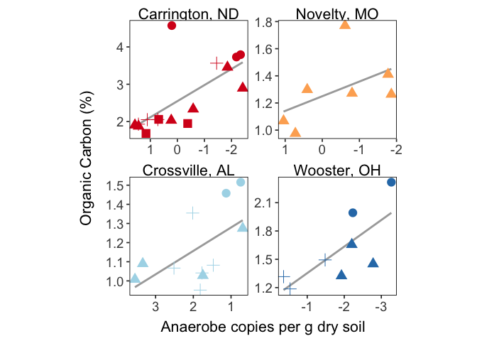
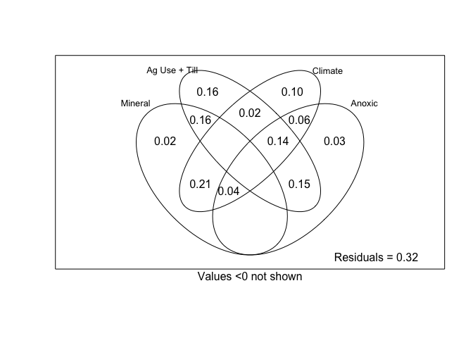
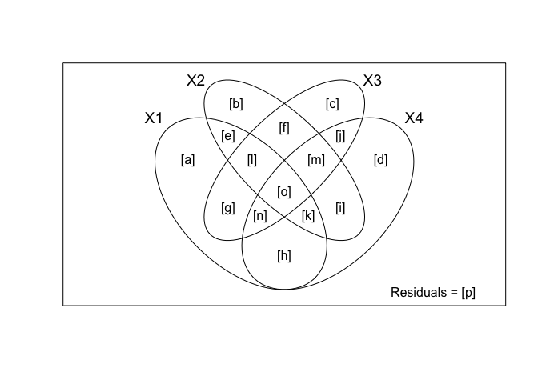
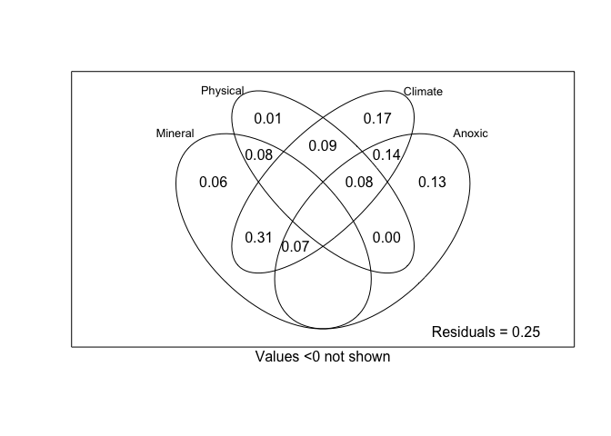

PredictSoilC with PCA result
================
Emily Lacroix
25 APR 2024

- [Set-up](#set-up)
  - [Load libraries](#load-libraries)
  - [Figure theme](#figure-theme)
  - [Labels](#labels)
  - [File names](#file-names)
  - [Import](#import)
  - [Join it all together](#join-it-all-together)
- [PC anaerobe copies vs. Soil C](#pc-anaerobe-copies-vs-soil-c)
  - [All sites](#all-sites)
    - [Create tibble](#create-tibble)
    - [Simple linear regression](#simple-linear-regression)
    - [Mixed-effects model -
      Unpublished](#mixed-effects-model---unpublished)
  - [Single Sites](#single-sites)
    - [regressions WITH outlier in SM](#regressions-with-outlier-in-sm)
    - [regressions WITHOUT outlier in
      SM](#regressions-without-outlier-in-sm)
- [Variance Partitioning](#variance-partitioning)
  - [All sites](#all-sites-1)
    - [Check VIF](#check-vif)
    - [Partition Variance - Supplementary Figure
      S7a](#partition-variance---supplementary-figure-s7a)
    - [Test significance](#test-significance)
  - [Cultivated only](#cultivated-only)
    - [Check VIF](#check-vif-1)
    - [Partition Variance - Supplementary Figure
      S7b](#partition-variance---supplementary-figure-s7b)
    - [Test Significance](#test-significance-1)

# Set-up

## Load libraries

``` r
library(MASS)
library(MuMIn)
library(car)
library(vegan)
library(psych)
library(readxl)
library(nlme)
library(outliers)
library(tidyverse)

conflicted::conflict_prefer("select", "dplyr")
conflicted::conflict_prefer("filter", "dplyr")
```

## Figure theme

``` r
my_theme <- function(base_size = 13, base_family = ""){ ## Control base font face and size. use `rel()` for relative font size.
  theme_bw(base_size = base_size, base_family = base_family) %+replace%
    theme(
      panel.border = element_rect(colour = "black", fill = "transparent"),
      panel.background  = element_blank(),
      panel.grid = element_blank(),
      strip.background = element_blank(),
      strip.text = element_text(size = 11),
      strip.text.y = element_text(size = 11)
    )
}
```

## Labels

``` r
site_labels <- 
  c(
    "CREC" = "Carrington, ND",
    "GR" = "Novelty, MO",
    "SM" = "Crossville, AL",
    "WO" = "Wooster, OH"
  )

till_labels <- 
  c(
    "UN" = "Uncultivated",
    "NT" = "No-till",
    "MT" = "Minimum till",
    "CT" = "Conventional till"
  )
```

## File names

``` r
all_data_excel <- "AllData_FINAL.xlsx"

anaerobe_file <- "anaerobe_pca.csv"
```

## Import

``` r
anaerobes_by_pca <- anaerobe_file %>%  read_csv()

mineral <- 
  all_data_excel %>% 
  read_xlsx(sheet = "mineral_protection") %>% 
  select(-c(ssa_analysis_date)) %>% 
  separate(sample, into = c("site", "till", "amend", "rep")) %>% 
  mutate(
    landscape_position = if_else(site == "GR", amend, NA_character_),
    across(amend, ~if_else(site == "GR", "U", .)),
    across(rep, as.numeric)
  )

climate <- 
  all_data_excel %>% 
  read_xlsx(sheet = "climate", na = "NA") %>% 
  rename(rep = field_rep)


root_mass_bd <-
  all_data_excel %>% 
  read_xlsx(sheet = "gravimetric", na = "NA") %>% 
  mutate(
    avg_plant_mass_per_cm3 = plant_mass_2_mm / volume_cm3
  ) %>% 
    group_by(site, till, amend, landscape_position, field_rep) %>% 
    summarise(
      avg_plant_mass_per_cm3 = mean(avg_plant_mass_per_cm3, na.rm = TRUE),
      avg_bd = mean(bd, na.rm = TRUE)
    ) %>% 
  rename(rep = field_rep)


c_n <- 
  all_data_excel %>% 
  read_xlsx(sheet = "c_n", na = "NA") %>%
  rename(
    amend = amend_pos,
    rep = field_rep
  ) %>% 
  mutate(
    landscape_position = if_else(site == "GR", amend, NA_character_),
    across(amend, ~if_else(site == "GR", "U", .)),
  )

aggregate_est <- 
  all_data_excel %>% 
  read_xlsx(sheet = "agg_est") %>% 
  select(site, till, amend, landscape_position, rep, wsa_perc)
```

## Join it all together

This data:

- combines all of the imported data
- removes the WO-UN-U-2 outlier (which was also removed from
  `ddPCR.Rmd`)
- removes GR samples that have incomplete anaerobe abundances due to
  droplet generation errors for select genes

``` r
all_data <- 
  mineral %>% 
  inner_join(
    anaerobes_by_pca,
    by = c("site", "till", "amend", "landscape_position", "rep")
  ) %>% 
  left_join(
    climate,
    by = c("site", "till", "amend", "landscape_position", "rep")
  ) %>% 
  left_join(
    root_mass_bd,
    by = c("site", "till", "amend", "landscape_position", "rep")
  ) %>% 
  left_join(
    c_n,
    by = c("site", "till", "amend", "landscape_position", "rep")
  ) %>% 

  left_join(
    aggregate_est,
    by = c("site", "till", "amend", "landscape_position", "rep")  
  ) %>% 
  rowid_to_column() %>% 
  arrange(site, till, amend, landscape_position, rep) %>% 
  ungroup() %>% 
  select(-landscape_position) %>% 
  na.omit() %>% 
  mutate(
    across(till, ~factor(., levels = c("UN", "NT", "MT", "CT"))),
    across(amend, ~factor(., levels = c("U", "A"))),
  )
```

# PC anaerobe copies vs. Soil C

## All sites

### Create tibble

``` r
multiple_reg_data_c <-
  all_data %>% 
  mutate(
    cultivated = if_else(till == "UN", 0, 1),
    amended = if_else(amend == "A", 1, 0),
    red_no_till = if_else(till %in% c("NT", "MT"), 1, 0),
  ) %>% 
  select(
    -c(
      rowid, 
      sample, 
      amend,
      contains(c("dsrAB", "gltA", "mcrA", "nirK", "nirS")),
      #pc1_values,
      soil_order,
      rep,
      gdd0,
      gdd10,
      precip_in_7,
      precip_in_14,
      precip_in_10,
      al_mmol_kg,
      fe_mmol_kg,
      mn_mmol_kg,
      plant_avail_n_ppm,
      npoc_mg_c_g_soil,
      avg_perc_n, #just playing around with removal
      map_mm, #removed after inspecting for VIF > 5
      mean_wfps  #removed after inspecting for VIF > 5
      )
  )
```

### Simple linear regression

#### Supplementary Figure S6a

``` r
all_data %>% 
  mutate(
    across(till, ~factor(., labels = till_labels)),
    across(site, ~factor(., labels = site_labels))
  ) %>% 
  ggplot(aes(x = pc1_values, y = avg_perc_c)) + 
  geom_smooth(method = "lm", se = FALSE, color = "darkgray", linetype = 1) +
  geom_point(aes(color = site, shape = till), size = 4) +
  scale_color_brewer(palette = "RdYlBu") +
  scale_x_reverse() +
  my_theme() + 
  theme(
    aspect.ratio = 1,
    axis.text.x = element_text(size = 12),
    axis.text.y = element_text(size = 12),
    axis.title.x = element_text(margin = margin(t = 8), size = 14),
    axis.title.y = element_text(margin = margin(r = 12), size = 14),
    legend.title = element_text(size = 10),
    legend.text = element_text(size = 10),
    legend.position = "top",
    legend.box = "vertical"
  ) +
  labs(
    y = "Organic Carbon (%)",
    x = "PC1 - Anaerobe Abundance",
    shape = "Agricultural Use and Till",
    color = NULL
  )
```

<!-- -->

#### Statistics - Supplementary Figure S6a

``` r
anaerobe_c <- lm(avg_perc_c ~ pc1_values, data = multiple_reg_data_c)

summary(anaerobe_c)
```

    ## 
    ## Call:
    ## lm(formula = avg_perc_c ~ pc1_values, data = multiple_reg_data_c)
    ## 
    ## Residuals:
    ##     Min      1Q  Median      3Q     Max 
    ## -1.0883 -0.5280 -0.1857  0.3453  2.7433 
    ## 
    ## Coefficients:
    ##             Estimate Std. Error t value Pr(>|t|)    
    ## (Intercept)  1.87826    0.13024  14.422   <2e-16 ***
    ## pc1_values  -0.23791    0.07651  -3.109   0.0034 ** 
    ## ---
    ## Signif. codes:  0 '***' 0.001 '**' 0.01 '*' 0.05 '.' 0.1 ' ' 1
    ## 
    ## Residual standard error: 0.854 on 41 degrees of freedom
    ## Multiple R-squared:  0.1908, Adjusted R-squared:  0.1711 
    ## F-statistic: 9.669 on 1 and 41 DF,  p-value: 0.003403

### Mixed-effects model - Unpublished

``` r
anaerobe_c_mixed_effects <-   
  lme(avg_perc_c ~ pc1_values_trans, 
      random = ~1|site, 
      data = multiple_reg_data_c
  )

summary_mixed_effects <- anaerobe_c_mixed_effects %>% summary()

summary_mixed_effects$tTable
```

    ##                      Value  Std.Error DF  t-value      p-value
    ## (Intercept)      1.6739788 0.39511428 38 4.236695 1.390520e-04
    ## pc1_values_trans 0.3785315 0.07270173 38 5.206637 6.950741e-06

``` r
r.squaredGLMM(anaerobe_c_mixed_effects)
```

    ## Warning: 'r.squaredGLMM' now calculates a revised statistic. See the help page.

    ##            R2m       R2c
    ## [1,] 0.3134699 0.7475916

## Single Sites

### regressions WITH outlier in SM

#### Supplementary Figure S6b-e

``` r
all_data %>% 
  mutate(
    across(till, ~factor(., labels = till_labels)),
    across(site, ~factor(., labels = site_labels))
  ) %>% 
  ggplot(aes(x = pc1_values, y = avg_perc_c)) + 
  geom_smooth(method = "lm", se = FALSE, color = "darkgray", linetype = 1) +
  geom_point(aes(color = site, shape = till), size = 4) +
  scale_color_brewer(palette = "RdYlBu") +
  scale_x_reverse() +
  facet_wrap(facets = vars(site), scales = "free") +
  my_theme() + 
  theme(
    axis.text.x = element_text(size = 14),
    axis.text.y = element_text(size = 14),
    axis.title.x = element_text(margin = margin(t = 8), size = 16),
    axis.title.y = element_text(margin = margin(r = 12), size = 16),
    strip.text = element_text(size = 16),
    legend.position = "none",
    aspect.ratio = 1,
    
  ) +
  labs(
    y = "Organic Carbon (%)",
    x = "PC1 - Anaerobe Abundance",
    shape = "Agricultural Use and Till",
    color = NULL
  )
```

<!-- -->

``` r
#ggsave("~/Desktop/PC_regression_by_site_no-line.png", dpi = 300)
```

#### Statistics - Supplementary Figure S6d

``` r
anaerobe_c_crec <- 
  lm(
    avg_perc_c ~ pc1_values_trans, 
    data = all_data %>% filter(site == "CREC")
  )

anaerobe_c_wo <-
    lm(
    avg_perc_c ~ pc1_values_trans, 
    data = all_data %>% filter(site == "WO")
  )

anaerobe_c_gr <- 
    lm(
    avg_perc_c ~ pc1_values_trans, 
    data = all_data %>% filter(site == "GR")
  )

anaerobe_c_sm <-
    lm(
    avg_perc_c ~ pc1_values_trans, 
    data = all_data %>% filter(site == "SM" )
  )

summary(anaerobe_c_crec)
```

    ## 
    ## Call:
    ## lm(formula = avg_perc_c ~ pc1_values_trans, data = all_data %>% 
    ##     filter(site == "CREC"))
    ## 
    ## Residuals:
    ##      Min       1Q   Median       3Q      Max 
    ## -0.76344 -0.37753 -0.03452  0.14353  2.11565 
    ## 
    ## Coefficients:
    ##                  Estimate Std. Error t value Pr(>|t|)    
    ## (Intercept)        2.5458     0.1704  14.939 5.37e-10 ***
    ## pc1_values_trans   0.4314     0.1199   3.598  0.00291 ** 
    ## ---
    ## Signif. codes:  0 '***' 0.001 '**' 0.01 '*' 0.05 '.' 0.1 ' ' 1
    ## 
    ## Residual standard error: 0.677 on 14 degrees of freedom
    ## Multiple R-squared:  0.4805, Adjusted R-squared:  0.4434 
    ## F-statistic: 12.95 on 1 and 14 DF,  p-value: 0.002908

``` r
summary(anaerobe_c_wo)
```

    ## 
    ## Call:
    ## lm(formula = avg_perc_c ~ pc1_values_trans, data = all_data %>% 
    ##     filter(site == "WO"))
    ## 
    ## Residuals:
    ##      Min       1Q   Median       3Q      Max 
    ## -0.40280 -0.10001 -0.01582  0.18014  0.32466 
    ## 
    ## Coefficients:
    ##                  Estimate Std. Error t value Pr(>|t|)   
    ## (Intercept)        1.0720     0.2140   5.008  0.00243 **
    ## pc1_values_trans   0.2814     0.1030   2.733  0.03407 * 
    ## ---
    ## Signif. codes:  0 '***' 0.001 '**' 0.01 '*' 0.05 '.' 0.1 ' ' 1
    ## 
    ## Residual standard error: 0.2769 on 6 degrees of freedom
    ## Multiple R-squared:  0.5545, Adjusted R-squared:  0.4802 
    ## F-statistic: 7.467 on 1 and 6 DF,  p-value: 0.03407

``` r
summary(anaerobe_c_gr)
```

    ## 
    ## Call:
    ## lm(formula = avg_perc_c ~ pc1_values_trans, data = all_data %>% 
    ##     filter(site == "GR"))
    ## 
    ## Residuals:
    ##        1        2        3        4        5        6        7 
    ## -0.03057 -0.19573  0.09272 -0.06879  0.45448 -0.18711 -0.06500 
    ## 
    ## Coefficients:
    ##                  Estimate Std. Error t value Pr(>|t|)    
    ## (Intercept)       1.24973    0.09873   12.66 5.47e-05 ***
    ## pc1_values_trans  0.10823    0.08519    1.27     0.26    
    ## ---
    ## Signif. codes:  0 '***' 0.001 '**' 0.01 '*' 0.05 '.' 0.1 ' ' 1
    ## 
    ## Residual standard error: 0.2443 on 5 degrees of freedom
    ## Multiple R-squared:  0.244,  Adjusted R-squared:  0.09285 
    ## F-statistic: 1.614 on 1 and 5 DF,  p-value: 0.2598

``` r
summary(anaerobe_c_sm)
```

    ## 
    ## Call:
    ## lm(formula = avg_perc_c ~ pc1_values_trans, data = all_data %>% 
    ##     filter(site == "SM"))
    ## 
    ## Residuals:
    ##     Min      1Q  Median      3Q     Max 
    ## -0.7036 -0.4110 -0.3089  0.2255  1.6001 
    ## 
    ## Coefficients:
    ##                  Estimate Std. Error t value Pr(>|t|)    
    ## (Intercept)        2.3595     0.3674   6.423 7.61e-05 ***
    ## pc1_values_trans   0.5525     0.1831   3.017    0.013 *  
    ## ---
    ## Signif. codes:  0 '***' 0.001 '**' 0.01 '*' 0.05 '.' 0.1 ' ' 1
    ## 
    ## Residual standard error: 0.6835 on 10 degrees of freedom
    ## Multiple R-squared:  0.4766, Adjusted R-squared:  0.4242 
    ## F-statistic: 9.105 on 1 and 10 DF,  p-value: 0.01295

### regressions WITHOUT outlier in SM

#### Figure - unpublished

``` r
all_data %>% 
  filter(!(site == "SM" & till == "UN" & rep == 3)) %>% 
  mutate(
    across(till, ~factor(., labels = till_labels)),
    across(site, ~factor(., labels = site_labels))
  ) %>% 
  ggplot(aes(x = pc1_values, y = avg_perc_c)) + 
  geom_smooth(method = "lm", se = FALSE, color = "darkgray", linetype = 1) +
  geom_point(aes(color = site, shape = till), size = 4) +
  scale_color_brewer(palette = "RdYlBu") +
  scale_x_reverse() +
  facet_wrap(facets = vars(site), scales = "free") +
  my_theme() + 
  theme(
    axis.text.x = element_text(size = 14),
    axis.text.y = element_text(size = 14),
    axis.title.x = element_text(margin = margin(t = 8), size = 16),
    axis.title.y = element_text(margin = margin(r = 12), size = 16),
    strip.text = element_text(size = 16),
    legend.position = "none",
    aspect.ratio = 1
  ) +
  labs(
    y = "Organic Carbon (%)",
    x = "Anaerobe copies per g dry soil",
    shape = "Agricultural Use and Till",
    color = "Site"
  )
```

<!-- -->

#### Statistics - unpublished

``` r
anaerobe_c_sm_no_outlier <-
    lm(
    avg_perc_c ~ pc1_values, 
    data = 
      all_data %>% 
      filter(site == "SM") %>% 
      filter(!(till == "UN" & rep == 3))
  )

anaerobe_c_sm_no_outlier %>% summary()
```

    ## 
    ## Call:
    ## lm(formula = avg_perc_c ~ pc1_values, data = all_data %>% filter(site == 
    ##     "SM") %>% filter(!(till == "UN" & rep == 3)))
    ## 
    ## Residuals:
    ##      Min       1Q   Median       3Q      Max 
    ## -0.22699 -0.14126 -0.02681  0.14612  0.20524 
    ## 
    ## Coefficients:
    ##             Estimate Std. Error t value Pr(>|t|)    
    ## (Intercept)  1.40133    0.11758  11.918 8.16e-07 ***
    ## pc1_values  -0.12239    0.05624  -2.176   0.0575 .  
    ## ---
    ## Signif. codes:  0 '***' 0.001 '**' 0.01 '*' 0.05 '.' 0.1 ' ' 1
    ## 
    ## Residual standard error: 0.1669 on 9 degrees of freedom
    ## Multiple R-squared:  0.3448, Adjusted R-squared:  0.2719 
    ## F-statistic: 4.735 on 1 and 9 DF,  p-value: 0.05754

# Variance Partitioning

## All sites

``` r
varpart_perc_c <- 
      all_data %>% 
      arrange(rowid) %>% 
      select(-c(site, till, rep)) %>% 
      na.omit() %>% 
      pull(avg_perc_c)

varpart_data_perc_c <- 
  all_data %>% 
  arrange(rowid) %>% 
  mutate(
    cultivated = if_else(till == "UN", 0, 1),
    amended = if_else(amend == "A", 1, 0),
    red_no_till = if_else(till %in% c("NT", "MT"), 1, 0),
  ) %>% 
  select(
    -c(
      site, rep, sample, rowid, soil_order, amend
    )
  ) %>% 
  na.omit() 
```

### Check VIF

NOTE: highly co-linear variables have already been removed.

``` r
mineral.prot.lm <- 
  lm(
    varpart_perc_c
    ~ ssa_m2_g + 
      sro_mmol_kg,
    data = varpart_data_perc_c
  )

summary(mineral.prot.lm)
```

    ## 
    ## Call:
    ## lm(formula = varpart_perc_c ~ ssa_m2_g + sro_mmol_kg, data = varpart_data_perc_c)
    ## 
    ## Residuals:
    ##      Min       1Q   Median       3Q      Max 
    ## -1.40612 -0.54482 -0.22403  0.05495  2.67955 
    ## 
    ## Coefficients:
    ##              Estimate Std. Error t value Pr(>|t|)    
    ## (Intercept)  1.531833   0.396501   3.863   0.0004 ***
    ## ssa_m2_g     0.037173   0.021700   1.713   0.0945 .  
    ## sro_mmol_kg -0.002688   0.003837  -0.701   0.4876    
    ## ---
    ## Signif. codes:  0 '***' 0.001 '**' 0.01 '*' 0.05 '.' 0.1 ' ' 1
    ## 
    ## Residual standard error: 0.9278 on 40 degrees of freedom
    ## Multiple R-squared:  0.06835,    Adjusted R-squared:  0.02176 
    ## F-statistic: 1.467 on 2 and 40 DF,  p-value: 0.2427

``` r
vif(mineral.prot.lm) 
```

    ##    ssa_m2_g sro_mmol_kg 
    ##    1.201486    1.201486

``` r
phys.prot.lm <- 
  lm(
    varpart_perc_c
    ~  till + 
      wsa_perc,
    data = varpart_data_perc_c
  )

summary(phys.prot.lm)
```

    ## 
    ## Call:
    ## lm(formula = varpart_perc_c ~ till + wsa_perc, data = varpart_data_perc_c)
    ## 
    ## Residuals:
    ##     Min      1Q  Median      3Q     Max 
    ## -1.5273 -0.5290 -0.1817  0.3521  1.9942 
    ## 
    ## Coefficients:
    ##              Estimate Std. Error t value Pr(>|t|)    
    ## (Intercept)  2.620656   0.615696   4.256 0.000131 ***
    ## tillNT      -1.246179   0.368125  -3.385 0.001664 ** 
    ## tillMT      -1.033073   0.552338  -1.870 0.069151 .  
    ## tillCT      -1.322651   0.376537  -3.513 0.001163 ** 
    ## wsa_perc     0.004558   0.007529   0.605 0.548475    
    ## ---
    ## Signif. codes:  0 '***' 0.001 '**' 0.01 '*' 0.05 '.' 0.1 ' ' 1
    ## 
    ## Residual standard error: 0.8141 on 38 degrees of freedom
    ## Multiple R-squared:  0.3184, Adjusted R-squared:  0.2467 
    ## F-statistic: 4.439 on 4 and 38 DF,  p-value: 0.004839

``` r
vif(phys.prot.lm) 
```

    ##              GVIF Df GVIF^(1/(2*Df))
    ## till     1.199122  3        1.030728
    ## wsa_perc 1.199122  1        1.095044

``` r
climate.lm <-
  lm(
    varpart_perc_c
    ~ map_mm,
    data = varpart_data_perc_c
  )

summary(climate.lm)
```

    ## 
    ## Call:
    ## lm(formula = varpart_perc_c ~ map_mm, data = varpart_data_perc_c)
    ## 
    ## Residuals:
    ##     Min      1Q  Median      3Q     Max 
    ## -0.8417 -0.4855 -0.2073  0.1909  3.0077 
    ## 
    ## Coefficients:
    ##               Estimate Std. Error t value Pr(>|t|)    
    ## (Intercept)  3.1167642  0.3133166   9.948 1.71e-12 ***
    ## map_mm      -0.0011825  0.0002762  -4.281 0.000109 ***
    ## ---
    ## Signif. codes:  0 '***' 0.001 '**' 0.01 '*' 0.05 '.' 0.1 ' ' 1
    ## 
    ## Residual standard error: 0.7892 on 41 degrees of freedom
    ## Multiple R-squared:  0.309,  Adjusted R-squared:  0.2921 
    ## F-statistic: 18.33 on 1 and 41 DF,  p-value: 0.000109

``` r
anaerobe.lm <-
  lm(
    varpart_perc_c
    ~ pc1_values_trans,
    #
    data = varpart_data_perc_c
  )

summary(anaerobe.lm)
```

    ## 
    ## Call:
    ## lm(formula = varpart_perc_c ~ pc1_values_trans, data = varpart_data_perc_c)
    ## 
    ## Residuals:
    ##     Min      1Q  Median      3Q     Max 
    ## -1.0883 -0.5280 -0.1857  0.3453  2.7433 
    ## 
    ## Coefficients:
    ##                  Estimate Std. Error t value Pr(>|t|)    
    ## (Intercept)       1.87826    0.13024  14.422   <2e-16 ***
    ## pc1_values_trans  0.23791    0.07651   3.109   0.0034 ** 
    ## ---
    ## Signif. codes:  0 '***' 0.001 '**' 0.01 '*' 0.05 '.' 0.1 ' ' 1
    ## 
    ## Residual standard error: 0.854 on 41 degrees of freedom
    ## Multiple R-squared:  0.1908, Adjusted R-squared:  0.1711 
    ## F-statistic: 9.669 on 1 and 41 DF,  p-value: 0.003403

``` r
varpart_data_perc_c
```

    ## # A tibble: 43 × 40
    ##    till  ssa_m2_g perc_clay al_mmol_kg fe_mmol_kg mn_mmol_kg sro_mmol_kg   dsrAB
    ##    <fct>    <dbl>     <dbl>      <dbl>      <dbl>      <dbl>       <dbl>   <dbl>
    ##  1 CT        14.8      15.7       31.5       32.1      11.9         75.5  1.58e7
    ##  2 CT        18.4      16.9       31.2       27.0       8.60        66.8  1.01e7
    ##  3 CT        22.7      18.8       31.7       26.2       9.91        67.8  2.15e7
    ##  4 CT        18.4      16.3       35.8       30.5      10.4         76.7  1.65e7
    ##  5 MT        15.5      18.2       29.2       27.0       8.44        64.6  1.72e7
    ##  6 MT        23.1      20.1       32.9       28.7      11.1         72.6  2.16e7
    ##  7 MT        19.6      16.3       35.0       28.6       8.96        72.5  1.76e7
    ##  8 NT        22.2      19.4       38.9       37.2      11.9         88.0  1.86e7
    ##  9 NT        21.6      20.1       32.9       36.6      10.5         80.1  2.77e7
    ## 10 NT        22.9      16.9       32.5       31.6      10.3         74.5  1.53e7
    ## # ℹ 33 more rows
    ## # ℹ 32 more variables: gltA <dbl>, mcrA <dbl>, nirK <dbl>, nirS <dbl>,
    ## #   log_dsrAB <dbl>, log_gltA <dbl>, log_mcrA <dbl>, sqrt_nirK <dbl>,
    ## #   log_nirS <dbl>, log_16S <dbl>, pc1_values <dbl>, pc1_values_trans <dbl>,
    ## #   mean_wfps <dbl>, map_mm <dbl>, mat_c <dbl>, gdd0 <dbl>, gdd10 <dbl>,
    ## #   precip_in_7 <dbl>, precip_in_10 <dbl>, precip_in_14 <dbl>,
    ## #   avg_plant_mass_per_cm3 <dbl>, avg_bd <dbl>, avg_perc_c <dbl>, …

### Partition Variance - Supplementary Figure S7a

``` r
total_c_mod <-
  varpart(
    varpart_perc_c,
    # Mineral protection - X1
    ~ ssa_m2_g + 
      sro_mmol_kg,
    # Physical Protection - X2
    ~ wsa_perc + till,
    # Climate - X3
    ~ map_mm,
    #Anaerobes - X4
    ~ pc1_values_trans,
    data = 
      varpart_data_perc_c,
    scale = FALSE 
  )

plot(
  total_c_mod,
  Xnames = c("Mineral", "Ag Use + Till", "Climate", "Anoxic"),
  id.size = 0.80
) 
```

<!-- -->

### Test significance

``` r
showvarparts(4)
```

<!-- -->

## Cultivated only

``` r
varpart_perc_c_cult <- 
      all_data %>% 
      arrange(rowid) %>% 
      filter(till != "UN") %>% 
      select(-c(site, till, rep)) %>% 
      na.omit() %>% 
      pull(avg_perc_c)

varpart_data_perc_c_cult <- 
  all_data %>% 
  arrange(rowid) %>%
  filter(till != "UN") %>% 
  mutate(
    cultivated = if_else(till == "UN", 0, 1),
    amended = if_else(amend == "A", 1, 0),
    red_no_till = if_else(till %in% c("NT", "MT"), 1, 0),
  ) %>% 
  select(
    -c(
      site, rep, sample, rowid, soil_order, amend
    )
  ) %>% 
  na.omit() 
```

### Check VIF

``` r
mineral.prot.lm.cult <- 
  lm(
    varpart_perc_c_cult
    ~ ssa_m2_g + 
      sro_mmol_kg,
    data = varpart_data_perc_c_cult
  )

summary(mineral.prot.lm.cult)
```

    ## 
    ## Call:
    ## lm(formula = varpart_perc_c_cult ~ ssa_m2_g + sro_mmol_kg, data = varpart_data_perc_c_cult)
    ## 
    ## Residuals:
    ##      Min       1Q   Median       3Q      Max 
    ## -1.19873 -0.31170 -0.00533  0.12112  1.94909 
    ## 
    ## Coefficients:
    ##              Estimate Std. Error t value Pr(>|t|)    
    ## (Intercept)  1.252198   0.285657   4.384 0.000118 ***
    ## ssa_m2_g     0.042717   0.015421   2.770 0.009252 ** 
    ## sro_mmol_kg -0.003559   0.002829  -1.258 0.217554    
    ## ---
    ## Signif. codes:  0 '***' 0.001 '**' 0.01 '*' 0.05 '.' 0.1 ' ' 1
    ## 
    ## Residual standard error: 0.6043 on 32 degrees of freedom
    ## Multiple R-squared:  0.1935, Adjusted R-squared:  0.1431 
    ## F-statistic: 3.839 on 2 and 32 DF,  p-value: 0.03204

``` r
vif(mineral.prot.lm.cult) 
```

    ##    ssa_m2_g sro_mmol_kg 
    ##    1.230126    1.230126

``` r
phys.prot.lm.cult <- 
  lm(
    varpart_perc_c_cult
    ~ till + 
      wsa_perc,
    data = varpart_data_perc_c_cult
  )

summary(phys.prot.lm.cult)
```

    ## 
    ## Call:
    ## lm(formula = varpart_perc_c_cult ~ till + wsa_perc, data = varpart_data_perc_c_cult)
    ## 
    ## Residuals:
    ##     Min      1Q  Median      3Q     Max 
    ## -0.6986 -0.4445 -0.1667  0.2466  1.9965 
    ## 
    ## Coefficients:
    ##             Estimate Std. Error t value Pr(>|t|)    
    ## (Intercept)  1.34804    0.37081   3.635 0.000995 ***
    ## tillMT       0.20631    0.42466   0.486 0.630496    
    ## tillCT      -0.08163    0.25390  -0.322 0.749978    
    ## wsa_perc     0.00505    0.00631   0.800 0.429589    
    ## ---
    ## Signif. codes:  0 '***' 0.001 '**' 0.01 '*' 0.05 '.' 0.1 ' ' 1
    ## 
    ## Residual standard error: 0.6713 on 31 degrees of freedom
    ## Multiple R-squared:  0.03591,    Adjusted R-squared:  -0.05739 
    ## F-statistic: 0.3849 on 3 and 31 DF,  p-value: 0.7646

``` r
vif(phys.prot.lm.cult) 
```

    ##              GVIF Df GVIF^(1/(2*Df))
    ## till     1.096495  2        1.023297
    ## wsa_perc 1.096495  1        1.047137

``` r
climate.lm.cult <-
  lm(
    varpart_perc_c_cult
    ~ map_mm,
    #
    data = varpart_data_perc_c_cult
  )

summary(climate.lm.cult)
```

    ## 
    ## Call:
    ## lm(formula = varpart_perc_c_cult ~ map_mm, data = varpart_data_perc_c_cult)
    ## 
    ## Residuals:
    ##     Min      1Q  Median      3Q     Max 
    ## -0.5840 -0.2686 -0.1319  0.1158  1.3508 
    ## 
    ## Coefficients:
    ##               Estimate Std. Error t value Pr(>|t|)    
    ## (Intercept)  2.8320546  0.1877946  15.081 2.31e-16 ***
    ## map_mm      -0.0011580  0.0001677  -6.906 6.89e-08 ***
    ## ---
    ## Signif. codes:  0 '***' 0.001 '**' 0.01 '*' 0.05 '.' 0.1 ' ' 1
    ## 
    ## Residual standard error: 0.4238 on 33 degrees of freedom
    ## Multiple R-squared:  0.591,  Adjusted R-squared:  0.5786 
    ## F-statistic: 47.69 on 1 and 33 DF,  p-value: 6.893e-08

``` r
anaerobe.lm.cult <-
  lm(
    varpart_perc_c_cult
    ~ pc1_values_trans,
    data = varpart_data_perc_c_cult
  )

summary(anaerobe.lm.cult)
```

    ## 
    ## Call:
    ## lm(formula = varpart_perc_c_cult ~ pc1_values_trans, data = varpart_data_perc_c_cult)
    ## 
    ## Residuals:
    ##     Min      1Q  Median      3Q     Max 
    ## -0.7262 -0.4241 -0.1802  0.4712  1.6438 
    ## 
    ## Coefficients:
    ##                  Estimate Std. Error t value Pr(>|t|)    
    ## (Intercept)       1.67410    0.10198  16.416  < 2e-16 ***
    ## pc1_values_trans  0.16991    0.06138   2.768  0.00918 ** 
    ## ---
    ## Signif. codes:  0 '***' 0.001 '**' 0.01 '*' 0.05 '.' 0.1 ' ' 1
    ## 
    ## Residual standard error: 0.597 on 33 degrees of freedom
    ## Multiple R-squared:  0.1884, Adjusted R-squared:  0.1638 
    ## F-statistic: 7.662 on 1 and 33 DF,  p-value: 0.009176

### Partition Variance - Supplementary Figure S7b

``` r
total_c_mod_cult <-
  varpart(
    varpart_perc_c_cult,
    # Mineral protection - X1
    ~ ssa_m2_g + 
      sro_mmol_kg,
    # Physical Protection - X2
    ~ wsa_perc + till,
    #X3 - Climate
    ~ map_mm,
    #Anaerobes - X4
    ~ pc1_values_trans,
    data = 
      varpart_data_perc_c_cult,
    scale = FALSE 
  )

plot(
  total_c_mod_cult,
  Xnames = c("Mineral", "Physical", "Climate", "Anoxic"),
  id.size = 0.8
) 
```

<!-- -->

### Test Significance

What is testable?

``` r
total_c_mod_cult
```

    ## 
    ## Partition of variance in RDA 
    ## 
    ## Call: varpart(Y = varpart_perc_c_cult, X = ~ssa_m2_g + sro_mmol_kg,
    ## ~wsa_perc + till, ~map_mm, ~pc1_values_trans, data =
    ## varpart_data_perc_c_cult, scale = FALSE)
    ## 
    ## Explanatory tables:
    ## X1:  ~ssa_m2_g + sro_mmol_kg
    ## X2:  ~wsa_perc + till
    ## X3:  ~map_mm
    ## X4:  ~pc1_values_trans 
    ## 
    ## No. of explanatory tables: 4 
    ## Total variation (SS): 14.49 
    ##             Variance: 0.42619 
    ## No. of observations: 35 
    ## 
    ## Partition table:
    ##                             Df R.square Adj.R.square Testable
    ## [aeghklno] = X1              2  0.19350      0.14310     TRUE
    ## [befiklmo] = X2              3  0.03591     -0.05739     TRUE
    ## [cfgjlmno] = X3              1  0.59102      0.57863     TRUE
    ## [dhijkmno] = X4              1  0.18843      0.16384     TRUE
    ## [abefghiklmno] = X1+X2       5  0.42218      0.32255     TRUE
    ## [acefghjklmno] = X1+X3       3  0.64691      0.61274     TRUE
    ## [adeghijklmno] = X1+X4       3  0.53451      0.48946     TRUE
    ## [bcefgijklmno] = X2+X3       4  0.67380      0.63031     TRUE
    ## [bdefhijklmno] = X2+X4       4  0.30731      0.21495     TRUE
    ## [cdfghijklmno] = X3+X4       2  0.62432      0.60084     TRUE
    ## [abcefghijklmno] = X1+X2+X3  6  0.69386      0.62826     TRUE
    ## [abdefghijklmno] = X1+X2+X4  6  0.66093      0.58828     TRUE
    ## [acdefghijklmno] = X1+X3+X4  4  0.77343      0.74322     TRUE
    ## [bcdefghijklmno] = X2+X3+X4  5  0.73813      0.69298     TRUE
    ## [abcdefghijklmno] = All      7  0.80537      0.75491     TRUE
    ## Individual fractions                                         
    ## [a] = X1 | X2+X3+X4          2               0.06194     TRUE
    ## [b] = X2 | X1+X3+X4          3               0.01169     TRUE
    ## [c] = X3 | X1+X2+X4          1               0.16664     TRUE
    ## [d] = X4 | X1+X2+X3          1               0.12666     TRUE
    ## [e]                          0               0.08045    FALSE
    ## [f]                          0               0.08712    FALSE
    ## [g]                          0               0.31139    FALSE
    ## [h]                          0              -0.06399    FALSE
    ## [i]                          0               0.00382    FALSE
    ## [j]                          0               0.13907    FALSE
    ## [k]                          0              -0.04428    FALSE
    ## [l]                          0              -0.12815    FALSE
    ## [m]                          0               0.07681    FALSE
    ## [n]                          0               0.07060    FALSE
    ## [o]                          0              -0.14485    FALSE
    ## [p] = Residuals              0               0.24509    FALSE
    ## Controlling 2 tables X                                       
    ## [ae] = X1 | X3+X4            2               0.14238     TRUE
    ## [ag] = X1 | X2+X4            2               0.37332     TRUE
    ## [ah] = X1 | X2+X3            2              -0.00205     TRUE
    ## [be] = X2 | X3+X4            3               0.09214     TRUE
    ## [bf] = X2 | X1+X4            3               0.09882     TRUE
    ## [bi] = X2 | X1+X3            3               0.01552     TRUE
    ## [cf] = X3 | X1+X4            1               0.25376     TRUE
    ## [cg] = X3 | X2+X4            1               0.47802     TRUE
    ## [cj] = X3 | X1+X2            1               0.30571     TRUE
    ## [dh] = X4 | X2+X3            1               0.06267     TRUE
    ## [di] = X4 | X1+X3            1               0.13048     TRUE
    ## [dj] = X4 | X1+X2            1               0.26573     TRUE
    ## Controlling 1 table X                                        
    ## [aghn] = X1 | X2             2               0.37994     TRUE
    ## [aehk] = X1 | X3             2               0.03411     TRUE
    ## [aegl] = X1 | X4             2               0.32562     TRUE
    ## [bfim] = X2 | X1             3               0.17945     TRUE
    ## [beik] = X2 | X3             3               0.05168     TRUE
    ## [befl] = X2 | X4             3               0.05111     TRUE
    ## [cfjm] = X3 | X1             1               0.46964     TRUE
    ## [cgjn] = X3 | X2             1               0.68770     TRUE
    ## [cfgl] = X3 | X4             1               0.43700     TRUE
    ## [dijm] = X4 | X1             1               0.34636     TRUE
    ## [dhjn] = X4 | X2             1               0.27234     TRUE
    ## [dhik] = X4 | X3             1               0.02221     TRUE
    ## ---
    ## Use function 'rda' to test significance of fractions of interest

Is overall fit significant?

``` r
rda.overall <- 
  rda(
    varpart_perc_c_cult ~ 
      ssa_m2_g + 
      sro_mmol_kg + 
      wsa_perc + 
      red_no_till +
      map_mm + 
      pc1_values_trans,
    data = 
      varpart_data_perc_c_cult,
    scale = FALSE 
  )

anova(rda.overall)
```

    ## Permutation test for rda under reduced model
    ## Permutation: free
    ## Number of permutations: 999
    ## 
    ## Model: rda(formula = varpart_perc_c_cult ~ ssa_m2_g + sro_mmol_kg + wsa_perc + red_no_till + map_mm + pc1_values_trans, data = varpart_data_perc_c_cult, scale = FALSE)
    ##          Df Variance      F Pr(>F)    
    ## Model     6  0.33196 16.441  0.001 ***
    ## Residual 28  0.09422                  
    ## ---
    ## Signif. codes:  0 '***' 0.001 '**' 0.01 '*' 0.05 '.' 0.1 ' ' 1

#### Significance tests for unique variance

Test whether the UNIQUE variance explained by each factor is significant

**Mineral**

``` r
rda.mineral.part <- 
  rda(
      varpart_perc_c_cult ~ 
      ssa_m2_g +
      sro_mmol_kg +
      Condition(wsa_perc + till) + 
      Condition(map_mm) + 
      Condition(pc1_values_trans),
    data = varpart_data_perc_c_cult,
    scale = FALSE
  )

anova(rda.mineral.part)
```

    ## Permutation test for rda under reduced model
    ## Permutation: free
    ## Number of permutations: 999
    ## 
    ## Model: rda(formula = varpart_perc_c_cult ~ ssa_m2_g + sro_mmol_kg + Condition(wsa_perc + till) + Condition(map_mm) + Condition(pc1_values_trans), data = varpart_data_perc_c_cult, scale = FALSE)
    ##          Df Variance      F Pr(>F)  
    ## Model     2 0.028659 4.6643  0.018 *
    ## Residual 27 0.082948                
    ## ---
    ## Signif. codes:  0 '***' 0.001 '**' 0.01 '*' 0.05 '.' 0.1 ' ' 1

**Physical**

``` r
rda.phys.part <- 
  rda(
      varpart_perc_c_cult ~ wsa_perc + till +
      Condition(ssa_m2_g + sro_mmol_kg) +
      Condition(map_mm) + 
      Condition(pc1_values_trans),
    data = varpart_data_perc_c_cult,
    scale = FALSE
  )

anova(rda.phys.part)
```

    ## Permutation test for rda under reduced model
    ## Permutation: free
    ## Number of permutations: 999
    ## 
    ## Model: rda(formula = varpart_perc_c_cult ~ wsa_perc + till + Condition(ssa_m2_g + sro_mmol_kg) + Condition(map_mm) + Condition(pc1_values_trans), data = varpart_data_perc_c_cult, scale = FALSE)
    ##          Df Variance      F Pr(>F)
    ## Model     3 0.013614 1.4772  0.209
    ## Residual 27 0.082948

**Climate**

``` r
rda.climate.part <- 
  rda(
      varpart_perc_c_cult ~ map_mm + 
      Condition(wsa_perc + till) +
      Condition(ssa_m2_g + sro_mmol_kg) +
      Condition(pc1_values_trans),
    data = varpart_data_perc_c_cult,
    scale = FALSE
  )

anova(rda.climate.part)
```

    ## Permutation test for rda under reduced model
    ## Permutation: free
    ## Number of permutations: 999
    ## 
    ## Model: rda(formula = varpart_perc_c_cult ~ map_mm + Condition(wsa_perc + till) + Condition(ssa_m2_g + sro_mmol_kg) + Condition(pc1_values_trans), data = varpart_data_perc_c_cult, scale = FALSE)
    ##          Df Variance      F Pr(>F)    
    ## Model     1 0.061558 20.038  0.001 ***
    ## Residual 27 0.082948                  
    ## ---
    ## Signif. codes:  0 '***' 0.001 '**' 0.01 '*' 0.05 '.' 0.1 ' ' 1

**Anoxic**

``` r
rda.anoxic.part <- 
  rda(
      varpart_perc_c_cult ~ pc1_values_trans +
      Condition(map_mm) + 
      Condition(wsa_perc + till) +
      Condition(ssa_m2_g + sro_mmol_kg),
    data = varpart_data_perc_c_cult,
    scale = FALSE
  )

anova(rda.anoxic.part)
```

    ## Permutation test for rda under reduced model
    ## Permutation: free
    ## Number of permutations: 999
    ## 
    ## Model: rda(formula = varpart_perc_c_cult ~ pc1_values_trans + Condition(map_mm) + Condition(wsa_perc + till) + Condition(ssa_m2_g + sro_mmol_kg), data = varpart_data_perc_c_cult, scale = FALSE)
    ##          Df Variance     F Pr(>F)   
    ## Model     1 0.047526 15.47  0.002 **
    ## Residual 27 0.082948                
    ## ---
    ## Signif. codes:  0 '***' 0.001 '**' 0.01 '*' 0.05 '.' 0.1 ' ' 1
