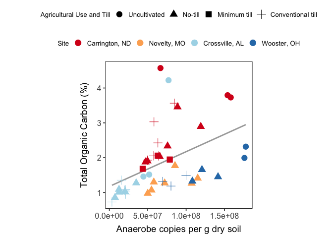
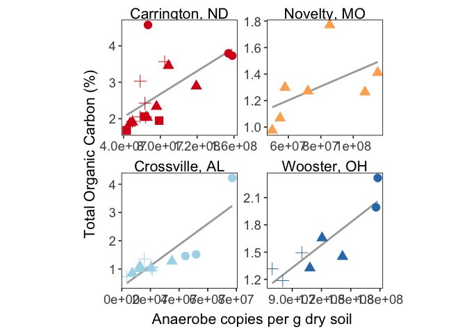
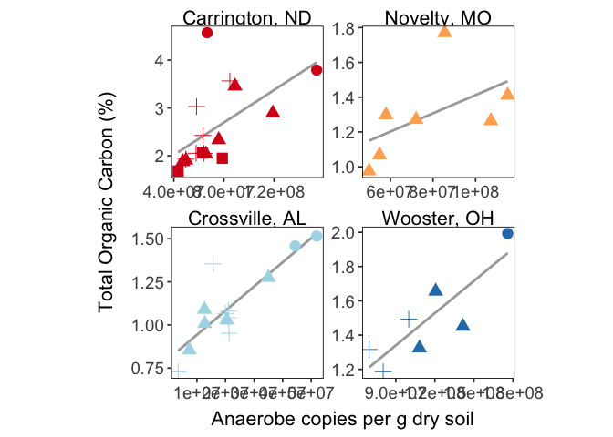
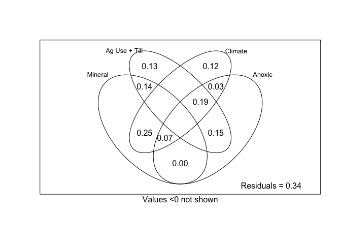
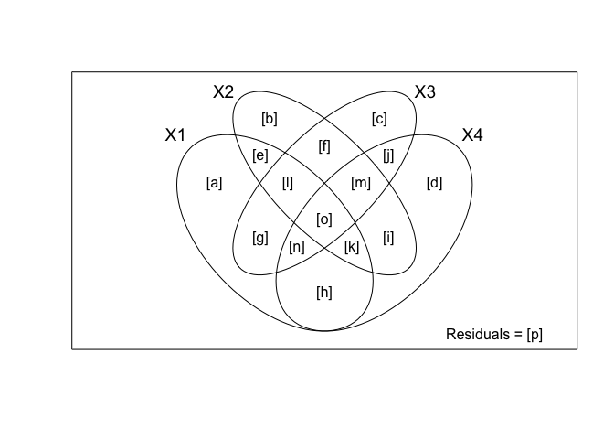
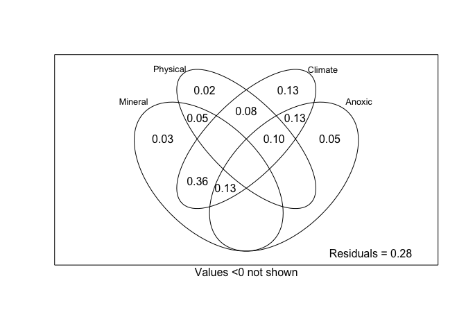

PredictSoilC
================
Emily Lacroix
25 JAN 2023

- <a href="#set-up" id="toc-set-up">Set-up</a>
  - <a href="#load-libraries" id="toc-load-libraries">Load libraries</a>
  - <a href="#figure-theme" id="toc-figure-theme">Figure theme</a>
  - <a href="#labels" id="toc-labels">Labels</a>
  - <a href="#file-names" id="toc-file-names">File names</a>
  - <a href="#import" id="toc-import">Import</a>
  - <a href="#check-for-outliers-in-anaerobe-data"
    id="toc-check-for-outliers-in-anaerobe-data">Check for outliers in
    anaerobe data</a>
  - <a href="#join-it-all-together" id="toc-join-it-all-together">Join it
    all together</a>
- <a href="#supp-table-soil-properties"
  id="toc-supp-table-soil-properties">Supp Table: Soil Properties</a>
- <a href="#regression" id="toc-regression">Regression</a>
  - <a href="#all-sites" id="toc-all-sites">All sites</a>
    - <a href="#simple-linear-regression-anaerobe-copies-vs-c"
      id="toc-simple-linear-regression-anaerobe-copies-vs-c">Simple linear
      regression, anaerobe copies vs. C</a>
    - <a href="#mixed-effects-model"
      id="toc-mixed-effects-model">Mixed-effects model</a>
  - <a href="#individual-sites" id="toc-individual-sites">Individual
    sites</a>
    - <a href="#check-for-outliers-in-individual-site-sets"
      id="toc-check-for-outliers-in-individual-site-sets">Check for outliers
      in individual site sets</a>
    - <a href="#regressions-with-outlier-in-sm"
      id="toc-regressions-with-outlier-in-sm">regressions WITH outlier in
      SM</a>
    - <a href="#regressions-without-outlier-in-sm"
      id="toc-regressions-without-outlier-in-sm">regressions WITHOUT outlier
      in SM</a>
  - <a href="#stepwise" id="toc-stepwise">Stepwise</a>
- <a href="#variance-partioning" id="toc-variance-partioning">Variance
  Partioning</a>
  - <a href="#all-sites-1" id="toc-all-sites-1">All sites</a>
    - <a href="#check-vif" id="toc-check-vif">Check VIF</a>
    - <a href="#partition-variance" id="toc-partition-variance">Partition
      Variance</a>
    - <a href="#test-significance" id="toc-test-significance">Test
      significance</a>
  - <a href="#cultivated-only" id="toc-cultivated-only">Cultivated only</a>
    - <a href="#check-vif-1" id="toc-check-vif-1">Check VIF</a>
    - <a href="#partition-variance-1" id="toc-partition-variance-1">Partition
      Variance</a>
    - <a href="#test-significance-1" id="toc-test-significance-1">Test
      Significance</a>

# Set-up

## Load libraries

``` r
library(MASS)
library(MuMIn)
library(car)
library(vegan)
library(psych)
library(readxl)
library(lmerTest)
library(nlme)
library(outliers)
library(tidyverse)

conflicted::conflict_prefer("select", "dplyr")
conflicted::conflict_prefer("filter", "dplyr")
```

## Figure theme

``` r
my_theme <- function(base_size = 13, base_family = ""){ ## Control base font face and size. use `rel()` for relative font size.
  theme_bw(base_size = base_size, base_family = base_family) %+replace%
    theme(
      panel.border = element_rect(colour = "black", fill = "transparent"),
      panel.background  = element_blank(),
      panel.grid = element_blank(),
      strip.background = element_blank(),
      strip.text = element_text(size = 11),
      strip.text.y = element_text(size = 11)
    )
}
```

## Labels

``` r
site_labels <- 
  c(
    "CREC" = "Carrington, ND",
    "GR" = "Novelty, MO",
    "SM" = "Crossville, AL",
    "WO" = "Wooster, OH"
  )

till_labels <- 
  c(
    "UN" = "Uncultivated",
    "NT" = "No-till",
    "MT" = "Minimum till",
    "CT" = "Conventional till"
  )
```

## File names

``` r
all_data_excel <- "AllData_03AUG.xlsx"
```

## Import

``` r
mineral <- 
  all_data_excel %>% 
  read_xlsx(sheet = "mineral_protection") %>% 
  select(-c(ssa_analysis_date)) %>% 
  separate(sample, into = c("site", "till", "amend", "rep")) %>% 
  mutate(
    landscape_position = if_else(site == "GR", amend, NA_character_),
    across(amend, ~if_else(site == "GR", "U", .)),
    across(rep, as.numeric)
  )

sixteenS_abund <-
  all_data_excel %>% 
  read_xlsx(sheet = "dna_ddpcr", na = "NA") %>% 
  distinct(site, till, amend, landscape_position, rep, copies_per_g_sixteenS)

anaerobe_copies_total <- 
  all_data_excel %>% 
  read_xlsx(sheet = "anaerobe_copies", na = "NA") %>% 
  add_row( #adding blank rows for GR-NT-F for now
    site = "GR",
    till = "NT",
    amend = "U",
    landscape_position = "F",
    rep = c(1,3),
    anaerobe_copies_per_g = NA_real_
  )

climate <- 
  all_data_excel %>% 
  read_xlsx(sheet = "climate", na = "NA") %>% 
  rename(rep = field_rep)


root_mass_bd <-
  all_data_excel %>% 
  read_xlsx(sheet = "gravimetric", na = "NA") %>% 
  mutate(
    avg_plant_mass_per_cm3 = plant_mass_2_mm / volume_cm3
  ) %>% 
    group_by(site, till, amend, landscape_position, field_rep) %>% 
    summarise(
      avg_plant_mass_per_cm3 = mean(avg_plant_mass_per_cm3, na.rm = TRUE),
      avg_bd = mean(bd, na.rm = TRUE)
    ) %>% 
  rename(rep = field_rep)


c_n <- 
  all_data_excel %>% 
  read_xlsx(sheet = "c_n", na = "NA") %>%
  rename(
    amend = amend_pos,
    rep = field_rep
  ) %>% 
  mutate(
    landscape_position = if_else(site == "GR", amend, NA_character_),
    across(amend, ~if_else(site == "GR", "U", .)),
  )


anaerobe_matrix <- 
  all_data_excel %>% 
  read_xlsx(sheet = "dna_ddpcr", na = "NA") %>% 
  group_by(
    site, till, amend, landscape_position, rep, target_gene
  ) %>% 
  summarise(
    copies_per_g = mean(copies_per_g, na.rm = TRUE),
    prop = mean(prop, na.rm = TRUE)
  ) %>% 
  pivot_wider(
    id_cols = c(site, till, amend, landscape_position, rep),
    names_from = target_gene,
    values_from = c(copies_per_g, prop)
  )

aggregate_est <- 
  all_data_excel %>% 
  read_xlsx(sheet = "agg_est") %>% 
  select(site, till, amend, landscape_position, rep, wsa_perc)
```

## Check for outliers in anaerobe data

``` r
outliers <- grubbs.test(anaerobe_copies_total$anaerobe_copies_per_g)

outliers
```

    ## 
    ##  Grubbs test for one outlier
    ## 
    ## data:  anaerobe_copies_total$anaerobe_copies_per_g
    ## G = 2.45486, U = 0.86905, p-value = 0.2759
    ## alternative hypothesis: highest value 177668646.209965 is an outlier

``` r
outliers_low <- grubbs.test(anaerobe_copies_total$anaerobe_copies_per_g, opposite = TRUE)

outliers_low
```

    ## 
    ##  Grubbs test for one outlier
    ## 
    ## data:  anaerobe_copies_total$anaerobe_copies_per_g
    ## G = 1.45772, U = 0.95383, p-value = 1
    ## alternative hypothesis: lowest value 3416440.62069635 is an outlier

## Join it all together

This data:

- combines all of the imported data
- removes the WO-UN-U-2 outlier (which was also removed from
  `ddPCR.Rmd`)
- removes GR samples that have incomplete anaerobe abundances due to
  droplet generation errors for select genes

``` r
all_data <- 
  mineral %>% 
  left_join(
    sixteenS_abund, 
    by = c("site", "till", "amend", "landscape_position", "rep")
  ) %>% 
  left_join(
    anaerobe_copies_total,
    by = c("site", "till", "amend", "landscape_position", "rep")
  ) %>% 
  left_join(
    climate,
    by = c("site", "till", "amend", "landscape_position", "rep")
  ) %>% 
  left_join(
    root_mass_bd,
    by = c("site", "till", "amend", "landscape_position", "rep")
  ) %>% 
  left_join(
    c_n,
    by = c("site", "till", "amend", "landscape_position", "rep")
  ) %>% 
  left_join(
    anaerobe_matrix,
    by = c("site", "till", "amend", "landscape_position", "rep")
  ) %>% 
  left_join(
    aggregate_est,
    by = c("site", "till", "amend", "landscape_position", "rep")  
  ) %>% 
  filter(!(site == "GR" & landscape_position == "F" & rep %in% c(1,3))) %>% 
  rowid_to_column() %>% 
  arrange(site, till, amend, landscape_position, rep) %>% 
  ungroup() %>% 
  select(-landscape_position) %>% 
  na.omit() %>% 
  mutate(
    across(till, ~factor(., levels = c("UN", "NT", "MT", "CT"))),
    across(amend, ~factor(., levels = c("U", "A"))),
  ) %>%
  filter(
    sample != "WO-UN-U-2"
  )
```

# Supp Table: Soil Properties

``` r
soil_properties <-
  all_data %>% 
  group_by(site, till, amend) %>% 
  summarise(
    across(
      c(
        avg_bd, 
        avg_perc_c, 
        avg_perc_n, 
        avg_plant_mass_per_cm3, 
        perc_clay, 
        ssa_m2_g, 
        sro_mmol_kg, 
        npoc_mg_c_g_soil, 
        plant_avail_n_ppm, 
        wsa_perc
      ),
      list(mean = mean, se = ~sd(.)/sqrt(n()))
    )
  )
```

# Regression

## All sites

``` r
multiple_reg_data_c <-
  all_data %>% 
  mutate(
    cultivated = if_else(till == "UN", 0, 1),
    amended = if_else(amend == "A", 1, 0),
    red_no_till = if_else(till %in% c("NT", "MT"), 1, 0),
  ) %>% 
  select(
    -c(
      rowid, 
      sample, 
      amend,
      starts_with("prop"),
      copies_per_g_dsrAB,
      copies_per_g_gltA,
      copies_per_g_mcrA,
      copies_per_g_nirK,
      copies_per_g_nirS,
      soil_order,
      rep,
      count,
      gdd0,
      gdd10,
      precip_in_7,
      precip_in_14,
      precip_in_10,
      al_mmol_kg,
      fe_mmol_kg,
      mn_mmol_kg,
      plant_avail_n_ppm,
      npoc_mg_c_g_soil,
      avg_perc_n, #just playing around with removal
      map_mm, #removed after inspecting for VIF > 5
      mean_wfps  #removed after inspecting for VIF > 5
      )
  )

multiple_reg_data_c
```

    ## # A tibble: 47 × 17
    ##    site  till  ssa_m2_g perc_clay sro_mmo…¹ copie…² anaer…³ mat_c avg_p…⁴ avg_bd
    ##    <chr> <fct>    <dbl>     <dbl>     <dbl>   <dbl>   <dbl> <dbl>   <dbl>  <dbl>
    ##  1 CREC  CT        22.7      18.8      80.7  1.32e9  5.81e7   4.8 8.52e-4   1.39
    ##  2 CREC  CT        21.0      19.4      74.6  1.21e9  6.33e7   4.8 1.24e-3   1.43
    ##  3 CREC  CT        14.8      15.7      75.5  1.28e9  8.47e7   4.8 9.78e-4   1.27
    ##  4 CREC  CT        18.4      16.9      66.8  6.10e8  4.96e7   4.8 3.48e-3   1.40
    ##  5 CREC  CT        22.7      18.8      67.8  1.10e9  6.41e7   4.8 1.76e-3   1.40
    ##  6 CREC  CT        18.4      16.3      76.7  1.06e9  5.78e7   4.8 2.31e-4   1.41
    ##  7 CREC  MT        15.5      18.2      64.6  4.48e8  4.34e7   4.8 2.80e-3   1.43
    ##  8 CREC  MT        23.1      20.1      72.6  1.37e9  6.29e7   4.8 3.91e-3   1.36
    ##  9 CREC  MT        19.6      16.3      72.5  8.90e8  7.87e7   4.8 2.12e-3   1.39
    ## 10 CREC  NT        22.2      19.4      88.0  2.16e9  1.19e8   4.8 6.44e-5   1.33
    ## # … with 37 more rows, 7 more variables: avg_perc_c <dbl>, ppm_n_nh4 <dbl>,
    ## #   ppm_n_nox <dbl>, wsa_perc <dbl>, cultivated <dbl>, amended <dbl>,
    ## #   red_no_till <dbl>, and abbreviated variable names ¹​sro_mmol_kg,
    ## #   ²​copies_per_g_sixteenS, ³​anaerobe_copies_per_g, ⁴​avg_plant_mass_per_cm3

### Simple linear regression, anaerobe copies vs. C

``` r
anaerobe_c <- lm(avg_perc_c ~ anaerobe_copies_per_g, data = multiple_reg_data_c)


summary(anaerobe_c)
```

    ## 
    ## Call:
    ## lm(formula = avg_perc_c ~ anaerobe_copies_per_g, data = multiple_reg_data_c)
    ## 
    ## Residuals:
    ##     Min      1Q  Median      3Q     Max 
    ## -1.1362 -0.5869 -0.2490  0.2580  2.7337 
    ## 
    ## Coefficients:
    ##                        Estimate Std. Error t value Pr(>|t|)    
    ## (Intercept)           1.174e+00  2.307e-01   5.089 6.84e-06 ***
    ## anaerobe_copies_per_g 9.983e-09  2.808e-09   3.555 0.000903 ***
    ## ---
    ## Signif. codes:  0 '***' 0.001 '**' 0.01 '*' 0.05 '.' 0.1 ' ' 1
    ## 
    ## Residual standard error: 0.8429 on 45 degrees of freedom
    ## Multiple R-squared:  0.2193, Adjusted R-squared:  0.2019 
    ## F-statistic: 12.64 on 1 and 45 DF,  p-value: 0.0009027

``` r
all_data %>% 
  mutate(
    across(till, ~factor(., labels = till_labels)),
    across(site, ~factor(., labels = site_labels))
  ) %>% 
  ggplot(aes(x = anaerobe_copies_per_g, y = avg_perc_c)) + 
  geom_smooth(method = "lm", se = FALSE, color = "darkgray", linetype = 1) +
  geom_point(aes(color = site, shape = till), size = 4) +
  scale_color_brewer(palette = "RdYlBu") +
  my_theme() + 
  theme(
    aspect.ratio = 1,
    axis.text.x = element_text(size = 12),
    axis.text.y = element_text(size = 12),
    axis.title.x = element_text(margin = margin(t = 8), size = 14),
    axis.title.y = element_text(margin = margin(r = 12), size = 14),
    legend.title = element_text(size = 10),
    legend.text = element_text(size = 10),
    legend.position = "top",
    legend.box = "vertical"
  ) +
  labs(
    y = "Total Organic Carbon (%)",
    x = "Anaerobe copies per g dry soil",
    shape = "Agricultural Use and Till",
    color = "Site"
  )
```

<!-- -->

### Mixed-effects model

``` r
anaerobe_c_mixed_effects <-   
  lme(avg_perc_c ~ anaerobe_copies_per_g, 
      random = ~1|site, 
      data = multiple_reg_data_c
  )

anova(anaerobe_c_mixed_effects)
```

    ##                       numDF denDF  F-value p-value
    ## (Intercept)               1    42 19.73028   1e-04
    ## anaerobe_copies_per_g     1    42 27.11710  <.0001

``` r
r.squaredGLMM(anaerobe_c_mixed_effects)
```

    ## Warning: 'r.squaredGLMM' now calculates a revised statistic. See the help page.

    ##            R2m       R2c
    ## [1,] 0.3158393 0.7450268

## Individual sites

### Check for outliers in individual site sets

``` r
crec_data <- 
  all_data %>% 
  filter(site == "CREC")

grubbs.test(crec_data$anaerobe_copies_per_g)
```

    ## 
    ##  Grubbs test for one outlier
    ## 
    ## data:  crec_data$anaerobe_copies_per_g
    ## G = 2.39090, U = 0.64396, p-value = 0.08052
    ## alternative hypothesis: highest value 158087773.310353 is an outlier

``` r
grubbs.test(crec_data$avg_perc_c)
```

    ## 
    ##  Grubbs test for one outlier
    ## 
    ## data:  crec_data$avg_perc_c
    ## G = 2.2610, U = 0.6816, p-value = 0.1324
    ## alternative hypothesis: highest value 4.5725 is an outlier

``` r
wo_data <- 
  all_data %>% 
  filter(site == "WO")

grubbs.test(wo_data$anaerobe_copies_per_g)
```

    ## 
    ##  Grubbs test for one outlier
    ## 
    ## data:  wo_data$anaerobe_copies_per_g
    ## G = 1.3768, U = 0.6905, p-value = 0.6085
    ## alternative hypothesis: highest value 177668646.209965 is an outlier

``` r
grubbs.test(wo_data$avg_perc_c)
```

    ## 
    ##  Grubbs test for one outlier
    ## 
    ## data:  wo_data$avg_perc_c
    ## G = 1.88726, U = 0.41849, p-value = 0.1111
    ## alternative hypothesis: highest value 2.317 is an outlier

``` r
gr_data <- 
  all_data %>% 
  filter(site == "GR")

grubbs.test(gr_data$anaerobe_copies_per_g)
```

    ## 
    ##  Grubbs test for one outlier
    ## 
    ## data:  gr_data$anaerobe_copies_per_g
    ## G = 1.44796, U = 0.59233, p-value = 0.4296
    ## alternative hypothesis: highest value 115088315.705798 is an outlier

``` r
grubbs.test(gr_data$avg_perc_c)
```

    ## 
    ##  Grubbs test for one outlier
    ## 
    ## data:  gr_data$avg_perc_c
    ## G = 1.85730, U = 0.32925, p-value = 0.08478
    ## alternative hypothesis: highest value 1.7705 is an outlier

``` r
sm_data <- 
  all_data %>% 
  filter(site == "SM")

grubbs.test(sm_data$anaerobe_copies_per_g)
```

    ## 
    ##  Grubbs test for one outlier
    ## 
    ## data:  sm_data$anaerobe_copies_per_g
    ## G = 2.56522, U = 0.45488, p-value = 0.01796
    ## alternative hypothesis: highest value 77097457.5629015 is an outlier

``` r
grubbs.test(sm_data$avg_perc_c)
```

    ## 
    ##  Grubbs test for one outlier
    ## 
    ## data:  sm_data$avg_perc_c
    ## G = 3.358159, U = 0.065792, p-value = 1.318e-07
    ## alternative hypothesis: highest value 4.223 is an outlier

``` r
sm_data_no_outliers <-
  sm_data %>% 
  filter(!(till == "UN" & rep == 3))


grubbs.test(sm_data_no_outliers$anaerobe_copies_per_g)
```

    ## 
    ##  Grubbs test for one outlier
    ## 
    ## data:  sm_data_no_outliers$anaerobe_copies_per_g
    ## G = 2.13429, U = 0.58877, p-value = 0.1181
    ## alternative hypothesis: highest value 51906486.4700562 is an outlier

``` r
grubbs.test(sm_data_no_outliers$avg_perc_c)
```

    ## 
    ##  Grubbs test for one outlier
    ## 
    ## data:  sm_data_no_outliers$avg_perc_c
    ## G = 1.75759, U = 0.72112, p-value = 0.4133
    ## alternative hypothesis: highest value 1.51549999999999 is an outlier

### regressions WITH outlier in SM

``` r
all_data %>% 
  mutate(
    across(till, ~factor(., labels = till_labels)),
    across(site, ~factor(., labels = site_labels))
  ) %>% 
  ggplot(aes(x = anaerobe_copies_per_g, y = avg_perc_c)) + 
  geom_smooth(method = "lm", se = FALSE, color = "darkgray", linetype = 1) +
  geom_point(aes(color = site, shape = till), size = 4) +
  scale_color_brewer(palette = "RdYlBu") +
  facet_wrap(facets = vars(site), scales = "free") +
  my_theme() + 
  theme(
    axis.text.x = element_text(size = 14),
    axis.text.y = element_text(size = 14),
    axis.title.x = element_text(margin = margin(t = 8), size = 16),
    axis.title.y = element_text(margin = margin(r = 12), size = 16),
    strip.text = element_text(size = 16),
    legend.position = "none",
    aspect.ratio = 1,
    
  ) +
  labs(
    y = "Total Organic Carbon (%)",
    x = "Anaerobe copies per g dry soil",
    shape = "Agricultural Use and Till",
    color = "Site"
  )
```

<!-- -->

``` r
anaerobe_c_crec <- 
  lm(
    avg_perc_c ~ anaerobe_copies_per_g, 
    data = all_data %>% filter(site == "CREC")
  )

anaerobe_c_wo <-
    lm(
    avg_perc_c ~ anaerobe_copies_per_g, 
    data = all_data %>% filter(site == "WO")
  )

anaerobe_c_gr <- 
    lm(
    avg_perc_c ~ anaerobe_copies_per_g, 
    data = all_data %>% filter(site == "GR")
  )

anaerobe_c_sm <-
    lm(
    avg_perc_c ~ anaerobe_copies_per_g, 
    data = all_data %>% filter(site == "SM" )
  )

summary(anaerobe_c_crec)
```

    ## 
    ## Call:
    ## lm(formula = avg_perc_c ~ anaerobe_copies_per_g, data = all_data %>% 
    ##     filter(site == "CREC"))
    ## 
    ## Residuals:
    ##      Min       1Q   Median       3Q      Max 
    ## -0.70809 -0.36778 -0.27373 -0.00205  2.10865 
    ## 
    ## Coefficients:
    ##                        Estimate Std. Error t value Pr(>|t|)   
    ## (Intercept)           1.413e+00  4.162e-01   3.396  0.00369 **
    ## anaerobe_copies_per_g 1.578e-08  4.965e-09   3.177  0.00585 **
    ## ---
    ## Signif. codes:  0 '***' 0.001 '**' 0.01 '*' 0.05 '.' 0.1 ' ' 1
    ## 
    ## Residual standard error: 0.6936 on 16 degrees of freedom
    ## Multiple R-squared:  0.3869, Adjusted R-squared:  0.3486 
    ## F-statistic:  10.1 on 1 and 16 DF,  p-value: 0.005848

``` r
summary(anaerobe_c_wo)
```

    ## 
    ## Call:
    ## lm(formula = avg_perc_c ~ anaerobe_copies_per_g, data = all_data %>% 
    ##     filter(site == "WO"))
    ## 
    ## Residuals:
    ##      Min       1Q   Median       3Q      Max 
    ## -0.30659 -0.08423  0.01078  0.10203  0.25817 
    ## 
    ## Coefficients:
    ##                        Estimate Std. Error t value Pr(>|t|)   
    ## (Intercept)           5.774e-01  2.313e-01   2.497   0.0467 * 
    ## anaerobe_copies_per_g 8.338e-09  1.814e-09   4.597   0.0037 **
    ## ---
    ## Signif. codes:  0 '***' 0.001 '**' 0.01 '*' 0.05 '.' 0.1 ' ' 1
    ## 
    ## Residual standard error: 0.1951 on 6 degrees of freedom
    ## Multiple R-squared:  0.7788, Adjusted R-squared:  0.742 
    ## F-statistic: 21.13 on 1 and 6 DF,  p-value: 0.003704

``` r
summary(anaerobe_c_gr)
```

    ## 
    ## Call:
    ## lm(formula = avg_perc_c ~ anaerobe_copies_per_g, data = all_data %>% 
    ##     filter(site == "GR"))
    ## 
    ## Residuals:
    ##         1         2         3         4         5         6         7 
    ## -0.080420 -0.174138  0.107311 -0.107370  0.434551 -0.186018  0.006084 
    ## 
    ## Coefficients:
    ##                        Estimate Std. Error t value Pr(>|t|)  
    ## (Intercept)           8.870e-01  3.040e-01   2.918   0.0331 *
    ## anaerobe_copies_per_g 5.251e-09  3.746e-09   1.402   0.2198  
    ## ---
    ## Signif. codes:  0 '***' 0.001 '**' 0.01 '*' 0.05 '.' 0.1 ' ' 1
    ## 
    ## Residual standard error: 0.238 on 5 degrees of freedom
    ## Multiple R-squared:  0.2822, Adjusted R-squared:  0.1386 
    ## F-statistic: 1.966 on 1 and 5 DF,  p-value: 0.2198

``` r
summary(anaerobe_c_sm)
```

    ## 
    ## Call:
    ## lm(formula = avg_perc_c ~ anaerobe_copies_per_g, data = all_data %>% 
    ##     filter(site == "SM"))
    ## 
    ## Residuals:
    ##      Min       1Q   Median       3Q      Max 
    ## -0.78255 -0.18075 -0.05545  0.22878  0.98810 
    ## 
    ## Coefficients:
    ##                        Estimate Std. Error t value Pr(>|t|)    
    ## (Intercept)           3.677e-01  2.046e-01   1.797   0.0975 .  
    ## anaerobe_copies_per_g 3.719e-08  6.332e-09   5.874 7.56e-05 ***
    ## ---
    ## Signif. codes:  0 '***' 0.001 '**' 0.01 '*' 0.05 '.' 0.1 ' ' 1
    ## 
    ## Residual standard error: 0.4549 on 12 degrees of freedom
    ## Multiple R-squared:  0.7419, Adjusted R-squared:  0.7204 
    ## F-statistic:  34.5 on 1 and 12 DF,  p-value: 7.555e-05

### regressions WITHOUT outlier in SM

``` r
all_data %>% 
  filter(!(till == "UN" & rep == 3)) %>% 
  mutate(
    across(till, ~factor(., labels = till_labels)),
    across(site, ~factor(., labels = site_labels))
  ) %>% 
  ggplot(aes(x = anaerobe_copies_per_g, y = avg_perc_c)) + 
  geom_smooth(method = "lm", se = FALSE, color = "darkgray", linetype = 1) +
  geom_point(aes(color = site, shape = till), size = 4) +
  scale_color_brewer(palette = "RdYlBu") +
  facet_wrap(facets = vars(site), scales = "free") +
  my_theme() + 
  theme(
    axis.text.x = element_text(size = 14),
    axis.text.y = element_text(size = 14),
    axis.title.x = element_text(margin = margin(t = 8), size = 16),
    axis.title.y = element_text(margin = margin(r = 12), size = 16),
    strip.text = element_text(size = 16),
    legend.position = "none",
    aspect.ratio = 1
  ) +
  labs(
    y = "Total Organic Carbon (%)",
    x = "Anaerobe copies per g dry soil",
    shape = "Agricultural Use and Till",
    color = "Site"
  )
```

<!-- -->

``` r
anaerobe_c_sm_no_outlier <-
    lm(
    avg_perc_c ~ anaerobe_copies_per_g, 
    data = 
      all_data %>% 
      filter(site == "SM") %>% 
      filter(!(till == "UN" & rep == 3))
  )

anaerobe_c_sm_no_outlier %>% summary()
```

    ## 
    ## Call:
    ## lm(formula = avg_perc_c ~ anaerobe_copies_per_g, data = all_data %>% 
    ##     filter(site == "SM") %>% filter(!(till == "UN" & rep == 3)))
    ## 
    ## Residuals:
    ##      Min       1Q   Median       3Q      Max 
    ## -0.14845 -0.05515 -0.01561  0.02711  0.33165 
    ## 
    ## Coefficients:
    ##                        Estimate Std. Error t value Pr(>|t|)    
    ## (Intercept)           8.026e-01  6.653e-02  12.064  1.1e-07 ***
    ## anaerobe_copies_per_g 1.402e-08  2.576e-09   5.444 0.000203 ***
    ## ---
    ## Signif. codes:  0 '***' 0.001 '**' 0.01 '*' 0.05 '.' 0.1 ' ' 1
    ## 
    ## Residual standard error: 0.1248 on 11 degrees of freedom
    ## Multiple R-squared:  0.7293, Adjusted R-squared:  0.7047 
    ## F-statistic: 29.63 on 1 and 11 DF,  p-value: 0.0002028

## Stepwise

``` r
# Fit the full model 
full.model <- lm(avg_perc_c ~., data = multiple_reg_data_c %>% select(-c(site, cultivated)))

# Stepwise regression model
step.model <- stepAIC(full.model, direction = "backward", trace = FALSE)

summary(step.model)
```

    ## 
    ## Call:
    ## lm(formula = avg_perc_c ~ till + perc_clay + anaerobe_copies_per_g + 
    ##     mat_c + avg_bd + ppm_n_nox + amended, data = multiple_reg_data_c %>% 
    ##     select(-c(site, cultivated)))
    ## 
    ## Residuals:
    ##     Min      1Q  Median      3Q     Max 
    ## -0.7375 -0.2578 -0.0104  0.2680  1.0686 
    ## 
    ## Coefficients:
    ##                         Estimate Std. Error t value Pr(>|t|)    
    ## (Intercept)            8.124e+00  1.067e+00   7.617 4.34e-09 ***
    ## tillNT                -1.124e+00  2.533e-01  -4.439 7.87e-05 ***
    ## tillMT                -1.564e+00  3.588e-01  -4.359 9.99e-05 ***
    ## tillCT                -1.269e+00  2.540e-01  -4.998 1.42e-05 ***
    ## perc_clay             -3.638e-02  1.807e-02  -2.013  0.05146 .  
    ## anaerobe_copies_per_g -4.136e-09  2.406e-09  -1.719  0.09392 .  
    ## mat_c                 -1.207e-01  2.385e-02  -5.058 1.18e-05 ***
    ## avg_bd                -2.615e+00  7.824e-01  -3.342  0.00191 ** 
    ## ppm_n_nox              1.366e-01  4.876e-02   2.801  0.00806 ** 
    ## amended                3.235e-01  1.818e-01   1.779  0.08343 .  
    ## ---
    ## Signif. codes:  0 '***' 0.001 '**' 0.01 '*' 0.05 '.' 0.1 ' ' 1
    ## 
    ## Residual standard error: 0.4216 on 37 degrees of freedom
    ## Multiple R-squared:  0.8394, Adjusted R-squared:  0.8003 
    ## F-statistic: 21.48 on 9 and 37 DF,  p-value: 3.97e-12

``` r
vif(step.model)
```

    ##                           GVIF Df GVIF^(1/(2*Df))
    ## till                  3.285734  3        1.219286
    ## perc_clay             3.626953  1        1.904456
    ## anaerobe_copies_per_g 2.932636  1        1.712494
    ## mat_c                 2.965548  1        1.722077
    ## avg_bd                3.426375  1        1.851047
    ## ppm_n_nox             1.740411  1        1.319246
    ## amended               1.566632  1        1.251652

# Variance Partioning

## All sites

``` r
varpart_perc_c <- 
      all_data %>% 
      arrange(rowid) %>% 
      select(-c(site, till, rep)) %>% 
      na.omit() %>% 
      pull(avg_perc_c)

varpart_data_perc_c <- 
  all_data %>% 
  arrange(rowid) %>% 
  mutate(
    cultivated = if_else(till == "UN", 0, 1),
    amended = if_else(amend == "A", 1, 0),
    red_no_till = if_else(till %in% c("NT", "MT"), 1, 0),
  ) %>% 
  select(
    -c(
      site, rep, sample, rowid, soil_order, amend
    )
  ) %>% 
  na.omit() 
```

### Check VIF

NOTE: highly co-linear variables have already been removed.

``` r
mineral.prot.lm <- 
  lm(
    varpart_perc_c
    ~ ssa_m2_g + 
      sro_mmol_kg,
    data = varpart_data_perc_c
  )

summary(mineral.prot.lm)
```

    ## 
    ## Call:
    ## lm(formula = varpart_perc_c ~ ssa_m2_g + sro_mmol_kg, data = varpart_data_perc_c)
    ## 
    ## Residuals:
    ##      Min       1Q   Median       3Q      Max 
    ## -1.54594 -0.46802 -0.21308  0.09333  2.77790 
    ## 
    ## Coefficients:
    ##              Estimate Std. Error t value Pr(>|t|)    
    ## (Intercept)  1.352073   0.363565   3.719 0.000563 ***
    ## ssa_m2_g     0.046314   0.020443   2.266 0.028456 *  
    ## sro_mmol_kg -0.002395   0.003686  -0.650 0.519210    
    ## ---
    ## Signif. codes:  0 '***' 0.001 '**' 0.01 '*' 0.05 '.' 0.1 ' ' 1
    ## 
    ## Residual standard error: 0.9116 on 44 degrees of freedom
    ## Multiple R-squared:  0.1069, Adjusted R-squared:  0.06635 
    ## F-statistic: 2.635 on 2 and 44 DF,  p-value: 0.08304

``` r
vif(mineral.prot.lm) 
```

    ##    ssa_m2_g sro_mmol_kg 
    ##    1.231911    1.231911

``` r
phys.prot.lm <- 
  lm(
    varpart_perc_c
    ~  till + 
      wsa_perc,
    data = varpart_data_perc_c
  )

summary(phys.prot.lm)
```

    ## 
    ## Call:
    ## lm(formula = varpart_perc_c ~ till + wsa_perc, data = varpart_data_perc_c)
    ## 
    ## Residuals:
    ##     Min      1Q  Median      3Q     Max 
    ## -1.5068 -0.5671 -0.2052  0.3710  1.8891 
    ## 
    ## Coefficients:
    ##              Estimate Std. Error t value Pr(>|t|)    
    ## (Intercept)  2.812946   0.622860   4.516 5.04e-05 ***
    ## tillNT      -1.333527   0.372302  -3.582 0.000879 ***
    ## tillMT      -1.045726   0.566813  -1.845 0.072108 .  
    ## tillCT      -1.250891   0.370334  -3.378 0.001586 ** 
    ## wsa_perc     0.001898   0.007585   0.250 0.803590    
    ## ---
    ## Signif. codes:  0 '***' 0.001 '**' 0.01 '*' 0.05 '.' 0.1 ' ' 1
    ## 
    ## Residual standard error: 0.8355 on 42 degrees of freedom
    ## Multiple R-squared:  0.2839, Adjusted R-squared:  0.2157 
    ## F-statistic: 4.163 on 4 and 42 DF,  p-value: 0.00627

``` r
vif(phys.prot.lm) 
```

    ##              GVIF Df GVIF^(1/(2*Df))
    ## till     1.181628  3        1.028206
    ## wsa_perc 1.181628  1        1.087027

``` r
climate.lm <-
  lm(
    varpart_perc_c
    ~ map_mm,
    data = varpart_data_perc_c
  )

summary(climate.lm)
```

    ## 
    ## Call:
    ## lm(formula = varpart_perc_c ~ map_mm, data = varpart_data_perc_c)
    ## 
    ## Residuals:
    ##     Min      1Q  Median      3Q     Max 
    ## -0.8366 -0.4761 -0.1836  0.2420  3.0587 
    ## 
    ## Coefficients:
    ##               Estimate Std. Error t value Pr(>|t|)    
    ## (Intercept)  3.1904497  0.2846164  11.210 1.29e-14 ***
    ## map_mm      -0.0012601  0.0002497  -5.047 7.87e-06 ***
    ## ---
    ## Signif. codes:  0 '***' 0.001 '**' 0.01 '*' 0.05 '.' 0.1 ' ' 1
    ## 
    ## Residual standard error: 0.7622 on 45 degrees of freedom
    ## Multiple R-squared:  0.3614, Adjusted R-squared:  0.3473 
    ## F-statistic: 25.47 on 1 and 45 DF,  p-value: 7.867e-06

``` r
anaerobe.lm <-
  lm(
    varpart_perc_c
    ~ anaerobe_copies_per_g,
    #
    data = varpart_data_perc_c
  )

summary(anaerobe.lm)
```

    ## 
    ## Call:
    ## lm(formula = varpart_perc_c ~ anaerobe_copies_per_g, data = varpart_data_perc_c)
    ## 
    ## Residuals:
    ##     Min      1Q  Median      3Q     Max 
    ## -1.1362 -0.5869 -0.2490  0.2580  2.7337 
    ## 
    ## Coefficients:
    ##                        Estimate Std. Error t value Pr(>|t|)    
    ## (Intercept)           1.174e+00  2.307e-01   5.089 6.84e-06 ***
    ## anaerobe_copies_per_g 9.983e-09  2.808e-09   3.555 0.000903 ***
    ## ---
    ## Signif. codes:  0 '***' 0.001 '**' 0.01 '*' 0.05 '.' 0.1 ' ' 1
    ## 
    ## Residual standard error: 0.8429 on 45 degrees of freedom
    ## Multiple R-squared:  0.2193, Adjusted R-squared:  0.2019 
    ## F-statistic: 12.64 on 1 and 45 DF,  p-value: 0.0009027

### Partition Variance

``` r
total_c_mod <-
  varpart(
    varpart_perc_c,
    # Mineral protection - X1
    ~ ssa_m2_g + 
      sro_mmol_kg,
    # Physical Protection - X2
    ~ wsa_perc + till,
    # Climate - X3
    ~ map_mm,
    #Anaerobes - X4
    ~ anaerobe_copies_per_g,
    data = 
      varpart_data_perc_c,
    scale = FALSE 
  )

plot(
  total_c_mod,
  Xnames = c("Mineral", "Ag Use + Till", "Climate", "Anoxic"),
  id.size = 0.80
) 
```

<!-- -->

### Test significance

``` r
showvarparts(4)
```

<!-- -->

## Cultivated only

``` r
varpart_perc_c_cult <- 
      all_data %>% 
      arrange(rowid) %>% 
      filter(till != "UN") %>% 
      select(-c(site, till, rep)) %>% 
      na.omit() %>% 
      pull(avg_perc_c)

varpart_data_perc_c_cult <- 
  all_data %>% 
  arrange(rowid) %>%
  filter(till != "UN") %>% 
  mutate(
    cultivated = if_else(till == "UN", 0, 1),
    amended = if_else(amend == "A", 1, 0),
    red_no_till = if_else(till %in% c("NT", "MT"), 1, 0),
  ) %>% 
  select(
    -c(
      site, rep, sample, rowid, soil_order, amend
    )
  ) %>% 
  na.omit() 
```

### Check VIF

``` r
mineral.prot.lm.cult <- 
  lm(
    varpart_perc_c_cult
    ~ ssa_m2_g + 
      sro_mmol_kg,
    data = varpart_data_perc_c_cult
  )

summary(mineral.prot.lm.cult)
```

    ## 
    ## Call:
    ## lm(formula = varpart_perc_c_cult ~ ssa_m2_g + sro_mmol_kg, data = varpart_data_perc_c_cult)
    ## 
    ## Residuals:
    ##      Min       1Q   Median       3Q      Max 
    ## -1.36380 -0.24884 -0.01464  0.13128  1.94940 
    ## 
    ## Coefficients:
    ##              Estimate Std. Error t value Pr(>|t|)    
    ## (Intercept)  1.109460   0.267631   4.145 0.000197 ***
    ## ssa_m2_g     0.053158   0.015000   3.544 0.001114 ** 
    ## sro_mmol_kg -0.003718   0.002815  -1.321 0.194896    
    ## ---
    ## Signif. codes:  0 '***' 0.001 '**' 0.01 '*' 0.05 '.' 0.1 ' ' 1
    ## 
    ## Residual standard error: 0.6162 on 36 degrees of freedom
    ## Multiple R-squared:  0.2607, Adjusted R-squared:  0.2196 
    ## F-statistic: 6.346 on 2 and 36 DF,  p-value: 0.004358

``` r
vif(mineral.prot.lm.cult) 
```

    ##    ssa_m2_g sro_mmol_kg 
    ##    1.274232    1.274232

``` r
phys.prot.lm.cult <- 
  lm(
    varpart_perc_c_cult
    ~ till + 
      wsa_perc,
    data = varpart_data_perc_c_cult
  )

summary(phys.prot.lm.cult)
```

    ## 
    ## Call:
    ## lm(formula = varpart_perc_c_cult ~ till + wsa_perc, data = varpart_data_perc_c_cult)
    ## 
    ## Residuals:
    ##     Min      1Q  Median      3Q     Max 
    ## -0.9822 -0.5050 -0.2033  0.2698  1.8910 
    ## 
    ## Coefficients:
    ##             Estimate Std. Error t value Pr(>|t|)    
    ## (Intercept) 1.458218   0.394726   3.694 0.000748 ***
    ## tillMT      0.282758   0.452522   0.625 0.536123    
    ## tillCT      0.078705   0.252421   0.312 0.757042    
    ## wsa_perc    0.002287   0.006638   0.345 0.732496    
    ## ---
    ## Signif. codes:  0 '***' 0.001 '**' 0.01 '*' 0.05 '.' 0.1 ' ' 1
    ## 
    ## Residual standard error: 0.7198 on 35 degrees of freedom
    ## Multiple R-squared:  0.01916,    Adjusted R-squared:  -0.06491 
    ## F-statistic: 0.2279 on 3 and 35 DF,  p-value: 0.8764

``` r
vif(phys.prot.lm.cult) 
```

    ##              GVIF Df GVIF^(1/(2*Df))
    ## till     1.094263  2        1.022776
    ## wsa_perc 1.094263  1        1.046070

``` r
climate.lm.cult <-
  lm(
    varpart_perc_c_cult
    ~ map_mm,
    #
    data = varpart_data_perc_c_cult
  )

summary(climate.lm.cult)
```

    ## 
    ## Call:
    ## lm(formula = varpart_perc_c_cult ~ map_mm, data = varpart_data_perc_c_cult)
    ## 
    ## Residuals:
    ##     Min      1Q  Median      3Q     Max 
    ## -0.5982 -0.2729 -0.0783  0.1477  1.2853 
    ## 
    ## Coefficients:
    ##               Estimate Std. Error t value Pr(>|t|)    
    ## (Intercept)  2.9486778  0.1738363  16.962  < 2e-16 ***
    ## map_mm      -0.0012537  0.0001541  -8.136  9.2e-10 ***
    ## ---
    ## Signif. codes:  0 '***' 0.001 '**' 0.01 '*' 0.05 '.' 0.1 ' ' 1
    ## 
    ## Residual standard error: 0.4232 on 37 degrees of freedom
    ## Multiple R-squared:  0.6415, Adjusted R-squared:  0.6318 
    ## F-statistic:  66.2 on 1 and 37 DF,  p-value: 9.202e-10

``` r
anaerobe.lm.cult <-
  lm(
    varpart_perc_c_cult
    ~ anaerobe_copies_per_g,
    data = varpart_data_perc_c_cult
  )

summary(anaerobe.lm.cult)
```

    ## 
    ## Call:
    ## lm(formula = varpart_perc_c_cult ~ anaerobe_copies_per_g, data = varpart_data_perc_c_cult)
    ## 
    ## Residuals:
    ##     Min      1Q  Median      3Q     Max 
    ## -0.8810 -0.4529 -0.2295  0.3625  1.7136 
    ## 
    ## Coefficients:
    ##                        Estimate Std. Error t value Pr(>|t|)    
    ## (Intercept)           1.133e+00  2.038e-01   5.560 2.48e-06 ***
    ## anaerobe_copies_per_g 8.469e-09  2.913e-09   2.907  0.00613 ** 
    ## ---
    ## Signif. codes:  0 '***' 0.001 '**' 0.01 '*' 0.05 '.' 0.1 ' ' 1
    ## 
    ## Residual standard error: 0.6377 on 37 degrees of freedom
    ## Multiple R-squared:  0.186,  Adjusted R-squared:  0.164 
    ## F-statistic: 8.452 on 1 and 37 DF,  p-value: 0.006128

### Partition Variance

``` r
total_c_mod_cult <-
  varpart(
    varpart_perc_c_cult,
    # Mineral protection - X1
    ~ ssa_m2_g + 
      sro_mmol_kg,
    # Physical Protection - X2
    ~ wsa_perc + till,
    #X3 - Climate
    ~ map_mm,
    #Anaerobes - X4
    ~ anaerobe_copies_per_g,
    data = 
      varpart_data_perc_c_cult,
    scale = FALSE 
  )

plot(
  total_c_mod_cult,
  Xnames = c("Mineral", "Physical", "Climate", "Anoxic"),
  id.size = 0.8
) 
```

<!-- -->

### Test Significance

What is testable?

``` r
total_c_mod_cult
```

    ## 
    ## Partition of variance in RDA 
    ## 
    ## Call: varpart(Y = varpart_perc_c_cult, X = ~ssa_m2_g + sro_mmol_kg,
    ## ~wsa_perc + till, ~map_mm, ~anaerobe_copies_per_g, data =
    ## varpart_data_perc_c_cult, scale = FALSE)
    ## 
    ## Explanatory tables:
    ## X1:  ~ssa_m2_g + sro_mmol_kg
    ## X2:  ~wsa_perc + till
    ## X3:  ~map_mm
    ## X4:  ~anaerobe_copies_per_g 
    ## 
    ## No. of explanatory tables: 4 
    ## Total variation (SS): 18.486 
    ##             Variance: 0.48648 
    ## No. of observations: 39 
    ## 
    ## Partition table:
    ##                             Df R.square Adj.R.square Testable
    ## [aeghklno] = X1              2  0.26065      0.21958     TRUE
    ## [befiklmo] = X2              3  0.01916     -0.06491     TRUE
    ## [cfgjlmno] = X3              1  0.64148      0.63179     TRUE
    ## [dhijkmno] = X4              1  0.18596      0.16396     TRUE
    ## [abefghiklmno] = X1+X2       5  0.49533      0.41886     TRUE
    ## [acefghjklmno] = X1+X3       3  0.68226      0.65502     TRUE
    ## [adeghijklmno] = X1+X4       3  0.53663      0.49691     TRUE
    ## [bcefgijklmno] = X2+X3       4  0.71541      0.68193     TRUE
    ## [bdefhijklmno] = X2+X4       4  0.29578      0.21293     TRUE
    ## [cdfghijklmno] = X3+X4       2  0.64660      0.62697     TRUE
    ## [abcefghijklmno] = X1+X2+X3  6  0.72763      0.67656     TRUE
    ## [abdefghijklmno] = X1+X2+X4  6  0.66238      0.59908     TRUE
    ## [acdefghijklmno] = X1+X3+X4  4  0.73176      0.70020     TRUE
    ## [bcdefghijklmno] = X2+X3+X4  5  0.73706      0.69722     TRUE
    ## [abcdefghijklmno] = All      7  0.77496      0.72414     TRUE
    ## Individual fractions                                         
    ## [a] = X1 | X2+X3+X4          2               0.02692     TRUE
    ## [b] = X2 | X1+X3+X4          3               0.02395     TRUE
    ## [c] = X3 | X1+X2+X4          1               0.12507     TRUE
    ## [d] = X4 | X1+X2+X3          1               0.04759     TRUE
    ## [e]                          0               0.04630    FALSE
    ## [f]                          0               0.07822    FALSE
    ## [g]                          0               0.35922    FALSE
    ## [h]                          0              -0.03230    FALSE
    ## [i]                          0              -0.00241    FALSE
    ## [j]                          0               0.13263    FALSE
    ## [k]                          0              -0.01770    FALSE
    ## [l]                          0              -0.09949    FALSE
    ## [m]                          0               0.09953    FALSE
    ## [n]                          0               0.12993    FALSE
    ## [o]                          0              -0.19331    FALSE
    ## [p] = Residuals              0               0.27586    FALSE
    ## Controlling 2 tables X                                       
    ## [ae] = X1 | X3+X4            2               0.07323     TRUE
    ## [ag] = X1 | X2+X4            2               0.38615     TRUE
    ## [ah] = X1 | X2+X3            2              -0.00537     TRUE
    ## [be] = X2 | X3+X4            3               0.07025     TRUE
    ## [bf] = X2 | X1+X4            3               0.10216     TRUE
    ## [bi] = X2 | X1+X3            3               0.02153     TRUE
    ## [cf] = X3 | X1+X4            1               0.20328     TRUE
    ## [cg] = X3 | X2+X4            1               0.48429     TRUE
    ## [cj] = X3 | X1+X2            1               0.25769     TRUE
    ## [dh] = X4 | X2+X3            1               0.01529     TRUE
    ## [di] = X4 | X1+X3            1               0.04518     TRUE
    ## [dj] = X4 | X1+X2            1               0.18022     TRUE
    ## Controlling 1 table X                                        
    ## [aghn] = X1 | X2             2               0.48378     TRUE
    ## [aehk] = X1 | X3             2               0.02324     TRUE
    ## [aegl] = X1 | X4             2               0.33295     TRUE
    ## [bfim] = X2 | X1             3               0.19929     TRUE
    ## [beik] = X2 | X3             3               0.05014     TRUE
    ## [befl] = X2 | X4             3               0.04897     TRUE
    ## [cfjm] = X3 | X1             1               0.43545     TRUE
    ## [cgjn] = X3 | X2             1               0.74684     TRUE
    ## [cfgl] = X3 | X4             1               0.46301     TRUE
    ## [dijm] = X4 | X1             1               0.27734     TRUE
    ## [dhjn] = X4 | X2             1               0.27785     TRUE
    ## [dhik] = X4 | X3             1              -0.00482     TRUE
    ## ---
    ## Use function 'rda' to test significance of fractions of interest

Is overall fit significant?

``` r
rda.overall <- 
  rda(
    varpart_perc_c_cult ~ 
      ssa_m2_g + 
      sro_mmol_kg + 
      wsa_perc + 
      red_no_till +
      map_mm + 
      anaerobe_copies_per_g,
    data = 
      varpart_data_perc_c_cult,
    scale = FALSE 
  )

anova(rda.overall)
```

    ## Permutation test for rda under reduced model
    ## Permutation: free
    ## Number of permutations: 999
    ## 
    ## Model: rda(formula = varpart_perc_c_cult ~ ssa_m2_g + sro_mmol_kg + wsa_perc + red_no_till + map_mm + anaerobe_copies_per_g, data = varpart_data_perc_c_cult, scale = FALSE)
    ##          Df Variance      F Pr(>F)    
    ## Model     6  0.36431 15.905  0.001 ***
    ## Residual 32  0.12216                  
    ## ---
    ## Signif. codes:  0 '***' 0.001 '**' 0.01 '*' 0.05 '.' 0.1 ' ' 1

#### Significance tests for unique variance

Test whether the UNIQUE variance explained by each factor is significant

**Mineral**

``` r
rda.mineral.part <- 
  rda(
      varpart_perc_c_cult ~ 
      ssa_m2_g +
      sro_mmol_kg +
      Condition(wsa_perc + till) + 
      Condition(map_mm) + 
      Condition(anaerobe_copies_per_g),
    data = varpart_data_perc_c_cult,
    scale = FALSE
  )

anova(rda.mineral.part)
```

    ## Permutation test for rda under reduced model
    ## Permutation: free
    ## Number of permutations: 999
    ## 
    ## Model: rda(formula = varpart_perc_c_cult ~ ssa_m2_g + sro_mmol_kg + Condition(wsa_perc + till) + Condition(map_mm) + Condition(anaerobe_copies_per_g), data = varpart_data_perc_c_cult, scale = FALSE)
    ##          Df Variance      F Pr(>F)  
    ## Model     2 0.018437 2.6104  0.096 .
    ## Residual 31 0.109477                
    ## ---
    ## Signif. codes:  0 '***' 0.001 '**' 0.01 '*' 0.05 '.' 0.1 ' ' 1

**Physical**

``` r
rda.phys.part <- 
  rda(
      varpart_perc_c_cult ~ wsa_perc + till +
      Condition(ssa_m2_g + sro_mmol_kg) +
      Condition(map_mm) + 
      Condition(anaerobe_copies_per_g),
    data = varpart_data_perc_c_cult,
    scale = FALSE
  )

anova(rda.phys.part)
```

    ## Permutation test for rda under reduced model
    ## Permutation: free
    ## Number of permutations: 999
    ## 
    ## Model: rda(formula = varpart_perc_c_cult ~ wsa_perc + till + Condition(ssa_m2_g + sro_mmol_kg) + Condition(map_mm) + Condition(anaerobe_copies_per_g), data = varpart_data_perc_c_cult, scale = FALSE)
    ##          Df Variance      F Pr(>F)
    ## Model     3 0.021018 1.9838  0.145
    ## Residual 31 0.109477

**Climate**

``` r
rda.climate.part <- 
  rda(
      varpart_perc_c_cult ~ map_mm + 
      Condition(wsa_perc + till) +
      Condition(ssa_m2_g + sro_mmol_kg) +
      Condition(anaerobe_copies_per_g),
    data = varpart_data_perc_c_cult,
    scale = FALSE
  )

anova(rda.climate.part)
```

    ## Permutation test for rda under reduced model
    ## Permutation: free
    ## Number of permutations: 999
    ## 
    ## Model: rda(formula = varpart_perc_c_cult ~ map_mm + Condition(wsa_perc + till) + Condition(ssa_m2_g + sro_mmol_kg) + Condition(anaerobe_copies_per_g), data = varpart_data_perc_c_cult, scale = FALSE)
    ##          Df Variance      F Pr(>F)    
    ## Model     1 0.054767 15.508  0.001 ***
    ## Residual 31 0.109477                  
    ## ---
    ## Signif. codes:  0 '***' 0.001 '**' 0.01 '*' 0.05 '.' 0.1 ' ' 1

**Anoxic**

``` r
rda.anoxic.part <- 
  rda(
      varpart_perc_c_cult ~ anaerobe_copies_per_g +
      Condition(map_mm) + 
      Condition(wsa_perc + till) +
      Condition(ssa_m2_g + sro_mmol_kg),
    data = varpart_data_perc_c_cult,
    scale = FALSE
  )

anova(rda.anoxic.part)
```

    ## Permutation test for rda under reduced model
    ## Permutation: free
    ## Number of permutations: 999
    ## 
    ## Model: rda(formula = varpart_perc_c_cult ~ anaerobe_copies_per_g + Condition(map_mm) + Condition(wsa_perc + till) + Condition(ssa_m2_g + sro_mmol_kg), data = varpart_data_perc_c_cult, scale = FALSE)
    ##          Df Variance      F Pr(>F)  
    ## Model     1 0.023027 6.5204  0.019 *
    ## Residual 31 0.109477                
    ## ---
    ## Signif. codes:  0 '***' 0.001 '**' 0.01 '*' 0.05 '.' 0.1 ' ' 1
