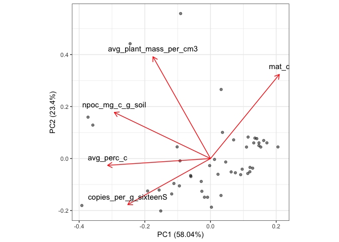
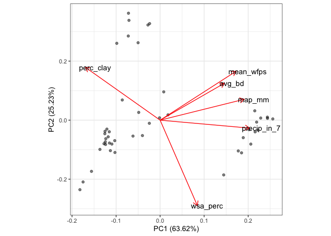
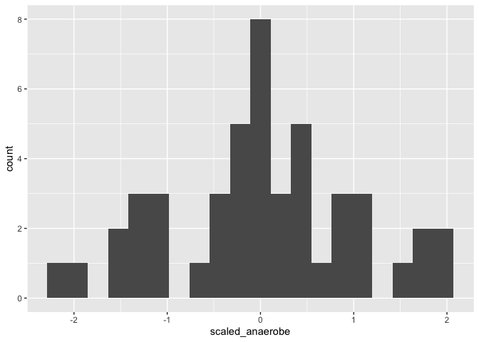
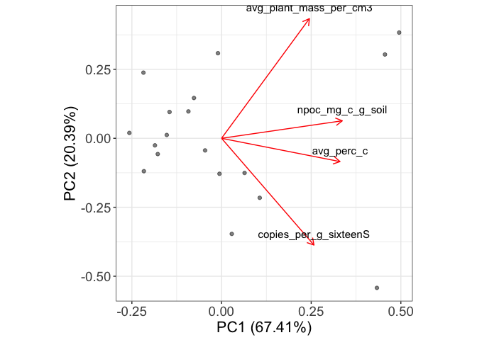
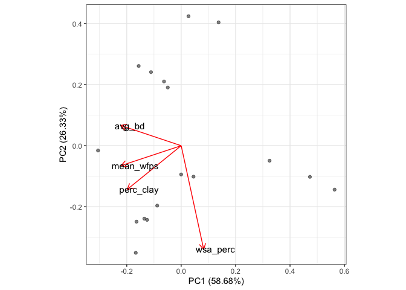
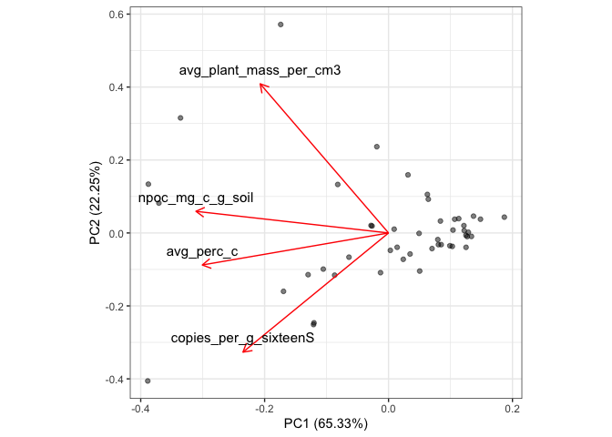
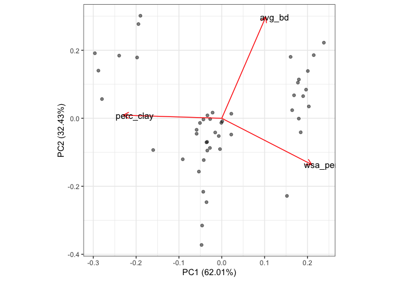

SEM_SHI
================
Emily Lacroix
09 FEB 2023

- <a href="#set-up" id="toc-set-up">Set-up</a>
  - <a href="#load-libraries" id="toc-load-libraries">Load libraries</a>
  - <a href="#file-names" id="toc-file-names">File names</a>
  - <a href="#import" id="toc-import">Import</a>
  - <a href="#join-it-all-together" id="toc-join-it-all-together">Join it
    all together</a>
- <a href="#entire-dataset---include-site-level-variables"
  id="toc-entire-dataset---include-site-level-variables">Entire dataset -
  include site-level variables</a>
  - <a href="#o2-demand-pc" id="toc-o2-demand-pc">O2 demand PC</a>
  - <a href="#o2-supply-pc" id="toc-o2-supply-pc">O2 supply PC</a>
  - <a href="#join-pcs-to-data-table" id="toc-join-pcs-to-data-table">Join
    PCs to data table</a>
  - <a href="#apriori-sem-model" id="toc-apriori-sem-model">Apriori SEM
    model</a>
    - <a href="#attempt-1" id="toc-attempt-1">Attempt 1</a>
    - <a href="#attempt-2" id="toc-attempt-2">Attempt 2</a>
  - <a href="#stepwise-removal-of-non-significant-paths"
    id="toc-stepwise-removal-of-non-significant-paths">Stepwise removal of
    non-significant paths</a>
    - <a href="#best-fit" id="toc-best-fit">Best fit</a>
    - <a href="#final-fit-non-viable-fit"
      id="toc-final-fit-non-viable-fit">Final fit (non-viable fit)</a>
- <a href="#crec-only" id="toc-crec-only">CREC only</a>
  - <a href="#o2-demand-pc-1" id="toc-o2-demand-pc-1">O2 demand PC</a>
  - <a href="#o2-supply-pc-1" id="toc-o2-supply-pc-1">O2 supply PC</a>
  - <a href="#join-pcs-to-data-table-1"
    id="toc-join-pcs-to-data-table-1">Join PCs to data table</a>
  - <a href="#apriori-model" id="toc-apriori-model">Apriori model</a>
    - <a href="#attempt-1-1" id="toc-attempt-1-1">Attempt 1</a>
  - <a href="#stepwise-removal-of-non-significant-paths-1"
    id="toc-stepwise-removal-of-non-significant-paths-1">Stepwise removal of
    non-significant paths</a>
    - <a href="#best-fit-1" id="toc-best-fit-1">Best fit</a>
    - <a href="#force-fit" id="toc-force-fit">Force fit</a>
- <a href="#entire-dataset---no-site-level-variables"
  id="toc-entire-dataset---no-site-level-variables">Entire dataset - no
  site level variables</a>
  - <a href="#o2-demand-pc-2" id="toc-o2-demand-pc-2">O2 demand PC</a>
  - <a href="#o2-supply-pc-2" id="toc-o2-supply-pc-2">O2 supply PC</a>
  - <a href="#join-pcs-to-data-table-2"
    id="toc-join-pcs-to-data-table-2">Join PCs to data table</a>
  - <a href="#apriori-model-1" id="toc-apriori-model-1">Apriori model</a>
  - <a href="#stepwise-removal-of-non-significant-paths-2"
    id="toc-stepwise-removal-of-non-significant-paths-2">Stepwise removal of
    non-significant paths</a>
    - <a href="#best-fit-2" id="toc-best-fit-2">Best fit</a>
    - <a href="#final-fit-non-viable-fit-1"
      id="toc-final-fit-non-viable-fit-1">Final fit (non-viable fit)</a>

# Set-up

## Load libraries

``` r
library(lavaan)
library(psych)
library(readxl)
library(ggfortify)
library(tidyverse)
```

## File names

``` r
all_data_excel <-  "AllData_FINAL.xlsx"
```

## Import

``` r
mineral <- 
  all_data_excel %>% 
  read_xlsx(sheet = "mineral_protection") %>% 
  select(-c(ssa_analysis_date, ssa_m2_g)) %>% 
  separate(sample, into = c("site", "till", "amend", "rep")) %>% 
  mutate(
    landscape_position = if_else(site == "GR", amend, NA_character_),
    across(amend, ~if_else(site == "GR", "U", .)),
    across(rep, as.numeric)
  )

sixteenS_abund <-
  all_data_excel %>% 
  read_xlsx(sheet = "dna_ddpcr", na = "NA") %>% 
  distinct(site, till, amend, landscape_position, rep, copies_per_g_sixteenS)

anaerobe_copies_total <- 
  all_data_excel %>% 
  read_xlsx(sheet = "anaerobe_copies", na = "NA") %>% 
  add_row( #adding blank rows for GR-NT-F for now
    site = "GR",
    till = "NT",
    amend = "U",
    landscape_position = "F",
    rep = c(1,3),
    anaerobe_copies_per_g = NA_real_
  )

climate <- 
  all_data_excel %>% 
  read_xlsx(sheet = "climate", na = "NA") %>% 
  rename(rep = field_rep)


root_mass_bd <-
  all_data_excel %>% 
  read_xlsx(sheet = "gravimetric", na = "NA") %>% 
  mutate(
    avg_plant_mass_per_cm3 = plant_mass_2_mm / volume_cm3
  ) %>% 
    group_by(site, till, amend, landscape_position, field_rep) %>% 
    summarise(
      avg_plant_mass_per_cm3 = mean(avg_plant_mass_per_cm3, na.rm = TRUE),
      avg_bd = mean(bd, na.rm = TRUE)
    ) %>% 
  rename(rep = field_rep)

c_n <- 
  all_data_excel %>% 
  read_xlsx(sheet = "c_n", na = "NA") %>%
  rename(
    amend = amend_pos,
    rep = field_rep
  ) %>% 
  mutate(
    landscape_position = if_else(site == "GR", amend, NA_character_),
    across(amend, ~if_else(site == "GR", "U", .)),
  )


anaerobe_matrix <- #already has outlier removed 
  all_data_excel %>% 
  read_xlsx(sheet = "dna_ddpcr", na = "NA") %>% 
  group_by(
    site, till, amend, landscape_position, rep, target_gene
  ) %>% 
  summarise(
    copies_per_g = mean(copies_per_g, na.rm = TRUE),
    prop = mean(prop, na.rm = TRUE)
  ) %>% 
  pivot_wider(
    id_cols = c(site, till, amend, landscape_position, rep),
    names_from = target_gene,
    values_from = c(copies_per_g, prop)
  )

aggregate_est <- 
  all_data_excel %>% 
  read_xlsx(sheet = "agg_est") %>% 
  select(site, till, amend, landscape_position, rep, wsa_perc)
```

## Join it all together

``` r
all_data <- 
  mineral %>% 
  left_join(
    sixteenS_abund, 
    by = c("site", "till", "amend", "landscape_position", "rep")
  ) %>% 
  left_join(
    anaerobe_copies_total,
    by = c("site", "till", "amend", "landscape_position", "rep")
  ) %>% 
  left_join(
    climate,
    by = c("site", "till", "amend", "landscape_position", "rep")
  ) %>% 
  left_join(
    root_mass_bd,
    by = c("site", "till", "amend", "landscape_position", "rep")
  ) %>% 
  left_join(
    c_n,
    by = c("site", "till", "amend", "landscape_position", "rep")
  ) %>% 
  left_join(
    anaerobe_matrix,
    by = c("site", "till", "amend", "landscape_position", "rep")
  ) %>% 
  left_join(
    aggregate_est,
    by = c("site", "till", "amend", "landscape_position", "rep")  
  ) %>% 
  filter(!(site == "GR" & landscape_position == "F" & rep %in% c(1,3))) %>% 
  rowid_to_column() %>% 
  arrange(site, till, amend, landscape_position, rep) %>% 
  ungroup() %>% 
  select(-landscape_position) %>% 
  na.omit() %>% 
  mutate(
    across(till, ~factor(., levels = c("UN", "NT", "MT", "CT"), ordered = TRUE)),
    across(amend, ~factor(., levels = c("U", "A"), ordered = TRUE))
  ) %>% 
  filter(
    !(site == "WO" & till == "UN" & rep == 2)
  )
```

# Entire dataset - include site-level variables

## O2 demand PC

``` r
o2_demand_pc_data <- 
  all_data %>% 
  select(
    copies_per_g_sixteenS,
    npoc_mg_c_g_soil,
    avg_perc_c,
    mat_c,
    avg_plant_mass_per_cm3
  ) 

o2_demand_pc <- 
  prcomp(~., data = o2_demand_pc_data, scale = TRUE)

o2_demand_pc1 <- o2_demand_pc$x %>% as_tibble() %>% pull(PC1)

autoplot(
  o2_demand_pc, 
  loadings = TRUE,
  loadings.label = TRUE,
  loadings.label.size = 8,
  loadings.label.hjust = 0.5,
  loadings.label.vjust = -1,
  loadings.label.colour = "black",
  alpha = 0.5
) + 
  theme_bw() + 
  theme(
    aspect.ratio = 1,
    axis.title = element_text(size = 16),
    axis.text = element_text(size = 14)
  )
```

<!-- -->

O2 demand, more negative = more demand expected

## O2 supply PC

``` r
o2_supp_pc_data <- 
  all_data %>% 
  select(
      avg_bd,
      perc_clay, 
      mean_wfps,
      wsa_perc,
      map_mm,
      precip_in_7
  ) 

o2_supp_pc <- 
  prcomp(~., data = o2_supp_pc_data, scale = TRUE)

autoplot(
  o2_supp_pc,
  loadings = TRUE,
  loadings.label = TRUE,
  loadings.label.size = 4,
  loadings.label.hjust = 0.2,
  loadings.label.colour = "black",
  alpha = 0.5
) + 
  theme_bw() + 
  theme(
    aspect.ratio = 1,
    axis.title = element_text(size = 16),
    axis.text = element_text(size = 14)
  )
```

<!-- -->

``` r
o2_supp_pc1 <- o2_supp_pc$x %>% as_tibble() %>% pull(PC1)
```

## Join PCs to data table

``` r
sem_data <- 
  all_data %>% 
  select(site, till, amend, anaerobe_copies_per_g) %>% 
  add_column(
    o2_demand_pc = o2_demand_pc1,
    o2_supp_pc = o2_supp_pc1
  ) %>% 
  mutate(
    #best transformation for normality
    sqrt_anaerobe_copies_per_g = sqrt(anaerobe_copies_per_g), 
    cultivated = if_else(till == "UN", 0, 1),
    amended = if_else(amend == "A", 1, 0),
    red_no_till = if_else(till %in% c("NT", "MT"), 1, 0),
    scaled_o2_demand_pc = scale(o2_demand_pc),
    scaled_o2_supp_pc = scale(o2_supp_pc),
    scaled_anaerobe = scale(sqrt_anaerobe_copies_per_g)
  ) 

sem_data %>% 
  ggplot(
    aes(x = scaled_anaerobe)
  ) + 
  geom_histogram(bins = 20)
```

<!-- -->

``` r
shapiro.test(sem_data$scaled_anaerobe)
```

    ## 
    ##  Shapiro-Wilk normality test
    ## 
    ## data:  sem_data$scaled_anaerobe
    ## W = 0.97881, p-value = 0.5441

## Apriori SEM model

### Attempt 1

First: see if there are relationships between everything essentially.
We’re going to try this on the normally distributed variable
sqrt_anaerobe_copies_per_g

Set this up like a series of regressions:

``` r
apriori_model1 <- 'scaled_o2_demand_pc ~ cultivated + amended + red_no_till + scaled_o2_supp_pc
           scaled_o2_supp_pc ~ cultivated + amended + red_no_till + scaled_o2_demand_pc
           scaled_anaerobe ~ scaled_o2_supp_pc + scaled_o2_demand_pc + cultivated + red_no_till + amended'


apriori_model1_fit <- sem(apriori_model1, data = sem_data)
```

    ## Warning in lav_model_vcov(lavmodel = lavmodel, lavsamplestats = lavsamplestats, : lavaan WARNING:
    ##     Could not compute standard errors! The information matrix could
    ##     not be inverted. This may be a symptom that the model is not
    ##     identified.

``` r
summary(apriori_model1_fit, standardized = TRUE, ci = TRUE, fit.measures = TRUE)
```

    ## lavaan 0.6.14 ended normally after 17 iterations
    ## 
    ##   Estimator                                         ML
    ##   Optimization method                           NLMINB
    ##   Number of model parameters                        16
    ## 
    ##   Number of observations                            47
    ## 
    ## Model Test User Model:
    ##                                                       
    ##   Test statistic                                    NA
    ##   Degrees of freedom                                -1
    ##   P-value (Unknown)                                 NA
    ## 
    ## Model Test Baseline Model:
    ## 
    ##   Test statistic                                    NA
    ##   Degrees of freedom                                NA
    ##   P-value                                           NA
    ## 
    ## User Model versus Baseline Model:
    ## 
    ##   Comparative Fit Index (CFI)                       NA
    ##   Tucker-Lewis Index (TLI)                          NA
    ## 
    ## Loglikelihood and Information Criteria:
    ## 
    ##   Loglikelihood user model (H0)               -131.602
    ##   Loglikelihood unrestricted model (H1)       -131.602
    ##                                                       
    ##   Akaike (AIC)                                 295.204
    ##   Bayesian (BIC)                               324.806
    ##   Sample-size adjusted Bayesian (SABIC)        274.624
    ## 
    ## Root Mean Square Error of Approximation:
    ## 
    ##   RMSEA                                          0.000
    ##   90 Percent confidence interval - lower            NA
    ##   90 Percent confidence interval - upper            NA
    ##   P-value H_0: RMSEA <= 0.050                       NA
    ##   P-value H_0: RMSEA >= 0.080                       NA
    ## 
    ## Standardized Root Mean Square Residual:
    ## 
    ##   SRMR                                           0.000
    ## 
    ## Parameter Estimates:
    ## 
    ##   Standard errors                             Standard
    ##   Information                                 Expected
    ##   Information saturated (h1) model          Structured
    ## 
    ## Regressions:
    ##                         Estimate  Std.Err  z-value  P(>|z|) ci.lower ci.upper
    ##   scaled_o2_demand_pc ~                                                      
    ##     cultivated             1.834       NA                         NA       NA
    ##     amended               -0.551       NA                         NA       NA
    ##     red_no_till           -0.012       NA                         NA       NA
    ##     scald_2_spp_pc         0.193       NA                         NA       NA
    ##   scaled_o2_supp_pc ~                                                        
    ##     cultivated            -1.644       NA                         NA       NA
    ##     amended                0.718       NA                         NA       NA
    ##     red_no_till           -0.232       NA                         NA       NA
    ##     scld_2_dmnd_pc         0.982       NA                         NA       NA
    ##   scaled_anaerobe ~                                                          
    ##     scald_2_spp_pc        -0.818       NA                         NA       NA
    ##     scld_2_dmnd_pc         0.252       NA                         NA       NA
    ##     cultivated            -1.615       NA                         NA       NA
    ##     red_no_till            0.217       NA                         NA       NA
    ##     amended                0.214       NA                         NA       NA
    ##    Std.lv  Std.all
    ##                   
    ##     1.834    0.697
    ##    -0.551   -0.236
    ##    -0.012   -0.006
    ##     0.193    0.193
    ##                   
    ##    -1.644   -0.625
    ##     0.718    0.307
    ##    -0.232   -0.117
    ##     0.982    0.982
    ##                   
    ##    -0.818   -0.818
    ##     0.252    0.252
    ##    -1.615   -0.614
    ##     0.217    0.110
    ##     0.214    0.092
    ## 
    ## Variances:
    ##                    Estimate  Std.Err  z-value  P(>|z|) ci.lower ci.upper
    ##    .scld_2_dmnd_pc    0.341       NA                         NA       NA
    ##    .scald_2_spp_pc    0.293       NA                         NA       NA
    ##    .scaled_anaerob    0.356       NA                         NA       NA
    ##    Std.lv  Std.all
    ##     0.341    0.349
    ##     0.293    0.300
    ##     0.356    0.364

This is seriously overfit (to the point where there are negative degrees
of freedom). Remove whichever variable has the smallest coefficient.

### Attempt 2

``` r
apriori_model2 <- 'scaled_o2_demand_pc ~ cultivated + amended + scaled_o2_supp_pc
           scaled_o2_supp_pc ~ cultivated + amended + red_no_till + scaled_o2_demand_pc
           scaled_anaerobe ~ scaled_o2_supp_pc + scaled_o2_demand_pc + cultivated + red_no_till + amended'

apriori_model2_fit <- sem(apriori_model2, data = sem_data)

summary(apriori_model2_fit, standardized = TRUE, ci = TRUE, fit.measures = TRUE)
```

    ## lavaan 0.6.14 ended normally after 27 iterations
    ## 
    ##   Estimator                                         ML
    ##   Optimization method                           NLMINB
    ##   Number of model parameters                        15
    ## 
    ##   Number of observations                            47
    ## 
    ## Model Test User Model:
    ##                                                       
    ##   Test statistic                                 0.000
    ##   Degrees of freedom                                 0
    ## 
    ## Model Test Baseline Model:
    ## 
    ##   Test statistic                               133.904
    ##   Degrees of freedom                                12
    ##   P-value                                        0.000
    ## 
    ## User Model versus Baseline Model:
    ## 
    ##   Comparative Fit Index (CFI)                    1.000
    ##   Tucker-Lewis Index (TLI)                       1.000
    ## 
    ## Loglikelihood and Information Criteria:
    ## 
    ##   Loglikelihood user model (H0)               -131.602
    ##   Loglikelihood unrestricted model (H1)       -131.602
    ##                                                       
    ##   Akaike (AIC)                                 293.204
    ##   Bayesian (BIC)                               320.956
    ##   Sample-size adjusted Bayesian (SABIC)        273.910
    ## 
    ## Root Mean Square Error of Approximation:
    ## 
    ##   RMSEA                                          0.000
    ##   90 Percent confidence interval - lower         0.000
    ##   90 Percent confidence interval - upper         0.000
    ##   P-value H_0: RMSEA <= 0.050                       NA
    ##   P-value H_0: RMSEA >= 0.080                       NA
    ## 
    ## Standardized Root Mean Square Residual:
    ## 
    ##   SRMR                                           0.000
    ## 
    ## Parameter Estimates:
    ## 
    ##   Standard errors                             Standard
    ##   Information                                 Expected
    ##   Information saturated (h1) model          Structured
    ## 
    ## Regressions:
    ##                         Estimate  Std.Err  z-value  P(>|z|) ci.lower ci.upper
    ##   scaled_o2_demand_pc ~                                                      
    ##     cultivated             1.826    0.223    8.193    0.000    1.389    2.263
    ##     amended               -0.560    0.265   -2.112    0.035   -1.080   -0.040
    ##     scald_2_spp_pc         0.234    0.620    0.378    0.706   -0.981    1.450
    ##   scaled_o2_supp_pc ~                                                        
    ##     cultivated            -1.573    1.172   -1.343    0.179   -3.870    0.723
    ##     amended                0.698    0.370    1.890    0.059   -0.026    1.423
    ##     red_no_till           -0.235    0.189   -1.242    0.214   -0.605    0.136
    ##     scld_2_dmnd_pc         0.944    0.611    1.544    0.123   -0.254    2.143
    ##   scaled_anaerobe ~                                                          
    ##     scald_2_spp_pc        -0.818    0.163   -5.009    0.000   -1.138   -0.498
    ##     scld_2_dmnd_pc         0.252    0.217    1.160    0.246   -0.174    0.677
    ##     cultivated            -1.615    0.469   -3.441    0.001   -2.535   -0.695
    ##     red_no_till            0.217    0.204    1.063    0.288   -0.183    0.617
    ##     amended                0.214    0.259    0.825    0.409   -0.294    0.722
    ##    Std.lv  Std.all
    ##                   
    ##     1.826    0.694
    ##    -0.560   -0.240
    ##     0.234    0.234
    ##                   
    ##    -1.573   -0.598
    ##     0.698    0.299
    ##    -0.235   -0.119
    ##     0.944    0.944
    ##                   
    ##    -0.818   -0.818
    ##     0.252    0.252
    ##    -1.615   -0.614
    ##     0.217    0.110
    ##     0.214    0.092
    ## 
    ## Variances:
    ##                    Estimate  Std.Err  z-value  P(>|z|) ci.lower ci.upper
    ##    .scld_2_dmnd_pc    0.309    0.469    0.659    0.510   -0.610    1.227
    ##    .scald_2_spp_pc    0.299    0.126    2.370    0.018    0.052    0.547
    ##    .scaled_anaerob    0.356    0.073    4.848    0.000    0.212    0.500
    ##    Std.lv  Std.all
    ##     0.309    0.315
    ##     0.299    0.306
    ##     0.356    0.364

This is our apriori model.

## Stepwise removal of non-significant paths

For each model, we remove one non-significant path per step, selecting
the path with the highest p-value (least likelihood for significance)
with each iteration.

For each of the iterations below, we assess the model for: i) acceptable
model fit, i.e. non-significant chi-squared test, RMSEA \< 0.09, and CFI
\> 0.90 ii) AIC value

At the end of the elimination of non-significant pathways, we compare
all models with acceptable fit and then select the one with the lowest
AIC value.

``` r
model1 <- 'scaled_o2_demand_pc ~ cultivated + amended
           scaled_o2_supp_pc ~ cultivated + amended + red_no_till + scaled_o2_demand_pc
           scaled_anaerobe ~ scaled_o2_supp_pc + scaled_o2_demand_pc + cultivated + red_no_till + amended'

fit1 <- sem(model1, data = sem_data)

summary(fit1, standardized = TRUE, ci = TRUE, fit.measures = TRUE)
```

    ## lavaan 0.6.14 ended normally after 1 iteration
    ## 
    ##   Estimator                                         ML
    ##   Optimization method                           NLMINB
    ##   Number of model parameters                        14
    ## 
    ##   Number of observations                            47
    ## 
    ## Model Test User Model:
    ##                                                       
    ##   Test statistic                                 0.082
    ##   Degrees of freedom                                 1
    ##   P-value (Chi-square)                           0.774
    ## 
    ## Model Test Baseline Model:
    ## 
    ##   Test statistic                               133.904
    ##   Degrees of freedom                                12
    ##   P-value                                        0.000
    ## 
    ## User Model versus Baseline Model:
    ## 
    ##   Comparative Fit Index (CFI)                    1.000
    ##   Tucker-Lewis Index (TLI)                       1.090
    ## 
    ## Loglikelihood and Information Criteria:
    ## 
    ##   Loglikelihood user model (H0)               -131.643
    ##   Loglikelihood unrestricted model (H1)       -131.602
    ##                                                       
    ##   Akaike (AIC)                                 291.286
    ##   Bayesian (BIC)                               317.188
    ##   Sample-size adjusted Bayesian (SABIC)        273.279
    ## 
    ## Root Mean Square Error of Approximation:
    ## 
    ##   RMSEA                                          0.000
    ##   90 Percent confidence interval - lower         0.000
    ##   90 Percent confidence interval - upper         0.257
    ##   P-value H_0: RMSEA <= 0.050                    0.787
    ##   P-value H_0: RMSEA >= 0.080                    0.195
    ## 
    ## Standardized Root Mean Square Residual:
    ## 
    ##   SRMR                                           0.010
    ## 
    ## Parameter Estimates:
    ## 
    ##   Standard errors                             Standard
    ##   Information                                 Expected
    ##   Information saturated (h1) model          Structured
    ## 
    ## Regressions:
    ##                         Estimate  Std.Err  z-value  P(>|z|) ci.lower ci.upper
    ##   scaled_o2_demand_pc ~                                                      
    ##     cultivated             1.823    0.294    6.206    0.000    1.248    2.399
    ##     amended               -0.493    0.261   -1.892    0.058   -1.005    0.018
    ##   scaled_o2_supp_pc ~                                                        
    ##     cultivated            -1.888    0.313   -6.033    0.000   -2.501   -1.274
    ##     amended                0.784    0.201    3.903    0.000    0.390    1.178
    ##     red_no_till           -0.223    0.179   -1.243    0.214   -0.574    0.129
    ##     scld_2_dmnd_pc         1.112    0.106   10.481    0.000    0.904    1.320
    ##   scaled_anaerobe ~                                                          
    ##     scald_2_spp_pc        -0.818    0.163   -5.009    0.000   -1.138   -0.498
    ##     scld_2_dmnd_pc         0.252    0.217    1.160    0.246   -0.173    0.677
    ##     cultivated            -1.615    0.467   -3.461    0.001   -2.530   -0.700
    ##     red_no_till            0.217    0.204    1.064    0.288   -0.183    0.617
    ##     amended                0.214    0.259    0.826    0.409   -0.293    0.721
    ##    Std.lv  Std.all
    ##                   
    ##     1.823    0.693
    ##    -0.493   -0.211
    ##                   
    ##    -1.888   -0.720
    ##     0.784    0.337
    ##    -0.223   -0.113
    ##     1.112    1.116
    ##                   
    ##    -0.818   -0.818
    ##     0.252    0.253
    ##    -1.615   -0.616
    ##     0.217    0.110
    ##     0.214    0.092
    ## 
    ## Variances:
    ##                    Estimate  Std.Err  z-value  P(>|z|) ci.lower ci.upper
    ##    .scld_2_dmnd_pc    0.537    0.111    4.848    0.000    0.320    0.754
    ##    .scald_2_spp_pc    0.284    0.059    4.848    0.000    0.169    0.399
    ##    .scaled_anaerob    0.356    0.073    4.848    0.000    0.212    0.500
    ##    Std.lv  Std.all
    ##     0.537    0.549
    ##     0.284    0.292
    ##     0.356    0.367

``` r
model2 <- 'scaled_o2_demand_pc ~ cultivated + amended
           scaled_o2_supp_pc ~ cultivated + amended + red_no_till + scaled_o2_demand_pc
           scaled_anaerobe ~ scaled_o2_supp_pc + scaled_o2_demand_pc + cultivated + red_no_till'

fit2 <- sem(model2, data = sem_data)

summary(fit2, standardized = TRUE, ci = TRUE, fit.measures = TRUE)
```

    ## lavaan 0.6.14 ended normally after 2 iterations
    ## 
    ##   Estimator                                         ML
    ##   Optimization method                           NLMINB
    ##   Number of model parameters                        13
    ## 
    ##   Number of observations                            47
    ## 
    ## Model Test User Model:
    ##                                                       
    ##   Test statistic                                 0.758
    ##   Degrees of freedom                                 2
    ##   P-value (Chi-square)                           0.685
    ## 
    ## Model Test Baseline Model:
    ## 
    ##   Test statistic                               133.904
    ##   Degrees of freedom                                12
    ##   P-value                                        0.000
    ## 
    ## User Model versus Baseline Model:
    ## 
    ##   Comparative Fit Index (CFI)                    1.000
    ##   Tucker-Lewis Index (TLI)                       1.061
    ## 
    ## Loglikelihood and Information Criteria:
    ## 
    ##   Loglikelihood user model (H0)               -131.981
    ##   Loglikelihood unrestricted model (H1)       -131.602
    ##                                                       
    ##   Akaike (AIC)                                 289.962
    ##   Bayesian (BIC)                               314.014
    ##   Sample-size adjusted Bayesian (SABIC)        273.241
    ## 
    ## Root Mean Square Error of Approximation:
    ## 
    ##   RMSEA                                          0.000
    ##   90 Percent confidence interval - lower         0.000
    ##   90 Percent confidence interval - upper         0.217
    ##   P-value H_0: RMSEA <= 0.050                    0.714
    ##   P-value H_0: RMSEA >= 0.080                    0.246
    ## 
    ## Standardized Root Mean Square Residual:
    ## 
    ##   SRMR                                           0.016
    ## 
    ## Parameter Estimates:
    ## 
    ##   Standard errors                             Standard
    ##   Information                                 Expected
    ##   Information saturated (h1) model          Structured
    ## 
    ## Regressions:
    ##                         Estimate  Std.Err  z-value  P(>|z|) ci.lower ci.upper
    ##   scaled_o2_demand_pc ~                                                      
    ##     cultivated             1.823    0.294    6.206    0.000    1.248    2.399
    ##     amended               -0.493    0.261   -1.892    0.058   -1.005    0.018
    ##   scaled_o2_supp_pc ~                                                        
    ##     cultivated            -1.888    0.313   -6.033    0.000   -2.501   -1.274
    ##     amended                0.784    0.201    3.903    0.000    0.390    1.178
    ##     red_no_till           -0.223    0.179   -1.243    0.214   -0.574    0.129
    ##     scld_2_dmnd_pc         1.112    0.106   10.481    0.000    0.904    1.320
    ##   scaled_anaerobe ~                                                          
    ##     scald_2_spp_pc        -0.751    0.143   -5.258    0.000   -1.032   -0.471
    ##     scld_2_dmnd_pc         0.155    0.184    0.841    0.400   -0.206    0.516
    ##     cultivated            -1.387    0.380   -3.648    0.000   -2.132   -0.642
    ##     red_no_till            0.202    0.205    0.984    0.325   -0.200    0.603
    ##    Std.lv  Std.all
    ##                   
    ##     1.823    0.693
    ##    -0.493   -0.211
    ##                   
    ##    -1.888   -0.720
    ##     0.784    0.337
    ##    -0.223   -0.113
    ##     1.112    1.116
    ##                   
    ##    -0.751   -0.751
    ##     0.155    0.155
    ##    -1.387   -0.529
    ##     0.202    0.102
    ## 
    ## Variances:
    ##                    Estimate  Std.Err  z-value  P(>|z|) ci.lower ci.upper
    ##    .scld_2_dmnd_pc    0.537    0.111    4.848    0.000    0.320    0.754
    ##    .scald_2_spp_pc    0.284    0.059    4.848    0.000    0.169    0.399
    ##    .scaled_anaerob    0.361    0.075    4.848    0.000    0.215    0.507
    ##    Std.lv  Std.all
    ##     0.537    0.549
    ##     0.284    0.292
    ##     0.361    0.372

``` r
model3 <- 'scaled_o2_demand_pc ~ cultivated + amended
           scaled_o2_supp_pc ~ cultivated + amended + red_no_till + scaled_o2_demand_pc
           scaled_anaerobe ~ scaled_o2_supp_pc + cultivated + red_no_till'

fit3 <- sem(model3, data = sem_data)

summary(fit3, standardized = TRUE, ci = TRUE, fit.measures = TRUE)
```

    ## lavaan 0.6.14 ended normally after 2 iterations
    ## 
    ##   Estimator                                         ML
    ##   Optimization method                           NLMINB
    ##   Number of model parameters                        12
    ## 
    ##   Number of observations                            47
    ## 
    ## Model Test User Model:
    ##                                                       
    ##   Test statistic                                 1.463
    ##   Degrees of freedom                                 3
    ##   P-value (Chi-square)                           0.691
    ## 
    ## Model Test Baseline Model:
    ## 
    ##   Test statistic                               133.904
    ##   Degrees of freedom                                12
    ##   P-value                                        0.000
    ## 
    ## User Model versus Baseline Model:
    ## 
    ##   Comparative Fit Index (CFI)                    1.000
    ##   Tucker-Lewis Index (TLI)                       1.050
    ## 
    ## Loglikelihood and Information Criteria:
    ## 
    ##   Loglikelihood user model (H0)               -132.333
    ##   Loglikelihood unrestricted model (H1)       -131.602
    ##                                                       
    ##   Akaike (AIC)                                 288.666
    ##   Bayesian (BIC)                               310.868
    ##   Sample-size adjusted Bayesian (SABIC)        273.232
    ## 
    ## Root Mean Square Error of Approximation:
    ## 
    ##   RMSEA                                          0.000
    ##   90 Percent confidence interval - lower         0.000
    ##   90 Percent confidence interval - upper         0.185
    ##   P-value H_0: RMSEA <= 0.050                    0.728
    ##   P-value H_0: RMSEA >= 0.080                    0.222
    ## 
    ## Standardized Root Mean Square Residual:
    ## 
    ##   SRMR                                           0.013
    ## 
    ## Parameter Estimates:
    ## 
    ##   Standard errors                             Standard
    ##   Information                                 Expected
    ##   Information saturated (h1) model          Structured
    ## 
    ## Regressions:
    ##                         Estimate  Std.Err  z-value  P(>|z|) ci.lower ci.upper
    ##   scaled_o2_demand_pc ~                                                      
    ##     cultivated             1.823    0.294    6.206    0.000    1.248    2.399
    ##     amended               -0.493    0.261   -1.892    0.058   -1.005    0.018
    ##   scaled_o2_supp_pc ~                                                        
    ##     cultivated            -1.888    0.313   -6.033    0.000   -2.501   -1.274
    ##     amended                0.784    0.201    3.903    0.000    0.390    1.178
    ##     red_no_till           -0.223    0.179   -1.243    0.214   -0.574    0.129
    ##     scld_2_dmnd_pc         1.112    0.106   10.481    0.000    0.904    1.320
    ##   scaled_anaerobe ~                                                          
    ##     scald_2_spp_pc        -0.658    0.090   -7.284    0.000   -0.835   -0.481
    ##     cultivated            -1.155    0.266   -4.341    0.000   -1.676   -0.633
    ##     red_no_till            0.238    0.201    1.185    0.236   -0.156    0.631
    ##    Std.lv  Std.all
    ##                   
    ##     1.823    0.693
    ##    -0.493   -0.211
    ##                   
    ##    -1.888   -0.720
    ##     0.784    0.337
    ##    -0.223   -0.113
    ##     1.112    1.116
    ##                   
    ##    -0.658   -0.658
    ##    -1.155   -0.440
    ##     0.238    0.121
    ## 
    ## Variances:
    ##                    Estimate  Std.Err  z-value  P(>|z|) ci.lower ci.upper
    ##    .scld_2_dmnd_pc    0.537    0.111    4.848    0.000    0.320    0.754
    ##    .scald_2_spp_pc    0.284    0.059    4.848    0.000    0.169    0.399
    ##    .scaled_anaerob    0.367    0.076    4.848    0.000    0.218    0.515
    ##    Std.lv  Std.all
    ##     0.537    0.549
    ##     0.284    0.292
    ##     0.367    0.378

``` r
model4 <- 'scaled_o2_demand_pc ~ cultivated + amended
           scaled_o2_supp_pc ~ cultivated + amended + scaled_o2_demand_pc + red_no_till
           scaled_anaerobe ~ scaled_o2_supp_pc + cultivated'

fit4 <- sem(model4, data = sem_data)

summary(fit4, standardized = TRUE, ci = TRUE, fit.measures = TRUE)
```

    ## lavaan 0.6.14 ended normally after 1 iteration
    ## 
    ##   Estimator                                         ML
    ##   Optimization method                           NLMINB
    ##   Number of model parameters                        11
    ## 
    ##   Number of observations                            47
    ## 
    ## Model Test User Model:
    ##                                                       
    ##   Test statistic                                 2.833
    ##   Degrees of freedom                                 4
    ##   P-value (Chi-square)                           0.586
    ## 
    ## Model Test Baseline Model:
    ## 
    ##   Test statistic                               133.904
    ##   Degrees of freedom                                12
    ##   P-value                                        0.000
    ## 
    ## User Model versus Baseline Model:
    ## 
    ##   Comparative Fit Index (CFI)                    1.000
    ##   Tucker-Lewis Index (TLI)                       1.029
    ## 
    ## Loglikelihood and Information Criteria:
    ## 
    ##   Loglikelihood user model (H0)               -133.018
    ##   Loglikelihood unrestricted model (H1)       -131.602
    ##                                                       
    ##   Akaike (AIC)                                 288.037
    ##   Bayesian (BIC)                               308.388
    ##   Sample-size adjusted Bayesian (SABIC)        273.888
    ## 
    ## Root Mean Square Error of Approximation:
    ## 
    ##   RMSEA                                          0.000
    ##   90 Percent confidence interval - lower         0.000
    ##   90 Percent confidence interval - upper         0.188
    ##   P-value H_0: RMSEA <= 0.050                    0.640
    ##   P-value H_0: RMSEA >= 0.080                    0.289
    ## 
    ## Standardized Root Mean Square Residual:
    ## 
    ##   SRMR                                           0.028
    ## 
    ## Parameter Estimates:
    ## 
    ##   Standard errors                             Standard
    ##   Information                                 Expected
    ##   Information saturated (h1) model          Structured
    ## 
    ## Regressions:
    ##                         Estimate  Std.Err  z-value  P(>|z|) ci.lower ci.upper
    ##   scaled_o2_demand_pc ~                                                      
    ##     cultivated             1.823    0.294    6.206    0.000    1.248    2.399
    ##     amended               -0.493    0.261   -1.892    0.058   -1.005    0.018
    ##   scaled_o2_supp_pc ~                                                        
    ##     cultivated            -1.888    0.313   -6.033    0.000   -2.501   -1.274
    ##     amended                0.784    0.201    3.903    0.000    0.390    1.178
    ##     scld_2_dmnd_pc         1.112    0.106   10.481    0.000    0.904    1.320
    ##     red_no_till           -0.223    0.179   -1.243    0.214   -0.574    0.129
    ##   scaled_anaerobe ~                                                          
    ##     scald_2_spp_pc        -0.674    0.091   -7.411    0.000   -0.852   -0.496
    ##     cultivated            -1.007    0.239   -4.221    0.000   -1.475   -0.539
    ##    Std.lv  Std.all
    ##                   
    ##     1.823    0.693
    ##    -0.493   -0.211
    ##                   
    ##    -1.888   -0.720
    ##     0.784    0.337
    ##     1.112    1.116
    ##    -0.223   -0.113
    ##                   
    ##    -0.674   -0.673
    ##    -1.007   -0.383
    ## 
    ## Variances:
    ##                    Estimate  Std.Err  z-value  P(>|z|) ci.lower ci.upper
    ##    .scld_2_dmnd_pc    0.537    0.111    4.848    0.000    0.320    0.754
    ##    .scald_2_spp_pc    0.284    0.059    4.848    0.000    0.169    0.399
    ##    .scaled_anaerob    0.378    0.078    4.848    0.000    0.225    0.530
    ##    Std.lv  Std.all
    ##     0.537    0.549
    ##     0.284    0.292
    ##     0.378    0.387

### Best fit

``` r
model5 <- 'scaled_o2_demand_pc ~ cultivated + amended
           scaled_o2_supp_pc ~ cultivated + amended + scaled_o2_demand_pc
           scaled_anaerobe ~ scaled_o2_supp_pc + cultivated'

fit5 <- sem(model5, data = sem_data)

summary(fit5, standardized = TRUE, ci = TRUE, fit.measures = TRUE)
```

    ## lavaan 0.6.14 ended normally after 1 iteration
    ## 
    ##   Estimator                                         ML
    ##   Optimization method                           NLMINB
    ##   Number of model parameters                        10
    ## 
    ##   Number of observations                            47
    ## 
    ## Model Test User Model:
    ##                                                       
    ##   Test statistic                                 1.635
    ##   Degrees of freedom                                 2
    ##   P-value (Chi-square)                           0.442
    ## 
    ## Model Test Baseline Model:
    ## 
    ##   Test statistic                               131.189
    ##   Degrees of freedom                                 9
    ##   P-value                                        0.000
    ## 
    ## User Model versus Baseline Model:
    ## 
    ##   Comparative Fit Index (CFI)                    1.000
    ##   Tucker-Lewis Index (TLI)                       1.013
    ## 
    ## Loglikelihood and Information Criteria:
    ## 
    ##   Loglikelihood user model (H0)               -133.777
    ##   Loglikelihood unrestricted model (H1)       -132.960
    ##                                                       
    ##   Akaike (AIC)                                 287.554
    ##   Bayesian (BIC)                               306.055
    ##   Sample-size adjusted Bayesian (SABIC)        274.692
    ## 
    ## Root Mean Square Error of Approximation:
    ## 
    ##   RMSEA                                          0.000
    ##   90 Percent confidence interval - lower         0.000
    ##   90 Percent confidence interval - upper         0.272
    ##   P-value H_0: RMSEA <= 0.050                    0.483
    ##   P-value H_0: RMSEA >= 0.080                    0.459
    ## 
    ## Standardized Root Mean Square Residual:
    ## 
    ##   SRMR                                           0.012
    ## 
    ## Parameter Estimates:
    ## 
    ##   Standard errors                             Standard
    ##   Information                                 Expected
    ##   Information saturated (h1) model          Structured
    ## 
    ## Regressions:
    ##                         Estimate  Std.Err  z-value  P(>|z|) ci.lower ci.upper
    ##   scaled_o2_demand_pc ~                                                      
    ##     cultivated             1.823    0.294    6.206    0.000    1.248    2.399
    ##     amended               -0.493    0.261   -1.892    0.058   -1.005    0.018
    ##   scaled_o2_supp_pc ~                                                        
    ##     cultivated            -2.049    0.293   -6.994    0.000   -2.623   -1.475
    ##     amended                0.837    0.200    4.183    0.000    0.445    1.229
    ##     scld_2_dmnd_pc         1.118    0.108   10.364    0.000    0.906    1.329
    ##   scaled_anaerobe ~                                                          
    ##     scald_2_spp_pc        -0.674    0.091   -7.436    0.000   -0.852   -0.496
    ##     cultivated            -1.007    0.239   -4.221    0.000   -1.475   -0.539
    ##    Std.lv  Std.all
    ##                   
    ##     1.823    0.693
    ##    -0.493   -0.211
    ##                   
    ##    -2.049   -0.778
    ##     0.837    0.358
    ##     1.118    1.118
    ##                   
    ##    -0.674   -0.674
    ##    -1.007   -0.383
    ## 
    ## Variances:
    ##                    Estimate  Std.Err  z-value  P(>|z|) ci.lower ci.upper
    ##    .scld_2_dmnd_pc    0.537    0.111    4.848    0.000    0.320    0.754
    ##    .scald_2_spp_pc    0.294    0.061    4.848    0.000    0.175    0.412
    ##    .scaled_anaerob    0.378    0.078    4.848    0.000    0.225    0.530
    ##    Std.lv  Std.all
    ##     0.537    0.549
    ##     0.294    0.300
    ##     0.378    0.386

### Final fit (non-viable fit)

``` r
model6 <- 'scaled_o2_demand_pc ~ cultivated
           scaled_o2_supp_pc ~ cultivated + amended + scaled_o2_demand_pc
           scaled_anaerobe ~ scaled_o2_supp_pc + cultivated'


fit6 <- sem(model6, data = sem_data)

summary(fit6, standardized = TRUE, ci = TRUE, fit.measures = TRUE)
```

    ## lavaan 0.6.14 ended normally after 1 iteration
    ## 
    ##   Estimator                                         ML
    ##   Optimization method                           NLMINB
    ##   Number of model parameters                         9
    ## 
    ##   Number of observations                            47
    ## 
    ## Model Test User Model:
    ##                                                       
    ##   Test statistic                                 5.085
    ##   Degrees of freedom                                 3
    ##   P-value (Chi-square)                           0.166
    ## 
    ## Model Test Baseline Model:
    ## 
    ##   Test statistic                               131.189
    ##   Degrees of freedom                                 9
    ##   P-value                                        0.000
    ## 
    ## User Model versus Baseline Model:
    ## 
    ##   Comparative Fit Index (CFI)                    0.983
    ##   Tucker-Lewis Index (TLI)                       0.949
    ## 
    ## Loglikelihood and Information Criteria:
    ## 
    ##   Loglikelihood user model (H0)               -135.502
    ##   Loglikelihood unrestricted model (H1)       -132.960
    ##                                                       
    ##   Akaike (AIC)                                 289.004
    ##   Bayesian (BIC)                               305.655
    ##   Sample-size adjusted Bayesian (SABIC)        277.428
    ## 
    ## Root Mean Square Error of Approximation:
    ## 
    ##   RMSEA                                          0.122
    ##   90 Percent confidence interval - lower         0.000
    ##   90 Percent confidence interval - upper         0.298
    ##   P-value H_0: RMSEA <= 0.050                    0.208
    ##   P-value H_0: RMSEA >= 0.080                    0.727
    ## 
    ## Standardized Root Mean Square Residual:
    ## 
    ##   SRMR                                           0.105
    ## 
    ## Parameter Estimates:
    ## 
    ##   Standard errors                             Standard
    ##   Information                                 Expected
    ##   Information saturated (h1) model          Structured
    ## 
    ## Regressions:
    ##                         Estimate  Std.Err  z-value  P(>|z|) ci.lower ci.upper
    ##   scaled_o2_demand_pc ~                                                      
    ##     cultivated             1.684    0.295    5.707    0.000    1.106    2.263
    ##   scaled_o2_supp_pc ~                                                        
    ##     cultivated            -2.049    0.279   -7.345    0.000   -2.596   -1.502
    ##     amended                0.837    0.193    4.340    0.000    0.459    1.215
    ##     scld_2_dmnd_pc         1.118    0.104   10.751    0.000    0.914    1.321
    ##   scaled_anaerobe ~                                                          
    ##     scald_2_spp_pc        -0.674    0.084   -8.004    0.000   -0.839   -0.509
    ##     cultivated            -1.007    0.239   -4.221    0.000   -1.475   -0.539
    ##    Std.lv  Std.all
    ##                   
    ##     1.684    0.640
    ##                   
    ##    -2.049   -0.723
    ##     0.837    0.333
    ##     1.118    1.038
    ##                   
    ##    -0.674   -0.701
    ##    -1.007   -0.369
    ## 
    ## Variances:
    ##                    Estimate  Std.Err  z-value  P(>|z|) ci.lower ci.upper
    ##    .scld_2_dmnd_pc    0.578    0.119    4.848    0.000    0.344    0.812
    ##    .scald_2_spp_pc    0.294    0.061    4.848    0.000    0.175    0.412
    ##    .scaled_anaerob    0.378    0.078    4.848    0.000    0.225    0.530
    ##    Std.lv  Std.all
    ##     0.578    0.591
    ##     0.294    0.259
    ##     0.378    0.360

# CREC only

## O2 demand PC

``` r
o2_demand_pc_data_crec <- 
  all_data %>% 
  filter(site == "CREC") %>% 
  select(
    copies_per_g_sixteenS,
    npoc_mg_c_g_soil,
    avg_perc_c,
    avg_plant_mass_per_cm3
  ) 

o2_demand_pc_crec <- 
  prcomp(~., data = o2_demand_pc_data_crec, scale = TRUE)

o2_demand_pc1_crec <- o2_demand_pc_crec$x %>% as_tibble() %>% pull(PC1)

autoplot(
  o2_demand_pc_crec, 
  loadings = TRUE,
  loadings.label = TRUE,
  loadings.label.size = 4,
  loadings.label.hjust = 0.5,
  loadings.label.vjust = -1,
  loadings.label.colour = "black",
  alpha = 0.5
) + 
  theme_bw() + 
  theme(
    aspect.ratio = 1,
    axis.title = element_text(size = 16),
    axis.text = element_text(size = 14)
  )
```

<!-- -->

``` r
ggsave("/Users/elacroi3/Documents/Research/SHI/SEM_PC_o2_demand_CREC.png")
```

    ## Saving 7 x 5 in image

## O2 supply PC

``` r
o2_supp_pc_data_crec <- 
  all_data %>% 
  filter(site == "CREC") %>% 
  select(
      avg_bd,
      perc_clay, 
      mean_wfps,
      wsa_perc
  ) 

o2_supp_pc_crec <- 
  prcomp(~., data = o2_supp_pc_data_crec, scale = TRUE)

autoplot(
  o2_supp_pc_crec,
 loadings = TRUE,
  loadings.label = TRUE,
  loadings.label.size = 4,
  loadings.label.hjust = 0.2,
  loadings.label.colour = "black",
  alpha = 0.5
) + 
  theme_bw() + 
  theme(
    aspect.ratio = 1,
    axis.title = element_text(size = 16),
    axis.text = element_text(size = 14)
  )
```

<!-- -->

``` r
#ggsave("/Users/elacroi3/Documents/Research/SHI/SEM_PC_o2_supp_CREC.png")

o2_supp_pc1_crec <- o2_supp_pc_crec$x %>% as_tibble() %>% pull(PC1)
```

## Join PCs to data table

``` r
sem_data_crec <- 
  all_data %>% 
  filter(site == "CREC") %>% 
  select(site, till, amend, anaerobe_copies_per_g) %>% 
  add_column(
    o2_demand_pc = o2_demand_pc1_crec,
    o2_supp_pc = o2_supp_pc1_crec
  ) %>% 
  mutate(
    #best transformation 
    sqrt_anaerobe_copies_per_g = sqrt(anaerobe_copies_per_g), 
    cultivated = if_else(till == "UN", 0, 1),
    amended = if_else(amend == "A", 1, 0),
    red_no_till = if_else(till %in% c("NT", "MT"), 1, 0),
    scaled_o2_demand_crec = scale(o2_demand_pc1_crec),
    scaled_o2_supp_crec = scale(o2_supp_pc1_crec),
    scaled_anaerobe = scale(sqrt_anaerobe_copies_per_g)
  ) 
```

## Apriori model

### Attempt 1

Same as apriori model for entire dataset

``` r
apriori_crec_model1 <- 
          'scaled_o2_demand_crec ~ cultivated + amended + scaled_o2_supp_crec
           scaled_o2_supp_crec ~ cultivated + amended + red_no_till + scaled_o2_demand_crec
           scaled_anaerobe ~ scaled_o2_supp_crec + scaled_o2_demand_crec + cultivated + red_no_till + amended'


apriori_crec_fit1 <- sem(apriori_crec_model1, data = sem_data_crec)

summary(apriori_crec_fit1, standardized = TRUE, ci = TRUE, fit.measures = TRUE)
```

    ## lavaan 0.6.14 ended normally after 32 iterations
    ## 
    ##   Estimator                                         ML
    ##   Optimization method                           NLMINB
    ##   Number of model parameters                        15
    ## 
    ##   Number of observations                            18
    ## 
    ## Model Test User Model:
    ##                                                       
    ##   Test statistic                                 0.000
    ##   Degrees of freedom                                 0
    ## 
    ## Model Test Baseline Model:
    ## 
    ##   Test statistic                                91.030
    ##   Degrees of freedom                                12
    ##   P-value                                        0.000
    ## 
    ## User Model versus Baseline Model:
    ## 
    ##   Comparative Fit Index (CFI)                    1.000
    ##   Tucker-Lewis Index (TLI)                       1.000
    ## 
    ## Loglikelihood and Information Criteria:
    ## 
    ##   Loglikelihood user model (H0)                -29.564
    ##   Loglikelihood unrestricted model (H1)        -29.564
    ##                                                       
    ##   Akaike (AIC)                                  89.128
    ##   Bayesian (BIC)                               102.484
    ##   Sample-size adjusted Bayesian (SABIC)         56.394
    ## 
    ## Root Mean Square Error of Approximation:
    ## 
    ##   RMSEA                                          0.000
    ##   90 Percent confidence interval - lower         0.000
    ##   90 Percent confidence interval - upper         0.000
    ##   P-value H_0: RMSEA <= 0.050                       NA
    ##   P-value H_0: RMSEA >= 0.080                       NA
    ## 
    ## Standardized Root Mean Square Residual:
    ## 
    ##   SRMR                                           0.000
    ## 
    ## Parameter Estimates:
    ## 
    ##   Standard errors                             Standard
    ##   Information                                 Expected
    ##   Information saturated (h1) model          Structured
    ## 
    ## Regressions:
    ##                           Estimate  Std.Err  z-value  P(>|z|) ci.lower ci.upper
    ##   scaled_o2_demand_crec ~                                                      
    ##     cultivated              -1.703    1.554   -1.096    0.273   -4.749    1.343
    ##     amended                  0.777    0.195    3.986    0.000    0.395    1.159
    ##     scld_2_spp_crc           0.414    0.683    0.606    0.544   -0.925    1.753
    ##   scaled_o2_supp_crec ~                                                        
    ##     cultivated              -4.740    4.877   -0.972    0.331  -14.299    4.820
    ##     amended                  0.539    1.356    0.398    0.691   -2.118    3.196
    ##     red_no_till             -0.357    0.341   -1.049    0.294   -1.025    0.310
    ##     scld_2_dmnd_cr          -1.034    1.894   -0.546    0.585   -4.745    2.678
    ##   scaled_anaerobe ~                                                            
    ##     scld_2_spp_crc           0.098    0.343    0.286    0.775   -0.573    0.770
    ##     scld_2_dmnd_cr           0.354    0.548    0.647    0.518   -0.720    1.428
    ##     cultivated              -1.109    1.631   -0.680    0.496   -4.305    2.087
    ##     red_no_till              0.415    0.351    1.182    0.237   -0.273    1.102
    ##     amended                  0.633    0.515    1.228    0.219   -0.377    1.642
    ##    Std.lv  Std.all
    ##                   
    ##    -1.703   -0.653
    ##     0.777    0.377
    ##     0.414    0.414
    ##                   
    ##    -4.740   -1.818
    ##     0.539    0.261
    ##    -0.357   -0.184
    ##    -1.034   -1.034
    ##                   
    ##     0.098    0.098
    ##     0.354    0.354
    ##    -1.109   -0.425
    ##     0.415    0.213
    ##     0.633    0.307
    ## 
    ## Variances:
    ##                    Estimate  Std.Err  z-value  P(>|z|) ci.lower ci.upper
    ##    .scld_2_dmnd_cr    0.102    0.107    0.958    0.338   -0.107    0.311
    ##    .scld_2_spp_crc    0.271    0.311    0.871    0.384   -0.339    0.882
    ##    .scaled_anaerob    0.394    0.131    3.000    0.003    0.137    0.652
    ##    Std.lv  Std.all
    ##     0.102    0.108
    ##     0.271    0.287
    ##     0.394    0.417

## Stepwise removal of non-significant paths

``` r
model1_crec <- 
          'scaled_o2_demand_crec ~ cultivated + amended + scaled_o2_supp_crec
           scaled_o2_supp_crec ~ cultivated + amended + red_no_till + scaled_o2_demand_crec
           scaled_anaerobe ~ scaled_o2_demand_crec + cultivated + red_no_till + amended'


fit1_crec <- sem(model1_crec, data = sem_data_crec)

summary(fit1_crec, standardized=TRUE, ci=TRUE, fit.measures=TRUE)
```

    ## lavaan 0.6.14 ended normally after 30 iterations
    ## 
    ##   Estimator                                         ML
    ##   Optimization method                           NLMINB
    ##   Number of model parameters                        14
    ## 
    ##   Number of observations                            18
    ## 
    ## Model Test User Model:
    ##                                                       
    ##   Test statistic                                 0.082
    ##   Degrees of freedom                                 1
    ##   P-value (Chi-square)                           0.775
    ## 
    ## Model Test Baseline Model:
    ## 
    ##   Test statistic                                91.030
    ##   Degrees of freedom                                12
    ##   P-value                                        0.000
    ## 
    ## User Model versus Baseline Model:
    ## 
    ##   Comparative Fit Index (CFI)                    1.000
    ##   Tucker-Lewis Index (TLI)                       1.139
    ## 
    ## Loglikelihood and Information Criteria:
    ## 
    ##   Loglikelihood user model (H0)                -29.605
    ##   Loglikelihood unrestricted model (H1)        -29.564
    ##                                                       
    ##   Akaike (AIC)                                  87.210
    ##   Bayesian (BIC)                                99.675
    ##   Sample-size adjusted Bayesian (SABIC)         56.658
    ## 
    ## Root Mean Square Error of Approximation:
    ## 
    ##   RMSEA                                          0.000
    ##   90 Percent confidence interval - lower         0.000
    ##   90 Percent confidence interval - upper         0.414
    ##   P-value H_0: RMSEA <= 0.050                    0.780
    ##   P-value H_0: RMSEA >= 0.080                    0.213
    ## 
    ## Standardized Root Mean Square Residual:
    ## 
    ##   SRMR                                           0.004
    ## 
    ## Parameter Estimates:
    ## 
    ##   Standard errors                             Standard
    ##   Information                                 Expected
    ##   Information saturated (h1) model          Structured
    ## 
    ## Regressions:
    ##                           Estimate  Std.Err  z-value  P(>|z|) ci.lower ci.upper
    ##   scaled_o2_demand_crec ~                                                      
    ##     cultivated              -1.703    1.554   -1.096    0.273   -4.749    1.343
    ##     amended                  0.777    0.195    3.986    0.000    0.395    1.159
    ##     scld_2_spp_crc           0.414    0.683    0.606    0.544   -0.925    1.753
    ##   scaled_o2_supp_crec ~                                                        
    ##     cultivated              -4.740    4.877   -0.972    0.331  -14.299    4.820
    ##     amended                  0.539    1.356    0.398    0.691   -2.118    3.196
    ##     red_no_till             -0.357    0.341   -1.049    0.294   -1.025    0.310
    ##     scld_2_dmnd_cr          -1.034    1.894   -0.546    0.585   -4.745    2.678
    ##   scaled_anaerobe ~                                                            
    ##     scld_2_dmnd_cr           0.359    0.549    0.653    0.513   -0.717    1.435
    ##     cultivated              -1.303    1.488   -0.876    0.381   -4.218    1.613
    ##     red_no_till              0.390    0.341    1.145    0.252   -0.278    1.059
    ##     amended                  0.611    0.511    1.196    0.232   -0.390    1.613
    ##    Std.lv  Std.all
    ##                   
    ##    -1.703   -0.653
    ##     0.777    0.377
    ##     0.414    0.414
    ##                   
    ##    -4.740   -1.818
    ##     0.539    0.261
    ##    -0.357   -0.184
    ##    -1.034   -1.034
    ##                   
    ##     0.359    0.359
    ##    -1.303   -0.500
    ##     0.390    0.201
    ##     0.611    0.297
    ## 
    ## Variances:
    ##                    Estimate  Std.Err  z-value  P(>|z|) ci.lower ci.upper
    ##    .scld_2_dmnd_cr    0.102    0.107    0.958    0.338   -0.107    0.311
    ##    .scld_2_spp_crc    0.271    0.311    0.871    0.384   -0.339    0.882
    ##    .scaled_anaerob    0.396    0.132    3.000    0.003    0.137    0.654
    ##    Std.lv  Std.all
    ##     0.102    0.108
    ##     0.271    0.287
    ##     0.396    0.419

``` r
model2_crec <- 
          'scaled_o2_demand_crec ~ cultivated + amended + scaled_o2_supp_crec
           scaled_o2_supp_crec ~ cultivated + red_no_till + scaled_o2_demand_crec
           scaled_anaerobe ~ scaled_o2_demand_crec + cultivated + red_no_till + amended'

fit2_crec <- sem(model2_crec, data = sem_data_crec)

summary(fit2_crec, standardized = TRUE, ci = TRUE, fit.measures = TRUE)
```

    ## lavaan 0.6.14 ended normally after 19 iterations
    ## 
    ##   Estimator                                         ML
    ##   Optimization method                           NLMINB
    ##   Number of model parameters                        13
    ## 
    ##   Number of observations                            18
    ## 
    ## Model Test User Model:
    ##                                                       
    ##   Test statistic                                 0.303
    ##   Degrees of freedom                                 2
    ##   P-value (Chi-square)                           0.859
    ## 
    ## Model Test Baseline Model:
    ## 
    ##   Test statistic                                91.030
    ##   Degrees of freedom                                12
    ##   P-value                                        0.000
    ## 
    ## User Model versus Baseline Model:
    ## 
    ##   Comparative Fit Index (CFI)                    1.000
    ##   Tucker-Lewis Index (TLI)                       1.129
    ## 
    ## Loglikelihood and Information Criteria:
    ## 
    ##   Loglikelihood user model (H0)                -29.716
    ##   Loglikelihood unrestricted model (H1)        -29.564
    ##                                                       
    ##   Akaike (AIC)                                  85.431
    ##   Bayesian (BIC)                                97.006
    ##   Sample-size adjusted Bayesian (SABIC)         57.061
    ## 
    ## Root Mean Square Error of Approximation:
    ## 
    ##   RMSEA                                          0.000
    ##   90 Percent confidence interval - lower         0.000
    ##   90 Percent confidence interval - upper         0.249
    ##   P-value H_0: RMSEA <= 0.050                    0.865
    ##   P-value H_0: RMSEA >= 0.080                    0.126
    ## 
    ## Standardized Root Mean Square Residual:
    ## 
    ##   SRMR                                           0.009
    ## 
    ## Parameter Estimates:
    ## 
    ##   Standard errors                             Standard
    ##   Information                                 Expected
    ##   Information saturated (h1) model          Structured
    ## 
    ## Regressions:
    ##                           Estimate  Std.Err  z-value  P(>|z|) ci.lower ci.upper
    ##   scaled_o2_demand_crec ~                                                      
    ##     cultivated              -2.291    0.466   -4.914    0.000   -3.205   -1.377
    ##     amended                  0.740    0.150    4.938    0.000    0.446    1.033
    ##     scld_2_spp_crc           0.153    0.191    0.803    0.422   -0.220    0.527
    ##   scaled_o2_supp_crec ~                                                        
    ##     cultivated              -2.845    0.797   -3.571    0.000   -4.406   -1.283
    ##     red_no_till             -0.285    0.239   -1.196    0.232   -0.753    0.182
    ##     scld_2_dmnd_cr          -0.300    0.325   -0.923    0.356   -0.938    0.337
    ##   scaled_anaerobe ~                                                            
    ##     scld_2_dmnd_cr           0.359    0.543    0.661    0.508   -0.705    1.422
    ##     cultivated              -1.303    1.492   -0.873    0.383   -4.227    1.622
    ##     red_no_till              0.390    0.337    1.158    0.247   -0.270    1.051
    ##     amended                  0.611    0.510    1.198    0.231   -0.389    1.611
    ##    Std.lv  Std.all
    ##                   
    ##    -2.291   -0.879
    ##     0.740    0.359
    ##     0.153    0.153
    ##                   
    ##    -2.845   -1.090
    ##    -0.285   -0.147
    ##    -0.300   -0.300
    ##                   
    ##     0.359    0.358
    ##    -1.303   -0.499
    ##     0.390    0.201
    ##     0.611    0.296
    ## 
    ## Variances:
    ##                    Estimate  Std.Err  z-value  P(>|z|) ci.lower ci.upper
    ##    .scld_2_dmnd_cr    0.077    0.027    2.850    0.004    0.024    0.130
    ##    .scld_2_spp_crc    0.195    0.068    2.885    0.004    0.063    0.328
    ##    .scaled_anaerob    0.396    0.132    3.000    0.003    0.137    0.654
    ##    Std.lv  Std.all
    ##     0.077    0.082
    ##     0.195    0.206
    ##     0.396    0.418

### Best fit

Lowest AIC of viable model fits

``` r
model3_crec <- 
          'scaled_o2_demand_crec ~ cultivated + amended + scaled_o2_supp_crec
           scaled_o2_supp_crec ~ cultivated + red_no_till + scaled_o2_demand_crec
           scaled_anaerobe ~ cultivated + red_no_till + amended'


fit3_crec <- sem(model3_crec, data = sem_data_crec)

summary(fit3_crec, standardized=TRUE, ci=TRUE, fit.measures=TRUE)
```

    ## lavaan 0.6.14 ended normally after 19 iterations
    ## 
    ##   Estimator                                         ML
    ##   Optimization method                           NLMINB
    ##   Number of model parameters                        12
    ## 
    ##   Number of observations                            18
    ## 
    ## Model Test User Model:
    ##                                                       
    ##   Test statistic                                 0.725
    ##   Degrees of freedom                                 3
    ##   P-value (Chi-square)                           0.867
    ## 
    ## Model Test Baseline Model:
    ## 
    ##   Test statistic                                91.030
    ##   Degrees of freedom                                12
    ##   P-value                                        0.000
    ## 
    ## User Model versus Baseline Model:
    ## 
    ##   Comparative Fit Index (CFI)                    1.000
    ##   Tucker-Lewis Index (TLI)                       1.115
    ## 
    ## Loglikelihood and Information Criteria:
    ## 
    ##   Loglikelihood user model (H0)                -29.927
    ##   Loglikelihood unrestricted model (H1)        -29.564
    ##                                                       
    ##   Akaike (AIC)                                  83.853
    ##   Bayesian (BIC)                                94.538
    ##   Sample-size adjusted Bayesian (SABIC)         57.665
    ## 
    ## Root Mean Square Error of Approximation:
    ## 
    ##   RMSEA                                          0.000
    ##   90 Percent confidence interval - lower         0.000
    ##   90 Percent confidence interval - upper         0.205
    ##   P-value H_0: RMSEA <= 0.050                    0.875
    ##   P-value H_0: RMSEA >= 0.080                    0.114
    ## 
    ## Standardized Root Mean Square Residual:
    ## 
    ##   SRMR                                           0.010
    ## 
    ## Parameter Estimates:
    ## 
    ##   Standard errors                             Standard
    ##   Information                                 Expected
    ##   Information saturated (h1) model          Structured
    ## 
    ## Regressions:
    ##                           Estimate  Std.Err  z-value  P(>|z|) ci.lower ci.upper
    ##   scaled_o2_demand_crec ~                                                      
    ##     cultivated              -2.291    0.466   -4.914    0.000   -3.205   -1.377
    ##     amended                  0.740    0.150    4.938    0.000    0.446    1.033
    ##     scld_2_spp_crc           0.153    0.191    0.803    0.422   -0.220    0.527
    ##   scaled_o2_supp_crec ~                                                        
    ##     cultivated              -2.845    0.797   -3.571    0.000   -4.406   -1.283
    ##     red_no_till             -0.285    0.239   -1.196    0.232   -0.753    0.182
    ##     scld_2_dmnd_cr          -0.300    0.325   -0.923    0.356   -0.938    0.337
    ##   scaled_anaerobe ~                                                            
    ##     cultivated              -2.223    0.481   -4.620    0.000   -3.167   -1.280
    ##     red_no_till              0.353    0.340    1.038    0.299   -0.314    1.020
    ##     amended                  0.863    0.340    2.535    0.011    0.196    1.530
    ##    Std.lv  Std.all
    ##                   
    ##    -2.291   -0.879
    ##     0.740    0.359
    ##     0.153    0.153
    ##                   
    ##    -2.845   -1.090
    ##    -0.285   -0.147
    ##    -0.300   -0.300
    ##                   
    ##    -2.223   -0.853
    ##     0.353    0.182
    ##     0.863    0.418
    ## 
    ## Variances:
    ##                    Estimate  Std.Err  z-value  P(>|z|) ci.lower ci.upper
    ##    .scld_2_dmnd_cr    0.077    0.027    2.850    0.004    0.024    0.130
    ##    .scld_2_spp_crc    0.195    0.068    2.885    0.004    0.063    0.328
    ##    .scaled_anaerob    0.405    0.135    3.000    0.003    0.140    0.670
    ##    Std.lv  Std.all
    ##     0.077    0.082
    ##     0.195    0.206
    ##     0.405    0.429

``` r
model4_crec <- 
          'scaled_o2_demand_crec ~ cultivated + amended
           scaled_o2_supp_crec ~ cultivated + red_no_till + scaled_o2_demand_crec
           scaled_anaerobe ~ cultivated + red_no_till + amended'


fit4_crec <- sem(model4_crec, data = sem_data_crec)

summary(fit4_crec, standardized = TRUE, ci = TRUE, fit.measures = TRUE)
```

    ## lavaan 0.6.14 ended normally after 21 iterations
    ## 
    ##   Estimator                                         ML
    ##   Optimization method                           NLMINB
    ##   Number of model parameters                        12
    ## 
    ##   Number of observations                            18
    ## 
    ## Model Test User Model:
    ##                                                       
    ##   Test statistic                                 1.264
    ##   Degrees of freedom                                 3
    ##   P-value (Chi-square)                           0.738
    ## 
    ## Model Test Baseline Model:
    ## 
    ##   Test statistic                                91.030
    ##   Degrees of freedom                                12
    ##   P-value                                        0.000
    ## 
    ## User Model versus Baseline Model:
    ## 
    ##   Comparative Fit Index (CFI)                    1.000
    ##   Tucker-Lewis Index (TLI)                       1.088
    ## 
    ## Loglikelihood and Information Criteria:
    ## 
    ##   Loglikelihood user model (H0)                -30.196
    ##   Loglikelihood unrestricted model (H1)        -29.564
    ##                                                       
    ##   Akaike (AIC)                                  84.392
    ##   Bayesian (BIC)                                95.077
    ##   Sample-size adjusted Bayesian (SABIC)         58.204
    ## 
    ## Root Mean Square Error of Approximation:
    ## 
    ##   RMSEA                                          0.000
    ##   90 Percent confidence interval - lower         0.000
    ##   90 Percent confidence interval - upper         0.281
    ##   P-value H_0: RMSEA <= 0.050                    0.751
    ##   P-value H_0: RMSEA >= 0.080                    0.230
    ## 
    ## Standardized Root Mean Square Residual:
    ## 
    ##   SRMR                                           0.014
    ## 
    ## Parameter Estimates:
    ## 
    ##   Standard errors                             Standard
    ##   Information                                 Expected
    ##   Information saturated (h1) model          Structured
    ## 
    ## Regressions:
    ##                           Estimate  Std.Err  z-value  P(>|z|) ci.lower ci.upper
    ##   scaled_o2_demand_crec ~                                                      
    ##     cultivated              -2.636    0.183  -14.435    0.000   -2.994   -2.278
    ##     amended                  0.718    0.144    4.972    0.000    0.435    1.001
    ##   scaled_o2_supp_crec ~                                                        
    ##     cultivated              -2.487    0.638   -3.897    0.000   -3.738   -1.236
    ##     red_no_till             -0.250    0.232   -1.078    0.281   -0.704    0.205
    ##     scld_2_dmnd_cr          -0.139    0.245   -0.566    0.571   -0.620    0.342
    ##   scaled_anaerobe ~                                                            
    ##     cultivated              -2.229    0.481   -4.632    0.000   -3.172   -1.286
    ##     red_no_till              0.355    0.340    1.043    0.297   -0.312    1.022
    ##     amended                  0.873    0.340    2.570    0.010    0.207    1.539
    ##    Std.lv  Std.all
    ##                   
    ##    -2.636   -1.011
    ##     0.718    0.348
    ##                   
    ##    -2.487   -0.953
    ##    -0.250   -0.128
    ##    -0.139   -0.139
    ##                   
    ##    -2.229   -0.853
    ##     0.355    0.182
    ##     0.873    0.423
    ## 
    ## Covariances:
    ##                          Estimate  Std.Err  z-value  P(>|z|) ci.lower ci.upper
    ##  .scaled_o2_supp_crec ~~                                                      
    ##    .scaled_anaerob          0.023    0.066    0.354    0.723   -0.105    0.152
    ##    Std.lv  Std.all
    ##                   
    ##     0.023    0.084
    ## 
    ## Variances:
    ##                    Estimate  Std.Err  z-value  P(>|z|) ci.lower ci.upper
    ##    .scld_2_dmnd_cr    0.075    0.025    3.000    0.003    0.026    0.124
    ##    .scld_2_spp_crc    0.190    0.063    3.000    0.003    0.066    0.315
    ##    .scaled_anaerob    0.405    0.135    3.000    0.003    0.141    0.670
    ##    Std.lv  Std.all
    ##     0.075    0.079
    ##     0.190    0.201
    ##     0.405    0.427

``` r
model5_crec <- 
          'scaled_o2_demand_crec ~ cultivated + amended
           scaled_o2_supp_crec ~ cultivated + red_no_till
           scaled_anaerobe ~ cultivated + red_no_till + amended'

fit5_crec <- sem(model5_crec, data = sem_data_crec)

summary(fit5_crec, standardized = TRUE, ci = TRUE, fit.measures = TRUE)
```

    ## lavaan 0.6.14 ended normally after 24 iterations
    ## 
    ##   Estimator                                         ML
    ##   Optimization method                           NLMINB
    ##   Number of model parameters                        13
    ## 
    ##   Number of observations                            18
    ## 
    ## Model Test User Model:
    ##                                                       
    ##   Test statistic                                 1.133
    ##   Degrees of freedom                                 2
    ##   P-value (Chi-square)                           0.567
    ## 
    ## Model Test Baseline Model:
    ## 
    ##   Test statistic                                91.030
    ##   Degrees of freedom                                12
    ##   P-value                                        0.000
    ## 
    ## User Model versus Baseline Model:
    ## 
    ##   Comparative Fit Index (CFI)                    1.000
    ##   Tucker-Lewis Index (TLI)                       1.066
    ## 
    ## Loglikelihood and Information Criteria:
    ## 
    ##   Loglikelihood user model (H0)                -30.131
    ##   Loglikelihood unrestricted model (H1)        -29.564
    ##                                                       
    ##   Akaike (AIC)                                  86.262
    ##   Bayesian (BIC)                                97.837
    ##   Sample-size adjusted Bayesian (SABIC)         57.892
    ## 
    ## Root Mean Square Error of Approximation:
    ## 
    ##   RMSEA                                          0.000
    ##   90 Percent confidence interval - lower         0.000
    ##   90 Percent confidence interval - upper         0.396
    ##   P-value H_0: RMSEA <= 0.050                    0.582
    ##   P-value H_0: RMSEA >= 0.080                    0.397
    ## 
    ## Standardized Root Mean Square Residual:
    ## 
    ##   SRMR                                           0.022
    ## 
    ## Parameter Estimates:
    ## 
    ##   Standard errors                             Standard
    ##   Information                                 Expected
    ##   Information saturated (h1) model          Structured
    ## 
    ## Regressions:
    ##                           Estimate  Std.Err  z-value  P(>|z|) ci.lower ci.upper
    ##   scaled_o2_demand_crec ~                                                      
    ##     cultivated              -2.638    0.183  -14.444    0.000   -2.996   -2.280
    ##     amended                  0.722    0.144    5.001    0.000    0.439    1.004
    ##   scaled_o2_supp_crec ~                                                        
    ##     cultivated              -2.182    0.311   -7.021    0.000   -2.792   -1.573
    ##     red_no_till             -0.214    0.232   -0.923    0.356   -0.668    0.240
    ##   scaled_anaerobe ~                                                            
    ##     cultivated              -2.258    0.480   -4.704    0.000   -3.199   -1.317
    ##     red_no_till              0.394    0.336    1.170    0.242   -0.266    1.053
    ##     amended                  0.888    0.339    2.617    0.009    0.223    1.553
    ##    Std.lv  Std.all
    ##                   
    ##    -2.638   -1.011
    ##     0.722    0.350
    ##                   
    ##    -2.182   -0.837
    ##    -0.214   -0.110
    ##                   
    ##    -2.258   -0.860
    ##     0.394    0.201
    ##     0.888    0.428
    ## 
    ## Covariances:
    ##                            Estimate  Std.Err  z-value  P(>|z|) ci.lower
    ##  .scaled_o2_demand_crec ~~                                             
    ##    .scld_2_spp_crc            0.004    0.028    0.145    0.884   -0.052
    ##    .scaled_anaerob            0.027    0.042    0.649    0.516   -0.055
    ##  .scaled_o2_supp_crec ~~                                               
    ##    .scaled_anaerob            0.020    0.066    0.309    0.758   -0.109
    ##  ci.upper   Std.lv  Std.all
    ##                            
    ##     0.060    0.004    0.034
    ##     0.109    0.027    0.155
    ##                            
    ##     0.150    0.020    0.073
    ## 
    ## Variances:
    ##                    Estimate  Std.Err  z-value  P(>|z|) ci.lower ci.upper
    ##    .scld_2_dmnd_cr    0.075    0.025    3.000    0.003    0.026    0.124
    ##    .scld_2_spp_crc    0.193    0.064    3.000    0.003    0.067    0.320
    ##    .scaled_anaerob    0.406    0.135    3.000    0.003    0.141    0.671
    ##    Std.lv  Std.all
    ##     0.075    0.079
    ##     0.193    0.205
    ##     0.406    0.424

``` r
model6_crec <- 
          'scaled_o2_demand_crec ~ cultivated + amended
           scaled_o2_supp_crec ~ cultivated
           scaled_anaerobe ~ cultivated + red_no_till + amended'


fit6_crec <- sem(model6_crec, data = sem_data_crec)

summary(fit6_crec, standardized = TRUE, ci = TRUE, fit.measures = TRUE)
```

    ## lavaan 0.6.14 ended normally after 27 iterations
    ## 
    ##   Estimator                                         ML
    ##   Optimization method                           NLMINB
    ##   Number of model parameters                        12
    ## 
    ##   Number of observations                            18
    ## 
    ## Model Test User Model:
    ##                                                       
    ##   Test statistic                                 1.944
    ##   Degrees of freedom                                 3
    ##   P-value (Chi-square)                           0.584
    ## 
    ## Model Test Baseline Model:
    ## 
    ##   Test statistic                                91.030
    ##   Degrees of freedom                                12
    ##   P-value                                        0.000
    ## 
    ## User Model versus Baseline Model:
    ## 
    ##   Comparative Fit Index (CFI)                    1.000
    ##   Tucker-Lewis Index (TLI)                       1.053
    ## 
    ## Loglikelihood and Information Criteria:
    ## 
    ##   Loglikelihood user model (H0)                -30.536
    ##   Loglikelihood unrestricted model (H1)        -29.564
    ##                                                       
    ##   Akaike (AIC)                                  85.073
    ##   Bayesian (BIC)                                95.757
    ##   Sample-size adjusted Bayesian (SABIC)         58.885
    ## 
    ## Root Mean Square Error of Approximation:
    ## 
    ##   RMSEA                                          0.000
    ##   90 Percent confidence interval - lower         0.000
    ##   90 Percent confidence interval - upper         0.337
    ##   P-value H_0: RMSEA <= 0.050                    0.602
    ##   P-value H_0: RMSEA >= 0.080                    0.371
    ## 
    ## Standardized Root Mean Square Residual:
    ## 
    ##   SRMR                                           0.029
    ## 
    ## Parameter Estimates:
    ## 
    ##   Standard errors                             Standard
    ##   Information                                 Expected
    ##   Information saturated (h1) model          Structured
    ## 
    ## Regressions:
    ##                           Estimate  Std.Err  z-value  P(>|z|) ci.lower ci.upper
    ##   scaled_o2_demand_crec ~                                                      
    ##     cultivated              -2.639    0.183  -14.450    0.000   -2.996   -2.281
    ##     amended                  0.724    0.144    5.025    0.000    0.441    1.006
    ##   scaled_o2_supp_crec ~                                                        
    ##     cultivated              -2.311    0.285   -8.111    0.000   -2.869   -1.752
    ##   scaled_anaerobe ~                                                            
    ##     cultivated              -2.271    0.480   -4.731    0.000   -3.212   -1.330
    ##     red_no_till              0.415    0.336    1.235    0.217   -0.243    1.072
    ##     amended                  0.889    0.339    2.619    0.009    0.224    1.554
    ##    Std.lv  Std.all
    ##                   
    ##    -2.639   -1.011
    ##     0.724    0.351
    ##                   
    ##    -2.311   -0.886
    ##                   
    ##    -2.271   -0.864
    ##     0.415    0.212
    ##     0.889    0.428
    ## 
    ## Covariances:
    ##                            Estimate  Std.Err  z-value  P(>|z|) ci.lower
    ##  .scaled_o2_demand_crec ~~                                             
    ##    .scld_2_spp_crc            0.008    0.029    0.291    0.771   -0.049
    ##    .scaled_anaerob            0.027    0.042    0.658    0.510   -0.054
    ##  .scaled_o2_supp_crec ~~                                               
    ##    .scaled_anaerob            0.023    0.068    0.338    0.736   -0.110
    ##  ci.upper   Std.lv  Std.all
    ##                            
    ##     0.066    0.008    0.069
    ##     0.109    0.027    0.157
    ##                            
    ##     0.156    0.023    0.080
    ## 
    ## Variances:
    ##                    Estimate  Std.Err  z-value  P(>|z|) ci.lower ci.upper
    ##    .scld_2_dmnd_cr    0.075    0.025    3.000    0.003    0.026    0.124
    ##    .scld_2_spp_crc    0.203    0.068    3.000    0.003    0.070    0.335
    ##    .scaled_anaerob    0.406    0.135    3.000    0.003    0.141    0.671
    ##    Std.lv  Std.all
    ##     0.075    0.079
    ##     0.203    0.215
    ##     0.406    0.423

``` r
model7_crec <- 
          'scaled_o2_demand_crec ~ cultivated + amended
           scaled_o2_supp_crec ~ cultivated
           scaled_anaerobe ~ cultivated + amended'

fit7_crec <- sem(model7_crec, data = sem_data_crec)

summary(fit7_crec, standardized = TRUE, ci = TRUE, fit.measures = TRUE)
```

    ## lavaan 0.6.14 ended normally after 24 iterations
    ## 
    ##   Estimator                                         ML
    ##   Optimization method                           NLMINB
    ##   Number of model parameters                        11
    ## 
    ##   Number of observations                            18
    ## 
    ## Model Test User Model:
    ##                                                       
    ##   Test statistic                                 0.369
    ##   Degrees of freedom                                 1
    ##   P-value (Chi-square)                           0.544
    ## 
    ## Model Test Baseline Model:
    ## 
    ##   Test statistic                                88.109
    ##   Degrees of freedom                                 9
    ##   P-value                                        0.000
    ## 
    ## User Model versus Baseline Model:
    ## 
    ##   Comparative Fit Index (CFI)                    1.000
    ##   Tucker-Lewis Index (TLI)                       1.072
    ## 
    ## Loglikelihood and Information Criteria:
    ## 
    ##   Loglikelihood user model (H0)                -31.210
    ##   Loglikelihood unrestricted model (H1)        -31.025
    ##                                                       
    ##   Akaike (AIC)                                  84.419
    ##   Bayesian (BIC)                                94.213
    ##   Sample-size adjusted Bayesian (SABIC)         60.414
    ## 
    ## Root Mean Square Error of Approximation:
    ## 
    ##   RMSEA                                          0.000
    ##   90 Percent confidence interval - lower         0.000
    ##   90 Percent confidence interval - upper         0.526
    ##   P-value H_0: RMSEA <= 0.050                    0.553
    ##   P-value H_0: RMSEA >= 0.080                    0.434
    ## 
    ## Standardized Root Mean Square Residual:
    ## 
    ##   SRMR                                           0.018
    ## 
    ## Parameter Estimates:
    ## 
    ##   Standard errors                             Standard
    ##   Information                                 Expected
    ##   Information saturated (h1) model          Structured
    ## 
    ## Regressions:
    ##                           Estimate  Std.Err  z-value  P(>|z|) ci.lower ci.upper
    ##   scaled_o2_demand_crec ~                                                      
    ##     cultivated              -2.639    0.183  -14.450    0.000   -2.996   -2.281
    ##     amended                  0.724    0.144    5.025    0.000    0.441    1.006
    ##   scaled_o2_supp_crec ~                                                        
    ##     cultivated              -2.311    0.285   -8.111    0.000   -2.869   -1.752
    ##   scaled_anaerobe ~                                                            
    ##     cultivated              -1.989    0.437   -4.552    0.000   -2.845   -1.132
    ##     amended                  0.805    0.345    2.332    0.020    0.128    1.482
    ##    Std.lv  Std.all
    ##                   
    ##    -2.639   -1.011
    ##     0.724    0.351
    ##                   
    ##    -2.311   -0.886
    ##                   
    ##    -1.989   -0.762
    ##     0.805    0.391
    ## 
    ## Covariances:
    ##                            Estimate  Std.Err  z-value  P(>|z|) ci.lower
    ##  .scaled_o2_demand_crec ~~                                             
    ##    .scld_2_spp_crc            0.008    0.029    0.291    0.771   -0.049
    ##    .scaled_anaerob            0.019    0.043    0.448    0.654   -0.064
    ##  .scaled_o2_supp_crec ~~                                               
    ##    .scaled_anaerob            0.002    0.070    0.033    0.973   -0.134
    ##  ci.upper   Std.lv  Std.all
    ##                            
    ##     0.066    0.008    0.069
    ##     0.102    0.019    0.106
    ##                            
    ##     0.139    0.002    0.008
    ## 
    ## Variances:
    ##                    Estimate  Std.Err  z-value  P(>|z|) ci.lower ci.upper
    ##    .scld_2_dmnd_cr    0.075    0.025    3.000    0.003    0.026    0.124
    ##    .scld_2_spp_crc    0.203    0.068    3.000    0.003    0.070    0.335
    ##    .scaled_anaerob    0.430    0.143    3.000    0.003    0.149    0.710
    ##    Std.lv  Std.all
    ##     0.075    0.079
    ##     0.203    0.215
    ##     0.430    0.455

### Force fit

``` r
model8_crec <- 
          'scaled_o2_demand_crec ~ cultivated + amended
           scaled_o2_supp_crec ~ cultivated
           scaled_anaerobe ~ cultivated + amended + scaled_o2_demand_crec + scaled_o2_supp_crec'

fit8_crec <- sem(model8_crec, data = sem_data_crec)

summary(fit8_crec, standardized = TRUE, ci = TRUE, fit.measures = TRUE)
```

    ## lavaan 0.6.14 ended normally after 1 iteration
    ## 
    ##   Estimator                                         ML
    ##   Optimization method                           NLMINB
    ##   Number of model parameters                        10
    ## 
    ##   Number of observations                            18
    ## 
    ## Model Test User Model:
    ##                                                       
    ##   Test statistic                                 0.452
    ##   Degrees of freedom                                 2
    ##   P-value (Chi-square)                           0.798
    ## 
    ## Model Test Baseline Model:
    ## 
    ##   Test statistic                                88.109
    ##   Degrees of freedom                                 9
    ##   P-value                                        0.000
    ## 
    ## User Model versus Baseline Model:
    ## 
    ##   Comparative Fit Index (CFI)                    1.000
    ##   Tucker-Lewis Index (TLI)                       1.088
    ## 
    ## Loglikelihood and Information Criteria:
    ## 
    ##   Loglikelihood user model (H0)                -31.251
    ##   Loglikelihood unrestricted model (H1)        -31.025
    ##                                                       
    ##   Akaike (AIC)                                  82.502
    ##   Bayesian (BIC)                                91.406
    ##   Sample-size adjusted Bayesian (SABIC)         60.679
    ## 
    ## Root Mean Square Error of Approximation:
    ## 
    ##   RMSEA                                          0.000
    ##   90 Percent confidence interval - lower         0.000
    ##   90 Percent confidence interval - upper         0.295
    ##   P-value H_0: RMSEA <= 0.050                    0.806
    ##   P-value H_0: RMSEA >= 0.080                    0.183
    ## 
    ## Standardized Root Mean Square Residual:
    ## 
    ##   SRMR                                           0.017
    ## 
    ## Parameter Estimates:
    ## 
    ##   Standard errors                             Standard
    ##   Information                                 Expected
    ##   Information saturated (h1) model          Structured
    ## 
    ## Regressions:
    ##                           Estimate  Std.Err  z-value  P(>|z|) ci.lower ci.upper
    ##   scaled_o2_demand_crec ~                                                      
    ##     cultivated              -2.636    0.183  -14.435    0.000   -2.994   -2.278
    ##     amended                  0.718    0.144    4.972    0.000    0.435    1.001
    ##   scaled_o2_supp_crec ~                                                        
    ##     cultivated              -2.311    0.285   -8.111    0.000   -2.869   -1.752
    ##   scaled_anaerobe ~                                                            
    ##     cultivated              -1.317    1.730   -0.761    0.447   -4.708    2.075
    ##     amended                  0.622    0.529    1.175    0.240   -0.415    1.659
    ##     scld_2_dmnd_cr           0.254    0.561    0.453    0.651   -0.845    1.353
    ##     scld_2_spp_crc           0.001    0.341    0.003    0.998   -0.667    0.669
    ##    Std.lv  Std.all
    ##                   
    ##    -2.636   -1.011
    ##     0.718    0.348
    ##                   
    ##    -2.311   -0.886
    ##                   
    ##    -1.317   -0.505
    ##     0.622    0.302
    ##     0.254    0.254
    ##     0.001    0.001
    ## 
    ## Variances:
    ##                    Estimate  Std.Err  z-value  P(>|z|) ci.lower ci.upper
    ##    .scld_2_dmnd_cr    0.075    0.025    3.000    0.003    0.026    0.124
    ##    .scld_2_spp_crc    0.203    0.068    3.000    0.003    0.070    0.335
    ##    .scaled_anaerob    0.425    0.142    3.000    0.003    0.147    0.702
    ##    Std.lv  Std.all
    ##     0.075    0.079
    ##     0.203    0.215
    ##     0.425    0.450

# Entire dataset - no site level variables

## O2 demand PC

``` r
o2_demand_pc_data <- 
  all_data %>% 
  select(
    copies_per_g_sixteenS,
    npoc_mg_c_g_soil,
    avg_perc_c,
    avg_plant_mass_per_cm3
  ) 

o2_demand_pc <- 
  prcomp(~., data = o2_demand_pc_data, scale = TRUE)

o2_demand_pc1 <- o2_demand_pc$x %>% as_tibble() %>% pull(PC1)

autoplot(
  o2_demand_pc, 
  loadings = TRUE,
  loadings.label = TRUE,
  loadings.label.size = 4,
  loadings.label.hjust = 0.5,
  loadings.label.vjust = -1,
  loadings.label.colour = "black",
  alpha = 0.5
) + 
  theme_bw() + 
  theme(
    aspect.ratio = 1
  )
```

<!-- --> O2 demand, more
negative = more demand expected

## O2 supply PC

``` r
o2_supp_pc_data <- 
  all_data %>% 
  select(
      avg_bd,
      perc_clay, 
      wsa_perc
  ) 

o2_supp_pc <- 
  prcomp(~., data = o2_supp_pc_data, scale = TRUE)

autoplot(
  o2_supp_pc,
 loadings = TRUE,
  loadings.label = TRUE,
  loadings.label.size = 4,
  loadings.label.hjust = 0.2,
  loadings.label.colour = "black",
  alpha = 0.5
) + 
  theme_bw() + 
  theme(
    aspect.ratio = 1
  )
```

<!-- -->

``` r
o2_supp_pc1 <- o2_supp_pc$x %>% as_tibble() %>% pull(PC1)
```

## Join PCs to data table

``` r
sem_data_2 <- 
  all_data %>% 
  select(site, till, amend, anaerobe_copies_per_g) %>% 
  add_column(
    o2_demand_pc = o2_demand_pc1,
    o2_supp_pc = o2_supp_pc1
  ) %>% 
  mutate(
    log_anaerobe_copies = log(anaerobe_copies_per_g),
    log10_anaerobe_copies = log10(anaerobe_copies_per_g),
    sqrt_anaerobe_copies_per_g = sqrt(anaerobe_copies_per_g), # this is the best transformation 
    cultivated = if_else(till == "UN", 0, 1),
    amended = if_else(amend == "A", 1, 0),
    red_no_till = if_else(till %in% c("NT", "MT"), 1, 0),
    scaled_o2_demand_pc = scale(o2_demand_pc),
    scaled_o2_supp_pc = scale(o2_supp_pc),
    scaled_anaerobe = scale(sqrt_anaerobe_copies_per_g)
  ) 
```

## Apriori model

``` r
apriori_model1 <- 'scaled_o2_demand_pc ~ cultivated + amended + red_no_till + scaled_o2_supp_pc
           scaled_o2_supp_pc ~ cultivated + amended + red_no_till + scaled_o2_demand_pc
           scaled_anaerobe ~ scaled_o2_supp_pc + scaled_o2_demand_pc + cultivated + red_no_till + amended'


apriori_model1_fit <- sem(apriori_model1, data = sem_data_2)
```

    ## Warning in lav_model_vcov(lavmodel = lavmodel, lavsamplestats = lavsamplestats, : lavaan WARNING:
    ##     Could not compute standard errors! The information matrix could
    ##     not be inverted. This may be a symptom that the model is not
    ##     identified.

``` r
summary(apriori_model1_fit, standardized = TRUE, ci = TRUE, fit.measures = TRUE)
```

    ## lavaan 0.6.14 ended normally after 20 iterations
    ## 
    ##   Estimator                                         ML
    ##   Optimization method                           NLMINB
    ##   Number of model parameters                        16
    ## 
    ##   Number of observations                            47
    ## 
    ## Model Test User Model:
    ##                                                       
    ##   Test statistic                                    NA
    ##   Degrees of freedom                                -1
    ##   P-value (Unknown)                                 NA
    ## 
    ## Model Test Baseline Model:
    ## 
    ##   Test statistic                                    NA
    ##   Degrees of freedom                                NA
    ##   P-value                                           NA
    ## 
    ## User Model versus Baseline Model:
    ## 
    ##   Comparative Fit Index (CFI)                       NA
    ##   Tucker-Lewis Index (TLI)                          NA
    ## 
    ## Loglikelihood and Information Criteria:
    ## 
    ##   Loglikelihood user model (H0)               -144.305
    ##   Loglikelihood unrestricted model (H1)       -144.305
    ##                                                       
    ##   Akaike (AIC)                                 320.610
    ##   Bayesian (BIC)                               350.212
    ##   Sample-size adjusted Bayesian (SABIC)        300.030
    ## 
    ## Root Mean Square Error of Approximation:
    ## 
    ##   RMSEA                                          0.000
    ##   90 Percent confidence interval - lower            NA
    ##   90 Percent confidence interval - upper            NA
    ##   P-value H_0: RMSEA <= 0.050                       NA
    ##   P-value H_0: RMSEA >= 0.080                       NA
    ## 
    ## Standardized Root Mean Square Residual:
    ## 
    ##   SRMR                                           0.000
    ## 
    ## Parameter Estimates:
    ## 
    ##   Standard errors                             Standard
    ##   Information                                 Expected
    ##   Information saturated (h1) model          Structured
    ## 
    ## Regressions:
    ##                         Estimate  Std.Err  z-value  P(>|z|) ci.lower ci.upper
    ##   scaled_o2_demand_pc ~                                                      
    ##     cultivated             2.143       NA                         NA       NA
    ##     amended               -0.557       NA                         NA       NA
    ##     red_no_till           -0.018       NA                         NA       NA
    ##     scald_2_spp_pc         0.035       NA                         NA       NA
    ##   scaled_o2_supp_pc ~                                                        
    ##     cultivated            -1.382       NA                         NA       NA
    ##     amended                0.894       NA                         NA       NA
    ##     red_no_till           -0.476       NA                         NA       NA
    ##     scld_2_dmnd_pc         0.568       NA                         NA       NA
    ##   scaled_anaerobe ~                                                          
    ##     scald_2_spp_pc        -0.607       NA                         NA       NA
    ##     scld_2_dmnd_pc        -0.288       NA                         NA       NA
    ##     cultivated            -0.789       NA                         NA       NA
    ##     red_no_till            0.134       NA                         NA       NA
    ##     amended                0.111       NA                         NA       NA
    ##    Std.lv  Std.all
    ##                   
    ##     2.143    0.814
    ##    -0.557   -0.238
    ##    -0.018   -0.009
    ##     0.035    0.035
    ##                   
    ##    -1.382   -0.525
    ##     0.894    0.383
    ##    -0.476   -0.241
    ##     0.568    0.568
    ##                   
    ##    -0.607   -0.607
    ##    -0.288   -0.288
    ##    -0.789   -0.300
    ##     0.134    0.068
    ##     0.111    0.047
    ## 
    ## Variances:
    ##                    Estimate  Std.Err  z-value  P(>|z|) ci.lower ci.upper
    ##    .scld_2_dmnd_pc    0.371       NA                         NA       NA
    ##    .scald_2_spp_pc    0.684       NA                         NA       NA
    ##    .scaled_anaerob    0.353       NA                         NA       NA
    ##    Std.lv  Std.all
    ##     0.371    0.379
    ##     0.684    0.699
    ##     0.353    0.361

## Stepwise removal of non-significant paths

``` r
apriori_model2 <- 'scaled_o2_demand_pc ~ cultivated + amended + scaled_o2_supp_pc
           scaled_o2_supp_pc ~ cultivated + amended + red_no_till + scaled_o2_demand_pc
           scaled_anaerobe ~ scaled_o2_supp_pc + scaled_o2_demand_pc + cultivated + red_no_till + amended'


apriori_model2_fit <- sem(apriori_model2, data = sem_data_2)

summary(apriori_model2_fit, standardized = TRUE, ci = TRUE, fit.measures = TRUE)
```

    ## lavaan 0.6.14 ended normally after 26 iterations
    ## 
    ##   Estimator                                         ML
    ##   Optimization method                           NLMINB
    ##   Number of model parameters                        15
    ## 
    ##   Number of observations                            47
    ## 
    ## Model Test User Model:
    ##                                                       
    ##   Test statistic                                 0.000
    ##   Degrees of freedom                                 0
    ## 
    ## Model Test Baseline Model:
    ## 
    ##   Test statistic                               108.498
    ##   Degrees of freedom                                12
    ##   P-value                                        0.000
    ## 
    ## User Model versus Baseline Model:
    ## 
    ##   Comparative Fit Index (CFI)                    1.000
    ##   Tucker-Lewis Index (TLI)                       1.000
    ## 
    ## Loglikelihood and Information Criteria:
    ## 
    ##   Loglikelihood user model (H0)               -144.305
    ##   Loglikelihood unrestricted model (H1)       -144.305
    ##                                                       
    ##   Akaike (AIC)                                 318.610
    ##   Bayesian (BIC)                               346.362
    ##   Sample-size adjusted Bayesian (SABIC)        299.317
    ## 
    ## Root Mean Square Error of Approximation:
    ## 
    ##   RMSEA                                          0.000
    ##   90 Percent confidence interval - lower         0.000
    ##   90 Percent confidence interval - upper         0.000
    ##   P-value H_0: RMSEA <= 0.050                       NA
    ##   P-value H_0: RMSEA >= 0.080                       NA
    ## 
    ## Standardized Root Mean Square Residual:
    ## 
    ##   SRMR                                           0.000
    ## 
    ## Parameter Estimates:
    ## 
    ##   Standard errors                             Standard
    ##   Information                                 Expected
    ##   Information saturated (h1) model          Structured
    ## 
    ## Regressions:
    ##                         Estimate  Std.Err  z-value  P(>|z|) ci.lower ci.upper
    ##   scaled_o2_demand_pc ~                                                      
    ##     cultivated             2.149    0.314    6.840    0.000    1.533    2.765
    ##     amended               -0.578    0.354   -1.634    0.102   -1.272    0.115
    ##     scald_2_spp_pc         0.071    0.404    0.176    0.860   -0.721    0.864
    ##   scaled_o2_supp_pc ~                                                        
    ##     cultivated            -1.233    1.768   -0.698    0.485   -4.699    2.232
    ##     amended                0.857    0.528    1.622    0.105   -0.178    1.891
    ##     red_no_till           -0.479    0.281   -1.704    0.088   -1.029    0.072
    ##     scld_2_dmnd_pc         0.499    0.808    0.618    0.537   -1.084    2.082
    ##   scaled_anaerobe ~                                                          
    ##     scald_2_spp_pc        -0.607    0.105   -5.788    0.000   -0.812   -0.401
    ##     scld_2_dmnd_pc        -0.288    0.154   -1.864    0.062   -0.590    0.015
    ##     cultivated            -0.789    0.435   -1.813    0.070   -1.641    0.064
    ##     red_no_till            0.134    0.206    0.652    0.514   -0.269    0.538
    ##     amended                0.111    0.249    0.446    0.656   -0.376    0.598
    ##    Std.lv  Std.all
    ##                   
    ##     2.149    0.816
    ##    -0.578   -0.248
    ##     0.071    0.071
    ##                   
    ##    -1.233   -0.469
    ##     0.857    0.367
    ##    -0.479   -0.242
    ##     0.499    0.499
    ##                   
    ##    -0.607   -0.607
    ##    -0.288   -0.288
    ##    -0.789   -0.300
    ##     0.134    0.068
    ##     0.111    0.047
    ## 
    ## Variances:
    ##                    Estimate  Std.Err  z-value  P(>|z|) ci.lower ci.upper
    ##    .scld_2_dmnd_pc    0.356    0.166    2.144    0.032    0.030    0.682
    ##    .scald_2_spp_pc    0.690    0.164    4.195    0.000    0.367    1.012
    ##    .scaled_anaerob    0.353    0.073    4.848    0.000    0.210    0.496
    ##    Std.lv  Std.all
    ##     0.356    0.364
    ##     0.690    0.705
    ##     0.353    0.361

``` r
model1 <- 'scaled_o2_demand_pc ~ cultivated + amended
           scaled_o2_supp_pc ~ cultivated + amended + red_no_till + scaled_o2_demand_pc
           scaled_anaerobe ~ scaled_o2_supp_pc + scaled_o2_demand_pc + cultivated + red_no_till + amended'


model1_fit <- sem(model1, data = sem_data_2)

summary(model1_fit, standardized = TRUE, ci = TRUE, fit.measures = TRUE)
```

    ## lavaan 0.6.14 ended normally after 2 iterations
    ## 
    ##   Estimator                                         ML
    ##   Optimization method                           NLMINB
    ##   Number of model parameters                        14
    ## 
    ##   Number of observations                            47
    ## 
    ## Model Test User Model:
    ##                                                       
    ##   Test statistic                                 0.029
    ##   Degrees of freedom                                 1
    ##   P-value (Chi-square)                           0.866
    ## 
    ## Model Test Baseline Model:
    ## 
    ##   Test statistic                               108.498
    ##   Degrees of freedom                                12
    ##   P-value                                        0.000
    ## 
    ## User Model versus Baseline Model:
    ## 
    ##   Comparative Fit Index (CFI)                    1.000
    ##   Tucker-Lewis Index (TLI)                       1.121
    ## 
    ## Loglikelihood and Information Criteria:
    ## 
    ##   Loglikelihood user model (H0)               -144.319
    ##   Loglikelihood unrestricted model (H1)       -144.305
    ##                                                       
    ##   Akaike (AIC)                                 316.639
    ##   Bayesian (BIC)                               342.541
    ##   Sample-size adjusted Bayesian (SABIC)        298.631
    ## 
    ## Root Mean Square Error of Approximation:
    ## 
    ##   RMSEA                                          0.000
    ##   90 Percent confidence interval - lower         0.000
    ##   90 Percent confidence interval - upper         0.206
    ##   P-value H_0: RMSEA <= 0.050                    0.873
    ##   P-value H_0: RMSEA >= 0.080                    0.116
    ## 
    ## Standardized Root Mean Square Residual:
    ## 
    ##   SRMR                                           0.004
    ## 
    ## Parameter Estimates:
    ## 
    ##   Standard errors                             Standard
    ##   Information                                 Expected
    ##   Information saturated (h1) model          Structured
    ## 
    ## Regressions:
    ##                         Estimate  Std.Err  z-value  P(>|z|) ci.lower ci.upper
    ##   scaled_o2_demand_pc ~                                                      
    ##     cultivated             2.113    0.249    8.476    0.000    1.625    2.602
    ##     amended               -0.528    0.221   -2.387    0.017   -0.962   -0.095
    ##   scaled_o2_supp_pc ~                                                        
    ##     cultivated            -1.515    0.560   -2.708    0.007   -2.612   -0.419
    ##     amended                0.927    0.318    2.920    0.003    0.305    1.550
    ##     red_no_till           -0.474    0.278   -1.705    0.088   -1.019    0.071
    ##     scld_2_dmnd_pc         0.631    0.194    3.255    0.001    0.251    1.011
    ##   scaled_anaerobe ~                                                          
    ##     scald_2_spp_pc        -0.607    0.105   -5.788    0.000   -0.812   -0.401
    ##     scld_2_dmnd_pc        -0.288    0.154   -1.864    0.062   -0.590    0.015
    ##     cultivated            -0.789    0.433   -1.823    0.068   -1.636    0.059
    ##     red_no_till            0.134    0.206    0.652    0.514   -0.269    0.538
    ##     amended                0.111    0.248    0.446    0.655   -0.376    0.597
    ##    Std.lv  Std.all
    ##                   
    ##     2.113    0.803
    ##    -0.528   -0.226
    ##                   
    ##    -1.515   -0.577
    ##     0.927    0.398
    ##    -0.474   -0.240
    ##     0.631    0.632
    ##                   
    ##    -0.607   -0.607
    ##    -0.288   -0.288
    ##    -0.789   -0.300
    ##     0.134    0.068
    ##     0.111    0.048
    ## 
    ## Variances:
    ##                    Estimate  Std.Err  z-value  P(>|z|) ci.lower ci.upper
    ##    .scld_2_dmnd_pc    0.387    0.080    4.848    0.000    0.230    0.543
    ##    .scald_2_spp_pc    0.683    0.141    4.848    0.000    0.407    0.959
    ##    .scaled_anaerob    0.353    0.073    4.848    0.000    0.210    0.496
    ##    Std.lv  Std.all
    ##     0.387    0.395
    ##     0.683    0.701
    ##     0.353    0.362

``` r
model2 <- 'scaled_o2_demand_pc ~ cultivated + amended
           scaled_o2_supp_pc ~ cultivated + amended + red_no_till + scaled_o2_demand_pc
           scaled_anaerobe ~ scaled_o2_supp_pc + scaled_o2_demand_pc + cultivated + amended'


model2_fit <- sem(model2, data = sem_data_2)

summary(model2_fit, standardized = TRUE, ci = TRUE, fit.measures = TRUE)
```

    ## lavaan 0.6.14 ended normally after 1 iteration
    ## 
    ##   Estimator                                         ML
    ##   Optimization method                           NLMINB
    ##   Number of model parameters                        13
    ## 
    ##   Number of observations                            47
    ## 
    ## Model Test User Model:
    ##                                                       
    ##   Test statistic                                 0.452
    ##   Degrees of freedom                                 2
    ##   P-value (Chi-square)                           0.798
    ## 
    ## Model Test Baseline Model:
    ## 
    ##   Test statistic                               108.498
    ##   Degrees of freedom                                12
    ##   P-value                                        0.000
    ## 
    ## User Model versus Baseline Model:
    ## 
    ##   Comparative Fit Index (CFI)                    1.000
    ##   Tucker-Lewis Index (TLI)                       1.096
    ## 
    ## Loglikelihood and Information Criteria:
    ## 
    ##   Loglikelihood user model (H0)               -144.531
    ##   Loglikelihood unrestricted model (H1)       -144.305
    ##                                                       
    ##   Akaike (AIC)                                 315.062
    ##   Bayesian (BIC)                               339.114
    ##   Sample-size adjusted Bayesian (SABIC)        298.341
    ## 
    ## Root Mean Square Error of Approximation:
    ## 
    ##   RMSEA                                          0.000
    ##   90 Percent confidence interval - lower         0.000
    ##   90 Percent confidence interval - upper         0.182
    ##   P-value H_0: RMSEA <= 0.050                    0.818
    ##   P-value H_0: RMSEA >= 0.080                    0.155
    ## 
    ## Standardized Root Mean Square Residual:
    ## 
    ##   SRMR                                           0.013
    ## 
    ## Parameter Estimates:
    ## 
    ##   Standard errors                             Standard
    ##   Information                                 Expected
    ##   Information saturated (h1) model          Structured
    ## 
    ## Regressions:
    ##                         Estimate  Std.Err  z-value  P(>|z|) ci.lower ci.upper
    ##   scaled_o2_demand_pc ~                                                      
    ##     cultivated             2.113    0.249    8.476    0.000    1.625    2.602
    ##     amended               -0.528    0.221   -2.387    0.017   -0.962   -0.095
    ##   scaled_o2_supp_pc ~                                                        
    ##     cultivated            -1.515    0.560   -2.708    0.007   -2.612   -0.419
    ##     amended                0.927    0.318    2.920    0.003    0.305    1.550
    ##     red_no_till           -0.474    0.278   -1.705    0.088   -1.019    0.071
    ##     scld_2_dmnd_pc         0.631    0.194    3.255    0.001    0.251    1.011
    ##   scaled_anaerobe ~                                                          
    ##     scald_2_spp_pc        -0.623    0.102   -6.098    0.000   -0.824   -0.423
    ##     scld_2_dmnd_pc        -0.279    0.154   -1.812    0.070   -0.581    0.023
    ##     cultivated            -0.723    0.424   -1.704    0.088   -1.555    0.109
    ##     amended                0.097    0.248    0.389    0.697   -0.390    0.584
    ##    Std.lv  Std.all
    ##                   
    ##     2.113    0.803
    ##    -0.528   -0.226
    ##                   
    ##    -1.515   -0.577
    ##     0.927    0.398
    ##    -0.474   -0.240
    ##     0.631    0.632
    ##                   
    ##    -0.623   -0.623
    ##    -0.279   -0.280
    ##    -0.723   -0.275
    ##     0.097    0.041
    ## 
    ## Variances:
    ##                    Estimate  Std.Err  z-value  P(>|z|) ci.lower ci.upper
    ##    .scld_2_dmnd_pc    0.387    0.080    4.848    0.000    0.230    0.543
    ##    .scald_2_spp_pc    0.683    0.141    4.848    0.000    0.407    0.959
    ##    .scaled_anaerob    0.356    0.073    4.848    0.000    0.212    0.500
    ##    Std.lv  Std.all
    ##     0.387    0.395
    ##     0.683    0.701
    ##     0.356    0.365

``` r
model3 <- 'scaled_o2_demand_pc ~ cultivated + amended
           scaled_o2_supp_pc ~ cultivated + amended + red_no_till + scaled_o2_demand_pc
           scaled_anaerobe ~ scaled_o2_supp_pc + scaled_o2_demand_pc + cultivated'


model3_fit <- sem(model3, data = sem_data_2)

summary(model3_fit, standardized = TRUE, ci = TRUE, fit.measures = TRUE)
```

    ## lavaan 0.6.14 ended normally after 2 iterations
    ## 
    ##   Estimator                                         ML
    ##   Optimization method                           NLMINB
    ##   Number of model parameters                        12
    ## 
    ##   Number of observations                            47
    ## 
    ## Model Test User Model:
    ##                                                       
    ##   Test statistic                                 0.603
    ##   Degrees of freedom                                 3
    ##   P-value (Chi-square)                           0.896
    ## 
    ## Model Test Baseline Model:
    ## 
    ##   Test statistic                               108.498
    ##   Degrees of freedom                                12
    ##   P-value                                        0.000
    ## 
    ## User Model versus Baseline Model:
    ## 
    ##   Comparative Fit Index (CFI)                    1.000
    ##   Tucker-Lewis Index (TLI)                       1.099
    ## 
    ## Loglikelihood and Information Criteria:
    ## 
    ##   Loglikelihood user model (H0)               -144.606
    ##   Loglikelihood unrestricted model (H1)       -144.305
    ##                                                       
    ##   Akaike (AIC)                                 313.213
    ##   Bayesian (BIC)                               335.415
    ##   Sample-size adjusted Bayesian (SABIC)        297.778
    ## 
    ## Root Mean Square Error of Approximation:
    ## 
    ##   RMSEA                                          0.000
    ##   90 Percent confidence interval - lower         0.000
    ##   90 Percent confidence interval - upper         0.108
    ##   P-value H_0: RMSEA <= 0.050                    0.911
    ##   P-value H_0: RMSEA >= 0.080                    0.070
    ## 
    ## Standardized Root Mean Square Residual:
    ## 
    ##   SRMR                                           0.014
    ## 
    ## Parameter Estimates:
    ## 
    ##   Standard errors                             Standard
    ##   Information                                 Expected
    ##   Information saturated (h1) model          Structured
    ## 
    ## Regressions:
    ##                         Estimate  Std.Err  z-value  P(>|z|) ci.lower ci.upper
    ##   scaled_o2_demand_pc ~                                                      
    ##     cultivated             2.113    0.249    8.476    0.000    1.625    2.602
    ##     amended               -0.528    0.221   -2.387    0.017   -0.962   -0.095
    ##   scaled_o2_supp_pc ~                                                        
    ##     cultivated            -1.515    0.560   -2.708    0.007   -2.612   -0.419
    ##     amended                0.927    0.318    2.920    0.003    0.305    1.550
    ##     red_no_till           -0.474    0.278   -1.705    0.088   -1.019    0.071
    ##     scld_2_dmnd_pc         0.631    0.194    3.255    0.001    0.251    1.011
    ##   scaled_anaerobe ~                                                          
    ##     scald_2_spp_pc        -0.607    0.093   -6.544    0.000   -0.788   -0.425
    ##     scld_2_dmnd_pc        -0.306    0.138   -2.220    0.026   -0.577   -0.036
    ##     cultivated            -0.638    0.364   -1.752    0.080   -1.351    0.076
    ##    Std.lv  Std.all
    ##                   
    ##     2.113    0.803
    ##    -0.528   -0.226
    ##                   
    ##    -1.515   -0.577
    ##     0.927    0.398
    ##    -0.474   -0.240
    ##     0.631    0.632
    ##                   
    ##    -0.607   -0.606
    ##    -0.306   -0.307
    ##    -0.638   -0.243
    ## 
    ## Variances:
    ##                    Estimate  Std.Err  z-value  P(>|z|) ci.lower ci.upper
    ##    .scld_2_dmnd_pc    0.387    0.080    4.848    0.000    0.230    0.543
    ##    .scald_2_spp_pc    0.683    0.141    4.848    0.000    0.407    0.959
    ##    .scaled_anaerob    0.357    0.074    4.848    0.000    0.213    0.502
    ##    Std.lv  Std.all
    ##     0.387    0.395
    ##     0.683    0.701
    ##     0.357    0.366

### Best fit

``` r
model4 <- 'scaled_o2_demand_pc ~ cultivated + amended
           scaled_o2_supp_pc ~ cultivated + amended + scaled_o2_demand_pc
           scaled_anaerobe ~ scaled_o2_supp_pc + scaled_o2_demand_pc + cultivated'


model4_fit <- sem(model4, data = sem_data_2)

summary(model4_fit, standardized = TRUE, ci = TRUE, fit.measures = TRUE)
```

    ## lavaan 0.6.14 ended normally after 2 iterations
    ## 
    ##   Estimator                                         ML
    ##   Optimization method                           NLMINB
    ##   Number of model parameters                        11
    ## 
    ##   Number of observations                            47
    ## 
    ## Model Test User Model:
    ##                                                       
    ##   Test statistic                                 0.151
    ##   Degrees of freedom                                 1
    ##   P-value (Chi-square)                           0.698
    ## 
    ## Model Test Baseline Model:
    ## 
    ##   Test statistic                               105.227
    ##   Degrees of freedom                                 9
    ##   P-value                                        0.000
    ## 
    ## User Model versus Baseline Model:
    ## 
    ##   Comparative Fit Index (CFI)                    1.000
    ##   Tucker-Lewis Index (TLI)                       1.079
    ## 
    ## Loglikelihood and Information Criteria:
    ## 
    ##   Loglikelihood user model (H0)               -146.016
    ##   Loglikelihood unrestricted model (H1)       -145.941
    ##                                                       
    ##   Akaike (AIC)                                 314.032
    ##   Bayesian (BIC)                               334.383
    ##   Sample-size adjusted Bayesian (SABIC)        299.883
    ## 
    ## Root Mean Square Error of Approximation:
    ## 
    ##   RMSEA                                          0.000
    ##   90 Percent confidence interval - lower         0.000
    ##   90 Percent confidence interval - upper         0.284
    ##   P-value H_0: RMSEA <= 0.050                    0.714
    ##   P-value H_0: RMSEA >= 0.080                    0.262
    ## 
    ## Standardized Root Mean Square Residual:
    ## 
    ##   SRMR                                           0.007
    ## 
    ## Parameter Estimates:
    ## 
    ##   Standard errors                             Standard
    ##   Information                                 Expected
    ##   Information saturated (h1) model          Structured
    ## 
    ## Regressions:
    ##                         Estimate  Std.Err  z-value  P(>|z|) ci.lower ci.upper
    ##   scaled_o2_demand_pc ~                                                      
    ##     cultivated             2.113    0.249    8.476    0.000    1.625    2.602
    ##     amended               -0.528    0.221   -2.387    0.017   -0.962   -0.095
    ##   scaled_o2_supp_pc ~                                                        
    ##     cultivated            -1.854    0.543   -3.416    0.001   -2.918   -0.790
    ##     amended                1.038    0.321    3.234    0.001    0.409    1.667
    ##     scld_2_dmnd_pc         0.639    0.200    3.199    0.001    0.248    1.030
    ##   scaled_anaerobe ~                                                          
    ##     scald_2_spp_pc        -0.607    0.093   -6.549    0.000   -0.788   -0.425
    ##     scld_2_dmnd_pc        -0.306    0.138   -2.217    0.027   -0.577   -0.036
    ##     cultivated            -0.638    0.364   -1.750    0.080   -1.352    0.076
    ##    Std.lv  Std.all
    ##                   
    ##     2.113    0.803
    ##    -0.528   -0.226
    ##                   
    ##    -1.854   -0.704
    ##     1.038    0.444
    ##     0.639    0.639
    ##                   
    ##    -0.607   -0.607
    ##    -0.306   -0.306
    ##    -0.638   -0.242
    ## 
    ## Variances:
    ##                    Estimate  Std.Err  z-value  P(>|z|) ci.lower ci.upper
    ##    .scld_2_dmnd_pc    0.387    0.080    4.848    0.000    0.230    0.543
    ##    .scald_2_spp_pc    0.725    0.150    4.848    0.000    0.432    1.018
    ##    .scaled_anaerob    0.357    0.074    4.848    0.000    0.213    0.502
    ##    Std.lv  Std.all
    ##     0.387    0.395
    ##     0.725    0.741
    ##     0.357    0.365

### Final fit (non-viable fit)

``` r
model5 <- 'scaled_o2_demand_pc ~ cultivated + amended
           scaled_o2_supp_pc ~ cultivated + amended + scaled_o2_demand_pc
           scaled_anaerobe ~ scaled_o2_supp_pc + cultivated'


model5_fit <- sem(model5, data = sem_data_2)

summary(model5_fit, standardized = TRUE, ci = TRUE, fit.measures = TRUE)
```

    ## lavaan 0.6.14 ended normally after 1 iteration
    ## 
    ##   Estimator                                         ML
    ##   Optimization method                           NLMINB
    ##   Number of model parameters                        10
    ## 
    ##   Number of observations                            47
    ## 
    ## Model Test User Model:
    ##                                                       
    ##   Test statistic                                 4.825
    ##   Degrees of freedom                                 2
    ##   P-value (Chi-square)                           0.090
    ## 
    ## Model Test Baseline Model:
    ## 
    ##   Test statistic                               105.227
    ##   Degrees of freedom                                 9
    ##   P-value                                        0.000
    ## 
    ## User Model versus Baseline Model:
    ## 
    ##   Comparative Fit Index (CFI)                    0.971
    ##   Tucker-Lewis Index (TLI)                       0.868
    ## 
    ## Loglikelihood and Information Criteria:
    ## 
    ##   Loglikelihood user model (H0)               -148.353
    ##   Loglikelihood unrestricted model (H1)       -145.941
    ##                                                       
    ##   Akaike (AIC)                                 316.706
    ##   Bayesian (BIC)                               335.208
    ##   Sample-size adjusted Bayesian (SABIC)        303.844
    ## 
    ## Root Mean Square Error of Approximation:
    ## 
    ##   RMSEA                                          0.173
    ##   90 Percent confidence interval - lower         0.000
    ##   90 Percent confidence interval - upper         0.378
    ##   P-value H_0: RMSEA <= 0.050                    0.115
    ##   P-value H_0: RMSEA >= 0.080                    0.844
    ## 
    ## Standardized Root Mean Square Residual:
    ## 
    ##   SRMR                                           0.043
    ## 
    ## Parameter Estimates:
    ## 
    ##   Standard errors                             Standard
    ##   Information                                 Expected
    ##   Information saturated (h1) model          Structured
    ## 
    ## Regressions:
    ##                         Estimate  Std.Err  z-value  P(>|z|) ci.lower ci.upper
    ##   scaled_o2_demand_pc ~                                                      
    ##     cultivated             2.113    0.249    8.476    0.000    1.625    2.602
    ##     amended               -0.528    0.221   -2.387    0.017   -0.962   -0.095
    ##   scaled_o2_supp_pc ~                                                        
    ##     cultivated            -1.854    0.543   -3.416    0.001   -2.918   -0.790
    ##     amended                1.038    0.321    3.234    0.001    0.409    1.667
    ##     scld_2_dmnd_pc         0.639    0.200    3.199    0.001    0.248    1.030
    ##   scaled_anaerobe ~                                                          
    ##     scald_2_spp_pc        -0.665    0.093   -7.132    0.000   -0.848   -0.482
    ##     cultivated            -1.257    0.246   -5.121    0.000   -1.739   -0.776
    ##    Std.lv  Std.all
    ##                   
    ##     2.113    0.803
    ##    -0.528   -0.226
    ##                   
    ##    -1.854   -0.704
    ##     1.038    0.444
    ##     0.639    0.639
    ##                   
    ##    -0.665   -0.665
    ##    -1.257   -0.478
    ## 
    ## Variances:
    ##                    Estimate  Std.Err  z-value  P(>|z|) ci.lower ci.upper
    ##    .scld_2_dmnd_pc    0.387    0.080    4.848    0.000    0.230    0.543
    ##    .scald_2_spp_pc    0.725    0.150    4.848    0.000    0.432    1.018
    ##    .scaled_anaerob    0.395    0.081    4.848    0.000    0.235    0.554
    ##    Std.lv  Std.all
    ##     0.387    0.395
    ##     0.725    0.741
    ##     0.395    0.403
