ddPCR
================
Emily Lacroix
25 APR 2024

- [Setup](#setup)
  - [Load libraries](#load-libraries)
  - [Functions](#functions)
  - [Files](#files)
  - [Figure theme](#figure-theme)
  - [Labels](#labels)
  - [Constants](#constants)
- [Import and combine data](#import-and-combine-data)
  - [Extraction data](#extraction-data)
  - [Soil Moisture data](#soil-moisture-data)
  - [Import ddPCR results](#import-ddpcr-results)
    - [mcrA](#mcra)
    - [gltA](#glta)
    - [nirK](#nirk)
    - [nirS](#nirs)
    - [dsrAB](#dsrab)
  - [Combine data](#combine-data)
  - [Check for outliers](#check-for-outliers)
    - [Total anaerobes](#total-anaerobes)
- [Absolute Abundance: Unamended, effect of tillage across
  sites](#absolute-abundance-unamended-effect-of-tillage-across-sites)
  - [Figure 2b](#figure-2b)
  - [Statistical tests - reported in Supplementary Table
    S2](#statistical-tests---reported-in-supplementary-table-s2)
    - [Statistics - nirK](#statistics---nirk)
    - [Statistics - nirS](#statistics---nirs)
    - [Statistics gltA](#statistics-glta)
    - [Statistics - dsrAB](#statistics---dsrab)
    - [Statistics - mcrA](#statistics---mcra)
  - [Figure 2a - stacked bars](#figure-2a---stacked-bars)
  - [Statistics reported in Supplementary Table S2 (total
    anaerobe)](#statistics-reported-in-supplementary-table-s2-total-anaerobe)
    - [total anaerobe - CREC](#total-anaerobe---crec)
    - [total anaerobe - SM](#total-anaerobe---sm)
    - [total anaerobe - WO](#total-anaerobe---wo)
- [Tillage - Carrington only](#tillage---carrington-only)
  - [Figure - stacked bar
    (unpublished)](#figure---stacked-bar-unpublished)
  - [Figure - faceted (unpublished)](#figure---faceted-unpublished)
- [Absolute Abundance: Landscape
  Position](#absolute-abundance-landscape-position)
  - [Supplementary Figure S5b -
    faceted](#supplementary-figure-s5b---faceted)
  - [Supplementary Figure S5a - stacked
    bars](#supplementary-figure-s5a---stacked-bars)
- [Absolute Abundance - Manure amendments at
  Carrington](#absolute-abundance---manure-amendments-at-carrington)
  - [Figure 3a - stacked bars](#figure-3a---stacked-bars)
  - [Statistical Tests reported in Supplementary Table S3 (Total
    anaerobe)](#statistical-tests-reported-in-supplementary-table-s3-total-anaerobe)
    - [total anaerobe - manure effect](#total-anaerobe---manure-effect)
  - [Figure 3b - faceted](#figure-3b---faceted)
  - [Statistical Tests reported in Supplementary Table
    S3](#statistical-tests-reported-in-supplementary-table-s3)
    - [nirK](#nirk-1)
    - [nirS](#nirs-1)
    - [gltA](#glta-1)
    - [dsrAB](#dsrab-1)
    - [mcrA](#mcra-1)
- [PCA of Anaerobe Abundance](#pca-of-anaerobe-abundance)
  - [Create tibble for PCA](#create-tibble-for-pca)
  - [Check normality](#check-normality-1)
  - [Confirm outliers removed](#confirm-outliers-removed)
  - [Perform PCA](#perform-pca)
    - [Plot - Supplementary Figure S2](#plot---supplementary-figure-s2)
    - [Save PC1 values](#save-pc1-values)
- [PC1 vs. tillage](#pc1-vs-tillage)
  - [Supplementary Figure S3](#supplementary-figure-s3)
  - [Statistics - values reported in Supplementary Table
    S2](#statistics---values-reported-in-supplementary-table-s2)
    - [CREC](#crec)
    - [SM](#sm)
    - [WO](#wo)
- [PC1 Anaerobe Abundances vs. manure
  amendments](#pc1-anaerobe-abundances-vs-manure-amendments)
  - [Supplementary Figure S4](#supplementary-figure-s4)
  - [Statistics - Reported in Supplementary Table
    S3](#statistics---reported-in-supplementary-table-s3)
    - [CT](#ct-5)
    - [NT](#nt-5)

# Setup

## Load libraries

``` r
library(car)
library(multcompView)
library(FSA)
library(outliers)
library(tidyverse)
library(readxl)
library(ggpubr)
library(ggfortify)
library(scales)
library(rstatix)
library(rcompanion)
```

## Functions

``` r
tri.to.squ<-function(x)
{
  rn <- row.names(x)
  cn <- colnames(x)
  an <- unique(c(cn,rn))
  myval <- x[!is.na(x)]
  mymat <- 
    matrix(1, nrow = length(an), ncol = length(an), dimnames = list(an,an))
  for(ext in 1:length(cn))
  {
    for(int in 1:length(rn))
    {
      if(is.na(x[row.names(x) == rn[int], colnames(x) == cn[ext]])) next
      mymat[row.names(mymat) == rn[int], colnames(mymat) == cn[ext]] <- 
        x[row.names(x) == rn[int], colnames(x) == cn[ext]]
      mymat[row.names(mymat) == cn[ext], colnames(mymat) == rn[int]] <- 
        x[row.names(x) == rn[int], colnames(x) == cn[ext]]
    }
  }
  return(mymat)
}
```

## Files

``` r
grav_data_file <- "intact_core_grav.csv"

extract_data_file <- "dna_extraction.csv"

all_data_file <- "AllData_FINAL.xlsx"

mcrA_file <- "mcra_data.xlsx"

glta_file1 <- "glta_SHI_28oct_manual.csv"

glta_file2 <- "lacroix_glta_02nov_manual.csv"

nirK_file1 <- "EML_nirK_SHI_samples_16jan_auto.csv" #note - this is the autointegration assignment from QuantaSoft software

nirS_file1 <-  "EML_nirS_SHI_samples_21jan_MANUAL_6000.csv" #note - this is the manual integration assignment, with threshold = 6000

dsrab_file <- "EML_dsrAB_SHI_samples_15mar2022_auto.csv"
```

## Figure theme

``` r
my_theme <- function(base_size = 13, base_family = ""){ ## Control base font face and size. use `rel()` for relative font size.
  theme_bw(base_size = base_size, base_family = base_family) %+replace%
    theme(
      panel.border = element_rect(colour = "black", fill = "transparent"),
      panel.background  = element_blank(),
      panel.grid = element_blank(),
      strip.background = element_blank(),
      legend.position="top",
      legend.title = element_blank(),
      strip.text = element_text(size = 11),
      strip.text.y = element_text(size = 11)
    )
}
```

## Labels

``` r
site_labels <- 
  c(
    "CREC" = "Carrington, ND",
    "WO" = "Wooster, OH",
    "GR" = "Novelty, MO",
    "SM" = "Crossville, AL"
  )
```

## Constants

``` r
rxn_dilution_factor <- 25
```

# Import and combine data

## Extraction data

``` r
dna_extraction <- 
  extract_data_file %>% 
  read_csv %>% 
  mutate(
    across(landscape_position, ~na_if(., "NA"))
  ) %>% 
  select(
    site,
    till,
    amend,
    landscape_position,
    rep = fieldrep,
    mass_g,
    nano_260_280,
    nano_260_230,
    qubit_ng_ul,
    qubit_ng_mL
  )

dna_extraction
```

    ## # A tibble: 51 × 10
    ##    site  till  amend landscape_position   rep mass_g nano_260_280 nano_260_230
    ##    <chr> <chr> <chr> <chr>              <dbl>  <dbl>        <dbl>        <dbl>
    ##  1 CREC  CT    A     <NA>                   1  0.249         1.76         1.38
    ##  2 CREC  CT    A     <NA>                   2  0.248         1.83         1.48
    ##  3 CREC  CT    A     <NA>                   3  0.249         1.81         0.65
    ##  4 CREC  CT    U     <NA>                   1  0.252         1.77         1.33
    ##  5 CREC  CT    U     <NA>                   2  0.248         1.79         1.93
    ##  6 CREC  CT    U     <NA>                   3  0.250         1.75         1.23
    ##  7 CREC  MT    U     <NA>                   1  0.249         1.7          1.01
    ##  8 CREC  MT    U     <NA>                   2  0.248         1.76         1.19
    ##  9 CREC  MT    U     <NA>                   3  0.25          1.84         1.43
    ## 10 CREC  NT    A     <NA>                   1  0.248         1.77         1.33
    ## # ℹ 41 more rows
    ## # ℹ 2 more variables: qubit_ng_ul <dbl>, qubit_ng_mL <dbl>

## Soil Moisture data

``` r
bd_est <- 
  all_data_file %>% 
  read_xlsx(sheet = "gravimetric", na = "NA") %>% 
  group_by(
    site, 
    till, 
    amend, 
    field_rep, 
    landscape_position,
    vwc_probe
  ) %>% 
  summarise(
    avg_bd = mean(bd, na.rm = TRUE),
    avg_vwc = mean(vwc, na.rm = TRUE),
    avg_gwc = mean(gwc, na.rm = TRUE)
  ) %>% 
  select(    
    site, 
    till, 
    amend, 
    field_rep, 
    landscape_position,
    vwc_probe,
    avg_bd,
    avg_vwc,
    avg_gwc
  ) %>% 
  ungroup()
```

## Import ddPCR results

### mcrA

This code:

- reads in the mcra data
- designates “No Calls” to 0 (confirmed visually)
- selects relevant data fields
- omits data with fewer than 10,000 droplets

``` r
mcrA_data <- 
  mcrA_file %>% 
  read_xlsx(sheet = "ddPCR") %>% 
  mutate(across(landscape_position, ~na_if(., "NA"))) %>% 
  mutate(
    target_gene = "mcrA",
    across(c(conc, conc_min, conc_max), as.numeric),
    across(conc, ~if_else(is.na(.), 0, .)) #treat NAs like 0s
  ) %>% 
  select(
    -c(
      target_type, 
      status, 
      positives, 
      negatives, 
      copies_per_20uL
    )
  ) %>% 
  rename(rep = field_rep) %>% 
  filter(total_droplets > 10000)


mcrA_data %>% arrange(site, till, amend, rep, landscape_position)
```

    ## # A tibble: 62 × 10
    ##    site  till  amend   rep  conc conc_min conc_max total_droplets
    ##    <chr> <chr> <chr> <dbl> <dbl>    <dbl>    <dbl>          <dbl>
    ##  1 CREC  CT    A         1  26       23       29            12996
    ##  2 CREC  CT    A         2  10.4      8.4     12.4          11959
    ##  3 CREC  CT    A         3  64.3     59.5     69            13414
    ##  4 CREC  CT    U         1   4        3        5.4          12820
    ##  5 CREC  CT    U         2   0       NA       NA            11998
    ##  6 CREC  CT    U         3   3.7      2.6      4.9          13234
    ##  7 CREC  CT    U         3   4.4      3.3      5.8          12733
    ##  8 CREC  MT    U         1   4.3      3.2      5.7          12232
    ##  9 CREC  MT    U         2   2.4      1.6      3.5          12342
    ## 10 CREC  MT    U         3   7.4      5.9      9.1          13239
    ## # ℹ 52 more rows
    ## # ℹ 2 more variables: landscape_position <chr>, target_gene <chr>

### gltA

This code:

- designates the PCR template dilution
- reads in the glta data
- selects relevant data fields
- omits data with fewer than 10,000 droplets

``` r
glta_df <- 10

glta_data <-
  glta_file2 %>% 
  read_csv() %>% 
  mutate(across(c(Concentration), as.numeric)) %>% 
  bind_rows(glta_file1 %>% read_csv()) %>% 
  select(
    sample_name = Sample,
    target_type = TargetType,
    status = Status,
    conc = Concentration, 
    copies_per_20uL = CopiesPer20uLWell,
    conc_min = PoissonConfMin,
    conc_max = PoissonConfMax,
    positives = Positives,
    negatives = Negatives,
    total_droplets = AcceptedDroplets
  ) %>% 
  separate(sample_name, into = c("site", "till", "amend", "rep")) %>% 
  mutate(
    landscape_position = if_else(site == "GR", amend, NA_character_),
    across(amend, ~if_else(site == "GR", "U", .)),
    across(c(conc, rep), as.numeric),
    target_gene = "gltA"
  ) %>% 
  filter(site %in% c("SM", "CREC", "GR", "WO")) %>% 
  mutate(
    across(c(conc, conc_min, conc_max), ~ . * glta_df)
  ) %>% 
  select(
    -c(
      target_type, 
      status, 
      positives, 
      negatives, 
      copies_per_20uL, 
      )
  ) %>% 
  filter(total_droplets > 10000)
```

### nirK

This code:

- reads in the nirK data
- selects relevant data fields
- corrects for template dilution
- omits data with fewer than 10,000 droplets

``` r
nirk_data <-
  nirK_file1 %>% 
  read_csv() %>% 
  select(
    sample_name = Sample,
    target_type = TargetType,
    status = Status,
    conc = Concentration, 
    copies_per_20uL = CopiesPer20uLWell,
    conc_min = PoissonConfMin,
    conc_max = PoissonConfMax,
    positives = Positives,
    negatives = Negatives,
    total_droplets = AcceptedDroplets
  ) %>% 
  separate(
    sample_name, 
    into = c("site", "till", "amend", "rep"),
    sep = c("-")
  ) %>% 
  mutate(
    dilution = str_extract(rep, "(?<=:)\\d+"),
    across(rep, ~str_extract(., "^\\d")),
    landscape_position = if_else(site == "GR", amend, NA_character_),
    across(amend, ~if_else(site == "GR", "U", .)),
    across(c(conc, dilution, rep), as.numeric),
    target_gene = "nirK"
  ) %>% 
  filter(site %in% c("SM", "CREC", "GR", "WO")) %>% 
  mutate(
    across(c(conc, conc_min, conc_max), ~ . * dilution)
  ) %>% 
  select(
    -c(
      target_type, 
      status, 
      positives, 
      negatives, 
      copies_per_20uL, 
      dilution
      )
  ) %>% 
  filter(total_droplets > 10000)
```

### nirS

This code:

- reads in the nirs data
- selects relevant data fields and renames to be nirs specific
- corrects for template dilution
- omits data with fewer than 10,000 droplets

``` r
nirs_data <-
  nirS_file1 %>%
  read_csv() %>%
  select(
    sample_name = Sample,
    target_type = TargetType,
    status = Status,
    conc = Concentration,
    copies_per_20uL = CopiesPer20uLWell,
    conc_min = PoissonConfMin,
    conc_max = PoissonConfMax,
    positives = Positives,
    negatives = Negatives,
    total_droplets = AcceptedDroplets
  ) %>%
  separate(
    sample_name,
    into = c("site", "till", "amend", "rep"),
    sep = c("-")
  ) %>% 
  mutate(
    dilution = str_extract(rep, "(?<=:)\\d+"),
    across(rep, ~str_extract(., "^\\d")),
    landscape_position = if_else(site == "GR", amend, NA_character_),
    across(amend, ~if_else(site == "GR", "U", .)),
    across(c(conc, dilution, rep), as.numeric),
    target_gene = "nirS"
  ) %>% 
  filter(site %in% c("SM", "CREC", "GR", "WO")) %>%
  mutate(
    across(c(conc, conc_min, conc_max), ~ . * dilution)
  ) %>%
  select(
    -c(
      target_type,
      status,
      positives,
      negatives,
      copies_per_20uL,
      dilution
      )
  ) %>% 
  filter(total_droplets > 10000)
```

### dsrAB

This code:

- specifies the dilution factor for the DNA template
- reads in the dsrAB data
- selects relevant data fields
- corrects for template dilution
- omits data with fewer than 10,000 droplets

``` r
dsrab_dilution_factor <- 50

dsrab_data <-
  dsrab_file %>%
  read_csv() %>%
  select(
    sample_name = Sample,
    target_type = TargetType,
    status = Status,
    conc = Concentration,
    copies_per_20uL = CopiesPer20uLWell,
    conc_min = PoissonConfMin,
    conc_max = PoissonConfMax,
    positives = Positives,
    negatives = Negatives,
    total_droplets = AcceptedDroplets
  ) %>%
  separate(
    sample_name,
    into = c("site", "till", "amend", "rep"),
    sep = c("-")
  ) %>% 
  mutate(
    landscape_position = if_else(site == "GR", amend, NA_character_),
    across(amend, ~if_else(site == "GR", "U", .)),
    across(c(conc, rep), as.numeric)
  ) %>% 
  filter(site %in% c("SM", "CREC", "GR", "WO")) %>%
  mutate(
    across(c(conc, conc_min, conc_max), ~ . * dsrab_dilution_factor),
    target_gene = "dsrAB"
  ) %>% 
  select(
    -c(
      target_type,
      status,
      positives,
      negatives,
      copies_per_20uL
      )
  ) %>% 
  filter(total_droplets > 10000)
```

## Combine data

This code:

- combines all the target gene tibbles into one
- corrects concentration values to account for dilution within PCR
- calculates target gene abundance normalized to 16S abundance
- calculates copies per g soil extracted

``` r
all_ddpcr_data_w_outliers <- 
  bind_rows(mcrA_data, glta_data, dsrab_data, nirk_data, nirs_data) %>% 
  left_join(
    dna_extraction,
    by =
      c("site", "till", "amend", "landscape_position", "rep")
  ) %>% 
  left_join(
    bd_est,
    by =
      c("site", "till", "amend", "landscape_position", "rep" = "field_rep")
  ) %>% 
  mutate(
    across(
      c(conc, 
        conc_min, 
        conc_max, 
      ), ~ . * rxn_dilution_factor
    ),
    g_h2o = mass_g / (1 / avg_gwc + 1),
    mass_dry_soil = mass_g - g_h2o,
    copies_per_g = conc * 100 / mass_dry_soil
  ) 
```

## Check for outliers

### Total anaerobes

``` r
total_anaerobe_w_outliers <-
  all_ddpcr_data_w_outliers %>% 
  group_by(site, till, amend, landscape_position, target_gene, rep) %>% 
  summarise(
    avg_copies_per_g = mean(copies_per_g, na.rm = TRUE),
  ) %>% 
  group_by(site, till, amend, landscape_position, rep) %>% 
  summarise(
    anaerobe_copies_per_g = sum(avg_copies_per_g),
    count = n() #missing genes for GR-NT-F-1 and GR-NT-F-3 due to droplet generation issues
  ) %>% 
  filter(count == 5)

outliers_total <- grubbs.test(total_anaerobe_w_outliers$anaerobe_copies_per_g)

outliers_total
```

    ## 
    ##  Grubbs test for one outlier
    ## 
    ## data:  total_anaerobe_w_outliers$anaerobe_copies_per_g
    ## G = 5.12562, U = 0.44126, p-value = 1.67e-08
    ## alternative hypothesis: highest value 415469909.867172 is an outlier

Grubb’s Test shows that the highest total anaerobe value is a
statistical outlier.

``` r
total_anaerobe <- 
  total_anaerobe_w_outliers %>% 
  filter(!(site == "WO" & till == "UN" & rep == 2))

all_ddpcr_data <- 
  all_ddpcr_data_w_outliers %>% 
  filter(!(site == "WO" & till == "UN" & rep == 2))
  
outliers <- grubbs.test(total_anaerobe$anaerobe_copies_per_g)
```

# Absolute Abundance: Unamended, effect of tillage across sites

## Figure 2b

``` r
all_ddpcr_data %>% 
  group_by(site, till, amend, landscape_position, target_gene) %>% 
  summarise(
    avg_copies_per_g = mean(copies_per_g, na.rm = TRUE),
    se_copies_per_g = sd(copies_per_g, na.rm = TRUE) / sqrt(n()),
    count = n()
  ) %>% 
  filter(site != "GR", amend == "U", till %in% c("CT", "NT", "UN")) %>% 
  mutate(
    across(
      target_gene, 
      ~factor(
        ., 
        levels = c("nirK", "nirS", "gltA", "dsrAB", "mcrA"),
        labels = c("nirK", "nirS", "gltA", "dsrAB", "mcrA")
      )
    )
  ) %>% 
  ggplot(aes(y = avg_copies_per_g, x = till, fill = target_gene)) + 
  geom_col(position = "dodge", color = "black") +
  geom_errorbar(
    aes(
      ymin = avg_copies_per_g,
      ymax = avg_copies_per_g + se_copies_per_g
    ),
    position = "dodge"
  ) +
  scale_fill_brewer(palette = "RdYlBu") +
  scale_y_continuous(
    labels = scientific, 
    n.breaks = 4,
    expand = expand_scale(mult = c(0, 0.25))
  ) +
  facet_grid(
    cols = vars(site), 
    rows = vars(target_gene), 
    scales = "free",
    labeller = labeller(site = site_labels)
  ) + 
  theme_bw() + 
  my_theme() +
  theme(
    aspect.ratio = 1.1,
    legend.position = "none",
    strip.text.y = element_text(face = "italic"),
    strip.text.x = element_text(size = 10)
  ) +
  labs(
    y = "Copies per g soil",
    x = NULL
  )
```

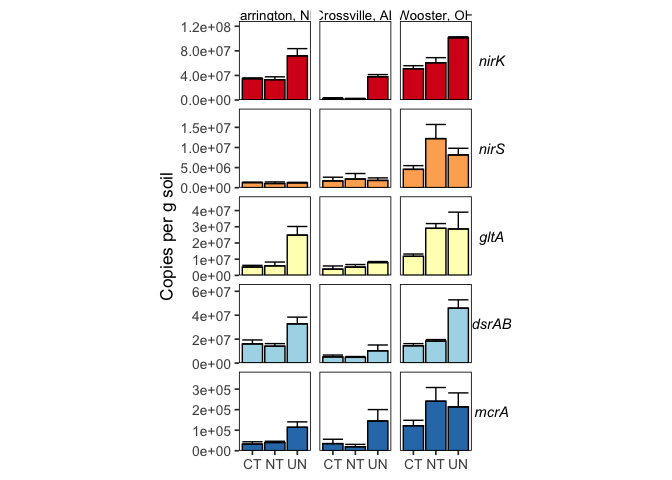<!-- -->

## Statistical tests - reported in Supplementary Table S2

### Statistics - nirK

#### nirK - CREC

**Normality:** no single transformation makes all 3-4 groups normal

``` r
all_ddpcr_data %>% 
  filter(site == "CREC", amend == "U",target_gene == "nirK") %>%
  group_by(site, till, amend, target_gene) %>% 
  summarise(
    normality_p = shapiro.test(copies_per_g)$p.value
  ) %>%
  arrange(site, normality_p)
```

    ## `summarise()` has grouped output by 'site', 'till', 'amend'. You can override
    ## using the `.groups` argument.

    ## # A tibble: 4 × 5
    ## # Groups:   site, till, amend [4]
    ##   site  till  amend target_gene normality_p
    ##   <chr> <chr> <chr> <chr>             <dbl>
    ## 1 CREC  UN    U     nirK             0.0179
    ## 2 CREC  NT    U     nirK             0.0409
    ## 3 CREC  CT    U     nirK             0.518 
    ## 4 CREC  MT    U     nirK             0.663

**Variances:** equal variances

``` r
leveneTest( 
  copies_per_g ~ till,
  data = 
    all_ddpcr_data %>% 
    filter(site == "CREC", amend == "U",target_gene == "nirK") 
) 
```

    ## Levene's Test for Homogeneity of Variance (center = median)
    ##       Df F value Pr(>F)
    ## group  3  0.6478 0.6005
    ##       11

**Statistical test:** Kruskal-Wallis test

``` r
kruskal.test(
  copies_per_g ~ till, 
  data = 
    all_ddpcr_data %>% 
    filter(site == "CREC", amend == "U",target_gene == "nirK")
)
```

    ## 
    ##  Kruskal-Wallis rank sum test
    ## 
    ## data:  copies_per_g by till
    ## Kruskal-Wallis chi-squared = 6.3958, df = 3, p-value = 0.09386

#### nirK - SM

**Normality:** all normal

``` r
all_ddpcr_data %>% 
  filter(site == "SM", amend == "U",target_gene == "nirK") %>%
  group_by(site, till, amend, target_gene) %>% 
  summarise(
    normality_p = shapiro.test(copies_per_g)$p.value
  ) %>%
  arrange(site, normality_p)
```

    ## # A tibble: 3 × 5
    ## # Groups:   site, till, amend [3]
    ##   site  till  amend target_gene normality_p
    ##   <chr> <chr> <chr> <chr>             <dbl>
    ## 1 SM    UN    U     nirK              0.141
    ## 2 SM    NT    U     nirK              0.280
    ## 3 SM    CT    U     nirK              0.637

**Variances:** not equal

``` r
bartlett.test( 
  copies_per_g ~ till,
  data = 
    all_ddpcr_data %>% 
    filter(site == "SM", amend == "U",target_gene == "nirK") 
) 
```

    ## 
    ##  Bartlett test of homogeneity of variances
    ## 
    ## data:  copies_per_g by till
    ## Bartlett's K-squared = 6.4668, df = 2, p-value = 0.03942

**Statistics:** Welch’s ANOVA

``` r
oneway.test(
  copies_per_g ~ till, 
  data = 
    all_ddpcr_data %>% 
    filter(site == "SM", amend == "U", target_gene == "nirK"),
  var.equal = FALSE
)
```

    ## 
    ##  One-way analysis of means (not assuming equal variances)
    ## 
    ## data:  copies_per_g and till
    ## F = 42.742, num df = 2.000, denom df = 3.845, p-value = 0.002364

``` r
games_howell_test(
  copies_per_g ~ till, 
  data = 
    all_ddpcr_data %>% 
    filter(site == "SM", amend == "U", target_gene == "nirK")
)
```

    ## # A tibble: 3 × 8
    ##   .y.          group1 group2  estimate  conf.low conf.high p.adj p.adj.signif
    ## * <chr>        <chr>  <chr>      <dbl>     <dbl>     <dbl> <dbl> <chr>       
    ## 1 copies_per_g CT     NT      -302107. -7509810.  6905596. 0.981 ns          
    ## 2 copies_per_g CT     UN     35434584. 21777015. 49092154. 0.002 **          
    ## 3 copies_per_g NT     UN     35736692. 21352966. 50120417. 0.003 **

#### nirK - WO

**Normality:** Normal

``` r
all_ddpcr_data %>% 
  filter(site == "WO", amend == "U",target_gene == "nirK") %>%
  group_by(site, till, amend, target_gene) %>% 
  summarise(
    normality_p = shapiro.test(copies_per_g)$p.value
  ) %>%
  arrange(site, normality_p)
```

    ## # A tibble: 3 × 5
    ## # Groups:   site, till, amend [3]
    ##   site  till  amend target_gene normality_p
    ##   <chr> <chr> <chr> <chr>             <dbl>
    ## 1 WO    NT    U     nirK              0.237
    ## 2 WO    CT    U     nirK              0.798
    ## 3 WO    UN    U     nirK              0.865

**Variances:** equal

``` r
leveneTest( 
  copies_per_g ~ till,
  data = 
    all_ddpcr_data %>% 
    filter(site == "WO", amend == "U",target_gene == "nirK") 
) 
```

    ## Levene's Test for Homogeneity of Variance (center = median)
    ##       Df F value Pr(>F)
    ## group  2   0.798 0.4873
    ##        7

**Statistics:** ANOVA

``` r
wo_nirk_aov <- 
  aov(
      copies_per_g ~ till,
      data = 
        all_ddpcr_data %>% 
        filter(site == "WO", amend == "U",target_gene == "nirK") 
)


summary(wo_nirk_aov)
```

    ##             Df    Sum Sq   Mean Sq F value  Pr(>F)   
    ## till         2 4.378e+15 2.189e+15   15.53 0.00267 **
    ## Residuals    7 9.865e+14 1.409e+14                   
    ## ---
    ## Signif. codes:  0 '***' 0.001 '**' 0.01 '*' 0.05 '.' 0.1 ' ' 1

``` r
tukey_wo_nirk <- TukeyHSD(wo_nirk_aov)

tukey_wo_nirk
```

    ##   Tukey multiple comparisons of means
    ##     95% family-wise confidence level
    ## 
    ## Fit: aov(formula = copies_per_g ~ till, data = all_ddpcr_data %>% filter(site == "WO", amend == "U", target_gene == "nirK"))
    ## 
    ## $till
    ##           diff       lwr      upr     p adj
    ## NT-CT  9840446 -16861396 36542289 0.5519523
    ## UN-CT 50407756  21862285 78953226 0.0031057
    ## UN-NT 40567310  13865467 67269152 0.0070700

### Statistics - nirS

#### nirS - CREC

**Normality:** All normal.

``` r
all_ddpcr_data %>% 
  filter(site == "CREC", amend == "U",target_gene == "nirS") %>%
  group_by(site, till, amend, target_gene) %>% 
  summarise(
    normality_p = shapiro.test(copies_per_g)$p.value
  ) %>%
  arrange(site, normality_p)
```

    ## # A tibble: 4 × 5
    ## # Groups:   site, till, amend [4]
    ##   site  till  amend target_gene normality_p
    ##   <chr> <chr> <chr> <chr>             <dbl>
    ## 1 CREC  MT    U     nirS             0.0601
    ## 2 CREC  NT    U     nirS             0.331 
    ## 3 CREC  CT    U     nirS             0.744 
    ## 4 CREC  UN    U     nirS             0.929

**Variances:** Equal

``` r
bartlett.test(
  copies_per_g ~ till,
  data = 
    all_ddpcr_data %>% 
    filter(site == "CREC", amend == "U",target_gene == "nirS") 
)
```

    ## 
    ##  Bartlett test of homogeneity of variances
    ## 
    ## data:  copies_per_g by till
    ## Bartlett's K-squared = 4.5603, df = 3, p-value = 0.207

**Statistics:** ANOVA

``` r
aov(
  copies_per_g ~ till,
  data = 
    all_ddpcr_data %>% 
    filter(site == "CREC", amend == "U", target_gene == "nirS") 
) %>% 
  summary()
```

    ##             Df    Sum Sq   Mean Sq F value Pr(>F)
    ## till         3 2.461e+11 8.203e+10    0.55  0.662
    ## Residuals    8 1.193e+12 1.491e+11

#### nirS - SM

**Normality:** Normal after log transformation

``` r
all_ddpcr_data %>% 
  filter(site == "SM", amend == "U",target_gene == "nirS") %>%
  group_by(site, till, amend, target_gene) %>% 
  summarise(
    normality_p = shapiro.test(log(copies_per_g))$p.value
  ) %>%
  arrange(site, normality_p)
```

    ## # A tibble: 3 × 5
    ## # Groups:   site, till, amend [3]
    ##   site  till  amend target_gene normality_p
    ##   <chr> <chr> <chr> <chr>             <dbl>
    ## 1 SM    CT    U     nirS              0.110
    ## 2 SM    UN    U     nirS              0.235
    ## 3 SM    NT    U     nirS              0.278

**Variances:** equal

``` r
bartlett.test(
  log(copies_per_g) ~ till,
  data = 
    all_ddpcr_data %>% 
    filter(site == "SM", amend == "U",target_gene == "nirS") 
)
```

    ## 
    ##  Bartlett test of homogeneity of variances
    ## 
    ## data:  log(copies_per_g) by till
    ## Bartlett's K-squared = 5.2847, df = 2, p-value = 0.07119

**Statistics:** ANOVA

``` r
aov(
  log(copies_per_g) ~ till,
  data = 
    all_ddpcr_data %>% 
    filter(site == "SM", amend == "U",target_gene == "nirS") 
) %>% summary()
```

    ##             Df Sum Sq Mean Sq F value Pr(>F)
    ## till         2  2.908   1.454   0.397  0.686
    ## Residuals    7 25.616   3.659

#### nirS - WO

**Normality:** All normal

``` r
all_ddpcr_data %>% 
  filter(site == "WO", amend == "U",target_gene == "nirS") %>%
  group_by(site, till, amend, target_gene) %>% 
  summarise(
    normality_p = shapiro.test(copies_per_g)$p.value
  ) %>%
  arrange(site, normality_p)
```

    ## # A tibble: 3 × 5
    ## # Groups:   site, till, amend [3]
    ##   site  till  amend target_gene normality_p
    ##   <chr> <chr> <chr> <chr>             <dbl>
    ## 1 WO    CT    U     nirS              0.566
    ## 2 WO    UN    U     nirS              0.884
    ## 3 WO    NT    U     nirS              0.902

**Variances:**

``` r
bartlett.test(
  copies_per_g ~ till,
  data = 
    all_ddpcr_data %>% 
    filter(site == "WO", amend == "U",target_gene == "nirS") 
)
```

    ## 
    ##  Bartlett test of homogeneity of variances
    ## 
    ## data:  copies_per_g by till
    ## Bartlett's K-squared = 2.956, df = 2, p-value = 0.2281

**Statistics:** ANOVA

``` r
aov(
  copies_per_g ~ till,
  data = 
    all_ddpcr_data %>% 
    filter(site == "WO", amend == "U",target_gene == "nirS") 
) %>% summary()
```

    ##             Df    Sum Sq   Mean Sq F value Pr(>F)  
    ## till         2 1.001e+14 5.007e+13   3.472 0.0896 .
    ## Residuals    7 1.009e+14 1.442e+13                 
    ## ---
    ## Signif. codes:  0 '***' 0.001 '**' 0.01 '*' 0.05 '.' 0.1 ' ' 1

### Statistics gltA

#### gltA - CREC

**Normality:** all approximately normal

``` r
all_ddpcr_data %>% 
  filter(site == "CREC", amend == "U",target_gene == "gltA") %>%
  group_by(site, till, amend, target_gene) %>% 
  summarise(
    normality_p = shapiro.test(copies_per_g)$p.value
  ) %>%
  arrange(site, normality_p)
```

    ## # A tibble: 4 × 5
    ## # Groups:   site, till, amend [4]
    ##   site  till  amend target_gene normality_p
    ##   <chr> <chr> <chr> <chr>             <dbl>
    ## 1 CREC  MT    U     gltA             0.0625
    ## 2 CREC  CT    U     gltA             0.126 
    ## 3 CREC  UN    U     gltA             0.313 
    ## 4 CREC  NT    U     gltA             0.582

**Variances:** Equal variances

``` r
bartlett.test(
  copies_per_g ~ till,
  data = 
    all_ddpcr_data %>% 
    filter(site == "CREC", amend == "U",target_gene == "gltA") 
)
```

    ## 
    ##  Bartlett test of homogeneity of variances
    ## 
    ## data:  copies_per_g by till
    ## Bartlett's K-squared = 6.4515, df = 3, p-value = 0.09159

**Statistics:** ANOVA

``` r
crec_glta_anova <- 
  aov(
    copies_per_g ~ till,
    data = 
      all_ddpcr_data %>% 
      filter(site == "CREC", amend == "U",target_gene == "gltA") 
  ) 

crec_glta_anova %>% summary()
```

    ##             Df    Sum Sq   Mean Sq F value Pr(>F)  
    ## till         3 9.578e+14 3.193e+14   5.032 0.0195 *
    ## Residuals   11 6.979e+14 6.345e+13                 
    ## ---
    ## Signif. codes:  0 '***' 0.001 '**' 0.01 '*' 0.05 '.' 0.1 ' ' 1

``` r
tukey_crec_glta <- TukeyHSD(crec_glta_anova)

multcompLetters4(crec_glta_anova, tukey_crec_glta)
```

    ## $till
    ##   UN   MT   NT   CT 
    ##  "a" "ab"  "b"  "b"

#### gltA - SM

**Normality:** all approximately normal

``` r
all_ddpcr_data %>% 
  filter(site == "SM", amend == "U",target_gene == "gltA") %>%
  group_by(site, till, amend, target_gene) %>% 
  summarise(
    normality_p = shapiro.test(copies_per_g)$p.value
  ) %>%
  arrange(site, normality_p)
```

    ## # A tibble: 3 × 5
    ## # Groups:   site, till, amend [3]
    ##   site  till  amend target_gene normality_p
    ##   <chr> <chr> <chr> <chr>             <dbl>
    ## 1 SM    CT    U     gltA             0.0574
    ## 2 SM    NT    U     gltA             0.181 
    ## 3 SM    UN    U     gltA             0.431

**Variances:** equal variances

``` r
bartlett.test(
  copies_per_g ~ till,
  data = 
    all_ddpcr_data %>% 
    filter(site == "SM", amend == "U",target_gene == "gltA") 
)
```

    ## 
    ##  Bartlett test of homogeneity of variances
    ## 
    ## data:  copies_per_g by till
    ## Bartlett's K-squared = 2.8643, df = 2, p-value = 0.2388

**Statistics:** ANOVA

``` r
aov(
  copies_per_g ~ till,
  data = 
    all_ddpcr_data %>% 
    filter(site == "SM", amend == "U",target_gene == "gltA") 
) %>% 
  summary()
```

    ##             Df    Sum Sq   Mean Sq F value Pr(>F)
    ## till         2 3.431e+13 1.715e+13   1.921  0.202
    ## Residuals    9 8.035e+13 8.928e+12

#### gltA - WO

**Normality:** all approximately normal

``` r
all_ddpcr_data %>% 
  filter(site == "WO", amend == "U",target_gene == "gltA") %>%
  group_by(site, till, amend, target_gene) %>% 
  summarise(
    normality_p = shapiro.test(copies_per_g)$p.value
  ) %>%
  arrange(site, normality_p)
```

    ## # A tibble: 3 × 5
    ## # Groups:   site, till, amend [3]
    ##   site  till  amend target_gene normality_p
    ##   <chr> <chr> <chr> <chr>             <dbl>
    ## 1 WO    NT    U     gltA              0.198
    ## 2 WO    CT    U     gltA              0.572
    ## 3 WO    UN    U     gltA              0.973

**Variances:** Barely equal variances

``` r
bartlett.test(
  copies_per_g ~ till,
  data = 
    all_ddpcr_data %>% 
    filter(site == "WO", amend == "U",target_gene == "gltA") 
)
```

    ## 
    ##  Bartlett test of homogeneity of variances
    ## 
    ## data:  copies_per_g by till
    ## Bartlett's K-squared = 5.9113, df = 2, p-value = 0.05204

**Statistics:** ANOVA

``` r
aov(
  copies_per_g ~ till, 
  data = 
    all_ddpcr_data %>% 
    filter(site == "WO", amend == "U",target_gene == "gltA")
) %>% summary()
```

    ##             Df    Sum Sq   Mean Sq F value Pr(>F)
    ## till         2 6.149e+14 3.075e+14   2.832  0.126
    ## Residuals    7 7.599e+14 1.086e+14

### Statistics - dsrAB

#### dsrAB - CREC

**Normality:** all approximately normal

``` r
all_ddpcr_data %>% 
  filter(site == "CREC", amend == "U", target_gene == "dsrAB") %>%
  group_by(site, till, amend, target_gene) %>% 
  summarise(
    normality_p = shapiro.test(copies_per_g)$p.value
  ) %>%
  arrange(site, normality_p)
```

    ## # A tibble: 4 × 5
    ## # Groups:   site, till, amend [4]
    ##   site  till  amend target_gene normality_p
    ##   <chr> <chr> <chr> <chr>             <dbl>
    ## 1 CREC  MT    U     dsrAB             0.169
    ## 2 CREC  NT    U     dsrAB             0.556
    ## 3 CREC  CT    U     dsrAB             0.873
    ## 4 CREC  UN    U     dsrAB             0.891

**Variances:** equal

``` r
bartlett.test(
  copies_per_g ~ till,
  data = 
    all_ddpcr_data %>% 
    filter(site == "CREC", amend == "U",target_gene == "dsrAB") 
)
```

    ## 
    ##  Bartlett test of homogeneity of variances
    ## 
    ## data:  copies_per_g by till
    ## Bartlett's K-squared = 4.6677, df = 3, p-value = 0.1978

**Statistics:** ANOVA

``` r
crec_dsrab_anova <- 
  aov(
    copies_per_g ~ till,
    data = 
      all_ddpcr_data %>% 
      filter(site == "CREC", amend == "U",target_gene == "dsrAB") 
  ) 

crec_dsrab_anova %>% summary()
```

    ##             Df    Sum Sq   Mean Sq F value Pr(>F)  
    ## till         3 7.849e+14 2.616e+14   4.866  0.028 *
    ## Residuals    9 4.840e+14 5.377e+13                 
    ## ---
    ## Signif. codes:  0 '***' 0.001 '**' 0.01 '*' 0.05 '.' 0.1 ' ' 1

``` r
tukey_crec_dsrab <- TukeyHSD(crec_dsrab_anova)

multcompLetters4(crec_dsrab_anova, tukey_crec_dsrab)
```

    ## $till
    ##   UN   MT   CT   NT 
    ##  "a" "ab" "ab"  "b"

#### dsrAB - SM

**Normality:** all approximately normal

``` r
all_ddpcr_data %>% 
  filter(site == "SM", amend == "U", target_gene == "dsrAB") %>%
  group_by(site, till, amend, target_gene) %>% 
  summarise(
    normality_p = shapiro.test(copies_per_g)$p.value
  ) %>%
  arrange(site, normality_p)
```

    ## # A tibble: 3 × 5
    ## # Groups:   site, till, amend [3]
    ##   site  till  amend target_gene normality_p
    ##   <chr> <chr> <chr> <chr>             <dbl>
    ## 1 SM    UN    U     dsrAB             0.192
    ## 2 SM    NT    U     dsrAB             0.199
    ## 3 SM    CT    U     dsrAB             0.707

**Variances:** Unequal

``` r
bartlett.test(
  copies_per_g ~ till,
  data = 
    all_ddpcr_data %>% 
    filter(site == "SM", amend == "U", target_gene == "dsrAB") 
)
```

    ## 
    ##  Bartlett test of homogeneity of variances
    ## 
    ## data:  copies_per_g by till
    ## Bartlett's K-squared = 7.0917, df = 2, p-value = 0.02884

**Statistics:** Welch’s ANOVA

``` r
oneway.test(
  copies_per_g ~ till,
  data = 
    all_ddpcr_data %>% 
    filter(site == "SM", amend == "U",target_gene == "dsrAB") 
)
```

    ## 
    ##  One-way analysis of means (not assuming equal variances)
    ## 
    ## data:  copies_per_g and till
    ## F = 0.54647, num df = 2.0000, denom df = 4.6149, p-value = 0.6124

#### dsrAB - WO

**Normality:** Non-normal, even after transformation attempts

``` r
all_ddpcr_data %>% 
  filter(site == "WO", amend == "U", target_gene == "dsrAB") %>%
  group_by(site, till, amend, target_gene) %>% 
  summarise(
    normality_p = shapiro.test(copies_per_g)$p.value
  ) %>%
  arrange(site, normality_p)
```

    ## # A tibble: 3 × 5
    ## # Groups:   site, till, amend [3]
    ##   site  till  amend target_gene normality_p
    ##   <chr> <chr> <chr> <chr>             <dbl>
    ## 1 WO    NT    U     dsrAB            0.0340
    ## 2 WO    UN    U     dsrAB            0.0474
    ## 3 WO    CT    U     dsrAB            0.617

**Variances:** approximately equal

``` r
leveneTest(
  copies_per_g ~ till,
  data = 
    all_ddpcr_data %>% 
    filter(site == "WO", amend == "U",target_gene == "dsrAB") 
)
```

    ## Levene's Test for Homogeneity of Variance (center = median)
    ##       Df F value Pr(>F)
    ## group  2  0.6577 0.5473
    ##        7

**Statistics:** Kruskal-Wallis

``` r
kruskal.test(
  copies_per_g ~ till,
  data = 
    all_ddpcr_data %>% 
    filter(site == "WO", amend == "U",target_gene == "dsrAB") 
)
```

    ## 
    ##  Kruskal-Wallis rank sum test
    ## 
    ## data:  copies_per_g by till
    ## Kruskal-Wallis chi-squared = 6.7455, df = 2, p-value = 0.0343

``` r
dunnTest(
  copies_per_g ~ till,
  data = 
    all_ddpcr_data %>% 
    filter(site == "WO", amend == "U",target_gene == "dsrAB"),
  method = "bh"
)
```

    ## Warning: till was coerced to a factor.

    ## Dunn (1964) Kruskal-Wallis multiple comparison

    ##   p-values adjusted with the Benjamini-Hochberg method.

    ##   Comparison        Z     P.unadj      P.adj
    ## 1    CT - NT -1.00905 0.312950676 0.31295068
    ## 2    CT - UN -2.59470 0.009467354 0.02840206
    ## 3    NT - UN -1.48324 0.138010738 0.20701611

### Statistics - mcrA

#### mcrA - CREC

**Normality:** All approximately normal

``` r
all_ddpcr_data %>% 
  filter(site == "CREC", amend == "U",target_gene == "mcrA") %>%
  group_by(site, till, amend, target_gene) %>% 
  summarise(
    normality_p = shapiro.test(copies_per_g)$p.value
  ) %>%
  arrange(normality_p)
```

    ## # A tibble: 4 × 5
    ## # Groups:   site, till, amend [4]
    ##   site  till  amend target_gene normality_p
    ##   <chr> <chr> <chr> <chr>             <dbl>
    ## 1 CREC  CT    U     mcrA             0.0513
    ## 2 CREC  MT    U     mcrA             0.451 
    ## 3 CREC  UN    U     mcrA             0.553 
    ## 4 CREC  NT    U     mcrA             0.584

**Variances:** Equal

``` r
bartlett.test(
  copies_per_g ~ till,
  data = 
    all_ddpcr_data %>% 
    filter(site == "CREC", amend == "U",target_gene == "mcrA") 
)
```

    ## 
    ##  Bartlett test of homogeneity of variances
    ## 
    ## data:  copies_per_g by till
    ## Bartlett's K-squared = 5.1027, df = 3, p-value = 0.1644

**Statistics:** ANOVA

``` r
crec_mcra_anova <- 
  aov(
    copies_per_g ~ till,
    data = 
      all_ddpcr_data %>% 
      filter(site == "CREC", amend == "U",target_gene == "mcrA") 
  ) 

crec_mcra_anova %>% summary()
```

    ##             Df    Sum Sq   Mean Sq F value Pr(>F)  
    ## till         3 1.665e+10 5.550e+09   5.238 0.0173 *
    ## Residuals   11 1.165e+10 1.059e+09                 
    ## ---
    ## Signif. codes:  0 '***' 0.001 '**' 0.01 '*' 0.05 '.' 0.1 ' ' 1

``` r
tukey_crec_mcra <- TukeyHSD(crec_mcra_anova)

multcompLetters4(crec_mcra_anova, tukey_crec_mcra)
```

    ## $till
    ##   UN   MT   NT   CT 
    ##  "a" "ab" "ab"  "b"

#### mcrA - SM

**Normality:** All approximately normal

``` r
all_ddpcr_data %>% 
  filter(site == "SM", amend == "U",target_gene == "mcrA") %>%
  group_by(site, till, amend, target_gene) %>% 
  summarise(
    normality_p = shapiro.test(copies_per_g)$p.value
  ) %>%
  arrange(normality_p)
```

    ## # A tibble: 3 × 5
    ## # Groups:   site, till, amend [3]
    ##   site  till  amend target_gene normality_p
    ##   <chr> <chr> <chr> <chr>             <dbl>
    ## 1 SM    NT    U     mcrA              0.103
    ## 2 SM    UN    U     mcrA              0.107
    ## 3 SM    CT    U     mcrA              0.264

**Variances:** Unequal

``` r
bartlett.test(
  copies_per_g ~ till,
  data = 
    all_ddpcr_data %>% 
    filter(site == "SM", amend == "U",target_gene == "mcrA") 
)
```

    ## 
    ##  Bartlett test of homogeneity of variances
    ## 
    ## data:  copies_per_g by till
    ## Bartlett's K-squared = 6.0254, df = 2, p-value = 0.04916

**Statistics:** Welch’s ANOVA

``` r
oneway.test(
  copies_per_g ~ till,
  data = 
    all_ddpcr_data %>% 
    filter(site == "SM", amend == "U",target_gene == "mcrA"),
  var.equal = FALSE #this is the default setting 
)
```

    ## 
    ##  One-way analysis of means (not assuming equal variances)
    ## 
    ## data:  copies_per_g and till
    ## F = 2.2246, num df = 2.0000, denom df = 4.9594, p-value = 0.2044

#### mcrA - WO

**Normality:** Normal after log transformation

``` r
all_ddpcr_data %>% 
  filter(site == "WO", amend == "U", target_gene == "mcrA") %>% 
  group_by(site, till, amend, target_gene) %>% 
  summarise(
    normality_p = shapiro.test(log(copies_per_g))$p.value
  ) %>%
  arrange(normality_p)
```

    ## # A tibble: 3 × 5
    ## # Groups:   site, till, amend [3]
    ##   site  till  amend target_gene normality_p
    ##   <chr> <chr> <chr> <chr>             <dbl>
    ## 1 WO    NT    U     mcrA             0.0619
    ## 2 WO    UN    U     mcrA             0.386 
    ## 3 WO    CT    U     mcrA             0.635

**Variances:** Equal

``` r
bartlett.test(
  log(copies_per_g) ~ till,
  data = 
    all_ddpcr_data %>% 
    filter(site == "WO", amend == "U",target_gene == "mcrA") 
)
```

    ## 
    ##  Bartlett test of homogeneity of variances
    ## 
    ## data:  log(copies_per_g) by till
    ## Bartlett's K-squared = 0.7342, df = 2, p-value = 0.6927

**Statistics:** ANOVA

``` r
aov(
  log(copies_per_g) ~ till,
  data = 
    all_ddpcr_data %>% 
    filter(site == "WO", amend == "U",target_gene == "mcrA") 
) %>% summary()
```

    ##             Df Sum Sq Mean Sq F value Pr(>F)
    ## till         2 0.7127  0.3563   1.321  0.326
    ## Residuals    7 1.8880  0.2697

## Figure 2a - stacked bars

``` r
total_anaerobe <-
  all_ddpcr_data %>% 
  group_by(site, till, amend, landscape_position, target_gene, rep) %>% 
  summarise(
    avg_copies_per_g = mean(copies_per_g, na.rm = TRUE),
  ) %>% 
  group_by(site, till, amend, landscape_position, rep) %>% 
  summarise(
    anaerobe_copies_per_g = sum(avg_copies_per_g),
    count = n() #Missing genes for GR-NT-F-1 and GR-NT-F-3 due to droplet generation issues
  ) %>% 
  filter(count == 5)

errors <-
  all_ddpcr_data %>% 
  group_by(site, till, amend, landscape_position, target_gene) %>% 
  summarise(
    avg_copies_per_g = mean(copies_per_g, na.rm = TRUE),
    se_copies_per_g = sd(copies_per_g, na.rm = TRUE) / sqrt(n()),
  ) %>% 
  group_by(site, till, amend, landscape_position) %>% 
  summarise(
    sum_se = sum(se_copies_per_g),
    sum_copies = sum(avg_copies_per_g),
    count = n()
  ) 


all_ddpcr_data %>% 
  group_by(site, till, amend, landscape_position, target_gene) %>% 
  summarise(
    avg_copies_per_g = mean(copies_per_g, na.rm = TRUE),
    se_copies_per_g = sd(copies_per_g, na.rm = TRUE) / sqrt(n()),
  ) %>% 
  filter(site != "GR", amend == "U", till %in% c("CT", "NT", "UN")) %>%
  mutate(
    across(
      target_gene, 
      ~factor(
        ., 
        levels = c("nirK", "nirS", "gltA", "dsrAB", "mcrA"),
        labels = c("nirK", "nirS", "gltA", "dsrAB", "mcrA")
      )
    )
  ) %>% 
  left_join(errors, by = c("site", "till", "amend", "landscape_position")) %>% 
  ggplot(aes(x = till, fill = target_gene)) + 
  geom_col(aes(y = avg_copies_per_g), position = "stack", color = "black") +
  geom_errorbar(
    aes(y = sum_copies, ymin = sum_copies, ymax = sum_copies + sum_se)
  ) +
  scale_fill_brewer(palette = "RdYlBu") +
  scale_y_continuous(
    labels = scientific,
    expand = expand_scale(mult = c(0, 0.1))
  ) +
  facet_grid(
    cols = vars(site), 
    scales = "free", 
    labeller = labeller(site = site_labels)
  ) + 
  theme_bw() + 
  my_theme() +
  theme(
    aspect.ratio = 4.5
  ) +
  labs(
    y = "Copies per g soil",
    x = NULL
  )
```

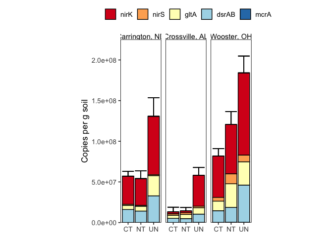<!-- -->

``` r
total_anaerobe
```

    ## # A tibble: 48 × 7
    ## # Groups:   site, till, amend, landscape_position [17]
    ##    site  till  amend landscape_position   rep anaerobe_copies_per_g count
    ##    <chr> <chr> <chr> <chr>              <dbl>                 <dbl> <int>
    ##  1 CREC  CT    A     <NA>                   1             58127300.     5
    ##  2 CREC  CT    A     <NA>                   2             63251238.     5
    ##  3 CREC  CT    A     <NA>                   3             84726515.     5
    ##  4 CREC  CT    U     <NA>                   1             49591671.     5
    ##  5 CREC  CT    U     <NA>                   2             64090647.     5
    ##  6 CREC  CT    U     <NA>                   3             57761702.     5
    ##  7 CREC  MT    U     <NA>                   1             43449404.     5
    ##  8 CREC  MT    U     <NA>                   2             62898705.     5
    ##  9 CREC  MT    U     <NA>                   3             78703568.     5
    ## 10 CREC  NT    A     <NA>                   1            119073250.     5
    ## # ℹ 38 more rows

## Statistics reported in Supplementary Table S2 (total anaerobe)

### total anaerobe - CREC

**Normality:** all approximately normal

``` r
total_anaerobe %>% 
  filter(site == "CREC", amend == "U") %>%
  group_by(site, till, amend) %>% 
  summarise(
    normality_p = shapiro.test(anaerobe_copies_per_g)$p.value
  ) %>%
  arrange(normality_p)
```

    ## # A tibble: 4 × 4
    ## # Groups:   site, till [4]
    ##   site  till  amend normality_p
    ##   <chr> <chr> <chr>       <dbl>
    ## 1 CREC  UN    U          0.0752
    ## 2 CREC  NT    U          0.250 
    ## 3 CREC  CT    U          0.860 
    ## 4 CREC  MT    U          0.886

**Variances:** Variances are barely equal

``` r
bartlett.test(
  anaerobe_copies_per_g ~ till,
  data = total_anaerobe %>% 
  filter(site == "CREC", amend == "U")
)
```

    ## 
    ##  Bartlett test of homogeneity of variances
    ## 
    ## data:  anaerobe_copies_per_g by till
    ## Bartlett's K-squared = 7.3615, df = 3, p-value = 0.06122

**Statistics:** ANOVA

``` r
crec_anaer_aov <- 
  aov(
    anaerobe_copies_per_g ~ till,
    data = total_anaerobe %>% 
      filter(site == "CREC", amend == "U")
  ) 

crec_anaer_aov %>% summary()
```

    ##             Df    Sum Sq   Mean Sq F value Pr(>F)  
    ## till         3 1.067e+16 3.555e+15   4.532 0.0388 *
    ## Residuals    8 6.276e+15 7.844e+14                 
    ## ---
    ## Signif. codes:  0 '***' 0.001 '**' 0.01 '*' 0.05 '.' 0.1 ' ' 1

``` r
TukeyHSD(crec_anaer_aov)
```

    ##   Tukey multiple comparisons of means
    ##     95% family-wise confidence level
    ## 
    ## Fit: aov(formula = anaerobe_copies_per_g ~ till, data = total_anaerobe %>% filter(site == "CREC", amend == "U"))
    ## 
    ## $till
    ##           diff       lwr       upr     p adj
    ## MT-CT  4535886 -68696864  77768635 0.9970048
    ## NT-CT -3011545 -76244294  70221205 0.9991134
    ## UN-CT 69080488  -4152261 142313238 0.0645901
    ## NT-MT -7547430 -80780180  65685320 0.9866798
    ## UN-MT 64544603  -8688147 137777353 0.0854789
    ## UN-NT 72092033  -1140717 145324783 0.0536380

### total anaerobe - SM

**Normality:** all approximately normal

``` r
total_anaerobe %>% 
  filter(site == "SM", amend == "U") %>%
  group_by(site, till, amend) %>% 
  summarise(
    normality_p = shapiro.test(anaerobe_copies_per_g)$p.value
  ) %>%
  arrange(normality_p)
```

    ## # A tibble: 3 × 4
    ## # Groups:   site, till [3]
    ##   site  till  amend normality_p
    ##   <chr> <chr> <chr>       <dbl>
    ## 1 SM    UN    U           0.423
    ## 2 SM    CT    U           0.588
    ## 3 SM    NT    U           0.804

**Variances:** Variances are equal

``` r
bartlett.test(
  anaerobe_copies_per_g ~ till,
  data = total_anaerobe %>% 
  filter(site == "SM", amend == "U")
)
```

    ## 
    ##  Bartlett test of homogeneity of variances
    ## 
    ## data:  anaerobe_copies_per_g by till
    ## Bartlett's K-squared = 1.5631, df = 2, p-value = 0.4577

**Statistics:** ANOVA

``` r
sm_anaer_aov <-
  aov(
    anaerobe_copies_per_g ~ till,
    data = total_anaerobe %>% 
      filter(site == "SM", amend == "U")
  ) 

sm_anaer_aov %>% summary()
```

    ##             Df    Sum Sq   Mean Sq F value  Pr(>F)   
    ## till         2 3.929e+15 1.964e+15   14.03 0.00547 **
    ## Residuals    6 8.400e+14 1.400e+14                   
    ## ---
    ## Signif. codes:  0 '***' 0.001 '**' 0.01 '*' 0.05 '.' 0.1 ' ' 1

``` r
TukeyHSD(sm_anaer_aov)
```

    ##   Tukey multiple comparisons of means
    ##     95% family-wise confidence level
    ## 
    ## Fit: aov(formula = anaerobe_copies_per_g ~ till, data = total_anaerobe %>% filter(site == "SM", amend == "U"))
    ## 
    ## $till
    ##              diff       lwr      upr     p adj
    ## NT-CT    37301.17 -29605329 29679932 0.9999918
    ## UN-CT 44340203.23  14697573 73982834 0.0088871
    ## UN-NT 44302902.06  14660272 73945533 0.0089226

### total anaerobe - WO

**Normality:**

``` r
total_anaerobe %>% 
  filter(site == "WO", amend == "U", till != "UN") %>%
  group_by(site, till, amend) %>% 
  summarise(
    normality_p = shapiro.test(sqrt(anaerobe_copies_per_g))$p.value
  ) %>%
  arrange(normality_p)
```

    ## # A tibble: 2 × 4
    ## # Groups:   site, till [2]
    ##   site  till  amend normality_p
    ##   <chr> <chr> <chr>       <dbl>
    ## 1 WO    CT    U           0.728
    ## 2 WO    NT    U           0.758

Assume normality for WO-UN

**Variances:** Equal

``` r
bartlett.test(
    anaerobe_copies_per_g ~ till,
  data = total_anaerobe %>% 
  filter(site == "WO", amend == "U")
)
```

    ## 
    ##  Bartlett test of homogeneity of variances
    ## 
    ## data:  anaerobe_copies_per_g by till
    ## Bartlett's K-squared = 3.1301, df = 2, p-value = 0.2091

**Statistics:** ANOVA

``` r
wo_aov <- 
aov(  
  anaerobe_copies_per_g ~ till,
  data = total_anaerobe %>% 
    filter(site == "WO", amend == "U")
)

summary(wo_aov)
```

    ##             Df    Sum Sq   Mean Sq F value  Pr(>F)   
    ## till         2 1.052e+16 5.261e+15   25.11 0.00247 **
    ## Residuals    5 1.048e+15 2.095e+14                   
    ## ---
    ## Signif. codes:  0 '***' 0.001 '**' 0.01 '*' 0.05 '.' 0.1 ' ' 1

``` r
TukeyHSD(wo_aov)
```

    ##   Tukey multiple comparisons of means
    ##     95% family-wise confidence level
    ## 
    ## Fit: aov(formula = anaerobe_copies_per_g ~ till, data = total_anaerobe %>% filter(site == "WO", amend == "U"))
    ## 
    ## $till
    ##           diff      lwr       upr     p adj
    ## NT-CT 40192915  1737368  78648461 0.0427811
    ## UN-CT 93572559 50577951 136567167 0.0020320
    ## UN-NT 53379644 10385036  96374252 0.0224704

# Tillage - Carrington only

## Figure - stacked bar (unpublished)

``` r
all_ddpcr_data %>% 
  group_by(site, till, amend, landscape_position, target_gene) %>% 
  summarise(
    avg_copies_per_g = mean(copies_per_g, na.rm = TRUE),
    se_copies_per_g = sd(copies_per_g, na.rm = TRUE) / sqrt(n()),
  ) %>% 
  filter(site == "CREC", amend == "U") %>%
  mutate(
    across(
      target_gene, 
      ~factor(
        ., 
        levels = c("nirK", "nirS", "gltA", "dsrAB", "mcrA"),
        labels = c("nirK", "nirS", "gltA", "dsrAB", "mcrA")
      )
    )
  ) %>% 
  left_join(errors, by = c("site", "till", "amend", "landscape_position")) %>% 
  ggplot(aes(x = till, fill = target_gene)) + 
  geom_col(aes(y = avg_copies_per_g), position = "stack", color = "black") +
  geom_errorbar(
    aes(y = sum_copies, ymin = sum_copies, ymax = sum_copies + sum_se)
  ) +
  scale_fill_brewer(palette = "RdYlBu") +
  scale_y_continuous(labels = scientific) +
  theme_bw() + 
  my_theme() +
  theme(
    aspect.ratio = 2
  ) +
  labs(
    y = "Copies per g soil",
    x = NULL
  )
```

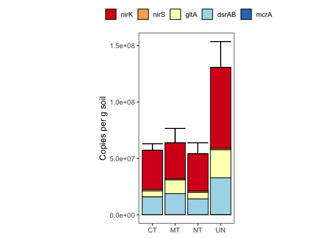<!-- -->

## Figure - faceted (unpublished)

``` r
all_ddpcr_data %>% 
  group_by(site, till, amend, landscape_position, target_gene) %>% 
  summarise(
    avg_copies_per_g = mean(copies_per_g, na.rm = TRUE),
    se_copies_per_g = sd(copies_per_g, na.rm = TRUE) / sqrt(n())
  ) %>% 
  filter(site == "CREC", amend == "U") %>% 
  mutate(
    across(
      target_gene, 
      ~factor(
        ., 
        levels = c("nirK", "nirS", "gltA", "dsrAB", "mcrA"),
        labels = c("nirK", "nirS", "gltA", "dsrAB", "mcrA")
      )
    )
  ) %>% 
  ggplot(aes(y = avg_copies_per_g, x = till, fill = target_gene)) + 
  geom_col(position = "dodge", color = "black") +
  geom_errorbar(
    aes(
      ymin = avg_copies_per_g,
      ymax = avg_copies_per_g + se_copies_per_g
    ),
    position = "dodge"
  ) +
  scale_fill_brewer(palette = "RdYlBu") +
  scale_y_continuous(labels = scientific) +
  facet_grid(
    rows = vars(target_gene), 
    scales = "free",
    labeller = labeller(site = site_labels)
  ) + 
  theme_bw() + 
  my_theme() +
  theme(
    aspect.ratio = 0.5,
    legend.position = "none",
    strip.text.y = element_text(face = "italic")
  ) +
  labs(
    y = "Copies per g soil",
    x = NULL
  )
```

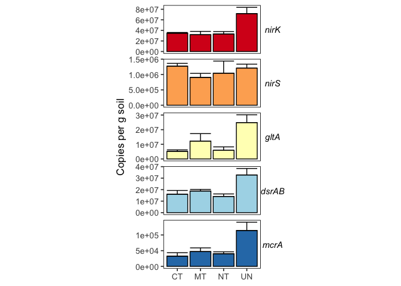<!-- -->

# Absolute Abundance: Landscape Position

## Supplementary Figure S5b - faceted

``` r
all_ddpcr_data %>% 
  group_by(site, till, amend, landscape_position, target_gene) %>% 
  summarise(
    avg_copies_per_g = mean(copies_per_g, na.rm = TRUE),
    se_copies_per_g = sd(copies_per_g, na.rm = TRUE) / sqrt(n())
  ) %>% 
  filter(site == "GR") %>% 
  mutate(
    across(
      target_gene, 
      ~factor(
        ., 
        levels = c("nirK", "nirS", "gltA", "dsrAB", "mcrA"),
        labels = c("nirK", "nirS", "gltA", "dsrAB", "mcrA")
      )
    )
  ) %>% 
  ggplot(aes(y = avg_copies_per_g, x = landscape_position, fill = target_gene)) + 
  geom_col(position = "dodge", color = "black") +
  geom_errorbar(
    aes(
      ymin = avg_copies_per_g,
      ymax = avg_copies_per_g + se_copies_per_g
    ),
    position = "dodge"
  ) +
  scale_fill_brewer(palette = "RdYlBu") +
  scale_y_continuous(labels = scientific) +
  facet_grid(
    rows = vars(target_gene), 
    scales = "free"
  ) + 
  theme_bw() + 
  my_theme() +
  theme(
    legend.position = "none",
    strip.text.y = element_text(face = "italic", size = 14),
    aspect.ratio = 2,
    axis.text.x = element_text(angle = 45, hjust = 1, size = 13),
    axis.text.y = element_text(size = 13),
    axis.title.y = element_text(size = 16)
  ) +
  labs(
    y = "Copies per g soil",
    x = NULL
  )
```

<!-- -->

## Supplementary Figure S5a - stacked bars

``` r
all_ddpcr_data %>% 
  group_by(site, till, amend, landscape_position, target_gene) %>% 
  summarise(
    avg_copies_per_g = mean(copies_per_g, na.rm = TRUE),
    se_copies_per_g = sd(copies_per_g, na.rm = TRUE) / sqrt(n()),
  ) %>% 
  filter(site == "GR") %>%
  mutate(
    across(
      target_gene, 
      ~factor(
        ., 
        levels = c("nirK", "nirS", "gltA", "dsrAB", "mcrA"),
        labels = c("nirK", "nirS", "gltA", "dsrAB", "mcrA")
      )
    )
  ) %>% 
  left_join(errors, by = c("site", "till", "amend", "landscape_position")) %>% 
  ggplot(aes(x = landscape_position, fill = target_gene)) + 
  geom_col(aes(y = avg_copies_per_g), position = "stack", color = "black") +
  geom_errorbar(
    aes(y = sum_copies, ymin = sum_copies, ymax = sum_copies + sum_se)
  ) +
  scale_fill_brewer(palette = "RdYlBu") +
  scale_y_continuous(labels = scientific) +
  scale_x_discrete(
    labels = c("C" = "Channel", "F" = "Footslope", "S" = "Shoulder")
  ) +
  theme_bw() + 
  my_theme() +
  theme(
    aspect.ratio = 2,
    axis.text.x = element_text(angle = 45, hjust = 1, size = 13),
    axis.text.y = element_text(size = 13),
    axis.title.y = element_text(size = 16),
    legend.text = element_text(size = 13)
  ) +
  labs(
    y = "Copies per g soil",
    x = NULL
  )
```

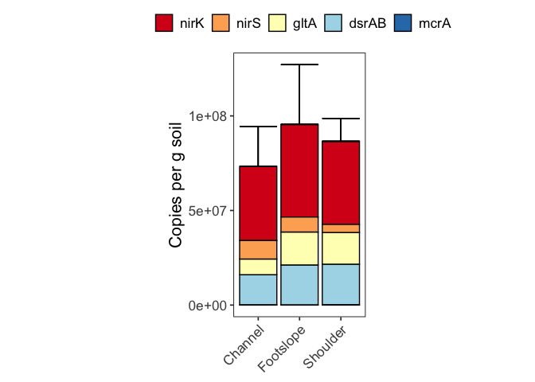<!-- -->

# Absolute Abundance - Manure amendments at Carrington

## Figure 3a - stacked bars

``` r
all_ddpcr_data %>% 
  group_by(site, till, amend, landscape_position, target_gene) %>% 
  summarise(
    avg_copies_per_g = mean(copies_per_g, na.rm = TRUE),
    se_copies_per_g = sd(copies_per_g, na.rm = TRUE) / sqrt(n()),
  ) %>% 
  filter(site == "CREC", till %in% c("CT", "NT")) %>%
  mutate(
    across(
      target_gene, 
      ~factor(
        ., 
        levels = c("nirK", "nirS", "gltA", "dsrAB", "mcrA"),
        labels = c("nirK", "nirS", "gltA", "dsrAB", "mcrA")
      )
    )
  ) %>% 
  left_join(errors, by = c("site", "till", "amend", "landscape_position")) %>% 
  ggplot(aes(x = amend, fill = target_gene)) + 
  geom_col(aes(y = avg_copies_per_g), position = "stack", color = "black") +
  geom_errorbar(
    aes(y = sum_copies, ymin = sum_copies, ymax = sum_copies + sum_se)
  ) +
  scale_fill_brewer(palette = "RdYlBu") +
  scale_y_continuous(labels = scientific) +
  facet_grid(
    cols = vars(till), 
    scales = "free", 
    labeller = labeller(site = site_labels)
  ) + 
  theme_bw() + 
  my_theme() +
  theme(
    aspect.ratio = 3
  ) +
  labs(
    y = "Copies per g soil",
    x = NULL
  )
```

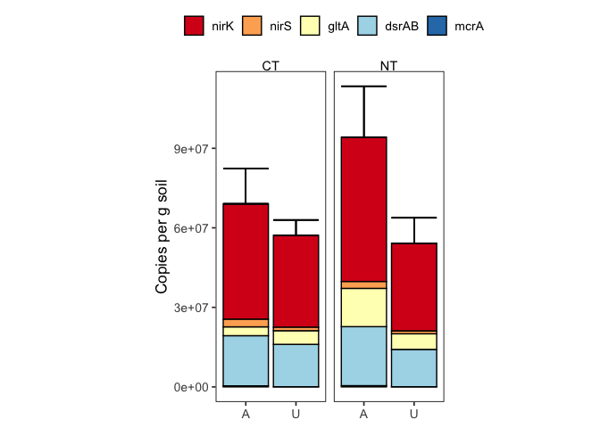<!-- -->

## Statistical Tests reported in Supplementary Table S3 (Total anaerobe)

### total anaerobe - manure effect

#### Check normality

``` r
total_anaerobe %>% 
  filter(site == "CREC") %>% 
  group_by(site, till, amend) %>% 
  summarise(
    normality_p = shapiro.test(anaerobe_copies_per_g)$p.value
  ) %>% 
  arrange(normality_p)
```

    ## # A tibble: 6 × 4
    ## # Groups:   site, till [4]
    ##   site  till  amend normality_p
    ##   <chr> <chr> <chr>       <dbl>
    ## 1 CREC  UN    U          0.0752
    ## 2 CREC  NT    U          0.250 
    ## 3 CREC  CT    A          0.349 
    ## 4 CREC  NT    A          0.567 
    ## 5 CREC  CT    U          0.860 
    ## 6 CREC  MT    U          0.886

#### Test for equal variances

``` r
leveneTest(
  anaerobe_copies_per_g~amend*till,
  data = total_anaerobe %>% filter(site == "CREC", till %in% c("CT", "NT"))
)
```

    ## Levene's Test for Homogeneity of Variance (center = median)
    ##       Df F value Pr(>F)
    ## group  3  0.4821 0.7038
    ##        8

#### test for differences in amended vs. unamended soils

Will use t-test for differences between amended and unamended

**CT**

``` r
t.test(
  x = 
    total_anaerobe %>% 
    filter(site == "CREC", till == "CT", amend == "A") %>% 
    pull(anaerobe_copies_per_g),
  y = 
    total_anaerobe %>% 
    filter(site == "CREC", till == "CT", amend == "U") %>% 
    pull(anaerobe_copies_per_g),
  alternative = c("greater")
)
```

    ## 
    ##  Welch Two Sample t-test
    ## 
    ## data:  total_anaerobe %>% filter(site == "CREC", till == "CT", amend == "A") %>% pull(anaerobe_copies_per_g) and total_anaerobe %>% filter(site == "CREC", till == "CT", amend == "U") %>% pull(anaerobe_copies_per_g)
    ## t = 1.2606, df = 2.9914, p-value = 0.1484
    ## alternative hypothesis: true difference in means is greater than 0
    ## 95 percent confidence interval:
    ##  -10040380       Inf
    ## sample estimates:
    ## mean of x mean of y 
    ##  68701684  57148007

**NT**

``` r
t.test(
  x = 
    total_anaerobe %>% 
    filter(site == "CREC", till == "NT", amend == "A") %>% 
    pull(anaerobe_copies_per_g),
  y = 
    total_anaerobe %>% 
    filter(site == "CREC", till == "NT", amend == "U") %>% 
    pull(anaerobe_copies_per_g),
  alternative = c("greater") #this really depends! 
)
```

    ## 
    ##  Welch Two Sample t-test
    ## 
    ## data:  total_anaerobe %>% filter(site == "CREC", till == "NT", amend == "A") %>% pull(anaerobe_copies_per_g) and total_anaerobe %>% filter(site == "CREC", till == "NT", amend == "U") %>% pull(anaerobe_copies_per_g)
    ## t = 2.876, df = 2.7851, p-value = 0.03482
    ## alternative hypothesis: true difference in means is greater than 0
    ## 95 percent confidence interval:
    ##  6281406     Inf
    ## sample estimates:
    ## mean of x mean of y 
    ##  94572959  54136462

## Figure 3b - faceted

``` r
all_ddpcr_data %>% 
  group_by(site, till, amend, landscape_position, target_gene) %>% 
  summarise(
    avg_copies_per_g = mean(copies_per_g, na.rm = TRUE),
    se_copies_per_g = sd(copies_per_g, na.rm = TRUE) / sqrt(n())
  ) %>% 
  filter(site == "CREC", till %in% c("CT", "NT")) %>% 
  mutate(
    across(
      target_gene, 
      ~factor(
        ., 
        levels = c("nirK", "nirS", "gltA", "dsrAB", "mcrA"),
        labels = c("nirK", "nirS", "gltA", "dsrAB", "mcrA")
      )
    )
  ) %>% 
  ggplot(aes(y = avg_copies_per_g, x = amend, fill = target_gene)) + 
  geom_col(position = "dodge", color = "black") +
  geom_errorbar(
    aes(
      ymin = avg_copies_per_g,
      ymax = avg_copies_per_g + se_copies_per_g
    ),
    position = "dodge"
  ) +
  scale_fill_brewer(palette = "RdYlBu") +
  scale_y_continuous(labels = scientific) +
  facet_grid(
    cols = vars(till), 
    rows = vars(target_gene), 
    scales = "free",
    labeller = labeller(site = site_labels)
  ) + 
  theme_bw() + 
  my_theme() +
  theme(
    aspect.ratio = 1,
    legend.position = "none",
    strip.text.y = element_text(face = "italic")
  ) +
  labs(
    y = "Copies per g soil",
    x = NULL
  )
```

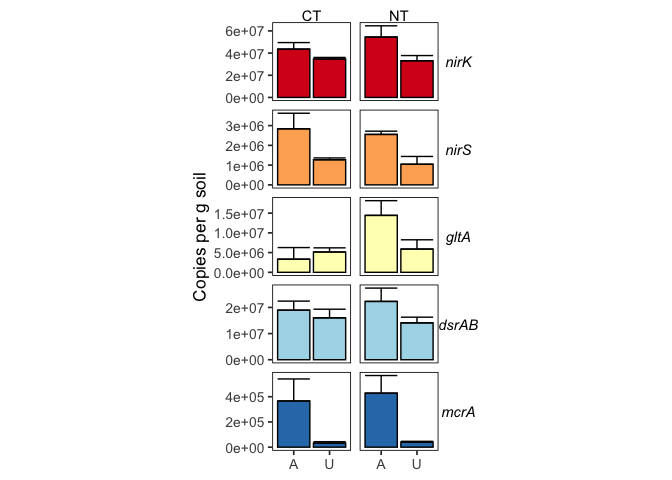<!-- -->

## Statistical Tests reported in Supplementary Table S3

### nirK

**Normality:** Approximately normal

``` r
all_ddpcr_data %>% 
  filter(
    site == "CREC", 
    till %in% c("CT", "NT"), 
    target_gene == "nirK"
  ) %>%
  group_by(site, till, amend, target_gene) %>% 
  summarise(
    normality_p = shapiro.test(log(copies_per_g))$p.value
  ) %>%
  arrange(target_gene, normality_p)
```

    ## # A tibble: 4 × 5
    ## # Groups:   site, till, amend [4]
    ##   site  till  amend target_gene normality_p
    ##   <chr> <chr> <chr> <chr>             <dbl>
    ## 1 CREC  NT    U     nirK             0.0504
    ## 2 CREC  CT    A     nirK             0.483 
    ## 3 CREC  CT    U     nirK             0.490 
    ## 4 CREC  NT    A     nirK             0.689

#### CT

**Variances**

``` r
bartlett.test( 
  copies_per_g ~ amend,
  data = 
    all_ddpcr_data %>% 
    filter(site == "CREC", target_gene == "nirK", till == "CT")
) 
```

    ## 
    ##  Bartlett test of homogeneity of variances
    ## 
    ## data:  copies_per_g by amend
    ## Bartlett's K-squared = 3.3213, df = 1, p-value = 0.06839

**Statistics:** t-test

``` r
t.test(
  x = 
    all_ddpcr_data %>% 
    filter(
      site == "CREC", 
      till == "CT", 
      amend == "A", 
      target_gene == "nirK"
    ) %>% 
    pull(copies_per_g),
  y = 
    all_ddpcr_data %>% 
    filter(
      site == "CREC", 
      till == "CT", 
      amend == "U",
      target_gene == "nirK"
    ) %>% 
    pull(copies_per_g),
  alternative = c("greater"),
  var.equal = TRUE
)
```

    ## 
    ##  Two Sample t-test
    ## 
    ## data:  all_ddpcr_data %>% filter(site == "CREC", till == "CT", amend == "A", target_gene == "nirK") %>% pull(copies_per_g) and all_ddpcr_data %>% filter(site == "CREC", till == "CT", amend == "U", target_gene == "nirK") %>% pull(copies_per_g)
    ## t = 1.9057, df = 6, p-value = 0.05267
    ## alternative hypothesis: true difference in means is greater than 0
    ## 95 percent confidence interval:
    ##  -175210.4       Inf
    ## sample estimates:
    ## mean of x mean of y 
    ##  43582608  34676245

#### NT

**Variances**

``` r
bartlett.test( 
  copies_per_g ~ amend,
  data = 
    all_ddpcr_data %>% 
    filter(site == "CREC", target_gene == "nirK", till == "NT")
) 
```

    ## 
    ##  Bartlett test of homogeneity of variances
    ## 
    ## data:  copies_per_g by amend
    ## Bartlett's K-squared = 0.86575, df = 1, p-value = 0.3521

**Statistics:** t-test

``` r
t.test(
  x = 
    all_ddpcr_data %>% 
    filter(
      site == "CREC", 
      till == "NT", 
      amend == "A", 
      target_gene == "nirK"
    ) %>% 
    pull(copies_per_g),
  y = 
    all_ddpcr_data %>% 
    filter(
      site == "CREC", 
      till == "NT", 
      amend == "U",
      target_gene == "nirK"
    ) %>% 
    pull(copies_per_g),
  alternative = c("greater"),
  var.equal = TRUE
)
```

    ## 
    ##  Two Sample t-test
    ## 
    ## data:  all_ddpcr_data %>% filter(site == "CREC", till == "NT", amend == "A", target_gene == "nirK") %>% pull(copies_per_g) and all_ddpcr_data %>% filter(site == "CREC", till == "NT", amend == "U", target_gene == "nirK") %>% pull(copies_per_g)
    ## t = 1.918, df = 4, p-value = 0.06378
    ## alternative hypothesis: true difference in means is greater than 0
    ## 95 percent confidence interval:
    ##  -2386339      Inf
    ## sample estimates:
    ## mean of x mean of y 
    ##  54464608  33064179

### nirS

**Normality**

``` r
all_ddpcr_data %>% 
  filter(
    site == "CREC", 
    till %in% c("CT", "NT"), 
    target_gene == "nirS"
  ) %>%
  group_by(site, till, amend, target_gene) %>% 
  summarise(
    normality_p = shapiro.test(copies_per_g)$p.value
  ) %>%
  arrange(target_gene, normality_p)
```

    ## # A tibble: 4 × 5
    ## # Groups:   site, till, amend [4]
    ##   site  till  amend target_gene normality_p
    ##   <chr> <chr> <chr> <chr>             <dbl>
    ## 1 CREC  NT    U     nirS              0.331
    ## 2 CREC  CT    U     nirS              0.744
    ## 3 CREC  NT    A     nirS              0.862
    ## 4 CREC  CT    A     nirS              0.928

#### CT

**Variances**

``` r
bartlett.test( 
  copies_per_g ~ amend,
  data = 
    all_ddpcr_data %>% 
    filter(site == "CREC", target_gene == "nirS", till == "CT")
) 
```

    ## 
    ##  Bartlett test of homogeneity of variances
    ## 
    ## data:  copies_per_g by amend
    ## Bartlett's K-squared = 5.5188, df = 1, p-value = 0.01881

**Statistics:** t-test

``` r
t.test(
  x = 
    all_ddpcr_data %>% 
    filter(
      site == "CREC", 
      till == "CT", 
      amend == "A", 
      target_gene == "nirS"
    ) %>% 
    pull(copies_per_g),
  y = 
    all_ddpcr_data %>% 
    filter(
      site == "CREC", 
      till == "CT", 
      amend == "U",
      target_gene == "nirS"
    ) %>% 
    pull(copies_per_g),
  alternative = c("greater"),
  var.equal = FALSE
)
```

    ## 
    ##  Welch Two Sample t-test
    ## 
    ## data:  all_ddpcr_data %>% filter(site == "CREC", till == "CT", amend == "A", target_gene == "nirS") %>% pull(copies_per_g) and all_ddpcr_data %>% filter(site == "CREC", till == "CT", amend == "U", target_gene == "nirS") %>% pull(copies_per_g)
    ## t = 1.9699, df = 3.0799, p-value = 0.07054
    ## alternative hypothesis: true difference in means is greater than 0
    ## 95 percent confidence interval:
    ##  -285064.2       Inf
    ## sample estimates:
    ## mean of x mean of y 
    ##   2837212   1272076

#### NT

**Variances**

``` r
bartlett.test( 
  copies_per_g ~ amend,
  data = 
    all_ddpcr_data %>% 
    filter(site == "CREC", target_gene == "nirS", till == "NT")
) 
```

    ## 
    ##  Bartlett test of homogeneity of variances
    ## 
    ## data:  copies_per_g by amend
    ## Bartlett's K-squared = 1.0879, df = 1, p-value = 0.2969

**Statistics**

``` r
t.test(
  x = 
    all_ddpcr_data %>% 
    filter(
      site == "CREC", 
      till == "NT", 
      amend == "A", 
      target_gene == "nirS"
    ) %>% 
    pull(copies_per_g),
  y = 
    all_ddpcr_data %>% 
    filter(
      site == "CREC", 
      till == "NT", 
      amend == "U",
      target_gene == "nirS"
    ) %>% 
    pull(copies_per_g),
  alternative = c("greater"),
  var.equal = TRUE
)
```

    ## 
    ##  Two Sample t-test
    ## 
    ## data:  all_ddpcr_data %>% filter(site == "CREC", till == "NT", amend == "A", target_gene == "nirS") %>% pull(copies_per_g) and all_ddpcr_data %>% filter(site == "CREC", till == "NT", amend == "U", target_gene == "nirS") %>% pull(copies_per_g)
    ## t = 3.9444, df = 5, p-value = 0.005456
    ## alternative hypothesis: true difference in means is greater than 0
    ## 95 percent confidence interval:
    ##  738773.1      Inf
    ## sample estimates:
    ## mean of x mean of y 
    ##   2553893   1043546

### gltA

**Normality**

``` r
all_ddpcr_data %>% 
  filter(
    site == "CREC", 
    till %in% c("CT", "NT"), 
    target_gene == "gltA"
  ) %>%
  group_by(site, till, amend, target_gene) %>% 
  summarise(
    normality_p = shapiro.test(copies_per_g)$p.value
  ) %>%
  arrange(target_gene, normality_p)
```

    ## # A tibble: 4 × 5
    ## # Groups:   site, till, amend [4]
    ##   site  till  amend target_gene normality_p
    ##   <chr> <chr> <chr> <chr>             <dbl>
    ## 1 CREC  CT    U     gltA              0.126
    ## 2 CREC  CT    A     gltA              0.135
    ## 3 CREC  NT    A     gltA              0.292
    ## 4 CREC  NT    U     gltA              0.582

#### CT

**Variances**

``` r
bartlett.test( 
  copies_per_g ~ amend,
  data = 
    all_ddpcr_data %>% 
    filter(site == "CREC", target_gene == "gltA", till == "CT")
) 
```

    ## 
    ##  Bartlett test of homogeneity of variances
    ## 
    ## data:  copies_per_g by amend
    ## Bartlett's K-squared = 1.5429, df = 1, p-value = 0.2142

**Statistics:** t-test

``` r
t.test(
  x = 
    all_ddpcr_data %>% 
    filter(
      site == "CREC", 
      till == "CT", 
      amend == "A", 
      target_gene == "gltA"
    ) %>% 
    pull(copies_per_g),
  y = 
    all_ddpcr_data %>% 
    filter(
      site == "CREC", 
      till == "CT", 
      amend == "U",
      target_gene == "gltA"
    ) %>% 
    pull(copies_per_g),
  alternative = c("greater"),
  var.equal = TRUE
)
```

    ## 
    ##  Two Sample t-test
    ## 
    ## data:  all_ddpcr_data %>% filter(site == "CREC", till == "CT", amend == "A", target_gene == "gltA") %>% pull(copies_per_g) and all_ddpcr_data %>% filter(site == "CREC", till == "CT", amend == "U", target_gene == "gltA") %>% pull(copies_per_g)
    ## t = -0.66057, df = 5, p-value = 0.7309
    ## alternative hypothesis: true difference in means is greater than 0
    ## 95 percent confidence interval:
    ##  -7376935      Inf
    ## sample estimates:
    ## mean of x mean of y 
    ##   3327595   5148851

#### NT

**Variances**

``` r
bartlett.test( 
  copies_per_g ~ amend,
  data = 
    all_ddpcr_data %>% 
    filter(site == "CREC", target_gene == "gltA", till == "NT")
) 
```

    ## 
    ##  Bartlett test of homogeneity of variances
    ## 
    ## data:  copies_per_g by amend
    ## Bartlett's K-squared = 0.64044, df = 1, p-value = 0.4236

**Statistics:** t-test

``` r
t.test(
  x = 
    all_ddpcr_data %>% 
    filter(
      site == "CREC", 
      till == "NT", 
      amend == "A", 
      target_gene == "gltA"
    ) %>% 
    pull(copies_per_g),
  y = 
    all_ddpcr_data %>% 
    filter(
      site == "CREC", 
      till == "NT", 
      amend == "U",
      target_gene == "gltA"
    ) %>% 
    pull(copies_per_g),
  alternative = c("greater"),
  var.equal = TRUE
)
```

    ## 
    ##  Two Sample t-test
    ## 
    ## data:  all_ddpcr_data %>% filter(site == "CREC", till == "NT", amend == "A", target_gene == "gltA") %>% pull(copies_per_g) and all_ddpcr_data %>% filter(site == "CREC", till == "NT", amend == "U", target_gene == "gltA") %>% pull(copies_per_g)
    ## t = 1.766, df = 5, p-value = 0.06883
    ## alternative hypothesis: true difference in means is greater than 0
    ## 95 percent confidence interval:
    ##  -1204249      Inf
    ## sample estimates:
    ## mean of x mean of y 
    ##  14430261   5892410

### dsrAB

**Normality:** normal

``` r
all_ddpcr_data %>% 
  filter(
    site == "CREC", 
    till %in% c("CT", "NT"), 
    target_gene == "dsrAB"
  ) %>%
  group_by(site, till, amend, target_gene) %>% 
  summarise(
    normality_p = shapiro.test(log(copies_per_g))$p.value
  ) %>%
  arrange(target_gene, normality_p)
```

    ## # A tibble: 4 × 5
    ## # Groups:   site, till, amend [4]
    ##   site  till  amend target_gene normality_p
    ##   <chr> <chr> <chr> <chr>             <dbl>
    ## 1 CREC  NT    A     dsrAB             0.128
    ## 2 CREC  CT    A     dsrAB             0.133
    ## 3 CREC  NT    U     dsrAB             0.676
    ## 4 CREC  CT    U     dsrAB             0.680

#### CT

**Variances**

``` r
bartlett.test( 
  log(copies_per_g) ~ amend,
  data = 
    all_ddpcr_data %>% 
    filter(site == "CREC", target_gene == "dsrAB", till == "CT")
) 
```

    ## 
    ##  Bartlett test of homogeneity of variances
    ## 
    ## data:  log(copies_per_g) by amend
    ## Bartlett's K-squared = 0.10539, df = 1, p-value = 0.7455

**Statistics:** t-test

``` r
t.test(
  x = 
    all_ddpcr_data %>% 
    filter(
      site == "CREC", 
      till == "CT", 
      amend == "A", 
      target_gene == "dsrAB"
    ) %>% 
    mutate(
      log_copies_per_g = log(copies_per_g)
    ) %>% 
    pull(log_copies_per_g),
  y = 
    all_ddpcr_data %>% 
    filter(
      site == "CREC", 
      till == "CT", 
      amend == "U",
      target_gene == "dsrAB"
    ) %>% 
    mutate(
      log_copies_per_g = log(copies_per_g)
    ) %>% 
    pull(log_copies_per_g),
  alternative = c("greater"),
  var.equal = TRUE
)
```

    ## 
    ##  Two Sample t-test
    ## 
    ## data:  all_ddpcr_data %>% filter(site == "CREC", till == "CT", amend == "A", target_gene == "dsrAB") %>% mutate(log_copies_per_g = log(copies_per_g)) %>% pull(log_copies_per_g) and all_ddpcr_data %>% filter(site == "CREC", till == "CT", amend == "U", target_gene == "dsrAB") %>% mutate(log_copies_per_g = log(copies_per_g)) %>% pull(log_copies_per_g)
    ## t = 0.65913, df = 4, p-value = 0.2729
    ## alternative hypothesis: true difference in means is greater than 0
    ## 95 percent confidence interval:
    ##  -0.4123952        Inf
    ## sample estimates:
    ## mean of x mean of y 
    ##  16.72668  16.54211

#### NT

**Variances**

``` r
bartlett.test( 
  log(copies_per_g) ~ amend,
  data = 
    all_ddpcr_data %>% 
    filter(site == "CREC", target_gene == "dsrAB", till == "NT")
) 
```

    ## 
    ##  Bartlett test of homogeneity of variances
    ## 
    ## data:  log(copies_per_g) by amend
    ## Bartlett's K-squared = 0.32749, df = 1, p-value = 0.5671

**Statistics:** t-test

``` r
t.test(
  x = 
    all_ddpcr_data %>% 
    filter(
      site == "CREC", 
      till == "NT", 
      amend == "A", 
      target_gene == "dsrAB"
    ) %>% 
    mutate(
      log_copies_per_g = log(copies_per_g)
    ) %>% 
    pull(log_copies_per_g),
  y = 
    all_ddpcr_data %>% 
    filter(
      site == "CREC", 
      till == "NT", 
      amend == "U",
      target_gene == "dsrAB"
    ) %>% 
    mutate(
      log_copies_per_g = log(copies_per_g)
    ) %>% 
    pull(log_copies_per_g),
  alternative = c("greater"),
  var.equal = TRUE
)
```

    ## 
    ##  Two Sample t-test
    ## 
    ## data:  all_ddpcr_data %>% filter(site == "CREC", till == "NT", amend == "A", target_gene == "dsrAB") %>% mutate(log_copies_per_g = log(copies_per_g)) %>% pull(log_copies_per_g) and all_ddpcr_data %>% filter(site == "CREC", till == "NT", amend == "U", target_gene == "dsrAB") %>% mutate(log_copies_per_g = log(copies_per_g)) %>% pull(log_copies_per_g)
    ## t = 1.5586, df = 5, p-value = 0.08992
    ## alternative hypothesis: true difference in means is greater than 0
    ## 95 percent confidence interval:
    ##  -0.1218655        Inf
    ## sample estimates:
    ## mean of x mean of y 
    ##  16.85444  16.43836

### mcrA

**Normality:** Approximately normal

``` r
all_ddpcr_data %>% 
  filter(
    site == "CREC", 
    till %in% c("CT", "NT"), 
    target_gene == "mcrA"
  ) %>%
  group_by(site, till, amend, target_gene) %>% 
  summarise(
    normality_p = shapiro.test(copies_per_g)$p.value
  ) %>%
  arrange(target_gene, normality_p)
```

    ## # A tibble: 4 × 5
    ## # Groups:   site, till, amend [4]
    ##   site  till  amend target_gene normality_p
    ##   <chr> <chr> <chr> <chr>             <dbl>
    ## 1 CREC  CT    U     mcrA             0.0513
    ## 2 CREC  NT    A     mcrA             0.407 
    ## 3 CREC  CT    A     mcrA             0.545 
    ## 4 CREC  NT    U     mcrA             0.584

#### CT

**Variances:** unequal

``` r
bartlett.test( 
  copies_per_g ~ amend,
  data = 
    all_ddpcr_data %>% 
    filter(site == "CREC", target_gene == "mcrA", till == "CT")
) 
```

    ## 
    ##  Bartlett test of homogeneity of variances
    ## 
    ## data:  copies_per_g by amend
    ## Bartlett's K-squared = 9.2421, df = 1, p-value = 0.002365

**Statistics:** t-test

``` r
t.test(
  x = 
    all_ddpcr_data %>% 
    filter(
      site == "CREC", 
      till == "CT", 
      amend == "A", 
      target_gene == "mcrA"
    ) %>% 
    pull(copies_per_g),
  y = 
    all_ddpcr_data %>% 
    filter(
      site == "CREC", 
      till == "CT", 
      amend == "U",
      target_gene == "mcrA"
    ) %>% 
    pull(copies_per_g),
  alternative = c("greater"),
  var.equal = FALSE
)
```

    ## 
    ##  Welch Two Sample t-test
    ## 
    ## data:  all_ddpcr_data %>% filter(site == "CREC", till == "CT", amend == "A", target_gene == "mcrA") %>% pull(copies_per_g) and all_ddpcr_data %>% filter(site == "CREC", till == "CT", amend == "U", target_gene == "mcrA") %>% pull(copies_per_g)
    ## t = 1.908, df = 2.0158, p-value = 0.09781
    ## alternative hypothesis: true difference in means is greater than 0
    ## 95 percent confidence interval:
    ##  -174308.9       Inf
    ## sample estimates:
    ## mean of x mean of y 
    ## 366326.77  32571.67

#### NT

**Variances**

``` r
bartlett.test( 
  copies_per_g ~ amend,
  data = 
    all_ddpcr_data %>% 
    filter(site == "CREC", target_gene == "mcrA", till == "NT")
) 
```

    ## 
    ##  Bartlett test of homogeneity of variances
    ## 
    ## data:  copies_per_g by amend
    ## Bartlett's K-squared = 8.6926, df = 1, p-value = 0.003195

**Statistics:** t-test

``` r
t.test(
  x = 
    all_ddpcr_data %>% 
    filter(
      site == "CREC", 
      till == "NT", 
      amend == "A", 
      target_gene == "mcrA"
    ) %>% 
    pull(copies_per_g),
  y = 
    all_ddpcr_data %>% 
    filter(
      site == "CREC", 
      till == "NT", 
      amend == "U",
      target_gene == "mcrA"
    ) %>% 
    pull(copies_per_g),
  alternative = c("greater"),
  var.equal = FALSE
)
```

    ## 
    ##  Welch Two Sample t-test
    ## 
    ## data:  all_ddpcr_data %>% filter(site == "CREC", till == "NT", amend == "A", target_gene == "mcrA") %>% pull(copies_per_g) and all_ddpcr_data %>% filter(site == "CREC", till == "NT", amend == "U", target_gene == "mcrA") %>% pull(copies_per_g)
    ## t = 2.7754, df = 3.0116, p-value = 0.03448
    ## alternative hypothesis: true difference in means is greater than 0
    ## 95 percent confidence interval:
    ##  59549.56      Inf
    ## sample estimates:
    ## mean of x mean of y 
    ## 428405.17  40177.66

# PCA of Anaerobe Abundance

## Create tibble for PCA

``` r
anaerobe_pca_data <-
  all_ddpcr_data_w_outliers %>% 
  group_by(site, till, amend, rep,landscape_position, target_gene) %>% 
  summarise(
    copies_per_g = mean(copies_per_g)
  ) %>% 
  pivot_wider(
    id_cols = c("site", "till", "amend", "rep", "landscape_position"),
    names_from = "target_gene", 
    values_from = "copies_per_g"
  ) %>% 
  drop_na(dsrAB, gltA, mcrA, nirK) %>% 
  ungroup() %>% 
  # Values below were removed because they were outliers
  filter(
    !(site == "WO" & till == "UN" & rep == 2),
    !(site == "CREC" & till == "CT" & amend == "A"& rep == 1),
    !(site == "CREC" & till == "CT" & amend == "A"& rep == 2),
    !(site == "SM" & till == "NT" & amend == "U"& rep == 1),
  ) %>% 
  mutate(
    log_dsrAB = log(dsrAB),
    log_gltA = log(gltA),
    log_mcrA = log(mcrA + (0.5*23957.38)),
    sqrt_nirK = sqrt(nirK),
    log_nirS = log(nirS),
  ) 
```

    ## `summarise()` has grouped output by 'site', 'till', 'amend', 'rep',
    ## 'landscape_position'. You can override using the `.groups` argument.

## Check normality

``` r
anaerobe_pca_data %>% 
  ggplot() +
  geom_histogram(aes(x = log(dsrAB)))
```

    ## `stat_bin()` using `bins = 30`. Pick better value with `binwidth`.

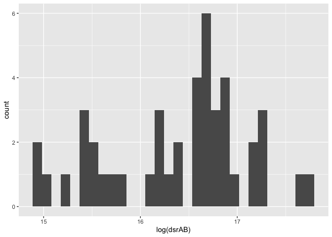<!-- -->

``` r
anaerobe_pca_data %>% 
  ggplot() +
  geom_histogram(aes(x = log(gltA)))
```

    ## `stat_bin()` using `bins = 30`. Pick better value with `binwidth`.

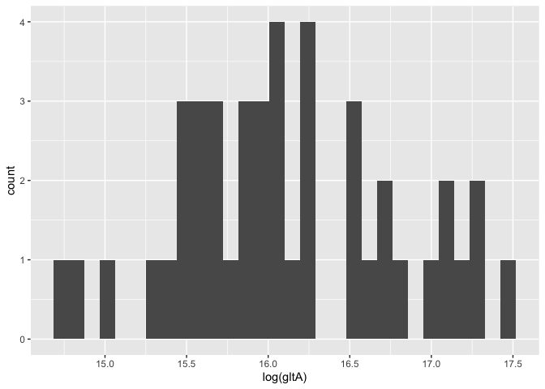<!-- -->

``` r
anaerobe_pca_data %>% 
  ggplot() +
  geom_histogram(aes(x = log(mcrA+ (0.5*23957.38))))
```

    ## `stat_bin()` using `bins = 30`. Pick better value with `binwidth`.

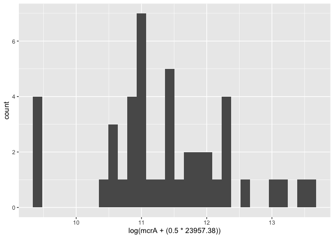<!-- -->

``` r
anaerobe_pca_data %>% 
  ggplot() +
  geom_histogram(aes(x = sqrt(nirK)))
```

    ## `stat_bin()` using `bins = 30`. Pick better value with `binwidth`.

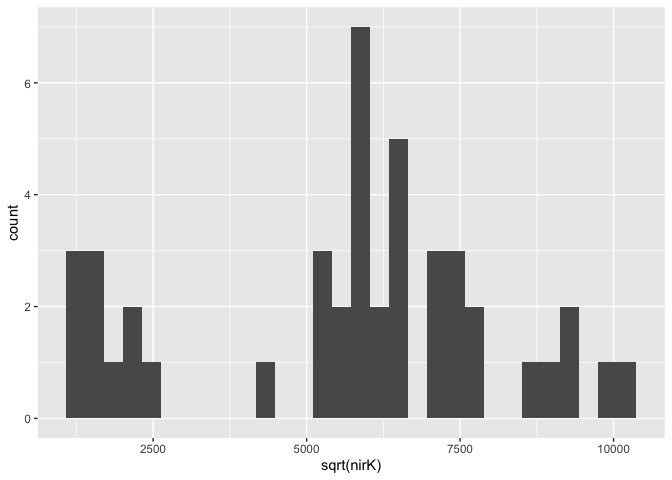<!-- -->

``` r
anaerobe_pca_data %>% 
  ggplot() +
  geom_histogram(aes(x = log(nirS)))
```

    ## `stat_bin()` using `bins = 30`. Pick better value with `binwidth`.

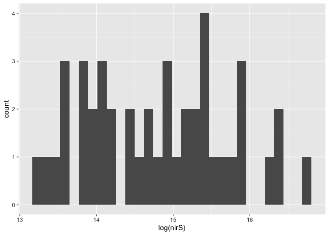<!-- -->

## Confirm outliers removed

Code originally used to identify outliers

``` r
grubbs.test(anaerobe_pca_data$log_dsrAB)
```

    ## 
    ##  Grubbs test for one outlier
    ## 
    ## data:  anaerobe_pca_data$log_dsrAB
    ## G = 1.97092, U = 0.90756, p-value = 0.9857
    ## alternative hypothesis: lowest value 14.9706141386213 is an outlier

``` r
grubbs.test(anaerobe_pca_data$log_gltA) #there is an outlier (CREC-CT-A-1 and CT-A-2)
```

    ## 
    ##  Grubbs test for one outlier
    ## 
    ## data:  anaerobe_pca_data$log_gltA
    ## G = 2.10287, U = 0.89477, p-value = 0.6972
    ## alternative hypothesis: lowest value 14.7026509447478 is an outlier

``` r
grubbs.test(anaerobe_pca_data$log_mcrA) 
```

    ## 
    ##  Grubbs test for one outlier
    ## 
    ## data:  anaerobe_pca_data$log_mcrA
    ## G = 2.20249, U = 0.88456, p-value = 0.529
    ## alternative hypothesis: highest value 13.5884040326152 is an outlier

``` r
grubbs.test(anaerobe_pca_data$sqrt_nirK) #there is an outlier (WO-UN-U-2)
```

    ## 
    ##  Grubbs test for one outlier
    ## 
    ## data:  anaerobe_pca_data$sqrt_nirK
    ## G = 1.79736, U = 0.92313, p-value = 1
    ## alternative hypothesis: highest value 10194.1244225821 is an outlier

``` r
grubbs.test(anaerobe_pca_data$log_nirS) #there is an outlier (SM-NT-U-1)
```

    ## 
    ##  Grubbs test for one outlier
    ## 
    ## data:  anaerobe_pca_data$log_nirS
    ## G = 2.0945, U = 0.8956, p-value = 0.713
    ## alternative hypothesis: highest value 16.7114978417475 is an outlier

## Perform PCA

``` r
pca_anaerobes <- 
  prcomp(
    ~log_dsrAB + log_gltA + log_mcrA + sqrt_nirK + log_nirS, 
    data = anaerobe_pca_data, 
    scale = TRUE
  )
```

### Plot - Supplementary Figure S2

``` r
autoplot(
  pca_anaerobes,
  loadings = TRUE,
  loadings.label = TRUE,
) +
  scale_x_reverse() + 
  theme_bw() + 
  theme(
    aspect.ratio = 1,
    axis.title = element_text(size = 16),
    axis.text = element_text(size = 14)
  )
```

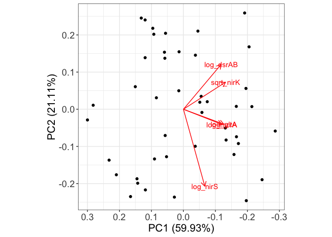<!-- -->

### Save PC1 values

NOTE: anaerobes_by_pca was saved as a csv: `anaerobe_pca.csv`

``` r
pc1_values <- pca_anaerobes$x %>% as_tibble() %>%  pull(PC1)


anaerobes_by_pca <- 
  anaerobe_pca_data %>% 
  add_column(pc1_values) %>% 
  mutate(
    pc1_values_trans = 1 * pc1_values
  )
```

# PC1 vs. tillage

## Supplementary Figure S3

``` r
anaerobes_by_pca %>% 
  group_by(site, till, landscape_position, amend) %>% 
  summarise(
    avg_pc1 = mean(pc1_values_trans, na.rm = TRUE),
    se_pc1 = sd(pc1_values_trans, na.rm = TRUE) / sqrt(n()),
  ) %>% 
  filter(site != "GR", till != "MT", amend == "U") %>%
  ggplot() +
  geom_pointrange(
    aes(
      x = till, 
      y = avg_pc1, 
      ymin = avg_pc1 - se_pc1, 
      ymax = avg_pc1 + se_pc1,
    )
  ) + 
  scale_y_reverse() +
  expand_limits(y = -3.5) +
  facet_grid(
    cols = vars(site), 
    scales = "free", 
    labeller = labeller(site = site_labels)
  ) + 
  my_theme() + 
  theme(
    aspect.ratio = 1.5
  ) +
  labs(
    y = "PC1 - Anaerobe Abundances",
    x = NULL
  )
```

    ## `summarise()` has grouped output by 'site', 'till', 'landscape_position'. You
    ## can override using the `.groups` argument.

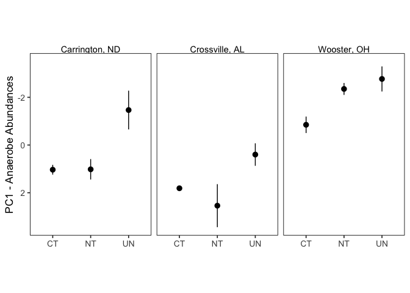<!-- -->

## Statistics - values reported in Supplementary Table S2

*Normality*

``` r
anaerobes_by_pca %>% 
  group_by(site, till, amend) %>% 
  mutate(
    count = n()
  ) %>% 
  filter(count > 2) %>% 
  summarise(
    normality_p = shapiro.test(pc1_values_trans)$p.value
  ) %>%
  arrange(normality_p)
```

    ## `summarise()` has grouped output by 'site', 'till'. You can override using the
    ## `.groups` argument.

    ## # A tibble: 11 × 4
    ## # Groups:   site, till [10]
    ##    site  till  amend normality_p
    ##    <chr> <chr> <chr>       <dbl>
    ##  1 CREC  UN    U           0.108
    ##  2 CREC  NT    U           0.178
    ##  3 WO    CT    U           0.262
    ##  4 SM    NT    A           0.396
    ##  5 GR    NT    U           0.415
    ##  6 SM    UN    U           0.421
    ##  7 SM    CT    A           0.544
    ##  8 CREC  MT    U           0.564
    ##  9 CREC  NT    A           0.581
    ## 10 WO    NT    U           0.639
    ## 11 CREC  CT    U           0.869

All groups w/ more than 3 observations are normally distributed.

*Variances*

``` r
bartlett.test(
   pc1_values_trans ~ interaction(till, site),
  data = 
    anaerobes_by_pca %>% 
    filter(site != "GR", till != "MT", amend == "U") 
  
)
```

    ## 
    ##  Bartlett test of homogeneity of variances
    ## 
    ## data:  pc1_values_trans by interaction(till, site)
    ## Bartlett's K-squared = 6.6865, df = 8, p-value = 0.5708

### CREC

``` r
crec_pc_anaerobe_aov <- 
  aov(
      pc1_values_trans ~ till,
      data = 
        anaerobes_by_pca %>% 
        filter(site == "CREC", amend == "U", till != "MT") 
)

crec_pc_anaerobe_aov %>% summary()
```

    ##             Df Sum Sq Mean Sq F value Pr(>F)  
    ## till         2 12.426   6.213   7.019 0.0268 *
    ## Residuals    6  5.311   0.885                 
    ## ---
    ## Signif. codes:  0 '***' 0.001 '**' 0.01 '*' 0.05 '.' 0.1 ' ' 1

``` r
TukeyHSD(crec_pc_anaerobe_aov)
```

    ##   Tukey multiple comparisons of means
    ##     95% family-wise confidence level
    ## 
    ## Fit: aov(formula = pc1_values_trans ~ till, data = anaerobes_by_pca %>% filter(site == "CREC", amend == "U", till != "MT"))
    ## 
    ## $till
    ##              diff       lwr        upr     p adj
    ## NT-CT -0.01646521 -2.373410  2.3404798 0.9997467
    ## UN-CT -2.50079717 -4.857742 -0.1438521 0.0397810
    ## UN-NT -2.48433196 -4.841277 -0.1273869 0.0408275

### SM

``` r
sm_pc_anaerobe_aov <- 
  aov(
      pc1_values_trans ~ till,
      data = 
        anaerobes_by_pca %>% 
        filter(site == "SM", amend == "U", till != "MT") 
)

sm_pc_anaerobe_aov %>% summary()
```

    ##             Df Sum Sq Mean Sq F value Pr(>F)
    ## till         2  5.951  2.9757   4.004  0.111
    ## Residuals    4  2.973  0.7432

### WO

``` r
wo_pc_anaerobe_aov <- 
  aov(
      pc1_values_trans ~ till,
      data = 
        anaerobes_by_pca %>% 
        filter(site == "WO", amend == "U", till != "MT") 
)

wo_pc_anaerobe_aov %>% summary()
```

    ##             Df Sum Sq Mean Sq F value Pr(>F)  
    ## till         2  5.443  2.7216   8.295 0.0258 *
    ## Residuals    5  1.641  0.3281                 
    ## ---
    ## Signif. codes:  0 '***' 0.001 '**' 0.01 '*' 0.05 '.' 0.1 ' ' 1

``` r
TukeyHSD(wo_pc_anaerobe_aov)
```

    ##   Tukey multiple comparisons of means
    ##     95% family-wise confidence level
    ## 
    ## Fit: aov(formula = pc1_values_trans ~ till, data = anaerobes_by_pca %>% filter(site == "WO", amend == "U", till != "MT"))
    ## 
    ## $till
    ##             diff       lwr         upr     p adj
    ## NT-CT -1.5028178 -3.024664  0.01902878 0.0522311
    ## UN-CT -1.9220453 -3.623522 -0.22056907 0.0322133
    ## UN-NT -0.4192275 -2.120704  1.28224875 0.7182773

# PC1 Anaerobe Abundances vs. manure amendments

## Supplementary Figure S4

``` r
anaerobes_by_pca %>% 
  group_by(site, till, amend, landscape_position) %>% 
  summarise(
    avg_pc = mean(pc1_values_trans, na.rm = TRUE),
    se_pc = sd(pc1_values_trans, na.rm = TRUE) / sqrt(n()),
  ) %>% 
  filter(site == "CREC", till %in% c("CT", "NT")) %>% 
  ggplot(aes(x = amend)) + 
  geom_pointrange(aes(ymin = avg_pc - se_pc, ymax = avg_pc + se_pc, y = avg_pc)) +
  scale_y_reverse() +
  expand_limits(y = -2.5) +
  facet_grid(
    cols = vars(till), 
    scales = "free", 
    labeller = labeller(site = site_labels)
  ) + 
  theme_bw() + 
  my_theme() +
  theme(
    aspect.ratio = 1.5
  ) +
  labs(
    y = "PC1 - Anaerobe Abundances",
    x = NULL
  )
```

    ## `summarise()` has grouped output by 'site', 'till', 'amend'. You can override
    ## using the `.groups` argument.

    ## Warning: Removed 1 rows containing missing values (`geom_segment()`).

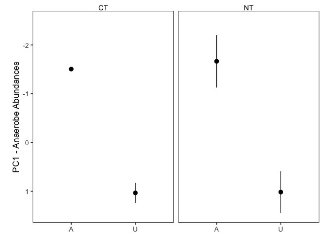<!-- -->

## Statistics - Reported in Supplementary Table S3

### CT

Not enough PC1 observations for CT-A to perform t-test.

### NT

*Check normality*

Data is normal.

``` r
anaerobes_by_pca %>% 
  filter(site == "CREC", till == "NT") %>% 
  group_by(site, till, amend) %>%
  summarise(
    normality_p = shapiro.test(pc1_values)$p.value
  ) %>% 
  arrange(normality_p)
```

    ## # A tibble: 2 × 4
    ## # Groups:   site, till [1]
    ##   site  till  amend normality_p
    ##   <chr> <chr> <chr>       <dbl>
    ## 1 CREC  NT    U           0.178
    ## 2 CREC  NT    A           0.581

*Test for equal variances*

``` r
bartlett.test( 
  pc1_values ~ amend,
  data = 
      anaerobes_by_pca %>% 
    filter(site == "CREC", till == "NT")
)
```

    ## 
    ##  Bartlett test of homogeneity of variances
    ## 
    ## data:  pc1_values by amend
    ## Bartlett's K-squared = 0.083129, df = 1, p-value = 0.7731

Variances are equal.

*t-test*

``` r
t.test(
  x = 
    anaerobes_by_pca %>% 
    filter(site == "CREC", till == "NT", amend == "A") %>% 
    pull(pc1_values),
  y = 
    anaerobes_by_pca %>% 
    filter(site == "CREC", till == "NT", amend == "U") %>% 
    pull(pc1_values),
  var.equal = TRUE,
  alternative = c("less") #more negative = more anaerobes
)
```

    ## 
    ##  Two Sample t-test
    ## 
    ## data:  anaerobes_by_pca %>% filter(site == "CREC", till == "NT", amend == "A") %>% pull(pc1_values) and anaerobes_by_pca %>% filter(site == "CREC", till == "NT", amend == "U") %>% pull(pc1_values)
    ## t = -3.9017, df = 4, p-value = 0.008758
    ## alternative hypothesis: true difference in means is less than 0
    ## 95 percent confidence interval:
    ##       -Inf -1.216749
    ## sample estimates:
    ## mean of x mean of y 
    ## -1.664279  1.018071
