ddPCR all data
================
Emily Lacroix
25 JAN 2023

- <a href="#setup" id="toc-setup">Setup</a>
  - <a href="#load-libraries" id="toc-load-libraries">Load libraries</a>
  - <a href="#functions" id="toc-functions">Functions</a>
  - <a href="#files" id="toc-files">Files</a>
  - <a href="#figure-theme" id="toc-figure-theme">Figure theme</a>
  - <a href="#labels" id="toc-labels">Labels</a>
  - <a href="#constants" id="toc-constants">Constants</a>
- <a href="#import-and-combine-data"
  id="toc-import-and-combine-data">Import and combine data</a>
  - <a href="#extraction-data" id="toc-extraction-data">Extraction data</a>
  - <a href="#soil-moisture-data" id="toc-soil-moisture-data">Soil Moisture
    data</a>
  - <a href="#import-ddpcr-results" id="toc-import-ddpcr-results">Import
    ddPCR results</a>
    - <a href="#mcra" id="toc-mcra">mcrA</a>
    - <a href="#glta" id="toc-glta">gltA</a>
    - <a href="#nirk" id="toc-nirk">nirK</a>
    - <a href="#nirs" id="toc-nirs">nirS</a>
    - <a href="#dsrab" id="toc-dsrab">dsrAB</a>
    - <a href="#16s" id="toc-16s">16S</a>
  - <a href="#combine-data" id="toc-combine-data">Combine data</a>
  - <a href="#check-for-outliers" id="toc-check-for-outliers">Check for
    outliers</a>
    - <a href="#total-anaerobes" id="toc-total-anaerobes">Total anaerobes</a>
- <a href="#absolute-abundance-unamended-effect-of-tillage-across-sites"
  id="toc-absolute-abundance-unamended-effect-of-tillage-across-sites">Absolute
  Abundance: Unamended, effect of tillage across sites</a>
  - <a href="#figure---faceted" id="toc-figure---faceted">Figure -
    faceted</a>
    - <a href="#statistics---nirk" id="toc-statistics---nirk">Statistics -
      nirK</a>
    - <a href="#statistics---nirs" id="toc-statistics---nirs">Statistics -
      nirS</a>
    - <a href="#statistics-glta" id="toc-statistics-glta">Statistics gltA</a>
    - <a href="#statistics---dsrab" id="toc-statistics---dsrab">Statistics -
      dsrAB</a>
    - <a href="#statistics---mcra" id="toc-statistics---mcra">Statistics -
      mcrA</a>
  - <a href="#figure---stacked-bars" id="toc-figure---stacked-bars">Figure -
    stacked bars</a>
    - <a href="#statistics---total-anaerobe"
      id="toc-statistics---total-anaerobe">Statistics - total anaerobe</a>
  - <a href="#tillage---carrington-only"
    id="toc-tillage---carrington-only">Tillage - Carrington only</a>
    - <a href="#figure---stacked-bar" id="toc-figure---stacked-bar">Figure -
      stacked bar</a>
    - <a href="#figure---faceted-1" id="toc-figure---faceted-1">Figure -
      faceted</a>
- <a href="#absolute-abundance-landscape-position"
  id="toc-absolute-abundance-landscape-position">Absolute Abundance:
  Landscape Position</a>
  - <a href="#figure---faceted-2" id="toc-figure---faceted-2">Figure -
    faceted</a>
  - <a href="#figure---stacked-bars-1"
    id="toc-figure---stacked-bars-1">Figure - stacked bars</a>
- <a href="#absolute-abundance---manure-amendments-at-carrington"
  id="toc-absolute-abundance---manure-amendments-at-carrington">Absolute
  Abundance - Manure amendments at Carrington</a>
  - <a href="#figure---stacked-bars-2"
    id="toc-figure---stacked-bars-2">Figure - stacked bars</a>
    - <a href="#statistics" id="toc-statistics">Statistics</a>
  - <a href="#figure---faceted-3" id="toc-figure---faceted-3">Figure -
    faceted</a>
    - <a href="#nirk-1" id="toc-nirk-1">nirK</a>
    - <a href="#nirs-1" id="toc-nirs-1">nirS</a>
    - <a href="#glta-1" id="toc-glta-1">gltA</a>
    - <a href="#dsrab-1" id="toc-dsrab-1">dsrAB</a>
    - <a href="#mcra-1" id="toc-mcra-1">mcrA</a>
- <a href="#absolute-abundance--poultry-litter-amendments--sand-mountain"
  id="toc-absolute-abundance--poultry-litter-amendments--sand-mountain">Absolute
  abundance- poultry litter amendments @ Sand Mountain</a>
  - <a href="#figure---stacked-bar-1" id="toc-figure---stacked-bar-1">Figure
    - stacked bar</a>
    - <a href="#statistics-1" id="toc-statistics-1">Statistics</a>
    - <a href="#figure---faceted-4" id="toc-figure---faceted-4">Figure -
      faceted</a>
- <a href="#relative-abundance-total-anaerobe--16s-copies"
  id="toc-relative-abundance-total-anaerobe--16s-copies">Relative
  Abundance (total anaerobe / 16S copies)</a>
  - <a href="#unamended-effect-of-tillage-across-sites"
    id="toc-unamended-effect-of-tillage-across-sites">Unamended, effect of
    tillage across sites</a>

# Setup

## Load libraries

``` r
library(car)
library(multcompView)
library(FSA)
library(outliers)
library(tidyverse)
library(readxl)
library(ggpubr)
library(scales)
library(rstatix)
library(rcompanion)
```

## Functions

``` r
tri.to.squ<-function(x)
{
  rn <- row.names(x)
  cn <- colnames(x)
  an <- unique(c(cn,rn))
  myval <- x[!is.na(x)]
  mymat <- 
    matrix(1, nrow = length(an), ncol = length(an), dimnames = list(an,an))
  for(ext in 1:length(cn))
  {
    for(int in 1:length(rn))
    {
      if(is.na(x[row.names(x) == rn[int], colnames(x) == cn[ext]])) next
      mymat[row.names(mymat) == rn[int], colnames(mymat) == cn[ext]] <- 
        x[row.names(x) == rn[int], colnames(x) == cn[ext]]
      mymat[row.names(mymat) == cn[ext], colnames(mymat) == rn[int]] <- 
        x[row.names(x) == rn[int], colnames(x) == cn[ext]]
    }
  }
  return(mymat)
}
```

## Files

``` r
grav_data_file <- "intact_core_grav.csv"

extract_data_file <- "dna_extraction.csv"

all_data_file <- "AllData_03AUG.xlsx"

mcrA_file <- "mcra_data.xlsx"

sixteenS_file_auto <- "EML_16S_SHI_redo_08MAR2022_auto.csv"

sixteenS_file_manual <- "EML_16S_SHI_redo_08MAR2022_auto.csv"

glta_file1 <- "glta_SHI_28oct_manual.csv"

glta_file2 <- "lacroix_glta_02nov_manual.csv"

nirK_file1 <- "EML_nirK_SHI_samples_16jan_auto.csv" #note - this is the autointegration assignment from QuantaSoft software

nirS_file1 <-  "EML_nirS_SHI_samples_21jan_MANUAL_6000.csv" #note - this is the manual integration assignment, with threshold = 6000

dsrab_file <- "EML_dsrAB_SHI_samples_15mar2022_auto.csv"
```

## Figure theme

``` r
my_theme <- function(base_size = 13, base_family = ""){ ## Control base font face and size. use `rel()` for relative font size.
  theme_bw(base_size = base_size, base_family = base_family) %+replace%
    theme(
      panel.border = element_rect(colour = "black", fill = "transparent"),
      panel.background  = element_blank(),
      panel.grid = element_blank(),
      strip.background = element_blank(),
      legend.position="top",
      legend.title = element_blank(),
      strip.text = element_text(size = 11),
      strip.text.y = element_text(size = 11)
    )
}
```

## Labels

``` r
site_labels <- 
  c(
    "CREC" = "Carrington, ND",
    "WO" = "Wooster, OH",
    "GR" = "Novelty, MO",
    "SM" = "Crossville, AL"
  )
```

## Constants

``` r
rxn_dilution_factor <- 25
```

# Import and combine data

## Extraction data

``` r
dna_extraction <- 
  extract_data_file %>% 
  read_csv %>% 
  mutate(
    across(landscape_position, ~na_if(., "NA"))
  ) %>% 
  select(
    site,
    till,
    amend,
    landscape_position,
    rep = fieldrep,
    mass_g,
    nano_260_280,
    nano_260_230,
    qubit_ng_ul,
    qubit_ng_mL
  )

dna_extraction
```

    ## # A tibble: 51 × 10
    ##    site  till  amend landscape_po…¹   rep mass_g nano_…² nano_…³ qubit…⁴ qubit…⁵
    ##    <chr> <chr> <chr> <chr>          <dbl>  <dbl>   <dbl>   <dbl>   <dbl>   <dbl>
    ##  1 CREC  CT    A     <NA>               1  0.249    1.76    1.38    40.8     204
    ##  2 CREC  CT    A     <NA>               2  0.248    1.83    1.48    41       205
    ##  3 CREC  CT    A     <NA>               3  0.249    1.81    0.65    67.8     339
    ##  4 CREC  CT    U     <NA>               1  0.252    1.77    1.33    31.4     157
    ##  5 CREC  CT    U     <NA>               2  0.248    1.79    1.93    34.2     171
    ##  6 CREC  CT    U     <NA>               3  0.250    1.75    1.23    41.4     207
    ##  7 CREC  MT    U     <NA>               1  0.249    1.7     1.01    47.4     237
    ##  8 CREC  MT    U     <NA>               2  0.248    1.76    1.19    51.4     257
    ##  9 CREC  MT    U     <NA>               3  0.25     1.84    1.43    30.4     152
    ## 10 CREC  NT    A     <NA>               1  0.248    1.77    1.33    72       360
    ## # … with 41 more rows, and abbreviated variable names ¹​landscape_position,
    ## #   ²​nano_260_280, ³​nano_260_230, ⁴​qubit_ng_ul, ⁵​qubit_ng_mL

## Soil Moisture data

``` r
bd_est <- 
  all_data_file %>% 
  read_xlsx(sheet = "gravimetric", na = "NA") %>% 
  group_by(
    site, 
    till, 
    amend, 
    field_rep, 
    landscape_position,
    vwc_probe
  ) %>% 
  summarise(
    avg_bd = mean(bd, na.rm = TRUE),
    avg_vwc = mean(vwc, na.rm = TRUE),
    avg_gwc = mean(gwc, na.rm = TRUE)
  ) %>% 
  select(    
    site, 
    till, 
    amend, 
    field_rep, 
    landscape_position,
    vwc_probe,
    avg_bd,
    avg_vwc,
    avg_gwc
  ) %>% 
  ungroup()
```

## Import ddPCR results

### mcrA

This code:

- reads in the mcra data
- designates “No Calls” to 0 (confirmed visually)
- selects relevant data fields
- omits data with fewer than 10,000 droplets

``` r
mcrA_data <- 
  mcrA_file %>% 
  read_xlsx(sheet = "ddPCR") %>% 
  mutate(across(landscape_position, ~na_if(., "NA"))) %>% 
  mutate(
    target_gene = "mcrA",
    across(c(conc, conc_min, conc_max), as.numeric),
    across(conc, ~if_else(is.na(.), 0, .)) #treat NAs like 0s
  ) %>% 
  select(
    -c(
      target_type, 
      status, 
      positives, 
      negatives, 
      copies_per_20uL
    )
  ) %>% 
  rename(rep = field_rep) %>% 
  filter(total_droplets > 10000)


mcrA_data %>% arrange(site, till, amend, rep, landscape_position)
```

    ## # A tibble: 62 × 10
    ##    site  till  amend   rep  conc conc_min conc_max total_dropl…¹ lands…² targe…³
    ##    <chr> <chr> <chr> <dbl> <dbl>    <dbl>    <dbl>         <dbl> <chr>   <chr>  
    ##  1 CREC  CT    A         1  26       23       29           12996 <NA>    mcrA   
    ##  2 CREC  CT    A         2  10.4      8.4     12.4         11959 <NA>    mcrA   
    ##  3 CREC  CT    A         3  64.3     59.5     69           13414 <NA>    mcrA   
    ##  4 CREC  CT    U         1   4        3        5.4         12820 <NA>    mcrA   
    ##  5 CREC  CT    U         2   0       NA       NA           11998 <NA>    mcrA   
    ##  6 CREC  CT    U         3   3.7      2.6      4.9         13234 <NA>    mcrA   
    ##  7 CREC  CT    U         3   4.4      3.3      5.8         12733 <NA>    mcrA   
    ##  8 CREC  MT    U         1   4.3      3.2      5.7         12232 <NA>    mcrA   
    ##  9 CREC  MT    U         2   2.4      1.6      3.5         12342 <NA>    mcrA   
    ## 10 CREC  MT    U         3   7.4      5.9      9.1         13239 <NA>    mcrA   
    ## # … with 52 more rows, and abbreviated variable names ¹​total_droplets,
    ## #   ²​landscape_position, ³​target_gene

### gltA

This code:

- designates the PCR template dilution
- reads in the glta data
- selects relevant data fields
- omits data with fewer than 10,000 droplets

``` r
glta_df <- 10

glta_data <-
  glta_file2 %>% 
  read_csv() %>% 
  mutate(across(c(Concentration), as.numeric)) %>% 
  bind_rows(glta_file1 %>% read_csv()) %>% 
  select(
    sample_name = Sample,
    target_type = TargetType,
    status = Status,
    conc = Concentration, 
    copies_per_20uL = CopiesPer20uLWell,
    conc_min = PoissonConfMin,
    conc_max = PoissonConfMax,
    positives = Positives,
    negatives = Negatives,
    total_droplets = AcceptedDroplets
  ) %>% 
  separate(sample_name, into = c("site", "till", "amend", "rep")) %>% 
  mutate(
    landscape_position = if_else(site == "GR", amend, NA_character_),
    across(amend, ~if_else(site == "GR", "U", .)),
    across(c(conc, rep), as.numeric),
    target_gene = "gltA"
  ) %>% 
  filter(site %in% c("SM", "CREC", "GR", "WO")) %>% 
  mutate(
    across(c(conc, conc_min, conc_max), ~ . * glta_df)
  ) %>% 
  select(
    -c(
      target_type, 
      status, 
      positives, 
      negatives, 
      copies_per_20uL, 
      )
  ) %>% 
  filter(total_droplets > 10000)
```

### nirK

This code:

- reads in the nirK data
- selects relevant data fields
- corrects for template dilution
- omits data with fewer than 10,000 droplets

``` r
nirk_data <-
  nirK_file1 %>% 
  read_csv() %>% 
  select(
    sample_name = Sample,
    target_type = TargetType,
    status = Status,
    conc = Concentration, 
    copies_per_20uL = CopiesPer20uLWell,
    conc_min = PoissonConfMin,
    conc_max = PoissonConfMax,
    positives = Positives,
    negatives = Negatives,
    total_droplets = AcceptedDroplets
  ) %>% 
  separate(
    sample_name, 
    into = c("site", "till", "amend", "rep"),
    sep = c("-")
  ) %>% 
  mutate(
    dilution = str_extract(rep, "(?<=:)\\d+"),
    across(rep, ~str_extract(., "^\\d")),
    landscape_position = if_else(site == "GR", amend, NA_character_),
    across(amend, ~if_else(site == "GR", "U", .)),
    across(c(conc, dilution, rep), as.numeric),
    target_gene = "nirK"
  ) %>% 
  filter(site %in% c("SM", "CREC", "GR", "WO")) %>% 
  mutate(
    across(c(conc, conc_min, conc_max), ~ . * dilution)
  ) %>% 
  select(
    -c(
      target_type, 
      status, 
      positives, 
      negatives, 
      copies_per_20uL, 
      dilution
      )
  ) %>% 
  filter(total_droplets > 10000)
```

### nirS

This code:

- reads in the nirs data
- selects relevant data fields and renames to be nirs specific
- corrects for template dilution
- omits data with fewer than 10,000 droplets

``` r
nirs_data <-
  nirS_file1 %>%
  read_csv() %>%
  select(
    sample_name = Sample,
    target_type = TargetType,
    status = Status,
    conc = Concentration,
    copies_per_20uL = CopiesPer20uLWell,
    conc_min = PoissonConfMin,
    conc_max = PoissonConfMax,
    positives = Positives,
    negatives = Negatives,
    total_droplets = AcceptedDroplets
  ) %>%
  separate(
    sample_name,
    into = c("site", "till", "amend", "rep"),
    sep = c("-")
  ) %>% 
  mutate(
    dilution = str_extract(rep, "(?<=:)\\d+"),
    across(rep, ~str_extract(., "^\\d")),
    landscape_position = if_else(site == "GR", amend, NA_character_),
    across(amend, ~if_else(site == "GR", "U", .)),
    across(c(conc, dilution, rep), as.numeric),
    target_gene = "nirS"
  ) %>% 
  filter(site %in% c("SM", "CREC", "GR", "WO")) %>%
  mutate(
    across(c(conc, conc_min, conc_max), ~ . * dilution)
  ) %>%
  select(
    -c(
      target_type,
      status,
      positives,
      negatives,
      copies_per_20uL,
      dilution
      )
  ) %>% 
  filter(total_droplets > 10000)
```

### dsrAB

This code:

- specifies the dilution factor for the DNA template
- reads in the dsrAB data
- selects relevant data fields
- corrects for template dilution
- omits data with fewer than 10,000 droplets

``` r
dsrab_dilution_factor <- 50

dsrab_data <-
  dsrab_file %>%
  read_csv() %>%
  select(
    sample_name = Sample,
    target_type = TargetType,
    status = Status,
    conc = Concentration,
    copies_per_20uL = CopiesPer20uLWell,
    conc_min = PoissonConfMin,
    conc_max = PoissonConfMax,
    positives = Positives,
    negatives = Negatives,
    total_droplets = AcceptedDroplets
  ) %>%
  separate(
    sample_name,
    into = c("site", "till", "amend", "rep"),
    sep = c("-")
  ) %>% 
  mutate(
    landscape_position = if_else(site == "GR", amend, NA_character_),
    across(amend, ~if_else(site == "GR", "U", .)),
    across(c(conc, rep), as.numeric)
  ) %>% 
  filter(site %in% c("SM", "CREC", "GR", "WO")) %>%
  mutate(
    across(c(conc, conc_min, conc_max), ~ . * dsrab_dilution_factor),
    target_gene = "dsrAB"
  ) %>% 
  select(
    -c(
      target_type,
      status,
      positives,
      negatives,
      copies_per_20uL
      )
  ) %>% 
  filter(total_droplets > 10000)
```

### 16S

This code:

- reads in the 16S data
- selects relevant data fields and renames to be 16S specific
- omits data from wells with pipetting errors (as recorded in laboratory
  notebook)
- omits data with fewer than 10,000 droplets

``` r
sixteenS_data <- 
  sixteenS_file_auto %>% 
  read_csv() %>% 
  filter(
    TargetType == "Ch1Unknown" & Well != "F09" & Well != "G09" & Well != "G07"
  ) %>%
  select(
    sample_name = Sample,
    target_type = TargetType,
    status = Status,
    conc = Concentration, 
    copies_per_20uL = CopiesPer20uLWell,
    conc_min = PoissonConfMin,
    conc_max = PoissonConfMax,
    positives = Positives,
    negatives = Negatives,
    total_droplets = AcceptedDroplets
  ) %>% 
  separate(
    sample_name, 
    into = c("site", "till", "amend", "rep"),
    sep = c("-")
  ) %>% 
  mutate(
    dilution = as.numeric(str_extract(rep, "(?<=:)\\d+")),
    across(rep, ~str_extract(., "^\\d")),
    landscape_position = if_else(site == "GR", amend, NA_character_),
    across(amend, ~if_else(site == "GR", "U", .)),
    across(c(conc, rep), as.numeric),
    target_gene = "16S"
  ) %>% 
  filter(
    site %in% c("SM", "CREC", "GR", "WO"),
    !(site == "SM" & till %in% c("NT", "UN") & dilution == 10),
    !(site == "SM" & till == "UN" & dilution == 1000)
  ) %>% 
  mutate(
    sixteenS_conc = conc * dilution,
    sixteenS_conc_min = conc_min * dilution,
    sixteenS_conc_max = conc_max * dilution,  #
    sixteenS_droplets = total_droplets
  ) %>% 
  select(
    -c(
      target_type, 
      status, 
      positives, 
      negatives, 
      copies_per_20uL, 
      dilution
      )
  ) %>% 
  filter(total_droplets > 10000) %>% 
  group_by(site, till, amend, rep, landscape_position) %>% 
  summarise(across(c(sixteenS_conc, sixteenS_conc_min, sixteenS_conc_max), mean))
```

## Combine data

This code:

- combines all the target gene tibbles into one
- corrects concentration values to account for dilution within PCR
- calculates target gene abundance normalized to 16S abundance
- calculates copies per g soil extracted

NOTE - all concentrations are currently in copies per uL

``` r
all_ddpcr_data_w_outliers <- 
  bind_rows(mcrA_data, glta_data, dsrab_data, nirk_data, nirs_data) %>% 
  left_join(
    sixteenS_data, 
    by = c("site", "till", "amend", "landscape_position", "rep")
  ) %>% 
  left_join(
    dna_extraction,
    by =
      c("site", "till", "amend", "landscape_position", "rep")
  ) %>% 
  left_join(
    bd_est,
    by =
      c("site", "till", "amend", "landscape_position", "rep" = "field_rep")
  ) %>% 
  mutate(
    across(
      c(conc, 
        sixteenS_conc, 
        conc_min, 
        conc_max, 
        sixteenS_conc_min, 
        sixteenS_conc_max
      ), ~ . * rxn_dilution_factor
    ),
    g_h2o = mass_g / (1 / avg_gwc + 1),
    mass_dry_soil = mass_g - g_h2o,
    prop = conc / sixteenS_conc,
    copies_per_g_sixteenS = sixteenS_conc * 100 / mass_dry_soil,
    copies_per_g = conc * 100 / mass_dry_soil
  ) 
```

## Check for outliers

### Total anaerobes

``` r
total_anaerobe_w_outliers <-
  all_ddpcr_data_w_outliers %>% 
  group_by(site, till, amend, landscape_position, target_gene, rep) %>% 
  summarise(
    avg_copies_per_g = mean(copies_per_g, na.rm = TRUE),
  ) %>% 
  group_by(site, till, amend, landscape_position, rep) %>% 
  summarise(
    anaerobe_copies_per_g = sum(avg_copies_per_g),
    count = n() #missing genes for GR-NT-F-1 and GR-NT-F-3 due to droplet generation issues
  ) %>% 
  filter(count == 5)

outliers_total <- grubbs.test(total_anaerobe_w_outliers$anaerobe_copies_per_g)

outliers_total
```

    ## 
    ##  Grubbs test for one outlier
    ## 
    ## data:  total_anaerobe_w_outliers$anaerobe_copies_per_g
    ## G = 5.12562, U = 0.44126, p-value = 1.67e-08
    ## alternative hypothesis: highest value 415469909.867172 is an outlier

Grubb’s Test shows that the highest total anaerobe value is a
statistical outlier.

``` r
total_anaerobe <- 
  total_anaerobe_w_outliers %>% 
  filter(!(site == "WO" & till == "UN" & rep == 2))

all_ddpcr_data <- 
  all_ddpcr_data_w_outliers %>% 
  filter(!(site == "WO" & till == "UN" & rep == 2))
  
outliers <- grubbs.test(total_anaerobe$anaerobe_copies_per_g)
```

# Absolute Abundance: Unamended, effect of tillage across sites

## Figure - faceted

``` r
all_ddpcr_data %>% 
  group_by(site, till, amend, landscape_position, target_gene) %>% 
  summarise(
    avg_copies_per_g = mean(copies_per_g, na.rm = TRUE),
    se_copies_per_g = sd(copies_per_g, na.rm = TRUE) / sqrt(n()),
    count = n()
  ) %>% 
  filter(site != "GR", amend == "U", till %in% c("CT", "NT", "UN")) %>% 
  mutate(
    across(
      target_gene, 
      ~factor(
        ., 
        levels = c("nirK", "nirS", "gltA", "dsrAB", "mcrA"),
        labels = c("nirK", "nirS", "gltA", "dsrAB", "mcrA")
      )
    )
  ) %>% 
  ggplot(aes(y = avg_copies_per_g, x = till, fill = target_gene)) + 
  geom_col(position = "dodge", color = "black") +
  geom_errorbar(
    aes(
      ymin = avg_copies_per_g,
      ymax = avg_copies_per_g + se_copies_per_g
    ),
    position = "dodge"
  ) +
  scale_fill_brewer(palette = "RdYlBu") +
  scale_y_continuous(
    labels = scientific, 
    n.breaks = 4,
    expand = expand_scale(mult = c(0, 0.25))
  ) +
  facet_grid(
    cols = vars(site), 
    rows = vars(target_gene), 
    scales = "free",
    labeller = labeller(site = site_labels)
  ) + 
  theme_bw() + 
  my_theme() +
  theme(
    aspect.ratio = 1.1,
    legend.position = "none",
    strip.text.y = element_text(face = "italic"),
    strip.text.x = element_text(size = 10)
  ) +
  labs(
    y = "Copies per g soil",
    x = NULL
  )
```

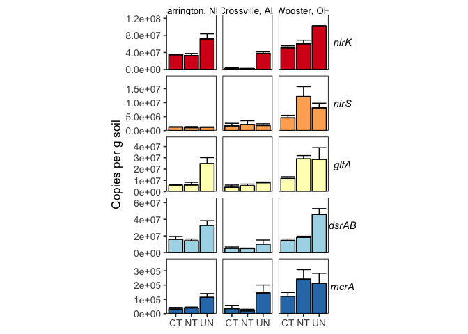<!-- -->

### Statistics - nirK

#### nirK - all sites

**Normality:** no single transformation makes all 9 groups normal

``` r
all_ddpcr_data %>% 
  filter(site != "GR", till != "MT", amend == "U",target_gene == "nirK") %>%
  group_by(site, till, amend, target_gene) %>% 
  summarise(
    normality_p = shapiro.test(copies_per_g)$p.value
  ) %>%
  arrange(normality_p)
```

    ## # A tibble: 9 × 5
    ## # Groups:   site, till, amend [9]
    ##   site  till  amend target_gene normality_p
    ##   <chr> <chr> <chr> <chr>             <dbl>
    ## 1 CREC  UN    U     nirK             0.0179
    ## 2 CREC  NT    U     nirK             0.0409
    ## 3 SM    UN    U     nirK             0.141 
    ## 4 WO    NT    U     nirK             0.237 
    ## 5 SM    NT    U     nirK             0.280 
    ## 6 CREC  CT    U     nirK             0.518 
    ## 7 SM    CT    U     nirK             0.637 
    ## 8 WO    CT    U     nirK             0.798 
    ## 9 WO    UN    U     nirK             0.865

**Variances:**

``` r
leveneTest( 
  copies_per_g ~ interaction(till, site),
  data = 
    all_ddpcr_data %>% 
    filter(site != "GR", till != "MT", amend == "U",target_gene == "nirK") 
) 
```

    ## Levene's Test for Homogeneity of Variance (center = median)
    ##       Df F value Pr(>F)
    ## group  8   0.795 0.6124
    ##       24

*Statistical test:* Kruskal-Wallis test

``` r
kruskal.test(
  copies_per_g ~ interaction(till, site), 
  data = 
    all_ddpcr_data %>% 
    filter(site != "GR", till != "MT", amend == "U", target_gene == "nirK")
)
```

    ## 
    ##  Kruskal-Wallis rank sum test
    ## 
    ## data:  copies_per_g by interaction(till, site)
    ## Kruskal-Wallis chi-squared = 28.204, df = 8, p-value = 0.0004371

``` r
dunn <- 
  dunnTest(
    copies_per_g ~ interaction(till, site), 
    data = 
      all_ddpcr_data %>% 
      filter(site != "GR", till != "MT", amend == "U", target_gene == "nirK"),
    method = "bh"
  )

dunn_pt <- dunn$res

cldList(comparison = dunn_pt$Comparison,
        p.value    = dunn_pt$P.adj,
        threshold  = 0.05,
        print.comp = TRUE
        )
```

    ## 
    ##  
    ##                     Comparisons     p.value Value Threshold
    ## CT.CREC-CT.SM     CT.CREC-CT.SM 0.283206467 FALSE      0.05
    ## CT.CREC-CT.WO     CT.CREC-CT.WO 0.301520384 FALSE      0.05
    ## CT.SM-CT.WO         CT.SM-CT.WO 0.057975686 FALSE      0.05
    ## CT.CREC-NT.CREC CT.CREC-NT.CREC 0.857896127 FALSE      0.05
    ## CT.SM-NT.CREC     CT.SM-NT.CREC 0.442024030 FALSE      0.05
    ## CT.WO-NT.CREC     CT.WO-NT.CREC 0.286389555 FALSE      0.05
    ## CT.CREC-NT.SM     CT.CREC-NT.SM 0.261666351 FALSE      0.05
    ## CT.SM-NT.SM         CT.SM-NT.SM 1.000000000 FALSE      0.05
    ## CT.WO-NT.SM         CT.WO-NT.SM 0.040363280  TRUE      0.05
    ## NT.CREC-NT.SM     NT.CREC-NT.SM 0.430876734 FALSE      0.05
    ## CT.CREC-NT.WO     CT.CREC-NT.WO 0.202150472 FALSE      0.05
    ## CT.SM-NT.WO         CT.SM-NT.WO 0.026771583  TRUE      0.05
    ## CT.WO-NT.WO         CT.WO-NT.WO 0.832803504 FALSE      0.05
    ## NT.CREC-NT.WO     NT.CREC-NT.WO 0.196646950 FALSE      0.05
    ## NT.SM-NT.WO         NT.SM-NT.WO 0.019178762  TRUE      0.05
    ## CT.CREC-UN.CREC CT.CREC-UN.CREC 0.199364133 FALSE      0.05
    ## CT.SM-UN.CREC     CT.SM-UN.CREC 0.028872961  TRUE      0.05
    ## CT.WO-UN.CREC     CT.WO-UN.CREC 0.883304802 FALSE      0.05
    ## NT.CREC-UN.CREC NT.CREC-UN.CREC 0.197632672 FALSE      0.05
    ## NT.SM-UN.CREC     NT.SM-UN.CREC 0.022610021  TRUE      0.05
    ## NT.WO-UN.CREC     NT.WO-UN.CREC 0.998571034 FALSE      0.05
    ## CT.CREC-UN.SM     CT.CREC-UN.SM 0.833129246 FALSE      0.05
    ## CT.SM-UN.SM         CT.SM-UN.SM 0.236343606 FALSE      0.05
    ## CT.WO-UN.SM         CT.WO-UN.SM 0.451735228 FALSE      0.05
    ## NT.CREC-UN.SM     NT.CREC-UN.SM 0.696394037 FALSE      0.05
    ## NT.SM-UN.SM         NT.SM-UN.SM 0.192841292 FALSE      0.05
    ## NT.WO-UN.SM         NT.WO-UN.SM 0.288167371 FALSE      0.05
    ## UN.CREC-UN.SM     UN.CREC-UN.SM 0.296470439 FALSE      0.05
    ## CT.CREC-UN.WO     CT.CREC-UN.WO 0.051209156 FALSE      0.05
    ## CT.SM-UN.WO         CT.SM-UN.WO 0.007027385  TRUE      0.05
    ## CT.WO-UN.WO         CT.WO-UN.WO 0.381466390 FALSE      0.05
    ## NT.CREC-UN.WO     NT.CREC-UN.WO 0.045053031  TRUE      0.05
    ## NT.SM-UN.WO         NT.SM-UN.WO 0.005393912  TRUE      0.05
    ## NT.WO-UN.WO         NT.WO-UN.WO 0.441272882 FALSE      0.05
    ## UN.CREC-UN.WO     UN.CREC-UN.WO 0.447795524 FALSE      0.05
    ## UN.SM-UN.WO         UN.SM-UN.WO 0.090926208 FALSE      0.05
    ## 
    ## 

    ##     Group Letter MonoLetter
    ## 1 CT.CREC   abcd       abcd
    ## 2   CT.SM     ab       ab  
    ## 3   CT.WO    acd       a cd
    ## 4 NT.CREC    abc       abc 
    ## 5   NT.SM      b        b  
    ## 6   NT.WO     cd         cd
    ## 7 UN.CREC     cd         cd
    ## 8   UN.SM   abcd       abcd
    ## 9   UN.WO      d          d

#### nirK - CREC

**Normality:** no single transformation makes all 3-4 groups normal

``` r
all_ddpcr_data %>% 
  filter(site == "CREC", amend == "U",target_gene == "nirK") %>%
  group_by(site, till, amend, target_gene) %>% 
  summarise(
    normality_p = shapiro.test(copies_per_g)$p.value
  ) %>%
  arrange(site, normality_p)
```

    ## `summarise()` has grouped output by 'site', 'till', 'amend'. You can override
    ## using the `.groups` argument.

    ## # A tibble: 4 × 5
    ## # Groups:   site, till, amend [4]
    ##   site  till  amend target_gene normality_p
    ##   <chr> <chr> <chr> <chr>             <dbl>
    ## 1 CREC  UN    U     nirK             0.0179
    ## 2 CREC  NT    U     nirK             0.0409
    ## 3 CREC  CT    U     nirK             0.518 
    ## 4 CREC  MT    U     nirK             0.663

**Variances:** equal variances

``` r
leveneTest( 
  copies_per_g ~ till,
  data = 
    all_ddpcr_data %>% 
    filter(site == "CREC", amend == "U",target_gene == "nirK") 
) 
```

    ## Levene's Test for Homogeneity of Variance (center = median)
    ##       Df F value Pr(>F)
    ## group  3  0.6478 0.6005
    ##       11

**Statistical test:** Kruskal-Wallis test

``` r
kruskal.test(
  copies_per_g ~ till, 
  data = 
    all_ddpcr_data %>% 
    filter(site == "CREC", amend == "U",target_gene == "nirK")
)
```

    ## 
    ##  Kruskal-Wallis rank sum test
    ## 
    ## data:  copies_per_g by till
    ## Kruskal-Wallis chi-squared = 6.3958, df = 3, p-value = 0.09386

#### nirK - SM

**Normality:** all normal

``` r
all_ddpcr_data %>% 
  filter(site == "SM", amend == "U",target_gene == "nirK") %>%
  group_by(site, till, amend, target_gene) %>% 
  summarise(
    normality_p = shapiro.test(copies_per_g)$p.value
  ) %>%
  arrange(site, normality_p)
```

    ## # A tibble: 3 × 5
    ## # Groups:   site, till, amend [3]
    ##   site  till  amend target_gene normality_p
    ##   <chr> <chr> <chr> <chr>             <dbl>
    ## 1 SM    UN    U     nirK              0.141
    ## 2 SM    NT    U     nirK              0.280
    ## 3 SM    CT    U     nirK              0.637

**Variances:** not equal

``` r
bartlett.test( 
  copies_per_g ~ till,
  data = 
    all_ddpcr_data %>% 
    filter(site == "SM", amend == "U",target_gene == "nirK") 
) 
```

    ## 
    ##  Bartlett test of homogeneity of variances
    ## 
    ## data:  copies_per_g by till
    ## Bartlett's K-squared = 6.4668, df = 2, p-value = 0.03942

**Statistics:** Welch’s ANOVA

``` r
oneway.test(
  copies_per_g ~ till, 
  data = 
    all_ddpcr_data %>% 
    filter(site == "SM", amend == "U", target_gene == "nirK"),
  var.equal = FALSE
)
```

    ## 
    ##  One-way analysis of means (not assuming equal variances)
    ## 
    ## data:  copies_per_g and till
    ## F = 42.742, num df = 2.000, denom df = 3.845, p-value = 0.002364

``` r
games_howell_test(
  copies_per_g ~ till, 
  data = 
    all_ddpcr_data %>% 
    filter(site == "SM", amend == "U", target_gene == "nirK")
)
```

    ## # A tibble: 3 × 8
    ##   .y.          group1 group2  estimate  conf.low conf.high p.adj p.adj.signif
    ## * <chr>        <chr>  <chr>      <dbl>     <dbl>     <dbl> <dbl> <chr>       
    ## 1 copies_per_g CT     NT      -302107. -7509810.  6905596. 0.981 ns          
    ## 2 copies_per_g CT     UN     35434584. 21777015. 49092154. 0.002 **          
    ## 3 copies_per_g NT     UN     35736692. 21352966. 50120417. 0.003 **

#### nirK - WO

**Normality:** Normal

``` r
all_ddpcr_data %>% 
  filter(site == "WO", amend == "U",target_gene == "nirK") %>%
  group_by(site, till, amend, target_gene) %>% 
  summarise(
    normality_p = shapiro.test(copies_per_g)$p.value
  ) %>%
  arrange(site, normality_p)
```

    ## # A tibble: 3 × 5
    ## # Groups:   site, till, amend [3]
    ##   site  till  amend target_gene normality_p
    ##   <chr> <chr> <chr> <chr>             <dbl>
    ## 1 WO    NT    U     nirK              0.237
    ## 2 WO    CT    U     nirK              0.798
    ## 3 WO    UN    U     nirK              0.865

**Variances:** equal

``` r
leveneTest( 
  copies_per_g ~ till,
  data = 
    all_ddpcr_data %>% 
    filter(site == "WO", amend == "U",target_gene == "nirK") 
) 
```

    ## Levene's Test for Homogeneity of Variance (center = median)
    ##       Df F value Pr(>F)
    ## group  2   0.798 0.4873
    ##        7

**Statistics:** ANOVA

``` r
wo_nirk_aov <- 
  aov(
      copies_per_g ~ till,
      data = 
        all_ddpcr_data %>% 
        filter(site == "WO", amend == "U",target_gene == "nirK") 
)


summary(wo_nirk_aov)
```

    ##             Df    Sum Sq   Mean Sq F value  Pr(>F)   
    ## till         2 4.378e+15 2.189e+15   15.53 0.00267 **
    ## Residuals    7 9.865e+14 1.409e+14                   
    ## ---
    ## Signif. codes:  0 '***' 0.001 '**' 0.01 '*' 0.05 '.' 0.1 ' ' 1

``` r
tukey_wo_nirk <- TukeyHSD(wo_nirk_aov)

tukey_wo_nirk
```

    ##   Tukey multiple comparisons of means
    ##     95% family-wise confidence level
    ## 
    ## Fit: aov(formula = copies_per_g ~ till, data = all_ddpcr_data %>% filter(site == "WO", amend == "U", target_gene == "nirK"))
    ## 
    ## $till
    ##           diff       lwr      upr     p adj
    ## NT-CT  9840446 -16861396 36542289 0.5519523
    ## UN-CT 50407756  21862285 78953226 0.0031057
    ## UN-NT 40567310  13865467 67269152 0.0070700

### Statistics - nirS

#### nirS - all sites

**Normality:** All 9 are normal after log transformation

``` r
all_ddpcr_data %>% 
  filter(site != "GR", till != "MT", amend == "U",target_gene == "nirS") %>%
  group_by(site, till, amend, target_gene) %>% 
  summarise(
    normality_p = shapiro.test(log(copies_per_g))$p.value
  ) %>%
  arrange(normality_p)
```

    ## # A tibble: 9 × 5
    ## # Groups:   site, till, amend [9]
    ##   site  till  amend target_gene normality_p
    ##   <chr> <chr> <chr> <chr>             <dbl>
    ## 1 SM    CT    U     nirS              0.110
    ## 2 SM    UN    U     nirS              0.235
    ## 3 SM    NT    U     nirS              0.278
    ## 4 CREC  NT    U     nirS              0.563
    ## 5 WO    CT    U     nirS              0.586
    ## 6 WO    NT    U     nirS              0.625
    ## 7 CREC  CT    U     nirS              0.681
    ## 8 CREC  UN    U     nirS              0.827
    ## 9 WO    UN    U     nirS              0.918

**Variance:** unequal

``` r
bartlett.test(
  log(copies_per_g) ~ interaction(till, site),
  data = 
    all_ddpcr_data %>% 
    filter(site != "GR", till != "MT", amend == "U",target_gene == "nirS") 
)
```

    ## 
    ##  Bartlett test of homogeneity of variances
    ## 
    ## data:  log(copies_per_g) by interaction(till, site)
    ## Bartlett's K-squared = 27.503, df = 8, p-value = 0.0005787

**Statistics:**: Welch’s ANOVA

``` r
oneway.test(
  log(copies_per_g) ~ interaction(site, till), 
  data = 
    all_ddpcr_data %>% 
    filter(site != "GR", till!= "MT", amend == "U", target_gene == "nirS"),
  var.equal = FALSE
)
```

    ## 
    ##  One-way analysis of means (not assuming equal variances)
    ## 
    ## data:  log(copies_per_g) and interaction(site, till)
    ## F = 10.546, num df = 8.0000, denom df = 7.8951, p-value = 0.001682

``` r
gh_nirs_all_sites <- 
  games_howell_test(
  log_copies_per_g ~ site_till,
  data = 
    all_ddpcr_data %>% 
    filter(site != "GR", till!= "MT", amend == "U", target_gene == "nirS") %>% 
    mutate(
      log_copies_per_g = log(copies_per_g),
      site_till = str_c(site, till, sep = "-")
    )
) %>% 
  mutate(
    across(c(group1, group2), ~(str_replace_all(., "-", "."))),
    comparison = str_c(group1, "-", group2)
  )

cldList(comparison = gh_nirs_all_sites$comparison,
        p.value    = gh_nirs_all_sites$p.adj,
        threshold  = 0.05,
        print.comp = TRUE
        )
```

    ## 
    ##  
    ##                     Comparisons p.value Value Threshold
    ## CREC.CT-CREC.NT CREC.CT-CREC.NT   0.972 FALSE      0.05
    ## CREC.CT-CREC.UN CREC.CT-CREC.UN   1.000 FALSE      0.05
    ## CREC.CT-SM.CT     CREC.CT-SM.CT   1.000 FALSE      0.05
    ## CREC.CT-SM.NT     CREC.CT-SM.NT   0.998 FALSE      0.05
    ## CREC.CT-SM.UN     CREC.CT-SM.UN   1.000 FALSE      0.05
    ## CREC.CT-WO.CT     CREC.CT-WO.CT   0.054 FALSE      0.05
    ## CREC.CT-WO.NT     CREC.CT-WO.NT   0.091 FALSE      0.05
    ## CREC.CT-WO.UN     CREC.CT-WO.UN   0.042  TRUE      0.05
    ## CREC.NT-CREC.UN CREC.NT-CREC.UN   0.992 FALSE      0.05
    ## CREC.NT-SM.CT     CREC.NT-SM.CT   0.999 FALSE      0.05
    ## CREC.NT-SM.NT     CREC.NT-SM.NT   1.000 FALSE      0.05
    ## CREC.NT-SM.UN     CREC.NT-SM.UN   0.982 FALSE      0.05
    ## CREC.NT-WO.CT     CREC.NT-WO.CT   0.190 FALSE      0.05
    ## CREC.NT-WO.NT     CREC.NT-WO.NT   0.060 FALSE      0.05
    ## CREC.NT-WO.UN     CREC.NT-WO.UN   0.084 FALSE      0.05
    ## CREC.UN-SM.CT     CREC.UN-SM.CT   1.000 FALSE      0.05
    ## CREC.UN-SM.NT     CREC.UN-SM.NT   0.998 FALSE      0.05
    ## CREC.UN-SM.UN     CREC.UN-SM.UN   0.999 FALSE      0.05
    ## CREC.UN-WO.CT     CREC.UN-WO.CT   0.041  TRUE      0.05
    ## CREC.UN-WO.NT     CREC.UN-WO.NT   0.076 FALSE      0.05
    ## CREC.UN-WO.UN     CREC.UN-WO.UN   0.028  TRUE      0.05
    ## SM.CT-SM.NT         SM.CT-SM.NT   0.998 FALSE      0.05
    ## SM.CT-SM.UN         SM.CT-SM.UN   1.000 FALSE      0.05
    ## SM.CT-WO.CT         SM.CT-WO.CT   0.554 FALSE      0.05
    ## SM.CT-WO.NT         SM.CT-WO.NT   0.202 FALSE      0.05
    ## SM.CT-WO.UN         SM.CT-WO.UN   0.287 FALSE      0.05
    ## SM.NT-SM.UN         SM.NT-SM.UN   0.996 FALSE      0.05
    ## SM.NT-WO.CT         SM.NT-WO.CT   0.907 FALSE      0.05
    ## SM.NT-WO.NT         SM.NT-WO.NT   0.752 FALSE      0.05
    ## SM.NT-WO.UN         SM.NT-WO.UN   0.810 FALSE      0.05
    ## SM.UN-WO.CT         SM.UN-WO.CT   0.420 FALSE      0.05
    ## SM.UN-WO.NT         SM.UN-WO.NT   0.101 FALSE      0.05
    ## SM.UN-WO.UN         SM.UN-WO.UN   0.133 FALSE      0.05
    ## WO.CT-WO.NT         WO.CT-WO.NT   0.447 FALSE      0.05
    ## WO.CT-WO.UN         WO.CT-WO.UN   0.585 FALSE      0.05
    ## WO.NT-WO.UN         WO.NT-WO.UN   0.978 FALSE      0.05
    ## 
    ## 

    ##     Group Letter MonoLetter
    ## 1 CREC.CT     ab        ab 
    ## 2 CREC.NT    abc        abc
    ## 3 CREC.UN      a        a  
    ## 4   SM.CT    abc        abc
    ## 5   SM.NT    abc        abc
    ## 6   SM.UN    abc        abc
    ## 7   WO.CT     bc         bc
    ## 8   WO.NT    abc        abc
    ## 9   WO.UN      c          c

#### nirS - CREC

**Normality:** All normal.

``` r
all_ddpcr_data %>% 
  filter(site == "CREC", amend == "U",target_gene == "nirS") %>%
  group_by(site, till, amend, target_gene) %>% 
  summarise(
    normality_p = shapiro.test(copies_per_g)$p.value
  ) %>%
  arrange(site, normality_p)
```

    ## # A tibble: 4 × 5
    ## # Groups:   site, till, amend [4]
    ##   site  till  amend target_gene normality_p
    ##   <chr> <chr> <chr> <chr>             <dbl>
    ## 1 CREC  MT    U     nirS             0.0601
    ## 2 CREC  NT    U     nirS             0.331 
    ## 3 CREC  CT    U     nirS             0.744 
    ## 4 CREC  UN    U     nirS             0.929

**Variances:** Equal

``` r
bartlett.test(
  copies_per_g ~ till,
  data = 
    all_ddpcr_data %>% 
    filter(site == "CREC", amend == "U",target_gene == "nirS") 
)
```

    ## 
    ##  Bartlett test of homogeneity of variances
    ## 
    ## data:  copies_per_g by till
    ## Bartlett's K-squared = 4.5603, df = 3, p-value = 0.207

**Statistics:** ANOVA

``` r
aov(
  copies_per_g ~ till,
  data = 
    all_ddpcr_data %>% 
    filter(site == "CREC", amend == "U", target_gene == "nirS") 
) %>% 
  summary()
```

    ##             Df    Sum Sq   Mean Sq F value Pr(>F)
    ## till         3 2.461e+11 8.203e+10    0.55  0.662
    ## Residuals    8 1.193e+12 1.491e+11

#### nirS - SM

**Normality:** Normal after log transformation

``` r
all_ddpcr_data %>% 
  filter(site == "SM", amend == "U",target_gene == "nirS") %>%
  group_by(site, till, amend, target_gene) %>% 
  summarise(
    normality_p = shapiro.test(log(copies_per_g))$p.value
  ) %>%
  arrange(site, normality_p)
```

    ## # A tibble: 3 × 5
    ## # Groups:   site, till, amend [3]
    ##   site  till  amend target_gene normality_p
    ##   <chr> <chr> <chr> <chr>             <dbl>
    ## 1 SM    CT    U     nirS              0.110
    ## 2 SM    UN    U     nirS              0.235
    ## 3 SM    NT    U     nirS              0.278

**Variances:** equal

``` r
bartlett.test(
  log(copies_per_g) ~ till,
  data = 
    all_ddpcr_data %>% 
    filter(site == "SM", amend == "U",target_gene == "nirS") 
)
```

    ## 
    ##  Bartlett test of homogeneity of variances
    ## 
    ## data:  log(copies_per_g) by till
    ## Bartlett's K-squared = 5.2847, df = 2, p-value = 0.07119

**Statistics:** ANOVA

``` r
aov(
  log(copies_per_g) ~ till,
  data = 
    all_ddpcr_data %>% 
    filter(site == "SM", amend == "U",target_gene == "nirS") 
) %>% summary()
```

    ##             Df Sum Sq Mean Sq F value Pr(>F)
    ## till         2  2.908   1.454   0.397  0.686
    ## Residuals    7 25.616   3.659

#### nirS - WO

**Normality:** All normal

``` r
all_ddpcr_data %>% 
  filter(site == "WO", amend == "U",target_gene == "nirS") %>%
  group_by(site, till, amend, target_gene) %>% 
  summarise(
    normality_p = shapiro.test(copies_per_g)$p.value
  ) %>%
  arrange(site, normality_p)
```

    ## # A tibble: 3 × 5
    ## # Groups:   site, till, amend [3]
    ##   site  till  amend target_gene normality_p
    ##   <chr> <chr> <chr> <chr>             <dbl>
    ## 1 WO    CT    U     nirS              0.566
    ## 2 WO    UN    U     nirS              0.884
    ## 3 WO    NT    U     nirS              0.902

**Variances:**

``` r
bartlett.test(
  copies_per_g ~ till,
  data = 
    all_ddpcr_data %>% 
    filter(site == "WO", amend == "U",target_gene == "nirS") 
)
```

    ## 
    ##  Bartlett test of homogeneity of variances
    ## 
    ## data:  copies_per_g by till
    ## Bartlett's K-squared = 2.956, df = 2, p-value = 0.2281

**Statistics:** ANOVA

``` r
aov(
  copies_per_g ~ till,
  data = 
    all_ddpcr_data %>% 
    filter(site == "WO", amend == "U",target_gene == "nirS") 
) %>% summary()
```

    ##             Df    Sum Sq   Mean Sq F value Pr(>F)  
    ## till         2 1.001e+14 5.007e+13   3.472 0.0896 .
    ## Residuals    7 1.009e+14 1.442e+13                 
    ## ---
    ## Signif. codes:  0 '***' 0.001 '**' 0.01 '*' 0.05 '.' 0.1 ' ' 1

### Statistics gltA

#### gltA - all sites

**Normality:** All approximately normal

``` r
all_ddpcr_data %>% 
  filter(site != "GR", till != "MT", amend == "U",target_gene == "gltA") %>%
  group_by(site, till, amend, target_gene) %>% 
  summarise(
    normality_p = shapiro.test(copies_per_g)$p.value
  ) %>%
  arrange(normality_p)
```

    ## # A tibble: 9 × 5
    ## # Groups:   site, till, amend [9]
    ##   site  till  amend target_gene normality_p
    ##   <chr> <chr> <chr> <chr>             <dbl>
    ## 1 SM    CT    U     gltA             0.0574
    ## 2 CREC  CT    U     gltA             0.126 
    ## 3 SM    NT    U     gltA             0.181 
    ## 4 WO    NT    U     gltA             0.198 
    ## 5 CREC  UN    U     gltA             0.313 
    ## 6 SM    UN    U     gltA             0.431 
    ## 7 WO    CT    U     gltA             0.572 
    ## 8 CREC  NT    U     gltA             0.582 
    ## 9 WO    UN    U     gltA             0.973

**Variances:** Very much unequal variances

``` r
bartlett.test(
  copies_per_g ~ interaction(till, site),
  data = 
    all_ddpcr_data %>% 
    filter(site != "GR", till != "MT", amend == "U",target_gene == "gltA") 
)
```

    ## 
    ##  Bartlett test of homogeneity of variances
    ## 
    ## data:  copies_per_g by interaction(till, site)
    ## Bartlett's K-squared = 24.484, df = 8, p-value = 0.0019

**Statistics:** Welch’s ANOVA

``` r
oneway.test(
  copies_per_g ~ interaction(till, site),
  data = 
    all_ddpcr_data %>% 
    filter(site != "GR", till != "MT", amend == "U",target_gene == "gltA") 
)
```

    ## 
    ##  One-way analysis of means (not assuming equal variances)
    ## 
    ## data:  copies_per_g and interaction(till, site)
    ## F = 7.3817, num df = 8.0000, denom df = 9.2138, p-value = 0.003253

``` r
gh_glta_all_sites <-
  games_howell_test(
    copies_per_g ~ site_till,
    data = 
      all_ddpcr_data %>% 
      filter(site != "GR", till!= "MT", amend == "U", target_gene == "gltA") %>% 
      mutate(
        site_till = str_c(site, till, sep = "-")
      )
  ) %>% 
  mutate(
    across(c(group1, group2), ~(str_replace_all(., "-", "."))),
    comparison = str_c(group1, "-", group2)
  ) 

cldList(comparison = gh_glta_all_sites$comparison,
        p.value    = gh_glta_all_sites$p.adj,
        threshold  = 0.05,
        print.comp = TRUE
        )
```

    ## 
    ##  
    ##                     Comparisons p.value Value Threshold
    ## CREC.CT-CREC.NT CREC.CT-CREC.NT   1.000 FALSE      0.05
    ## CREC.CT-CREC.UN CREC.CT-CREC.UN   0.203 FALSE      0.05
    ## CREC.CT-SM.CT     CREC.CT-SM.CT   0.999 FALSE      0.05
    ## CREC.CT-SM.NT     CREC.CT-SM.NT   1.000 FALSE      0.05
    ## CREC.CT-SM.UN     CREC.CT-SM.UN   0.487 FALSE      0.05
    ## CREC.CT-WO.CT     CREC.CT-WO.CT   0.153 FALSE      0.05
    ## CREC.CT-WO.NT     CREC.CT-WO.NT   0.017  TRUE      0.05
    ## CREC.CT-WO.UN     CREC.CT-WO.UN   0.560 FALSE      0.05
    ## CREC.NT-CREC.UN CREC.NT-CREC.UN   0.225 FALSE      0.05
    ## CREC.NT-SM.CT     CREC.NT-SM.CT   0.997 FALSE      0.05
    ## CREC.NT-SM.NT     CREC.NT-SM.NT   1.000 FALSE      0.05
    ## CREC.NT-SM.UN     CREC.NT-SM.UN   0.981 FALSE      0.05
    ## CREC.NT-WO.CT     CREC.NT-WO.CT   0.558 FALSE      0.05
    ## CREC.NT-WO.NT     CREC.NT-WO.NT   0.018  TRUE      0.05
    ## CREC.NT-WO.UN     CREC.NT-WO.UN   0.588 FALSE      0.05
    ## CREC.UN-SM.CT     CREC.UN-SM.CT   0.168 FALSE      0.05
    ## CREC.UN-SM.NT     CREC.UN-SM.NT   0.200 FALSE      0.05
    ## CREC.UN-SM.UN     CREC.UN-SM.UN   0.285 FALSE      0.05
    ## CREC.UN-WO.CT     CREC.UN-WO.CT   0.472 FALSE      0.05
    ## CREC.UN-WO.NT     CREC.UN-WO.NT   0.996 FALSE      0.05
    ## CREC.UN-WO.UN     CREC.UN-WO.UN   1.000 FALSE      0.05
    ## SM.CT-SM.NT         SM.CT-SM.NT   1.000 FALSE      0.05
    ## SM.CT-SM.UN         SM.CT-SM.UN   0.624 FALSE      0.05
    ## SM.CT-WO.CT         SM.CT-WO.CT   0.196 FALSE      0.05
    ## SM.CT-WO.NT         SM.CT-WO.NT   0.008  TRUE      0.05
    ## SM.CT-WO.UN         SM.CT-WO.UN   0.528 FALSE      0.05
    ## SM.NT-SM.UN         SM.NT-SM.UN   0.756 FALSE      0.05
    ## SM.NT-WO.CT         SM.NT-WO.CT   0.217 FALSE      0.05
    ## SM.NT-WO.NT         SM.NT-WO.NT   0.012  TRUE      0.05
    ## SM.NT-WO.UN         SM.NT-WO.UN   0.561 FALSE      0.05
    ## SM.UN-WO.CT         SM.UN-WO.CT   0.456 FALSE      0.05
    ## SM.UN-WO.NT         SM.UN-WO.NT   0.032  TRUE      0.05
    ## SM.UN-WO.UN         SM.UN-WO.UN   0.640 FALSE      0.05
    ## WO.CT-WO.NT         WO.CT-WO.NT   0.047  TRUE      0.05
    ## WO.CT-WO.UN         WO.CT-WO.UN   0.769 FALSE      0.05
    ## WO.NT-WO.UN         WO.NT-WO.UN   1.000 FALSE      0.05
    ## 
    ## 

    ##     Group Letter MonoLetter
    ## 1 CREC.CT      a         a 
    ## 2 CREC.NT      a         a 
    ## 3 CREC.UN     ab         ab
    ## 4   SM.CT      a         a 
    ## 5   SM.NT      a         a 
    ## 6   SM.UN      a         a 
    ## 7   WO.CT      a         a 
    ## 8   WO.NT      b          b
    ## 9   WO.UN     ab         ab

#### gltA - CREC

**Normality:** all approximately normal

``` r
all_ddpcr_data %>% 
  filter(site == "CREC", amend == "U",target_gene == "gltA") %>%
  group_by(site, till, amend, target_gene) %>% 
  summarise(
    normality_p = shapiro.test(copies_per_g)$p.value
  ) %>%
  arrange(site, normality_p)
```

    ## # A tibble: 4 × 5
    ## # Groups:   site, till, amend [4]
    ##   site  till  amend target_gene normality_p
    ##   <chr> <chr> <chr> <chr>             <dbl>
    ## 1 CREC  MT    U     gltA             0.0625
    ## 2 CREC  CT    U     gltA             0.126 
    ## 3 CREC  UN    U     gltA             0.313 
    ## 4 CREC  NT    U     gltA             0.582

**Variances:** Equal variances

``` r
bartlett.test(
  copies_per_g ~ till,
  data = 
    all_ddpcr_data %>% 
    filter(site == "CREC", amend == "U",target_gene == "gltA") 
)
```

    ## 
    ##  Bartlett test of homogeneity of variances
    ## 
    ## data:  copies_per_g by till
    ## Bartlett's K-squared = 6.4515, df = 3, p-value = 0.09159

**Statistics:** ANOVA

``` r
crec_glta_anova <- 
  aov(
    copies_per_g ~ till,
    data = 
      all_ddpcr_data %>% 
      filter(site == "CREC", amend == "U",target_gene == "gltA") 
  ) 

crec_glta_anova %>% summary()
```

    ##             Df    Sum Sq   Mean Sq F value Pr(>F)  
    ## till         3 9.578e+14 3.193e+14   5.032 0.0195 *
    ## Residuals   11 6.979e+14 6.345e+13                 
    ## ---
    ## Signif. codes:  0 '***' 0.001 '**' 0.01 '*' 0.05 '.' 0.1 ' ' 1

``` r
tukey_crec_glta <- TukeyHSD(crec_glta_anova)

multcompLetters4(crec_glta_anova, tukey_crec_glta)
```

    ## $till
    ##   UN   MT   NT   CT 
    ##  "a" "ab"  "b"  "b"

#### gltA - SM

**Normality:** all approximately normal

``` r
all_ddpcr_data %>% 
  filter(site == "SM", amend == "U",target_gene == "gltA") %>%
  group_by(site, till, amend, target_gene) %>% 
  summarise(
    normality_p = shapiro.test(copies_per_g)$p.value
  ) %>%
  arrange(site, normality_p)
```

    ## # A tibble: 3 × 5
    ## # Groups:   site, till, amend [3]
    ##   site  till  amend target_gene normality_p
    ##   <chr> <chr> <chr> <chr>             <dbl>
    ## 1 SM    CT    U     gltA             0.0574
    ## 2 SM    NT    U     gltA             0.181 
    ## 3 SM    UN    U     gltA             0.431

**Variances:** equal variances

``` r
bartlett.test(
  copies_per_g ~ till,
  data = 
    all_ddpcr_data %>% 
    filter(site == "SM", amend == "U",target_gene == "gltA") 
)
```

    ## 
    ##  Bartlett test of homogeneity of variances
    ## 
    ## data:  copies_per_g by till
    ## Bartlett's K-squared = 2.8643, df = 2, p-value = 0.2388

**Statistics:** ANOVA

``` r
aov(
  copies_per_g ~ till,
  data = 
    all_ddpcr_data %>% 
    filter(site == "SM", amend == "U",target_gene == "gltA") 
) %>% 
  summary()
```

    ##             Df    Sum Sq   Mean Sq F value Pr(>F)
    ## till         2 3.431e+13 1.715e+13   1.921  0.202
    ## Residuals    9 8.035e+13 8.928e+12

#### gltA - WO

**Normality:** all approximately normal

``` r
all_ddpcr_data %>% 
  filter(site == "WO", amend == "U",target_gene == "gltA") %>%
  group_by(site, till, amend, target_gene) %>% 
  summarise(
    normality_p = shapiro.test(copies_per_g)$p.value
  ) %>%
  arrange(site, normality_p)
```

    ## # A tibble: 3 × 5
    ## # Groups:   site, till, amend [3]
    ##   site  till  amend target_gene normality_p
    ##   <chr> <chr> <chr> <chr>             <dbl>
    ## 1 WO    NT    U     gltA              0.198
    ## 2 WO    CT    U     gltA              0.572
    ## 3 WO    UN    U     gltA              0.973

**Variances:** Barely equal variances

``` r
bartlett.test(
  copies_per_g ~ till,
  data = 
    all_ddpcr_data %>% 
    filter(site == "WO", amend == "U",target_gene == "gltA") 
)
```

    ## 
    ##  Bartlett test of homogeneity of variances
    ## 
    ## data:  copies_per_g by till
    ## Bartlett's K-squared = 5.9113, df = 2, p-value = 0.05204

**Statistics:** ANOVA

``` r
aov(
  copies_per_g ~ till, 
  data = 
    all_ddpcr_data %>% 
    filter(site == "WO", amend == "U",target_gene == "gltA")
) %>% summary()
```

    ##             Df    Sum Sq   Mean Sq F value Pr(>F)
    ## till         2 6.149e+14 3.075e+14   2.832  0.126
    ## Residuals    7 7.599e+14 1.086e+14

### Statistics - dsrAB

#### dsrAB - all sites

**Normality:** Cannot get WO-NT-U normal, even upon transformations

``` r
all_ddpcr_data %>% 
  filter(site != "GR", till != "MT", amend == "U",target_gene == "dsrAB") %>%
  group_by(site, till, amend, target_gene) %>% 
  summarise(
    normality_p = shapiro.test(copies_per_g)$p.value
  ) %>%
  arrange(normality_p)
```

    ## # A tibble: 9 × 5
    ## # Groups:   site, till, amend [9]
    ##   site  till  amend target_gene normality_p
    ##   <chr> <chr> <chr> <chr>             <dbl>
    ## 1 WO    NT    U     dsrAB            0.0340
    ## 2 WO    UN    U     dsrAB            0.0474
    ## 3 SM    UN    U     dsrAB            0.192 
    ## 4 SM    NT    U     dsrAB            0.199 
    ## 5 CREC  NT    U     dsrAB            0.556 
    ## 6 WO    CT    U     dsrAB            0.617 
    ## 7 SM    CT    U     dsrAB            0.707 
    ## 8 CREC  CT    U     dsrAB            0.873 
    ## 9 CREC  UN    U     dsrAB            0.891

**Variances:** Equal variances

``` r
leveneTest( 
  copies_per_g ~ interaction(till, site),
  data = 
    all_ddpcr_data %>% 
    filter(site != "GR", till != "MT", amend == "U",target_gene == "dsrAB") 
) 
```

    ## Levene's Test for Homogeneity of Variance (center = median)
    ##       Df F value Pr(>F)
    ## group  8  0.8225 0.5916
    ##       22

**Statistical test:** Kruskal-Wallis test

``` r
kruskal.test(
  copies_per_g ~ interaction(till, site), 
  data = 
    all_ddpcr_data %>% 
    filter(site != "GR", till != "MT", amend == "U",target_gene == "dsrAB")
)
```

    ## 
    ##  Kruskal-Wallis rank sum test
    ## 
    ## data:  copies_per_g by interaction(till, site)
    ## Kruskal-Wallis chi-squared = 22.84, df = 8, p-value = 0.003576

``` r
dunn_dsrab <- 
  dunnTest(
    copies_per_g ~ interaction(till, site), 
    data = 
      all_ddpcr_data %>% 
      filter(site != "GR", till != "MT", amend == "U", target_gene == "dsrAB"),
    method = "bh"
  )


dunn_pt_dsrab <- dunn_dsrab$res

cldList(comparison = dunn_pt_dsrab$Comparison,
        p.value    = dunn_pt_dsrab$P.adj,
        threshold  = 0.05,
        print.comp = TRUE
        )
```

    ## 
    ##  
    ##                     Comparisons    p.value Value Threshold
    ## CT.CREC-CT.SM     CT.CREC-CT.SM 0.29662576 FALSE      0.05
    ## CT.CREC-CT.WO     CT.CREC-CT.WO 0.93507060 FALSE      0.05
    ## CT.SM-CT.WO         CT.SM-CT.WO 0.26338414 FALSE      0.05
    ## CT.CREC-NT.CREC CT.CREC-NT.CREC 0.94536628 FALSE      0.05
    ## CT.SM-NT.CREC     CT.SM-NT.CREC 0.29186489 FALSE      0.05
    ## CT.WO-NT.CREC     CT.WO-NT.CREC 0.97128144 FALSE      0.05
    ## CT.CREC-NT.SM     CT.CREC-NT.SM 0.31141911 FALSE      0.05
    ## CT.SM-NT.SM         CT.SM-NT.SM 0.94010703 FALSE      0.05
    ## CT.WO-NT.SM         CT.WO-NT.SM 0.32061094 FALSE      0.05
    ## NT.CREC-NT.SM     NT.CREC-NT.SM 0.32034137 FALSE      0.05
    ## CT.CREC-NT.WO     CT.CREC-NT.WO 0.77189671 FALSE      0.05
    ## CT.SM-NT.WO         CT.SM-NT.WO 0.17313151 FALSE      0.05
    ## CT.WO-NT.WO         CT.WO-NT.WO 0.67099630 FALSE      0.05
    ## NT.CREC-NT.WO     NT.CREC-NT.WO 0.70801666 FALSE      0.05
    ## NT.SM-NT.WO         NT.SM-NT.WO 0.23725763 FALSE      0.05
    ## CT.CREC-UN.CREC CT.CREC-UN.CREC 0.31345060 FALSE      0.05
    ## CT.SM-UN.CREC     CT.SM-UN.CREC 0.01960652  TRUE      0.05
    ## CT.WO-UN.CREC     CT.WO-UN.CREC 0.28364446 FALSE      0.05
    ## NT.CREC-UN.CREC NT.CREC-UN.CREC 0.29632492 FALSE      0.05
    ## NT.SM-UN.CREC     NT.SM-UN.CREC 0.03190000  TRUE      0.05
    ## NT.WO-UN.CREC     NT.WO-UN.CREC 0.55215739 FALSE      0.05
    ## CT.CREC-UN.SM     CT.CREC-UN.SM 0.54666433 FALSE      0.05
    ## CT.SM-UN.SM         CT.SM-UN.SM 0.57344866 FALSE      0.05
    ## CT.WO-UN.SM         CT.WO-UN.SM 0.59638660 FALSE      0.05
    ## NT.CREC-UN.SM     NT.CREC-UN.SM 0.57112786 FALSE      0.05
    ## NT.SM-UN.SM         NT.SM-UN.SM 0.66467769 FALSE      0.05
    ## NT.WO-UN.SM         NT.WO-UN.SM 0.32456534 FALSE      0.05
    ## UN.CREC-UN.SM     UN.CREC-UN.SM 0.08576174 FALSE      0.05
    ## CT.CREC-UN.WO     CT.CREC-UN.WO 0.28993010 FALSE      0.05
    ## CT.SM-UN.WO         CT.SM-UN.WO 0.01886871  TRUE      0.05
    ## CT.WO-UN.WO         CT.WO-UN.WO 0.22706001 FALSE      0.05
    ## NT.CREC-UN.WO     NT.CREC-UN.WO 0.26094991 FALSE      0.05
    ## NT.SM-UN.WO         NT.SM-UN.WO 0.02006074  TRUE      0.05
    ## NT.WO-UN.WO         NT.WO-UN.WO 0.34145638 FALSE      0.05
    ## UN.CREC-UN.WO     UN.CREC-UN.WO 0.76300526 FALSE      0.05
    ## UN.SM-UN.WO         UN.SM-UN.WO 0.04813998  TRUE      0.05
    ## 
    ## 

    ##     Group Letter MonoLetter
    ## 1 CT.CREC    abc        abc
    ## 2   CT.SM      a        a  
    ## 3   CT.WO    abc        abc
    ## 4 NT.CREC    abc        abc
    ## 5   NT.SM      a        a  
    ## 6   NT.WO    abc        abc
    ## 7 UN.CREC     bc         bc
    ## 8   UN.SM     ab        ab 
    ## 9   UN.WO      c          c

#### dsrAB - CREC

**Normality:** all approximately normal

``` r
all_ddpcr_data %>% 
  filter(site == "CREC", amend == "U", target_gene == "dsrAB") %>%
  group_by(site, till, amend, target_gene) %>% 
  summarise(
    normality_p = shapiro.test(copies_per_g)$p.value
  ) %>%
  arrange(site, normality_p)
```

    ## # A tibble: 4 × 5
    ## # Groups:   site, till, amend [4]
    ##   site  till  amend target_gene normality_p
    ##   <chr> <chr> <chr> <chr>             <dbl>
    ## 1 CREC  MT    U     dsrAB             0.169
    ## 2 CREC  NT    U     dsrAB             0.556
    ## 3 CREC  CT    U     dsrAB             0.873
    ## 4 CREC  UN    U     dsrAB             0.891

**Variances:** equal

``` r
bartlett.test(
  copies_per_g ~ till,
  data = 
    all_ddpcr_data %>% 
    filter(site == "CREC", amend == "U",target_gene == "dsrAB") 
)
```

    ## 
    ##  Bartlett test of homogeneity of variances
    ## 
    ## data:  copies_per_g by till
    ## Bartlett's K-squared = 4.6677, df = 3, p-value = 0.1978

**Statistics:** ANOVA

``` r
crec_dsrab_anova <- 
  aov(
    copies_per_g ~ till,
    data = 
      all_ddpcr_data %>% 
      filter(site == "CREC", amend == "U",target_gene == "dsrAB") 
  ) 

crec_dsrab_anova %>% summary()
```

    ##             Df    Sum Sq   Mean Sq F value Pr(>F)  
    ## till         3 7.849e+14 2.616e+14   4.866  0.028 *
    ## Residuals    9 4.840e+14 5.377e+13                 
    ## ---
    ## Signif. codes:  0 '***' 0.001 '**' 0.01 '*' 0.05 '.' 0.1 ' ' 1

``` r
tukey_crec_dsrab <- TukeyHSD(crec_dsrab_anova)

multcompLetters4(crec_dsrab_anova, tukey_crec_dsrab)
```

    ## $till
    ##   UN   MT   CT   NT 
    ##  "a" "ab" "ab"  "b"

#### dsrAB - SM

**Normality:** all approximately normal

``` r
all_ddpcr_data %>% 
  filter(site == "SM", amend == "U", target_gene == "dsrAB") %>%
  group_by(site, till, amend, target_gene) %>% 
  summarise(
    normality_p = shapiro.test(copies_per_g)$p.value
  ) %>%
  arrange(site, normality_p)
```

    ## # A tibble: 3 × 5
    ## # Groups:   site, till, amend [3]
    ##   site  till  amend target_gene normality_p
    ##   <chr> <chr> <chr> <chr>             <dbl>
    ## 1 SM    UN    U     dsrAB             0.192
    ## 2 SM    NT    U     dsrAB             0.199
    ## 3 SM    CT    U     dsrAB             0.707

**Variances:** Unequal

``` r
bartlett.test(
  copies_per_g ~ till,
  data = 
    all_ddpcr_data %>% 
    filter(site == "SM", amend == "U", target_gene == "dsrAB") 
)
```

    ## 
    ##  Bartlett test of homogeneity of variances
    ## 
    ## data:  copies_per_g by till
    ## Bartlett's K-squared = 7.0917, df = 2, p-value = 0.02884

**Statistics:** Welch’s ANOVA

``` r
oneway.test(
  copies_per_g ~ till,
  data = 
    all_ddpcr_data %>% 
    filter(site == "SM", amend == "U",target_gene == "dsrAB") 
)
```

    ## 
    ##  One-way analysis of means (not assuming equal variances)
    ## 
    ## data:  copies_per_g and till
    ## F = 0.54647, num df = 2.0000, denom df = 4.6149, p-value = 0.6124

#### dsrAB - WO

**Normality:** Non-normal, even after transformation attempts

``` r
all_ddpcr_data %>% 
  filter(site == "WO", amend == "U", target_gene == "dsrAB") %>%
  group_by(site, till, amend, target_gene) %>% 
  summarise(
    normality_p = shapiro.test(copies_per_g)$p.value
  ) %>%
  arrange(site, normality_p)
```

    ## # A tibble: 3 × 5
    ## # Groups:   site, till, amend [3]
    ##   site  till  amend target_gene normality_p
    ##   <chr> <chr> <chr> <chr>             <dbl>
    ## 1 WO    NT    U     dsrAB            0.0340
    ## 2 WO    UN    U     dsrAB            0.0474
    ## 3 WO    CT    U     dsrAB            0.617

**Variances:** approximately equal

``` r
leveneTest(
  copies_per_g ~ till,
  data = 
    all_ddpcr_data %>% 
    filter(site == "WO", amend == "U",target_gene == "dsrAB") 
)
```

    ## Levene's Test for Homogeneity of Variance (center = median)
    ##       Df F value Pr(>F)
    ## group  2  0.6577 0.5473
    ##        7

**Statistics:** Kruskal-Wallis

``` r
kruskal.test(
  copies_per_g ~ till,
  data = 
    all_ddpcr_data %>% 
    filter(site == "WO", amend == "U",target_gene == "dsrAB") 
)
```

    ## 
    ##  Kruskal-Wallis rank sum test
    ## 
    ## data:  copies_per_g by till
    ## Kruskal-Wallis chi-squared = 6.7455, df = 2, p-value = 0.0343

``` r
dunnTest(
  copies_per_g ~ till,
  data = 
    all_ddpcr_data %>% 
    filter(site == "WO", amend == "U",target_gene == "dsrAB"),
  method = "bh"
)
```

    ## Warning: till was coerced to a factor.

    ## Dunn (1964) Kruskal-Wallis multiple comparison

    ##   p-values adjusted with the Benjamini-Hochberg method.

    ##   Comparison        Z     P.unadj      P.adj
    ## 1    CT - NT -1.00905 0.312950676 0.31295068
    ## 2    CT - UN -2.59470 0.009467354 0.02840206
    ## 3    NT - UN -1.48324 0.138010738 0.20701611

### Statistics - mcrA

#### mcrA - all sites

**Normality:** Cannot find a transformation that will work for all 9

``` r
all_ddpcr_data %>% 
  filter(site != "GR", till != "MT", amend == "U",target_gene == "mcrA") %>%
  group_by(site, till, amend, target_gene) %>% 
  summarise(
    normality_p = shapiro.test(copies_per_g)$p.value
  ) %>%
  arrange(normality_p)
```

    ## # A tibble: 9 × 5
    ## # Groups:   site, till, amend [9]
    ##   site  till  amend target_gene normality_p
    ##   <chr> <chr> <chr> <chr>             <dbl>
    ## 1 WO    NT    U     mcrA             0.0203
    ## 2 CREC  CT    U     mcrA             0.0513
    ## 3 SM    NT    U     mcrA             0.103 
    ## 4 SM    UN    U     mcrA             0.107 
    ## 5 SM    CT    U     mcrA             0.264 
    ## 6 WO    CT    U     mcrA             0.478 
    ## 7 CREC  UN    U     mcrA             0.553 
    ## 8 CREC  NT    U     mcrA             0.584 
    ## 9 WO    UN    U     mcrA             0.634

**Variances:** Equal

``` r
leveneTest(
  copies_per_g ~ interaction(till, site),
  data = 
    all_ddpcr_data %>% 
    filter(site != "GR", till != "MT", amend == "U",target_gene == "mcrA") 
)
```

    ## Levene's Test for Homogeneity of Variance (center = median)
    ##       Df F value Pr(>F)
    ## group  8  0.6921 0.6948
    ##       24

**Statistics:** Kruskal-Wallis

``` r
kruskal.test(
  copies_per_g ~ interaction(till, site), 
  data = 
    all_ddpcr_data %>% 
    filter(site != "GR", till != "MT", amend == "U", target_gene == "mcrA")
)
```

    ## 
    ##  Kruskal-Wallis rank sum test
    ## 
    ## data:  copies_per_g by interaction(till, site)
    ## Kruskal-Wallis chi-squared = 22.916, df = 8, p-value = 0.003474

``` r
dunn_mcra_all_sites <-
  dunnTest(
    copies_per_g ~ interaction(till, site), 
    data = 
      all_ddpcr_data %>% 
      filter(site != "GR", till != "MT", amend == "U", target_gene == "mcrA"),
    method = "bh"
  )

dunn_pt_mcra <- dunn_mcra_all_sites$res

cldList(comparison = dunn_pt_dsrab$Comparison,
        p.value    = dunn_pt_dsrab$P.adj,
        threshold  = 0.05,
        print.comp = TRUE
        )
```

    ## 
    ##  
    ##                     Comparisons    p.value Value Threshold
    ## CT.CREC-CT.SM     CT.CREC-CT.SM 0.29662576 FALSE      0.05
    ## CT.CREC-CT.WO     CT.CREC-CT.WO 0.93507060 FALSE      0.05
    ## CT.SM-CT.WO         CT.SM-CT.WO 0.26338414 FALSE      0.05
    ## CT.CREC-NT.CREC CT.CREC-NT.CREC 0.94536628 FALSE      0.05
    ## CT.SM-NT.CREC     CT.SM-NT.CREC 0.29186489 FALSE      0.05
    ## CT.WO-NT.CREC     CT.WO-NT.CREC 0.97128144 FALSE      0.05
    ## CT.CREC-NT.SM     CT.CREC-NT.SM 0.31141911 FALSE      0.05
    ## CT.SM-NT.SM         CT.SM-NT.SM 0.94010703 FALSE      0.05
    ## CT.WO-NT.SM         CT.WO-NT.SM 0.32061094 FALSE      0.05
    ## NT.CREC-NT.SM     NT.CREC-NT.SM 0.32034137 FALSE      0.05
    ## CT.CREC-NT.WO     CT.CREC-NT.WO 0.77189671 FALSE      0.05
    ## CT.SM-NT.WO         CT.SM-NT.WO 0.17313151 FALSE      0.05
    ## CT.WO-NT.WO         CT.WO-NT.WO 0.67099630 FALSE      0.05
    ## NT.CREC-NT.WO     NT.CREC-NT.WO 0.70801666 FALSE      0.05
    ## NT.SM-NT.WO         NT.SM-NT.WO 0.23725763 FALSE      0.05
    ## CT.CREC-UN.CREC CT.CREC-UN.CREC 0.31345060 FALSE      0.05
    ## CT.SM-UN.CREC     CT.SM-UN.CREC 0.01960652  TRUE      0.05
    ## CT.WO-UN.CREC     CT.WO-UN.CREC 0.28364446 FALSE      0.05
    ## NT.CREC-UN.CREC NT.CREC-UN.CREC 0.29632492 FALSE      0.05
    ## NT.SM-UN.CREC     NT.SM-UN.CREC 0.03190000  TRUE      0.05
    ## NT.WO-UN.CREC     NT.WO-UN.CREC 0.55215739 FALSE      0.05
    ## CT.CREC-UN.SM     CT.CREC-UN.SM 0.54666433 FALSE      0.05
    ## CT.SM-UN.SM         CT.SM-UN.SM 0.57344866 FALSE      0.05
    ## CT.WO-UN.SM         CT.WO-UN.SM 0.59638660 FALSE      0.05
    ## NT.CREC-UN.SM     NT.CREC-UN.SM 0.57112786 FALSE      0.05
    ## NT.SM-UN.SM         NT.SM-UN.SM 0.66467769 FALSE      0.05
    ## NT.WO-UN.SM         NT.WO-UN.SM 0.32456534 FALSE      0.05
    ## UN.CREC-UN.SM     UN.CREC-UN.SM 0.08576174 FALSE      0.05
    ## CT.CREC-UN.WO     CT.CREC-UN.WO 0.28993010 FALSE      0.05
    ## CT.SM-UN.WO         CT.SM-UN.WO 0.01886871  TRUE      0.05
    ## CT.WO-UN.WO         CT.WO-UN.WO 0.22706001 FALSE      0.05
    ## NT.CREC-UN.WO     NT.CREC-UN.WO 0.26094991 FALSE      0.05
    ## NT.SM-UN.WO         NT.SM-UN.WO 0.02006074  TRUE      0.05
    ## NT.WO-UN.WO         NT.WO-UN.WO 0.34145638 FALSE      0.05
    ## UN.CREC-UN.WO     UN.CREC-UN.WO 0.76300526 FALSE      0.05
    ## UN.SM-UN.WO         UN.SM-UN.WO 0.04813998  TRUE      0.05
    ## 
    ## 

    ##     Group Letter MonoLetter
    ## 1 CT.CREC    abc        abc
    ## 2   CT.SM      a        a  
    ## 3   CT.WO    abc        abc
    ## 4 NT.CREC    abc        abc
    ## 5   NT.SM      a        a  
    ## 6   NT.WO    abc        abc
    ## 7 UN.CREC     bc         bc
    ## 8   UN.SM     ab        ab 
    ## 9   UN.WO      c          c

#### mcrA - CREC

**Normality:** All approximately normal

``` r
all_ddpcr_data %>% 
  filter(site == "CREC", amend == "U",target_gene == "mcrA") %>%
  group_by(site, till, amend, target_gene) %>% 
  summarise(
    normality_p = shapiro.test(copies_per_g)$p.value
  ) %>%
  arrange(normality_p)
```

    ## # A tibble: 4 × 5
    ## # Groups:   site, till, amend [4]
    ##   site  till  amend target_gene normality_p
    ##   <chr> <chr> <chr> <chr>             <dbl>
    ## 1 CREC  CT    U     mcrA             0.0513
    ## 2 CREC  MT    U     mcrA             0.451 
    ## 3 CREC  UN    U     mcrA             0.553 
    ## 4 CREC  NT    U     mcrA             0.584

**Variances:** Equal

``` r
bartlett.test(
  copies_per_g ~ till,
  data = 
    all_ddpcr_data %>% 
    filter(site == "CREC", amend == "U",target_gene == "mcrA") 
)
```

    ## 
    ##  Bartlett test of homogeneity of variances
    ## 
    ## data:  copies_per_g by till
    ## Bartlett's K-squared = 5.1027, df = 3, p-value = 0.1644

**Statistics:** ANOVA

``` r
crec_mcra_anova <- 
  aov(
    copies_per_g ~ till,
    data = 
      all_ddpcr_data %>% 
      filter(site == "CREC", amend == "U",target_gene == "mcrA") 
  ) 

crec_mcra_anova %>% summary()
```

    ##             Df    Sum Sq   Mean Sq F value Pr(>F)  
    ## till         3 1.665e+10 5.550e+09   5.238 0.0173 *
    ## Residuals   11 1.165e+10 1.059e+09                 
    ## ---
    ## Signif. codes:  0 '***' 0.001 '**' 0.01 '*' 0.05 '.' 0.1 ' ' 1

``` r
tukey_crec_mcra <- TukeyHSD(crec_mcra_anova)

multcompLetters4(crec_mcra_anova, tukey_crec_mcra)
```

    ## $till
    ##   UN   MT   NT   CT 
    ##  "a" "ab" "ab"  "b"

#### mcrA - SM

**Normality:** All approximately normal

``` r
all_ddpcr_data %>% 
  filter(site == "SM", amend == "U",target_gene == "mcrA") %>%
  group_by(site, till, amend, target_gene) %>% 
  summarise(
    normality_p = shapiro.test(copies_per_g)$p.value
  ) %>%
  arrange(normality_p)
```

    ## # A tibble: 3 × 5
    ## # Groups:   site, till, amend [3]
    ##   site  till  amend target_gene normality_p
    ##   <chr> <chr> <chr> <chr>             <dbl>
    ## 1 SM    NT    U     mcrA              0.103
    ## 2 SM    UN    U     mcrA              0.107
    ## 3 SM    CT    U     mcrA              0.264

**Variances:** Unequal

``` r
bartlett.test(
  copies_per_g ~ till,
  data = 
    all_ddpcr_data %>% 
    filter(site == "SM", amend == "U",target_gene == "mcrA") 
)
```

    ## 
    ##  Bartlett test of homogeneity of variances
    ## 
    ## data:  copies_per_g by till
    ## Bartlett's K-squared = 6.0254, df = 2, p-value = 0.04916

**Statistics:** Welch’s ANOVA

``` r
oneway.test(
  copies_per_g ~ till,
  data = 
    all_ddpcr_data %>% 
    filter(site == "SM", amend == "U",target_gene == "mcrA"),
  var.equal = FALSE #this is the default setting 
)
```

    ## 
    ##  One-way analysis of means (not assuming equal variances)
    ## 
    ## data:  copies_per_g and till
    ## F = 2.2246, num df = 2.0000, denom df = 4.9594, p-value = 0.2044

#### mcrA - WO

**Normality:** Normal after log transformation

``` r
all_ddpcr_data %>% 
  filter(site == "WO", amend == "U", target_gene == "mcrA") %>% 
  group_by(site, till, amend, target_gene) %>% 
  summarise(
    normality_p = shapiro.test(log(copies_per_g))$p.value
  ) %>%
  arrange(normality_p)
```

    ## # A tibble: 3 × 5
    ## # Groups:   site, till, amend [3]
    ##   site  till  amend target_gene normality_p
    ##   <chr> <chr> <chr> <chr>             <dbl>
    ## 1 WO    NT    U     mcrA             0.0619
    ## 2 WO    UN    U     mcrA             0.386 
    ## 3 WO    CT    U     mcrA             0.635

**Variances:** Equal

``` r
bartlett.test(
  log(copies_per_g) ~ till,
  data = 
    all_ddpcr_data %>% 
    filter(site == "WO", amend == "U",target_gene == "mcrA") 
)
```

    ## 
    ##  Bartlett test of homogeneity of variances
    ## 
    ## data:  log(copies_per_g) by till
    ## Bartlett's K-squared = 0.7342, df = 2, p-value = 0.6927

**Statistics:** ANOVA

``` r
aov(
  log(copies_per_g) ~ till,
  data = 
    all_ddpcr_data %>% 
    filter(site == "WO", amend == "U",target_gene == "mcrA") 
) %>% summary()
```

    ##             Df Sum Sq Mean Sq F value Pr(>F)
    ## till         2 0.7127  0.3563   1.321  0.326
    ## Residuals    7 1.8880  0.2697

## Figure - stacked bars

``` r
total_anaerobe <-
  all_ddpcr_data %>% 
  group_by(site, till, amend, landscape_position, target_gene, rep) %>% 
  summarise(
    avg_copies_per_g = mean(copies_per_g, na.rm = TRUE),
  ) %>% 
  group_by(site, till, amend, landscape_position, rep) %>% 
  summarise(
    anaerobe_copies_per_g = sum(avg_copies_per_g),
    count = n() #Missing genes for GR-NT-F-1 and GR-NT-F-3 due to droplet generation issues
  ) %>% 
  filter(count == 5)

errors <-
  all_ddpcr_data %>% 
  group_by(site, till, amend, landscape_position, target_gene) %>% 
  summarise(
    avg_copies_per_g = mean(copies_per_g, na.rm = TRUE),
    se_copies_per_g = sd(copies_per_g, na.rm = TRUE) / sqrt(n()),
  ) %>% 
  group_by(site, till, amend, landscape_position) %>% 
  summarise(
    sum_se = sum(se_copies_per_g),
    sum_copies = sum(avg_copies_per_g),
    count = n()
  ) 


all_ddpcr_data %>% 
  group_by(site, till, amend, landscape_position, target_gene) %>% 
  summarise(
    avg_copies_per_g = mean(copies_per_g, na.rm = TRUE),
    se_copies_per_g = sd(copies_per_g, na.rm = TRUE) / sqrt(n()),
  ) %>% 
  filter(site != "GR", amend == "U", till %in% c("CT", "NT", "UN")) %>%
  mutate(
    across(
      target_gene, 
      ~factor(
        ., 
        levels = c("nirK", "nirS", "gltA", "dsrAB", "mcrA"),
        labels = c("nirK", "nirS", "gltA", "dsrAB", "mcrA")
      )
    )
  ) %>% 
  left_join(errors, by = c("site", "till", "amend", "landscape_position")) %>% 
  ggplot(aes(x = till, fill = target_gene)) + 
  geom_col(aes(y = avg_copies_per_g), position = "stack", color = "black") +
  geom_errorbar(
    aes(y = sum_copies, ymin = sum_copies, ymax = sum_copies + sum_se)
  ) +
  scale_fill_brewer(palette = "RdYlBu") +
  scale_y_continuous(
    labels = scientific,
    expand = expand_scale(mult = c(0, 0.1))
  ) +
  facet_grid(
    cols = vars(site), 
    scales = "free", 
    labeller = labeller(site = site_labels)
  ) + 
  theme_bw() + 
  my_theme() +
  theme(
    aspect.ratio = 4.5
  ) +
  labs(
    y = "Copies per g soil",
    x = NULL
  )
```

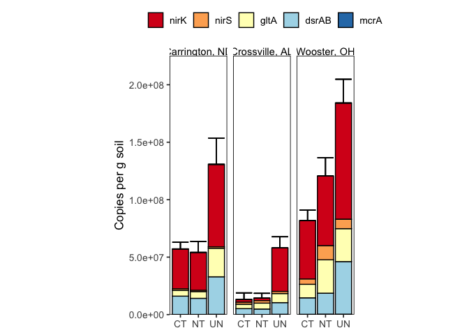<!-- -->

``` r
total_anaerobe
```

    ## # A tibble: 48 × 7
    ## # Groups:   site, till, amend, landscape_position [17]
    ##    site  till  amend landscape_position   rep anaerobe_copies_per_g count
    ##    <chr> <chr> <chr> <chr>              <dbl>                 <dbl> <int>
    ##  1 CREC  CT    A     <NA>                   1             58127300.     5
    ##  2 CREC  CT    A     <NA>                   2             63251238.     5
    ##  3 CREC  CT    A     <NA>                   3             84726515.     5
    ##  4 CREC  CT    U     <NA>                   1             49591671.     5
    ##  5 CREC  CT    U     <NA>                   2             64090647.     5
    ##  6 CREC  CT    U     <NA>                   3             57761702.     5
    ##  7 CREC  MT    U     <NA>                   1             43449404.     5
    ##  8 CREC  MT    U     <NA>                   2             62898705.     5
    ##  9 CREC  MT    U     <NA>                   3             78703568.     5
    ## 10 CREC  NT    A     <NA>                   1            119073250.     5
    ## # … with 38 more rows

### Statistics - total anaerobe

#### total anaerobe - all sites

**Normality:** We can’t know if WO-UN-U is normal because n = 2. Treat
as non-normal.

``` r
total_anaerobe %>% 
  filter(site != "GR", till != "MT", amend == "U") %>%
  filter(!(site == "WO" & till == "UN" )) %>%  #excluding n = 2 group
  group_by(site, till, amend) %>% 
  summarise(
    normality_p = shapiro.test(anaerobe_copies_per_g)$p.value
  ) %>%
  arrange(normality_p)
```

    ## # A tibble: 8 × 4
    ## # Groups:   site, till [8]
    ##   site  till  amend normality_p
    ##   <chr> <chr> <chr>       <dbl>
    ## 1 CREC  UN    U          0.0752
    ## 2 CREC  NT    U          0.250 
    ## 3 SM    UN    U          0.423 
    ## 4 SM    CT    U          0.588 
    ## 5 WO    CT    U          0.683 
    ## 6 WO    NT    U          0.723 
    ## 7 SM    NT    U          0.804 
    ## 8 CREC  CT    U          0.860

**Variances:** Variances are not equal

``` r
bartlett.test(
  anaerobe_copies_per_g ~ interaction(site, till),
  data = 
    total_anaerobe %>% 
    filter(site != "GR", till != "MT", amend == "U")
)
```

    ## 
    ##  Bartlett test of homogeneity of variances
    ## 
    ## data:  anaerobe_copies_per_g by interaction(site, till)
    ## Bartlett's K-squared = 16.814, df = 8, p-value = 0.0321

**Statistics:** Kruskal Wallis

``` r
kruskal.test(
  anaerobe_copies_per_g ~ interaction(site, till),
  data = total_anaerobe %>%
    filter(site != "GR", till != "MT", amend == "U")
)
```

    ## 
    ##  Kruskal-Wallis rank sum test
    ## 
    ## data:  anaerobe_copies_per_g by interaction(site, till)
    ## Kruskal-Wallis chi-squared = 22.416, df = 8, p-value = 0.004201

``` r
dunn_anaerobe_all_sites <- 
  dunnTest(
    anaerobe_copies_per_g ~ interaction(site, till),
    data = total_anaerobe %>%
      filter(site != "GR", till != "MT", amend == "U"),
      method = "bh"
  )

dunn_all_pt <- dunn_anaerobe_all_sites$res

cldList(comparison = dunn_all_pt$Comparison,
        p.value    = dunn_all_pt$P.adj,
        threshold  = 0.05,
        print.comp = TRUE
        )
```

    ## 
    ##  
    ##                     Comparisons    p.value Value Threshold
    ## CREC.CT-CREC.NT CREC.CT-CREC.NT 0.99816616 FALSE      0.05
    ## CREC.CT-CREC.UN CREC.CT-CREC.UN 0.30383391 FALSE      0.05
    ## CREC.NT-CREC.UN CREC.NT-CREC.UN 0.30271729 FALSE      0.05
    ## CREC.CT-SM.CT     CREC.CT-SM.CT 0.37642061 FALSE      0.05
    ## CREC.NT-SM.CT     CREC.NT-SM.CT 0.37775761 FALSE      0.05
    ## CREC.UN-SM.CT     CREC.UN-SM.CT 0.03891185  TRUE      0.05
    ## CREC.CT-SM.NT     CREC.CT-SM.NT 0.36033265 FALSE      0.05
    ## CREC.NT-SM.NT     CREC.NT-SM.NT 0.39319469 FALSE      0.05
    ## CREC.UN-SM.NT     CREC.UN-SM.NT 0.04959687  TRUE      0.05
    ## SM.CT-SM.NT         SM.CT-SM.NT 1.00000000 FALSE      0.05
    ## CREC.CT-SM.UN     CREC.CT-SM.UN 0.95743229 FALSE      0.05
    ## CREC.NT-SM.UN     CREC.NT-SM.UN 0.98187764 FALSE      0.05
    ## CREC.UN-SM.UN     CREC.UN-SM.UN 0.31667581 FALSE      0.05
    ## SM.CT-SM.UN         SM.CT-SM.UN 0.37929752 FALSE      0.05
    ## SM.NT-SM.UN         SM.NT-SM.UN 0.36414476 FALSE      0.05
    ## CREC.CT-WO.CT     CREC.CT-WO.CT 0.42994188 FALSE      0.05
    ## CREC.NT-WO.CT     CREC.NT-WO.CT 0.39349751 FALSE      0.05
    ## CREC.UN-WO.CT     CREC.UN-WO.CT 0.73272082 FALSE      0.05
    ## SM.CT-WO.CT         SM.CT-WO.CT 0.11238606 FALSE      0.05
    ## SM.NT-WO.CT         SM.NT-WO.CT 0.11172020 FALSE      0.05
    ## SM.UN-WO.CT         SM.UN-WO.CT 0.44889116 FALSE      0.05
    ## CREC.CT-WO.NT     CREC.CT-WO.NT 0.31280157 FALSE      0.05
    ## CREC.NT-WO.NT     CREC.NT-WO.NT 0.29398192 FALSE      0.05
    ## CREC.UN-WO.NT     CREC.UN-WO.NT 0.98478749 FALSE      0.05
    ## SM.CT-WO.NT         SM.CT-WO.NT 0.03967750  TRUE      0.05
    ## SM.NT-WO.NT         SM.NT-WO.NT 0.05604457 FALSE      0.05
    ## SM.UN-WO.NT         SM.UN-WO.NT 0.32408951 FALSE      0.05
    ## WO.CT-WO.NT         WO.CT-WO.NT 0.71220868 FALSE      0.05
    ## CREC.CT-WO.UN     CREC.CT-WO.UN 0.15285273 FALSE      0.05
    ## CREC.NT-WO.UN     CREC.NT-WO.UN 0.13452207 FALSE      0.05
    ## CREC.UN-WO.UN     CREC.UN-WO.UN 0.62843641 FALSE      0.05
    ## SM.CT-WO.UN         SM.CT-WO.UN 0.03178421  TRUE      0.05
    ## SM.NT-WO.UN         SM.NT-WO.UN 0.05398281 FALSE      0.05
    ## SM.UN-WO.UN         SM.UN-WO.UN 0.15566111 FALSE      0.05
    ## WO.CT-WO.UN         WO.CT-WO.UN 0.40992935 FALSE      0.05
    ## WO.NT-WO.UN         WO.NT-WO.UN 0.64458504 FALSE      0.05
    ## 
    ## 

    ##     Group Letter MonoLetter
    ## 1 CREC.CT    abc        abc
    ## 2 CREC.NT    abc        abc
    ## 3 CREC.UN      a        a  
    ## 4   SM.CT      b         b 
    ## 5   SM.NT     bc         bc
    ## 6   SM.UN    abc        abc
    ## 7   WO.CT    abc        abc
    ## 8   WO.NT     ac        a c
    ## 9   WO.UN     ac        a c

#### total anaerobe - CREC

**Normality:** all approximately normal

``` r
total_anaerobe %>% 
  filter(site == "CREC", amend == "U") %>%
  group_by(site, till, amend) %>% 
  summarise(
    normality_p = shapiro.test(anaerobe_copies_per_g)$p.value
  ) %>%
  arrange(normality_p)
```

    ## # A tibble: 4 × 4
    ## # Groups:   site, till [4]
    ##   site  till  amend normality_p
    ##   <chr> <chr> <chr>       <dbl>
    ## 1 CREC  UN    U          0.0752
    ## 2 CREC  NT    U          0.250 
    ## 3 CREC  CT    U          0.860 
    ## 4 CREC  MT    U          0.886

**Variances:** Variances are barely equal

``` r
bartlett.test(
  anaerobe_copies_per_g ~ till,
  data = total_anaerobe %>% 
  filter(site == "CREC", amend == "U")
)
```

    ## 
    ##  Bartlett test of homogeneity of variances
    ## 
    ## data:  anaerobe_copies_per_g by till
    ## Bartlett's K-squared = 7.3615, df = 3, p-value = 0.06122

**Statistics:** ANOVA

``` r
crec_anaer_aov <- 
  aov(
    anaerobe_copies_per_g ~ till,
    data = total_anaerobe %>% 
      filter(site == "CREC", amend == "U")
  ) 

crec_anaer_aov %>% summary()
```

    ##             Df    Sum Sq   Mean Sq F value Pr(>F)  
    ## till         3 1.067e+16 3.555e+15   4.532 0.0388 *
    ## Residuals    8 6.276e+15 7.844e+14                 
    ## ---
    ## Signif. codes:  0 '***' 0.001 '**' 0.01 '*' 0.05 '.' 0.1 ' ' 1

``` r
TukeyHSD(crec_anaer_aov)
```

    ##   Tukey multiple comparisons of means
    ##     95% family-wise confidence level
    ## 
    ## Fit: aov(formula = anaerobe_copies_per_g ~ till, data = total_anaerobe %>% filter(site == "CREC", amend == "U"))
    ## 
    ## $till
    ##           diff       lwr       upr     p adj
    ## MT-CT  4535886 -68696864  77768635 0.9970048
    ## NT-CT -3011545 -76244294  70221205 0.9991134
    ## UN-CT 69080488  -4152261 142313238 0.0645901
    ## NT-MT -7547430 -80780180  65685320 0.9866798
    ## UN-MT 64544603  -8688147 137777353 0.0854789
    ## UN-NT 72092033  -1140717 145324783 0.0536380

#### total anaerobe - SM

**Normality:** all approximately normal

``` r
total_anaerobe %>% 
  filter(site == "SM", amend == "U") %>%
  group_by(site, till, amend) %>% 
  summarise(
    normality_p = shapiro.test(anaerobe_copies_per_g)$p.value
  ) %>%
  arrange(normality_p)
```

    ## # A tibble: 3 × 4
    ## # Groups:   site, till [3]
    ##   site  till  amend normality_p
    ##   <chr> <chr> <chr>       <dbl>
    ## 1 SM    UN    U           0.423
    ## 2 SM    CT    U           0.588
    ## 3 SM    NT    U           0.804

**Variances:** Variances are equal

``` r
bartlett.test(
  anaerobe_copies_per_g ~ till,
  data = total_anaerobe %>% 
  filter(site == "SM", amend == "U")
)
```

    ## 
    ##  Bartlett test of homogeneity of variances
    ## 
    ## data:  anaerobe_copies_per_g by till
    ## Bartlett's K-squared = 1.5631, df = 2, p-value = 0.4577

**Statistics:** ANOVA

``` r
sm_anaer_aov <-
  aov(
    anaerobe_copies_per_g ~ till,
    data = total_anaerobe %>% 
      filter(site == "SM", amend == "U")
  ) 

sm_anaer_aov %>% summary()
```

    ##             Df    Sum Sq   Mean Sq F value  Pr(>F)   
    ## till         2 3.929e+15 1.964e+15   14.03 0.00547 **
    ## Residuals    6 8.400e+14 1.400e+14                   
    ## ---
    ## Signif. codes:  0 '***' 0.001 '**' 0.01 '*' 0.05 '.' 0.1 ' ' 1

``` r
TukeyHSD(sm_anaer_aov)
```

    ##   Tukey multiple comparisons of means
    ##     95% family-wise confidence level
    ## 
    ## Fit: aov(formula = anaerobe_copies_per_g ~ till, data = total_anaerobe %>% filter(site == "SM", amend == "U"))
    ## 
    ## $till
    ##              diff       lwr      upr     p adj
    ## NT-CT    37301.17 -29605329 29679932 0.9999918
    ## UN-CT 44340203.23  14697573 73982834 0.0088871
    ## UN-NT 44302902.06  14660272 73945533 0.0089226

#### total anaerobe - WO

**Normality:**

``` r
total_anaerobe %>% 
  filter(site == "WO", amend == "U", till != "UN") %>%
  group_by(site, till, amend) %>% 
  summarise(
    normality_p = shapiro.test(sqrt(anaerobe_copies_per_g))$p.value
  ) %>%
  arrange(normality_p)
```

    ## # A tibble: 2 × 4
    ## # Groups:   site, till [2]
    ##   site  till  amend normality_p
    ##   <chr> <chr> <chr>       <dbl>
    ## 1 WO    CT    U           0.728
    ## 2 WO    NT    U           0.758

Assume normality for WO-UN

**Variances:** Equal

``` r
bartlett.test(
    anaerobe_copies_per_g ~ till,
  data = total_anaerobe %>% 
  filter(site == "WO", amend == "U")
)
```

    ## 
    ##  Bartlett test of homogeneity of variances
    ## 
    ## data:  anaerobe_copies_per_g by till
    ## Bartlett's K-squared = 3.1301, df = 2, p-value = 0.2091

**Statistics:** ANOVA

``` r
wo_aov <- 
aov(  
  anaerobe_copies_per_g ~ till,
  data = total_anaerobe %>% 
    filter(site == "WO", amend == "U")
)

summary(wo_aov)
```

    ##             Df    Sum Sq   Mean Sq F value  Pr(>F)   
    ## till         2 1.052e+16 5.261e+15   25.11 0.00247 **
    ## Residuals    5 1.048e+15 2.095e+14                   
    ## ---
    ## Signif. codes:  0 '***' 0.001 '**' 0.01 '*' 0.05 '.' 0.1 ' ' 1

``` r
TukeyHSD(wo_aov)
```

    ##   Tukey multiple comparisons of means
    ##     95% family-wise confidence level
    ## 
    ## Fit: aov(formula = anaerobe_copies_per_g ~ till, data = total_anaerobe %>% filter(site == "WO", amend == "U"))
    ## 
    ## $till
    ##           diff      lwr       upr     p adj
    ## NT-CT 40192915  1737368  78648461 0.0427811
    ## UN-CT 93572559 50577951 136567167 0.0020320
    ## UN-NT 53379644 10385036  96374252 0.0224704

## Tillage - Carrington only

### Figure - stacked bar

``` r
all_ddpcr_data %>% 
  group_by(site, till, amend, landscape_position, target_gene) %>% 
  summarise(
    avg_copies_per_g = mean(copies_per_g, na.rm = TRUE),
    se_copies_per_g = sd(copies_per_g, na.rm = TRUE) / sqrt(n()),
  ) %>% 
  filter(site == "CREC", amend == "U") %>%
  mutate(
    across(
      target_gene, 
      ~factor(
        ., 
        levels = c("nirK", "nirS", "gltA", "dsrAB", "mcrA"),
        labels = c("nirK", "nirS", "gltA", "dsrAB", "mcrA")
      )
    )
  ) %>% 
  left_join(errors, by = c("site", "till", "amend", "landscape_position")) %>% 
  ggplot(aes(x = till, fill = target_gene)) + 
  geom_col(aes(y = avg_copies_per_g), position = "stack", color = "black") +
  geom_errorbar(
    aes(y = sum_copies, ymin = sum_copies, ymax = sum_copies + sum_se)
  ) +
  scale_fill_brewer(palette = "RdYlBu") +
  scale_y_continuous(labels = scientific) +
  theme_bw() + 
  my_theme() +
  theme(
    aspect.ratio = 2
  ) +
  labs(
    y = "Copies per g soil",
    x = NULL
  )
```

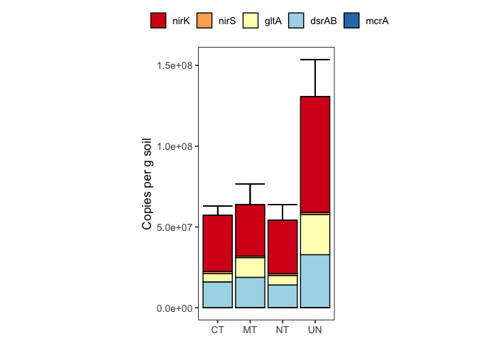<!-- -->

### Figure - faceted

``` r
all_ddpcr_data %>% 
  group_by(site, till, amend, landscape_position, target_gene) %>% 
  summarise(
    avg_copies_per_g = mean(copies_per_g, na.rm = TRUE),
    se_copies_per_g = sd(copies_per_g, na.rm = TRUE) / sqrt(n())
  ) %>% 
  filter(site == "CREC", amend == "U") %>% 
  mutate(
    across(
      target_gene, 
      ~factor(
        ., 
        levels = c("nirK", "nirS", "gltA", "dsrAB", "mcrA"),
        labels = c("nirK", "nirS", "gltA", "dsrAB", "mcrA")
      )
    )
  ) %>% 
  ggplot(aes(y = avg_copies_per_g, x = till, fill = target_gene)) + 
  geom_col(position = "dodge", color = "black") +
  geom_errorbar(
    aes(
      ymin = avg_copies_per_g,
      ymax = avg_copies_per_g + se_copies_per_g
    ),
    position = "dodge"
  ) +
  scale_fill_brewer(palette = "RdYlBu") +
  scale_y_continuous(labels = scientific) +
  facet_grid(
    rows = vars(target_gene), 
    scales = "free",
    labeller = labeller(site = site_labels)
  ) + 
  theme_bw() + 
  my_theme() +
  theme(
    aspect.ratio = 0.5,
    legend.position = "none",
    strip.text.y = element_text(face = "italic")
  ) +
  labs(
    y = "Copies per g soil",
    x = NULL
  )
```

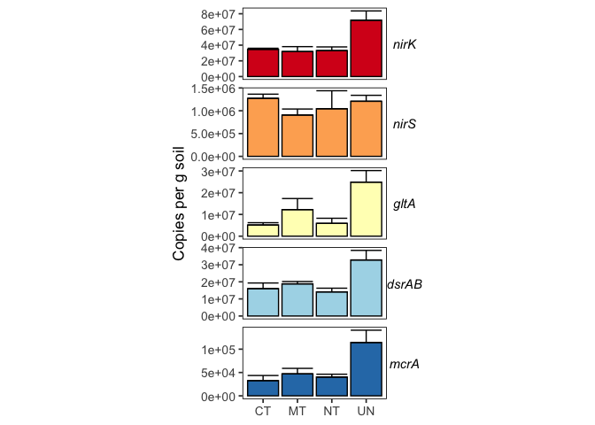<!-- -->

# Absolute Abundance: Landscape Position

## Figure - faceted

``` r
all_ddpcr_data %>% 
  group_by(site, till, amend, landscape_position, target_gene) %>% 
  summarise(
    avg_copies_per_g = mean(copies_per_g, na.rm = TRUE),
    se_copies_per_g = sd(copies_per_g, na.rm = TRUE) / sqrt(n())
  ) %>% 
  filter(site == "GR") %>% 
  mutate(
    across(
      target_gene, 
      ~factor(
        ., 
        levels = c("nirK", "nirS", "gltA", "dsrAB", "mcrA"),
        labels = c("nirK", "nirS", "gltA", "dsrAB", "mcrA")
      )
    )
  ) %>% 
  ggplot(aes(y = avg_copies_per_g, x = landscape_position, fill = target_gene)) + 
  geom_col(position = "dodge", color = "black") +
  geom_errorbar(
    aes(
      ymin = avg_copies_per_g,
      ymax = avg_copies_per_g + se_copies_per_g
    ),
    position = "dodge"
  ) +
  scale_fill_brewer(palette = "RdYlBu") +
  scale_y_continuous(labels = scientific) +
  facet_grid(
    rows = vars(target_gene), 
    scales = "free"
  ) + 
  theme_bw() + 
  my_theme() +
  theme(
    legend.position = "none",
    strip.text.y = element_text(face = "italic", size = 14),
    aspect.ratio = 2,
    axis.text.x = element_text(angle = 45, hjust = 1, size = 13),
    axis.text.y = element_text(size = 13),
    axis.title.y = element_text(size = 16)
  ) +
  labs(
    y = "Copies per g soil",
    x = NULL
  )
```

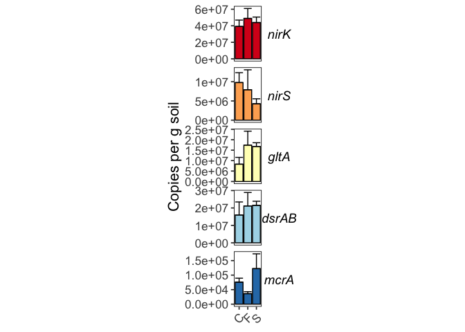<!-- -->

## Figure - stacked bars

``` r
all_ddpcr_data %>% 
  group_by(site, till, amend, landscape_position, target_gene) %>% 
  summarise(
    avg_copies_per_g = mean(copies_per_g, na.rm = TRUE),
    se_copies_per_g = sd(copies_per_g, na.rm = TRUE) / sqrt(n()),
  ) %>% 
  filter(site == "GR") %>%
  mutate(
    across(
      target_gene, 
      ~factor(
        ., 
        levels = c("nirK", "nirS", "gltA", "dsrAB", "mcrA"),
        labels = c("nirK", "nirS", "gltA", "dsrAB", "mcrA")
      )
    )
  ) %>% 
  left_join(errors, by = c("site", "till", "amend", "landscape_position")) %>% 
  ggplot(aes(x = landscape_position, fill = target_gene)) + 
  geom_col(aes(y = avg_copies_per_g), position = "stack", color = "black") +
  geom_errorbar(
    aes(y = sum_copies, ymin = sum_copies, ymax = sum_copies + sum_se)
  ) +
  scale_fill_brewer(palette = "RdYlBu") +
  scale_y_continuous(labels = scientific) +
  scale_x_discrete(
    labels = c("C" = "Channel", "F" = "Footslope", "S" = "Shoulder")
  ) +
  theme_bw() + 
  my_theme() +
  theme(
    aspect.ratio = 2,
    axis.text.x = element_text(angle = 45, hjust = 1, size = 13),
    axis.text.y = element_text(size = 13),
    axis.title.y = element_text(size = 16),
    legend.text = element_text(size = 13)
  ) +
  labs(
    y = "Copies per g soil",
    x = NULL
  )
```

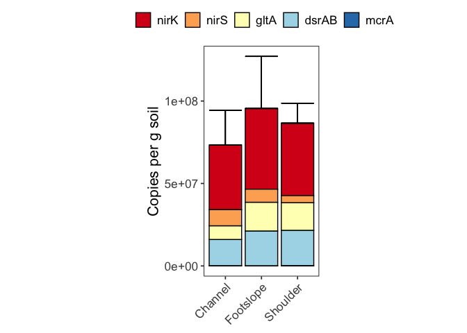<!-- -->

# Absolute Abundance - Manure amendments at Carrington

## Figure - stacked bars

``` r
all_ddpcr_data %>% 
  group_by(site, till, amend, landscape_position, target_gene) %>% 
  summarise(
    avg_copies_per_g = mean(copies_per_g, na.rm = TRUE),
    se_copies_per_g = sd(copies_per_g, na.rm = TRUE) / sqrt(n()),
  ) %>% 
  filter(site == "CREC", till %in% c("CT", "NT")) %>%
  mutate(
    across(
      target_gene, 
      ~factor(
        ., 
        levels = c("nirK", "nirS", "gltA", "dsrAB", "mcrA"),
        labels = c("nirK", "nirS", "gltA", "dsrAB", "mcrA")
      )
    )
  ) %>% 
  left_join(errors, by = c("site", "till", "amend", "landscape_position")) %>% 
  ggplot(aes(x = amend, fill = target_gene)) + 
  geom_col(aes(y = avg_copies_per_g), position = "stack", color = "black") +
  geom_errorbar(
    aes(y = sum_copies, ymin = sum_copies, ymax = sum_copies + sum_se)
  ) +
  scale_fill_brewer(palette = "RdYlBu") +
  scale_y_continuous(labels = scientific) +
  facet_grid(
    cols = vars(till), 
    scales = "free", 
    labeller = labeller(site = site_labels)
  ) + 
  theme_bw() + 
  my_theme() +
  theme(
    aspect.ratio = 3
  ) +
  labs(
    y = "Copies per g soil",
    x = NULL
  )
```

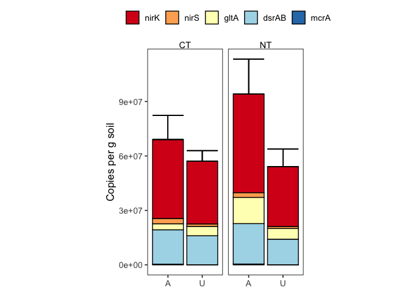<!-- -->

### Statistics

#### Check normality

``` r
total_anaerobe %>% 
  filter(site == "CREC") %>% 
  group_by(site, till, amend) %>% 
  summarise(
    normality_p = shapiro.test(anaerobe_copies_per_g)$p.value
  ) %>% 
  arrange(normality_p)
```

    ## # A tibble: 6 × 4
    ## # Groups:   site, till [4]
    ##   site  till  amend normality_p
    ##   <chr> <chr> <chr>       <dbl>
    ## 1 CREC  UN    U          0.0752
    ## 2 CREC  NT    U          0.250 
    ## 3 CREC  CT    A          0.349 
    ## 4 CREC  NT    A          0.567 
    ## 5 CREC  CT    U          0.860 
    ## 6 CREC  MT    U          0.886

#### Test for equal variances

``` r
leveneTest(
  anaerobe_copies_per_g~amend*till,
  data = total_anaerobe %>% filter(site == "CREC", till %in% c("CT", "NT"))
)
```

    ## Levene's Test for Homogeneity of Variance (center = median)
    ##       Df F value Pr(>F)
    ## group  3  0.4821 0.7038
    ##        8

#### test for differences in amended vs. unamended soils

Will use t-test for differences between amended and unamended

**CT**

``` r
t.test(
  x = 
    total_anaerobe %>% 
    filter(site == "CREC", till == "CT", amend == "A") %>% 
    pull(anaerobe_copies_per_g),
  y = 
    total_anaerobe %>% 
    filter(site == "CREC", till == "CT", amend == "U") %>% 
    pull(anaerobe_copies_per_g),
  alternative = c("greater")
)
```

    ## 
    ##  Welch Two Sample t-test
    ## 
    ## data:  total_anaerobe %>% filter(site == "CREC", till == "CT", amend == "A") %>% pull(anaerobe_copies_per_g) and total_anaerobe %>% filter(site == "CREC", till == "CT", amend == "U") %>% pull(anaerobe_copies_per_g)
    ## t = 1.2606, df = 2.9914, p-value = 0.1484
    ## alternative hypothesis: true difference in means is greater than 0
    ## 95 percent confidence interval:
    ##  -10040380       Inf
    ## sample estimates:
    ## mean of x mean of y 
    ##  68701684  57148007

**NT**

``` r
t.test(
  x = 
    total_anaerobe %>% 
    filter(site == "CREC", till == "NT", amend == "A") %>% 
    pull(anaerobe_copies_per_g),
  y = 
    total_anaerobe %>% 
    filter(site == "CREC", till == "NT", amend == "U") %>% 
    pull(anaerobe_copies_per_g),
  alternative = c("greater") #this really depends! 
)
```

    ## 
    ##  Welch Two Sample t-test
    ## 
    ## data:  total_anaerobe %>% filter(site == "CREC", till == "NT", amend == "A") %>% pull(anaerobe_copies_per_g) and total_anaerobe %>% filter(site == "CREC", till == "NT", amend == "U") %>% pull(anaerobe_copies_per_g)
    ## t = 2.876, df = 2.7851, p-value = 0.03482
    ## alternative hypothesis: true difference in means is greater than 0
    ## 95 percent confidence interval:
    ##  6281406     Inf
    ## sample estimates:
    ## mean of x mean of y 
    ##  94572959  54136462

## Figure - faceted

``` r
all_ddpcr_data %>% 
  group_by(site, till, amend, landscape_position, target_gene) %>% 
  summarise(
    avg_copies_per_g = mean(copies_per_g, na.rm = TRUE),
    se_copies_per_g = sd(copies_per_g, na.rm = TRUE) / sqrt(n())
  ) %>% 
  filter(site == "CREC", till %in% c("CT", "NT")) %>% 
  mutate(
    across(
      target_gene, 
      ~factor(
        ., 
        levels = c("nirK", "nirS", "gltA", "dsrAB", "mcrA"),
        labels = c("nirK", "nirS", "gltA", "dsrAB", "mcrA")
      )
    )
  ) %>% 
  ggplot(aes(y = avg_copies_per_g, x = amend, fill = target_gene)) + 
  geom_col(position = "dodge", color = "black") +
  geom_errorbar(
    aes(
      ymin = avg_copies_per_g,
      ymax = avg_copies_per_g + se_copies_per_g
    ),
    position = "dodge"
  ) +
  scale_fill_brewer(palette = "RdYlBu") +
  scale_y_continuous(labels = scientific) +
  facet_grid(
    cols = vars(till), 
    rows = vars(target_gene), 
    scales = "free",
    labeller = labeller(site = site_labels)
  ) + 
  theme_bw() + 
  my_theme() +
  theme(
    aspect.ratio = 1,
    legend.position = "none",
    strip.text.y = element_text(face = "italic")
  ) +
  labs(
    y = "Copies per g soil",
    x = NULL
  )
```

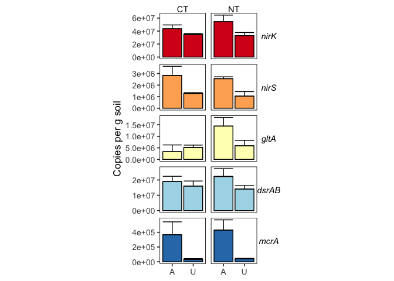<!-- -->

### nirK

**Normality:** Approximately normal

``` r
all_ddpcr_data %>% 
  filter(
    site == "CREC", 
    till %in% c("CT", "NT"), 
    target_gene == "nirK"
  ) %>%
  group_by(site, till, amend, target_gene) %>% 
  summarise(
    normality_p = shapiro.test(log(copies_per_g))$p.value
  ) %>%
  arrange(target_gene, normality_p)
```

    ## # A tibble: 4 × 5
    ## # Groups:   site, till, amend [4]
    ##   site  till  amend target_gene normality_p
    ##   <chr> <chr> <chr> <chr>             <dbl>
    ## 1 CREC  NT    U     nirK             0.0504
    ## 2 CREC  CT    A     nirK             0.483 
    ## 3 CREC  CT    U     nirK             0.490 
    ## 4 CREC  NT    A     nirK             0.689

#### CT

**Variances**

``` r
bartlett.test( 
  copies_per_g ~ amend,
  data = 
    all_ddpcr_data %>% 
    filter(site == "CREC", target_gene == "nirK", till == "CT")
) 
```

    ## 
    ##  Bartlett test of homogeneity of variances
    ## 
    ## data:  copies_per_g by amend
    ## Bartlett's K-squared = 3.3213, df = 1, p-value = 0.06839

**Statistics:** t-test

``` r
t.test(
  x = 
    all_ddpcr_data %>% 
    filter(
      site == "CREC", 
      till == "CT", 
      amend == "A", 
      target_gene == "nirK"
    ) %>% 
    pull(copies_per_g),
  y = 
    all_ddpcr_data %>% 
    filter(
      site == "CREC", 
      till == "CT", 
      amend == "U",
      target_gene == "nirK"
    ) %>% 
    pull(copies_per_g),
  alternative = c("greater"),
  var.equal = TRUE
)
```

    ## 
    ##  Two Sample t-test
    ## 
    ## data:  all_ddpcr_data %>% filter(site == "CREC", till == "CT", amend == "A", target_gene == "nirK") %>% pull(copies_per_g) and all_ddpcr_data %>% filter(site == "CREC", till == "CT", amend == "U", target_gene == "nirK") %>% pull(copies_per_g)
    ## t = 1.9057, df = 6, p-value = 0.05267
    ## alternative hypothesis: true difference in means is greater than 0
    ## 95 percent confidence interval:
    ##  -175210.4       Inf
    ## sample estimates:
    ## mean of x mean of y 
    ##  43582608  34676245

#### NT

**Variances**

``` r
bartlett.test( 
  copies_per_g ~ amend,
  data = 
    all_ddpcr_data %>% 
    filter(site == "CREC", target_gene == "nirK", till == "NT")
) 
```

    ## 
    ##  Bartlett test of homogeneity of variances
    ## 
    ## data:  copies_per_g by amend
    ## Bartlett's K-squared = 0.86575, df = 1, p-value = 0.3521

**Statistics:** t-test

``` r
t.test(
  x = 
    all_ddpcr_data %>% 
    filter(
      site == "CREC", 
      till == "NT", 
      amend == "A", 
      target_gene == "nirK"
    ) %>% 
    pull(copies_per_g),
  y = 
    all_ddpcr_data %>% 
    filter(
      site == "CREC", 
      till == "NT", 
      amend == "U",
      target_gene == "nirK"
    ) %>% 
    pull(copies_per_g),
  alternative = c("greater"),
  var.equal = TRUE
)
```

    ## 
    ##  Two Sample t-test
    ## 
    ## data:  all_ddpcr_data %>% filter(site == "CREC", till == "NT", amend == "A", target_gene == "nirK") %>% pull(copies_per_g) and all_ddpcr_data %>% filter(site == "CREC", till == "NT", amend == "U", target_gene == "nirK") %>% pull(copies_per_g)
    ## t = 1.918, df = 4, p-value = 0.06378
    ## alternative hypothesis: true difference in means is greater than 0
    ## 95 percent confidence interval:
    ##  -2386339      Inf
    ## sample estimates:
    ## mean of x mean of y 
    ##  54464608  33064179

### nirS

**Normality**

``` r
all_ddpcr_data %>% 
  filter(
    site == "CREC", 
    till %in% c("CT", "NT"), 
    target_gene == "nirS"
  ) %>%
  group_by(site, till, amend, target_gene) %>% 
  summarise(
    normality_p = shapiro.test(copies_per_g)$p.value
  ) %>%
  arrange(target_gene, normality_p)
```

    ## # A tibble: 4 × 5
    ## # Groups:   site, till, amend [4]
    ##   site  till  amend target_gene normality_p
    ##   <chr> <chr> <chr> <chr>             <dbl>
    ## 1 CREC  NT    U     nirS              0.331
    ## 2 CREC  CT    U     nirS              0.744
    ## 3 CREC  NT    A     nirS              0.862
    ## 4 CREC  CT    A     nirS              0.928

#### CT

**Variances**

``` r
bartlett.test( 
  copies_per_g ~ amend,
  data = 
    all_ddpcr_data %>% 
    filter(site == "CREC", target_gene == "nirS", till == "CT")
) 
```

    ## 
    ##  Bartlett test of homogeneity of variances
    ## 
    ## data:  copies_per_g by amend
    ## Bartlett's K-squared = 5.5188, df = 1, p-value = 0.01881

**Statistics:** t-test

``` r
t.test(
  x = 
    all_ddpcr_data %>% 
    filter(
      site == "CREC", 
      till == "CT", 
      amend == "A", 
      target_gene == "nirS"
    ) %>% 
    pull(copies_per_g),
  y = 
    all_ddpcr_data %>% 
    filter(
      site == "CREC", 
      till == "CT", 
      amend == "U",
      target_gene == "nirS"
    ) %>% 
    pull(copies_per_g),
  alternative = c("greater"),
  var.equal = FALSE
)
```

    ## 
    ##  Welch Two Sample t-test
    ## 
    ## data:  all_ddpcr_data %>% filter(site == "CREC", till == "CT", amend == "A", target_gene == "nirS") %>% pull(copies_per_g) and all_ddpcr_data %>% filter(site == "CREC", till == "CT", amend == "U", target_gene == "nirS") %>% pull(copies_per_g)
    ## t = 1.9699, df = 3.0799, p-value = 0.07054
    ## alternative hypothesis: true difference in means is greater than 0
    ## 95 percent confidence interval:
    ##  -285064.2       Inf
    ## sample estimates:
    ## mean of x mean of y 
    ##   2837212   1272076

#### NT

**Variances**

``` r
bartlett.test( 
  copies_per_g ~ amend,
  data = 
    all_ddpcr_data %>% 
    filter(site == "CREC", target_gene == "nirS", till == "NT")
) 
```

    ## 
    ##  Bartlett test of homogeneity of variances
    ## 
    ## data:  copies_per_g by amend
    ## Bartlett's K-squared = 1.0879, df = 1, p-value = 0.2969

**Statistics**

``` r
t.test(
  x = 
    all_ddpcr_data %>% 
    filter(
      site == "CREC", 
      till == "NT", 
      amend == "A", 
      target_gene == "nirS"
    ) %>% 
    pull(copies_per_g),
  y = 
    all_ddpcr_data %>% 
    filter(
      site == "CREC", 
      till == "NT", 
      amend == "U",
      target_gene == "nirS"
    ) %>% 
    pull(copies_per_g),
  alternative = c("greater"),
  var.equal = TRUE
)
```

    ## 
    ##  Two Sample t-test
    ## 
    ## data:  all_ddpcr_data %>% filter(site == "CREC", till == "NT", amend == "A", target_gene == "nirS") %>% pull(copies_per_g) and all_ddpcr_data %>% filter(site == "CREC", till == "NT", amend == "U", target_gene == "nirS") %>% pull(copies_per_g)
    ## t = 3.9444, df = 5, p-value = 0.005456
    ## alternative hypothesis: true difference in means is greater than 0
    ## 95 percent confidence interval:
    ##  738773.1      Inf
    ## sample estimates:
    ## mean of x mean of y 
    ##   2553893   1043546

### gltA

**Normality**

``` r
all_ddpcr_data %>% 
  filter(
    site == "CREC", 
    till %in% c("CT", "NT"), 
    target_gene == "gltA"
  ) %>%
  group_by(site, till, amend, target_gene) %>% 
  summarise(
    normality_p = shapiro.test(copies_per_g)$p.value
  ) %>%
  arrange(target_gene, normality_p)
```

    ## # A tibble: 4 × 5
    ## # Groups:   site, till, amend [4]
    ##   site  till  amend target_gene normality_p
    ##   <chr> <chr> <chr> <chr>             <dbl>
    ## 1 CREC  CT    U     gltA              0.126
    ## 2 CREC  CT    A     gltA              0.135
    ## 3 CREC  NT    A     gltA              0.292
    ## 4 CREC  NT    U     gltA              0.582

#### CT

**Variances**

``` r
bartlett.test( 
  copies_per_g ~ amend,
  data = 
    all_ddpcr_data %>% 
    filter(site == "CREC", target_gene == "gltA", till == "CT")
) 
```

    ## 
    ##  Bartlett test of homogeneity of variances
    ## 
    ## data:  copies_per_g by amend
    ## Bartlett's K-squared = 1.5429, df = 1, p-value = 0.2142

**Statistics:** t-test

``` r
t.test(
  x = 
    all_ddpcr_data %>% 
    filter(
      site == "CREC", 
      till == "CT", 
      amend == "A", 
      target_gene == "gltA"
    ) %>% 
    pull(copies_per_g),
  y = 
    all_ddpcr_data %>% 
    filter(
      site == "CREC", 
      till == "CT", 
      amend == "U",
      target_gene == "gltA"
    ) %>% 
    pull(copies_per_g),
  alternative = c("greater"),
  var.equal = TRUE
)
```

    ## 
    ##  Two Sample t-test
    ## 
    ## data:  all_ddpcr_data %>% filter(site == "CREC", till == "CT", amend == "A", target_gene == "gltA") %>% pull(copies_per_g) and all_ddpcr_data %>% filter(site == "CREC", till == "CT", amend == "U", target_gene == "gltA") %>% pull(copies_per_g)
    ## t = -0.66057, df = 5, p-value = 0.7309
    ## alternative hypothesis: true difference in means is greater than 0
    ## 95 percent confidence interval:
    ##  -7376935      Inf
    ## sample estimates:
    ## mean of x mean of y 
    ##   3327595   5148851

#### NT

**Variances**

``` r
bartlett.test( 
  copies_per_g ~ amend,
  data = 
    all_ddpcr_data %>% 
    filter(site == "CREC", target_gene == "gltA", till == "NT")
) 
```

    ## 
    ##  Bartlett test of homogeneity of variances
    ## 
    ## data:  copies_per_g by amend
    ## Bartlett's K-squared = 0.64044, df = 1, p-value = 0.4236

**Statistics:** t-test

``` r
t.test(
  x = 
    all_ddpcr_data %>% 
    filter(
      site == "CREC", 
      till == "NT", 
      amend == "A", 
      target_gene == "gltA"
    ) %>% 
    pull(copies_per_g),
  y = 
    all_ddpcr_data %>% 
    filter(
      site == "CREC", 
      till == "NT", 
      amend == "U",
      target_gene == "gltA"
    ) %>% 
    pull(copies_per_g),
  alternative = c("greater"),
  var.equal = TRUE
)
```

    ## 
    ##  Two Sample t-test
    ## 
    ## data:  all_ddpcr_data %>% filter(site == "CREC", till == "NT", amend == "A", target_gene == "gltA") %>% pull(copies_per_g) and all_ddpcr_data %>% filter(site == "CREC", till == "NT", amend == "U", target_gene == "gltA") %>% pull(copies_per_g)
    ## t = 1.766, df = 5, p-value = 0.06883
    ## alternative hypothesis: true difference in means is greater than 0
    ## 95 percent confidence interval:
    ##  -1204249      Inf
    ## sample estimates:
    ## mean of x mean of y 
    ##  14430261   5892410

### dsrAB

**Normality:** normal

``` r
all_ddpcr_data %>% 
  filter(
    site == "CREC", 
    till %in% c("CT", "NT"), 
    target_gene == "dsrAB"
  ) %>%
  group_by(site, till, amend, target_gene) %>% 
  summarise(
    normality_p = shapiro.test(log(copies_per_g))$p.value
  ) %>%
  arrange(target_gene, normality_p)
```

    ## # A tibble: 4 × 5
    ## # Groups:   site, till, amend [4]
    ##   site  till  amend target_gene normality_p
    ##   <chr> <chr> <chr> <chr>             <dbl>
    ## 1 CREC  NT    A     dsrAB             0.128
    ## 2 CREC  CT    A     dsrAB             0.133
    ## 3 CREC  NT    U     dsrAB             0.676
    ## 4 CREC  CT    U     dsrAB             0.680

#### CT

**Variances**

``` r
bartlett.test( 
  log(copies_per_g) ~ amend,
  data = 
    all_ddpcr_data %>% 
    filter(site == "CREC", target_gene == "dsrAB", till == "CT")
) 
```

    ## 
    ##  Bartlett test of homogeneity of variances
    ## 
    ## data:  log(copies_per_g) by amend
    ## Bartlett's K-squared = 0.10539, df = 1, p-value = 0.7455

**Statistics:** t-test

``` r
t.test(
  x = 
    all_ddpcr_data %>% 
    filter(
      site == "CREC", 
      till == "CT", 
      amend == "A", 
      target_gene == "dsrAB"
    ) %>% 
    mutate(
      log_copies_per_g = log(copies_per_g)
    ) %>% 
    pull(log_copies_per_g),
  y = 
    all_ddpcr_data %>% 
    filter(
      site == "CREC", 
      till == "CT", 
      amend == "U",
      target_gene == "dsrAB"
    ) %>% 
    mutate(
      log_copies_per_g = log(copies_per_g)
    ) %>% 
    pull(log_copies_per_g),
  alternative = c("greater"),
  var.equal = TRUE
)
```

    ## 
    ##  Two Sample t-test
    ## 
    ## data:  all_ddpcr_data %>% filter(site == "CREC", till == "CT", amend == "A", target_gene == "dsrAB") %>% mutate(log_copies_per_g = log(copies_per_g)) %>% pull(log_copies_per_g) and all_ddpcr_data %>% filter(site == "CREC", till == "CT", amend == "U", target_gene == "dsrAB") %>% mutate(log_copies_per_g = log(copies_per_g)) %>% pull(log_copies_per_g)
    ## t = 0.65913, df = 4, p-value = 0.2729
    ## alternative hypothesis: true difference in means is greater than 0
    ## 95 percent confidence interval:
    ##  -0.4123952        Inf
    ## sample estimates:
    ## mean of x mean of y 
    ##  16.72668  16.54211

#### NT

**Variances**

``` r
bartlett.test( 
  log(copies_per_g) ~ amend,
  data = 
    all_ddpcr_data %>% 
    filter(site == "CREC", target_gene == "dsrAB", till == "NT")
) 
```

    ## 
    ##  Bartlett test of homogeneity of variances
    ## 
    ## data:  log(copies_per_g) by amend
    ## Bartlett's K-squared = 0.32749, df = 1, p-value = 0.5671

**Statistics:** t-test

``` r
t.test(
  x = 
    all_ddpcr_data %>% 
    filter(
      site == "CREC", 
      till == "NT", 
      amend == "A", 
      target_gene == "dsrAB"
    ) %>% 
    mutate(
      log_copies_per_g = log(copies_per_g)
    ) %>% 
    pull(log_copies_per_g),
  y = 
    all_ddpcr_data %>% 
    filter(
      site == "CREC", 
      till == "NT", 
      amend == "U",
      target_gene == "dsrAB"
    ) %>% 
    mutate(
      log_copies_per_g = log(copies_per_g)
    ) %>% 
    pull(log_copies_per_g),
  alternative = c("greater"),
  var.equal = TRUE
)
```

    ## 
    ##  Two Sample t-test
    ## 
    ## data:  all_ddpcr_data %>% filter(site == "CREC", till == "NT", amend == "A", target_gene == "dsrAB") %>% mutate(log_copies_per_g = log(copies_per_g)) %>% pull(log_copies_per_g) and all_ddpcr_data %>% filter(site == "CREC", till == "NT", amend == "U", target_gene == "dsrAB") %>% mutate(log_copies_per_g = log(copies_per_g)) %>% pull(log_copies_per_g)
    ## t = 1.5586, df = 5, p-value = 0.08992
    ## alternative hypothesis: true difference in means is greater than 0
    ## 95 percent confidence interval:
    ##  -0.1218655        Inf
    ## sample estimates:
    ## mean of x mean of y 
    ##  16.85444  16.43836

### mcrA

**Normality:** Approximately normal

``` r
all_ddpcr_data %>% 
  filter(
    site == "CREC", 
    till %in% c("CT", "NT"), 
    target_gene == "mcrA"
  ) %>%
  group_by(site, till, amend, target_gene) %>% 
  summarise(
    normality_p = shapiro.test(copies_per_g)$p.value
  ) %>%
  arrange(target_gene, normality_p)
```

    ## # A tibble: 4 × 5
    ## # Groups:   site, till, amend [4]
    ##   site  till  amend target_gene normality_p
    ##   <chr> <chr> <chr> <chr>             <dbl>
    ## 1 CREC  CT    U     mcrA             0.0513
    ## 2 CREC  NT    A     mcrA             0.407 
    ## 3 CREC  CT    A     mcrA             0.545 
    ## 4 CREC  NT    U     mcrA             0.584

#### CT

**Variances:** unequal

``` r
bartlett.test( 
  copies_per_g ~ amend,
  data = 
    all_ddpcr_data %>% 
    filter(site == "CREC", target_gene == "mcrA", till == "CT")
) 
```

    ## 
    ##  Bartlett test of homogeneity of variances
    ## 
    ## data:  copies_per_g by amend
    ## Bartlett's K-squared = 9.2421, df = 1, p-value = 0.002365

**Statistics:** t-test

``` r
t.test(
  x = 
    all_ddpcr_data %>% 
    filter(
      site == "CREC", 
      till == "CT", 
      amend == "A", 
      target_gene == "mcrA"
    ) %>% 
    pull(copies_per_g),
  y = 
    all_ddpcr_data %>% 
    filter(
      site == "CREC", 
      till == "CT", 
      amend == "U",
      target_gene == "mcrA"
    ) %>% 
    pull(copies_per_g),
  alternative = c("greater"),
  var.equal = FALSE
)
```

    ## 
    ##  Welch Two Sample t-test
    ## 
    ## data:  all_ddpcr_data %>% filter(site == "CREC", till == "CT", amend == "A", target_gene == "mcrA") %>% pull(copies_per_g) and all_ddpcr_data %>% filter(site == "CREC", till == "CT", amend == "U", target_gene == "mcrA") %>% pull(copies_per_g)
    ## t = 1.908, df = 2.0158, p-value = 0.09781
    ## alternative hypothesis: true difference in means is greater than 0
    ## 95 percent confidence interval:
    ##  -174308.9       Inf
    ## sample estimates:
    ## mean of x mean of y 
    ## 366326.77  32571.67

#### NT

**Variances**

``` r
bartlett.test( 
  copies_per_g ~ amend,
  data = 
    all_ddpcr_data %>% 
    filter(site == "CREC", target_gene == "mcrA", till == "NT")
) 
```

    ## 
    ##  Bartlett test of homogeneity of variances
    ## 
    ## data:  copies_per_g by amend
    ## Bartlett's K-squared = 8.6926, df = 1, p-value = 0.003195

**Statistics:** t-test

``` r
t.test(
  x = 
    all_ddpcr_data %>% 
    filter(
      site == "CREC", 
      till == "NT", 
      amend == "A", 
      target_gene == "mcrA"
    ) %>% 
    pull(copies_per_g),
  y = 
    all_ddpcr_data %>% 
    filter(
      site == "CREC", 
      till == "NT", 
      amend == "U",
      target_gene == "mcrA"
    ) %>% 
    pull(copies_per_g),
  alternative = c("greater"),
  var.equal = FALSE
)
```

    ## 
    ##  Welch Two Sample t-test
    ## 
    ## data:  all_ddpcr_data %>% filter(site == "CREC", till == "NT", amend == "A", target_gene == "mcrA") %>% pull(copies_per_g) and all_ddpcr_data %>% filter(site == "CREC", till == "NT", amend == "U", target_gene == "mcrA") %>% pull(copies_per_g)
    ## t = 2.7754, df = 3.0116, p-value = 0.03448
    ## alternative hypothesis: true difference in means is greater than 0
    ## 95 percent confidence interval:
    ##  59549.56      Inf
    ## sample estimates:
    ## mean of x mean of y 
    ## 428405.17  40177.66

# Absolute abundance- poultry litter amendments @ Sand Mountain

## Figure - stacked bar

``` r
all_ddpcr_data %>% 
  group_by(site, till, amend, landscape_position, target_gene) %>% 
  summarise(
    avg_copies_per_g = mean(copies_per_g, na.rm = TRUE),
    se_copies_per_g = sd(copies_per_g, na.rm = TRUE) / sqrt(n()),
  ) %>% 
  filter(site == "SM", till %in% c("CT", "NT")) %>%
  mutate(
    across(
      target_gene, 
      ~factor(
        ., 
        levels = c("nirK", "nirS", "gltA", "dsrAB", "mcrA"),
        labels = c("nirK", "nirS", "gltA", "dsrAB", "mcrA")
      )
    )
  ) %>% 
  left_join(errors, by = c("site", "till", "amend", "landscape_position")) %>% 
  ggplot(aes(x = amend, fill = target_gene)) + 
  geom_col(aes(y = avg_copies_per_g), position = "stack", color = "black") +
  geom_errorbar(
    aes(y = sum_copies, ymin = sum_copies, ymax = sum_copies + sum_se)
  ) +
  scale_fill_brewer(palette = "RdYlBu") +
  scale_y_continuous(labels = scientific) +
  facet_grid(
    cols = vars(till), 
    scales = "free", 
    labeller = labeller(site = site_labels)
  ) + 
  theme_bw() + 
  my_theme() +
  theme(
    aspect.ratio = 4
  ) +
  labs(
    y = "Copies per g soil",
    x = NULL
  )
```

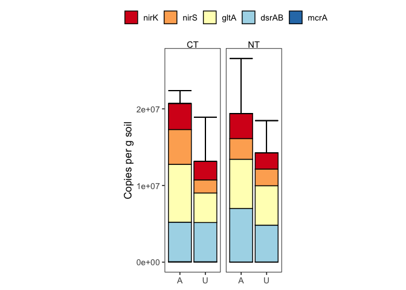<!-- -->

### Statistics

#### Check normality

``` r
total_anaerobe %>% 
  filter(site == "SM") %>% 
  group_by(site, till, amend) %>% 
  summarise(
    normality_p = shapiro.test(anaerobe_copies_per_g)$p.value
  ) %>% 
  arrange(normality_p)
```

    ## # A tibble: 5 × 4
    ## # Groups:   site, till [3]
    ##   site  till  amend normality_p
    ##   <chr> <chr> <chr>       <dbl>
    ## 1 SM    NT    A          0.0139
    ## 2 SM    CT    A          0.108 
    ## 3 SM    UN    U          0.423 
    ## 4 SM    CT    U          0.588 
    ## 5 SM    NT    U          0.804

SM-NT-A is non-normal, non-amenable to transformations

#### Test for equal variances

``` r
leveneTest(
  anaerobe_copies_per_g~amend*till,
  data = total_anaerobe %>% filter(site == "SM", till %in% c("CT", "NT"))
)
```

    ## Levene's Test for Homogeneity of Variance (center = median)
    ##       Df F value Pr(>F)
    ## group  3  0.5167 0.6823
    ##        8

Equal variances

#### test for differences in amended vs. unamended soils

Will use t-test for differences between amended and unamended

**CT**

``` r
t.test(
  x = 
    total_anaerobe %>% 
    filter(site == "SM", till == "CT", amend == "A") %>% 
    pull(anaerobe_copies_per_g),
  y = 
    total_anaerobe %>% 
    filter(site == "SM", till == "CT", amend == "U") %>% 
    pull(anaerobe_copies_per_g),
  alternative = c("greater"),
  var.equal = TRUE
)
```

    ## 
    ##  Two Sample t-test
    ## 
    ## data:  total_anaerobe %>% filter(site == "SM", till == "CT", amend == "A") %>% pull(anaerobe_copies_per_g) and total_anaerobe %>% filter(site == "SM", till == "CT", amend == "U") %>% pull(anaerobe_copies_per_g)
    ## t = 1.3637, df = 4, p-value = 0.1222
    ## alternative hypothesis: true difference in means is greater than 0
    ## 95 percent confidence interval:
    ##  -4055119      Inf
    ## sample estimates:
    ## mean of x mean of y 
    ##  20655217  13455668

**NT**

``` r
wilcox.test(
  x = 
    total_anaerobe %>% 
    filter(site == "SM", till == "NT", amend == "A") %>% 
    pull(anaerobe_copies_per_g),
  y = 
    total_anaerobe %>% 
    filter(site == "SM", till == "NT", amend == "U") %>% 
    pull(anaerobe_copies_per_g),
  alternative = c("greater") #this really depends! 
)
```

    ## 
    ##  Wilcoxon rank sum exact test
    ## 
    ## data:  total_anaerobe %>% filter(site == "SM", till == "NT", amend == "A") %>% pull(anaerobe_copies_per_g) and total_anaerobe %>% filter(site == "SM", till == "NT", amend == "U") %>% pull(anaerobe_copies_per_g)
    ## W = 6, p-value = 0.35
    ## alternative hypothesis: true location shift is greater than 0

### Figure - faceted

``` r
all_ddpcr_data %>% 
  group_by(site, till, amend, landscape_position, target_gene) %>% 
  summarise(
    avg_copies_per_g = mean(copies_per_g, na.rm = TRUE),
    se_copies_per_g = sd(copies_per_g, na.rm = TRUE) / sqrt(n())
  ) %>% 
  filter(site == "SM", till %in% c("CT", "NT")) %>% 
  mutate(
    across(
      target_gene, 
      ~factor(
        ., 
        levels = c("nirK", "nirS", "gltA", "dsrAB", "mcrA"),
        labels = c("nirK", "nirS", "gltA", "dsrAB", "mcrA")
      )
    )
  ) %>% 
  ggplot(aes(y = avg_copies_per_g, x = amend, fill = target_gene)) + 
  geom_col(position = "dodge", color = "black") +
  geom_errorbar(
    aes(
      ymin = avg_copies_per_g,
      ymax = avg_copies_per_g + se_copies_per_g
    ),
    position = "dodge"
  ) +
  scale_fill_brewer(palette = "RdYlBu") +
  scale_y_continuous(labels = scientific) +
  facet_grid(
    cols = vars(till), 
    rows = vars(target_gene), 
    scales = "free",
    labeller = labeller(site = site_labels)
  ) + 
  theme_bw() + 
  my_theme() +
  theme(
    aspect.ratio = 1,
    legend.position = "none",
    strip.text.y = element_text(face = "italic")
  ) +
  labs(
    y = "Copies per g soil",
    x = NULL
  )
```

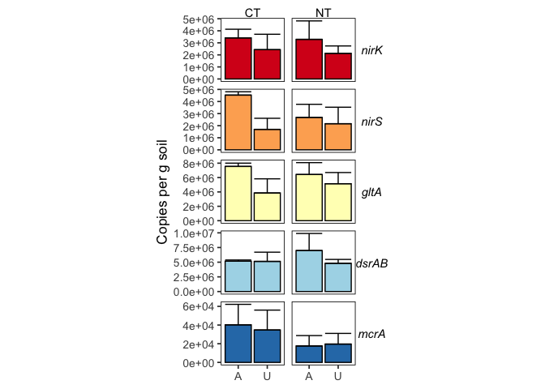<!-- -->

#### Check Normality

**All target genes**

``` r
all_ddpcr_data %>% 
  filter(
    site == "SM", 
    till %in% c("CT", "NT")
  ) %>%
  group_by(site, till, amend, target_gene) %>% 
  summarise(
    normality_p = shapiro.test(copies_per_g)$p.value
  ) %>%
  arrange(target_gene, normality_p)
```

    ## # A tibble: 20 × 5
    ## # Groups:   site, till, amend [4]
    ##    site  till  amend target_gene normality_p
    ##    <chr> <chr> <chr> <chr>             <dbl>
    ##  1 SM    NT    U     dsrAB            0.199 
    ##  2 SM    NT    A     dsrAB            0.363 
    ##  3 SM    CT    U     dsrAB            0.707 
    ##  4 SM    CT    A     dsrAB            0.746 
    ##  5 SM    CT    U     gltA             0.0574
    ##  6 SM    NT    U     gltA             0.181 
    ##  7 SM    NT    A     gltA             0.431 
    ##  8 SM    CT    A     gltA             0.570 
    ##  9 SM    NT    U     mcrA             0.103 
    ## 10 SM    CT    U     mcrA             0.264 
    ## 11 SM    NT    A     mcrA             0.275 
    ## 12 SM    CT    A     mcrA             0.788 
    ## 13 SM    NT    A     nirK             0.201 
    ## 14 SM    CT    A     nirK             0.224 
    ## 15 SM    NT    U     nirK             0.280 
    ## 16 SM    CT    U     nirK             0.637 
    ## 17 SM    CT    U     nirS             0.0471
    ## 18 SM    NT    A     nirS             0.388 
    ## 19 SM    CT    A     nirS             0.570 
    ## 20 SM    NT    U     nirS             0.732

nirS appears non-normal for SM-CT-U

**nirS**

``` r
all_ddpcr_data %>% 
  filter(
    site == "SM", 
    till %in% c("CT", "NT"), 
    target_gene == "nirS"
  ) %>%
  group_by(site, till, amend, target_gene) %>% 
  summarise(
    normality_p = shapiro.test(log(copies_per_g))$p.value
  ) %>%
  arrange(target_gene, normality_p)
```

    ## # A tibble: 4 × 5
    ## # Groups:   site, till, amend [4]
    ##   site  till  amend target_gene normality_p
    ##   <chr> <chr> <chr> <chr>             <dbl>
    ## 1 SM    CT    U     nirS              0.110
    ## 2 SM    NT    U     nirS              0.278
    ## 3 SM    NT    A     nirS              0.676
    ## 4 SM    CT    A     nirS              0.686

A log transform helps SM-CT-U nirK meet the assumptions of normality

#### Check for equal variances

``` r
bartlett.test( 
  copies_per_g ~ amend,
  data = 
    all_ddpcr_data %>% 
    filter(site == "SM", target_gene == "mcrA", till == "CT")
) 
```

    ## 
    ##  Bartlett test of homogeneity of variances
    ## 
    ## data:  copies_per_g by amend
    ## Bartlett's K-squared = 0.025068, df = 1, p-value = 0.8742

``` r
bartlett.test( 
  copies_per_g ~ amend,
  data = 
    all_ddpcr_data %>% 
    filter(site == "SM", target_gene == "mcrA", till == "NT")
) 
```

    ## 
    ##  Bartlett test of homogeneity of variances
    ## 
    ## data:  copies_per_g by amend
    ## Bartlett's K-squared = 0.0016525, df = 1, p-value = 0.9676

``` r
bartlett.test( 
  log(copies_per_g) ~ amend,
  data = 
    all_ddpcr_data %>% 
    filter(site == "SM", target_gene == "dsrAB", till == "CT")
) 
```

    ## 
    ##  Bartlett test of homogeneity of variances
    ## 
    ## data:  log(copies_per_g) by amend
    ## Bartlett's K-squared = 5.4977, df = 1, p-value = 0.01904

``` r
bartlett.test( 
  log(copies_per_g) ~ amend,
  data = 
    all_ddpcr_data %>% 
    filter(site == "SM", target_gene == "dsrAB", till == "NT")
) 
```

    ## 
    ##  Bartlett test of homogeneity of variances
    ## 
    ## data:  log(copies_per_g) by amend
    ## Bartlett's K-squared = 1.7173, df = 1, p-value = 0.19

``` r
bartlett.test( 
  copies_per_g ~ amend,
  data = 
    all_ddpcr_data %>% 
    filter(site == "SM", target_gene == "gltA", till == "CT")
) 
```

    ## 
    ##  Bartlett test of homogeneity of variances
    ## 
    ## data:  copies_per_g by amend
    ## Bartlett's K-squared = 3.314, df = 1, p-value = 0.06869

``` r
bartlett.test( 
  copies_per_g ~ amend,
  data = 
    all_ddpcr_data %>% 
    filter(site == "SM", target_gene == "gltA", till == "NT")
) 
```

    ## 
    ##  Bartlett test of homogeneity of variances
    ## 
    ## data:  copies_per_g by amend
    ## Bartlett's K-squared = 0.0089954, df = 1, p-value = 0.9244

``` r
bartlett.test( 
  copies_per_g ~ amend,
  data = 
    all_ddpcr_data %>% 
    filter(site == "SM", target_gene == "nirS", till == "CT")
) 
```

    ## 
    ##  Bartlett test of homogeneity of variances
    ## 
    ## data:  copies_per_g by amend
    ## Bartlett's K-squared = 2.1307, df = 1, p-value = 0.1444

``` r
bartlett.test( 
  copies_per_g ~ amend,
  data = 
    all_ddpcr_data %>% 
    filter(site == "SM", target_gene == "nirS", till == "NT")
) 
```

    ## 
    ##  Bartlett test of homogeneity of variances
    ## 
    ## data:  copies_per_g by amend
    ## Bartlett's K-squared = 0.084218, df = 1, p-value = 0.7717

``` r
bartlett.test( 
  log(copies_per_g) ~ amend,
  data = 
    all_ddpcr_data %>% 
    filter(site == "SM", target_gene == "nirK", till == "CT")
) 
```

    ## 
    ##  Bartlett test of homogeneity of variances
    ## 
    ## data:  log(copies_per_g) by amend
    ## Bartlett's K-squared = 2.9832, df = 1, p-value = 0.08413

``` r
bartlett.test( 
  copies_per_g ~ amend,
  data = 
    all_ddpcr_data %>% 
    filter(site == "SM", target_gene == "nirK", till == "NT")
) 
```

    ## 
    ##  Bartlett test of homogeneity of variances
    ## 
    ## data:  copies_per_g by amend
    ## Bartlett's K-squared = 1.1935, df = 1, p-value = 0.2746

Unequal variances: SM-CT dsrAB

#### test for differences

t-tests with equal variances (except in cases outlined above)
Log-transform SM-CT nirK comparisons

**mcrA**

``` r
t.test(
  x = 
    all_ddpcr_data %>% 
    filter(
      site == "SM", 
      till == "CT", 
      amend == "A", 
      target_gene == "mcrA"
    ) %>% 
    pull(copies_per_g),
  y = 
    all_ddpcr_data %>% 
    filter(
      site == "SM", 
      till == "CT", 
      amend == "U",
      target_gene == "mcrA"
    ) %>% 
    pull(copies_per_g),
  alternative = c("greater"),
  var.equal = TRUE
)
```

    ## 
    ##  Two Sample t-test
    ## 
    ## data:  all_ddpcr_data %>% filter(site == "SM", till == "CT", amend == "A", target_gene == "mcrA") %>% pull(copies_per_g) and all_ddpcr_data %>% filter(site == "SM", till == "CT", amend == "U", target_gene == "mcrA") %>% pull(copies_per_g)
    ## t = 0.17687, df = 5, p-value = 0.4333
    ## alternative hypothesis: true difference in means is greater than 0
    ## 95 percent confidence interval:
    ##  -57308.58       Inf
    ## sample estimates:
    ## mean of x mean of y 
    ##  40220.23  34706.05

``` r
t.test(
  x = 
    all_ddpcr_data %>% 
    filter(
      site == "SM", 
      till == "NT", 
      amend == "A", 
      target_gene == "mcrA"
    ) %>% 
    pull(copies_per_g),
  y = 
    all_ddpcr_data %>% 
    filter(
      site == "SM", 
      till == "NT", 
      amend == "U",
      target_gene == "mcrA"
    ) %>% 
    pull(copies_per_g),
  alternative = c("two.sided"),
  var.equal = TRUE
)
```

    ## 
    ##  Two Sample t-test
    ## 
    ## data:  all_ddpcr_data %>% filter(site == "SM", till == "NT", amend == "A", target_gene == "mcrA") %>% pull(copies_per_g) and all_ddpcr_data %>% filter(site == "SM", till == "NT", amend == "U", target_gene == "mcrA") %>% pull(copies_per_g)
    ## t = -0.12716, df = 6, p-value = 0.903
    ## alternative hypothesis: true difference in means is not equal to 0
    ## 95 percent confidence interval:
    ##  -41067.32  37009.93
    ## sample estimates:
    ## mean of x mean of y 
    ##  17585.62  19614.32

**dsrAB**

``` r
t.test(
  x = 
    all_ddpcr_data %>% 
    filter(
      site == "SM", 
      till == "CT", 
      amend == "A", 
      target_gene == "dsrAB"
    ) %>% 
    pull(copies_per_g) %>% log(),
  y = 
    all_ddpcr_data %>% 
    filter(
      site == "SM", 
      till == "CT", 
      amend == "U",
      target_gene == "dsrAB"
    ) %>% 
    pull(copies_per_g) %>% log(),
  alternative = c("two.sided"),
  var.equal = FALSE
)
```

    ## 
    ##  Welch Two Sample t-test
    ## 
    ## data:  all_ddpcr_data %>% filter(site == "SM", till == "CT", amend == "A", target_gene == "dsrAB") %>% pull(copies_per_g) %>% log() and all_ddpcr_data %>% filter(site == "SM", till == "CT", amend == "U", target_gene == "dsrAB") %>% pull(copies_per_g) %>% log()
    ## t = 0.48723, df = 3.081, p-value = 0.6587
    ## alternative hypothesis: true difference in means is not equal to 0
    ## 95 percent confidence interval:
    ##  -0.889019  1.216125
    ## sample estimates:
    ## mean of x mean of y 
    ##  15.45731  15.29375

``` r
t.test(
  x = 
    all_ddpcr_data %>% 
    filter(
      site == "SM", 
      till == "NT", 
      amend == "A", 
      target_gene == "dsrAB"
    ) %>% 
    pull(copies_per_g),
  y = 
    all_ddpcr_data %>% 
    filter(
      site == "SM", 
      till == "NT", 
      amend == "U",
      target_gene == "dsrAB"
    ) %>% 
    pull(copies_per_g),
  alternative = c("two.sided"),
  var.equal = TRUE
)
```

    ## 
    ##  Two Sample t-test
    ## 
    ## data:  all_ddpcr_data %>% filter(site == "SM", till == "NT", amend == "A", target_gene == "dsrAB") %>% pull(copies_per_g) and all_ddpcr_data %>% filter(site == "SM", till == "NT", amend == "U", target_gene == "dsrAB") %>% pull(copies_per_g)
    ## t = 0.72878, df = 4, p-value = 0.5065
    ## alternative hypothesis: true difference in means is not equal to 0
    ## 95 percent confidence interval:
    ##  -6109084 10457654
    ## sample estimates:
    ## mean of x mean of y 
    ##   6982550   4808265

**gltA**

``` r
t.test(
  x = 
    all_ddpcr_data %>% 
    filter(
      site == "SM", 
      till == "CT", 
      amend == "A", 
      target_gene == "dsrAB"
    ) %>% 
    pull(copies_per_g),
  y = 
    all_ddpcr_data %>% 
    filter(
      site == "SM", 
      till == "CT", 
      amend == "U",
      target_gene == "gltA"
    ) %>% 
    pull(copies_per_g),
  alternative = c("two.sided"),
  var.equal = FALSE
)
```

    ## 
    ##  Welch Two Sample t-test
    ## 
    ## data:  all_ddpcr_data %>% filter(site == "SM", till == "CT", amend == "A", target_gene == "dsrAB") %>% pull(copies_per_g) and all_ddpcr_data %>% filter(site == "SM", till == "CT", amend == "U", target_gene == "gltA") %>% pull(copies_per_g)
    ## t = 0.66601, df = 3.0629, p-value = 0.5521
    ## alternative hypothesis: true difference in means is not equal to 0
    ## 95 percent confidence interval:
    ##  -4908633  7545310
    ## sample estimates:
    ## mean of x mean of y 
    ##   5172249   3853910

``` r
t.test(
  x = 
    all_ddpcr_data %>% 
    filter(
      site == "SM", 
      till == "NT", 
      amend == "A", 
      target_gene == "gltA"
    ) %>% 
    pull(copies_per_g),
  y = 
    all_ddpcr_data %>% 
    filter(
      site == "SM", 
      till == "NT", 
      amend == "U",
      target_gene == "dsrAB"
    ) %>% 
    pull(copies_per_g),
  alternative = c("two.sided"),
  var.equal = TRUE
)
```

    ## 
    ##  Two Sample t-test
    ## 
    ## data:  all_ddpcr_data %>% filter(site == "SM", till == "NT", amend == "A", target_gene == "gltA") %>% pull(copies_per_g) and all_ddpcr_data %>% filter(site == "SM", till == "NT", amend == "U", target_gene == "dsrAB") %>% pull(copies_per_g)
    ## t = 0.79592, df = 5, p-value = 0.4622
    ## alternative hypothesis: true difference in means is not equal to 0
    ## 95 percent confidence interval:
    ##  -3605420  6839440
    ## sample estimates:
    ## mean of x mean of y 
    ##   6425275   4808265

**nirS**

``` r
t.test(
  x = 
    all_ddpcr_data %>% 
    filter(
      site == "SM", 
      till == "CT", 
      amend == "A", 
      target_gene == "nirS"
    ) %>% 
    pull(copies_per_g),
  y = 
    all_ddpcr_data %>% 
    filter(
      site == "SM", 
      till == "CT", 
      amend == "U",
      target_gene == "nirS"
    ) %>% 
    pull(copies_per_g),
  alternative = c("two.sided"),
  var.equal = TRUE
)
```

    ## 
    ##  Two Sample t-test
    ## 
    ## data:  all_ddpcr_data %>% filter(site == "SM", till == "CT", amend == "A", target_gene == "nirS") %>% pull(copies_per_g) and all_ddpcr_data %>% filter(site == "SM", till == "CT", amend == "U", target_gene == "nirS") %>% pull(copies_per_g)
    ## t = 3.3911, df = 5, p-value = 0.01944
    ## alternative hypothesis: true difference in means is not equal to 0
    ## 95 percent confidence interval:
    ##   686350.2 4987081.7
    ## sample estimates:
    ## mean of x mean of y 
    ##   4528625   1691909

``` r
t.test(
  x = 
    all_ddpcr_data %>% 
    filter(
      site == "SM", 
      till == "NT", 
      amend == "A", 
      target_gene == "nirS"
    ) %>% 
    pull(copies_per_g),
  y = 
    all_ddpcr_data %>% 
    filter(
      site == "SM", 
      till == "NT", 
      amend == "U",
      target_gene == "nirS"
    ) %>% 
    pull(copies_per_g),
  alternative = c("two.sided"),
  var.equal = TRUE
)
```

    ## 
    ##  Two Sample t-test
    ## 
    ## data:  all_ddpcr_data %>% filter(site == "SM", till == "NT", amend == "A", target_gene == "nirS") %>% pull(copies_per_g) and all_ddpcr_data %>% filter(site == "SM", till == "NT", amend == "U", target_gene == "nirS") %>% pull(copies_per_g)
    ## t = 0.2996, df = 4, p-value = 0.7794
    ## alternative hypothesis: true difference in means is not equal to 0
    ## 95 percent confidence interval:
    ##  -4320666  5365943
    ## sample estimates:
    ## mean of x mean of y 
    ##   2684188   2161550

**nirK**

``` r
t.test(
  x = 
    all_ddpcr_data %>% 
    filter(
      site == "SM", 
      till == "CT", 
      amend == "A", 
      target_gene == "nirK"
    ) %>% 
    mutate(
      log_copies_per_g = log(copies_per_g)
    ) %>% 
    pull(log_copies_per_g),
  y = 
    all_ddpcr_data %>% 
    filter(
      site == "SM", 
      till == "CT", 
      amend == "U",
      target_gene == "nirS"
    ) %>% 
    mutate(
      log_copies_per_g = log(copies_per_g)
    ) %>% 
    pull(log_copies_per_g),
  alternative = c("two.sided"),
  var.equal = TRUE
)
```

    ## 
    ##  Two Sample t-test
    ## 
    ## data:  all_ddpcr_data %>% filter(site == "SM", till == "CT", amend == "A", target_gene == "nirK") %>% mutate(log_copies_per_g = log(copies_per_g)) %>% pull(log_copies_per_g) and all_ddpcr_data %>% filter(site == "SM", till == "CT", amend == "U", target_gene == "nirS") %>% mutate(log_copies_per_g = log(copies_per_g)) %>% pull(log_copies_per_g)
    ## t = 1.7196, df = 4, p-value = 0.1606
    ## alternative hypothesis: true difference in means is not equal to 0
    ## 95 percent confidence interval:
    ##  -0.5760887  2.4508229
    ## sample estimates:
    ## mean of x mean of y 
    ##  15.00050  14.06313

``` r
t.test(
  x = 
    all_ddpcr_data %>% 
    filter(
      site == "SM", 
      till == "NT", 
      amend == "A", 
      target_gene == "nirK"
    ) %>% 
    pull(copies_per_g),
  y = 
    all_ddpcr_data %>% 
    filter(
      site == "SM", 
      till == "NT", 
      amend == "U",
      target_gene == "nirK"
    ) %>% 
    pull(copies_per_g),
  alternative = c("two.sided"),
  var.equal = TRUE
)
```

    ## 
    ##  Two Sample t-test
    ## 
    ## data:  all_ddpcr_data %>% filter(site == "SM", till == "NT", amend == "A", target_gene == "nirK") %>% pull(copies_per_g) and all_ddpcr_data %>% filter(site == "SM", till == "NT", amend == "U", target_gene == "nirK") %>% pull(copies_per_g)
    ## t = 0.78655, df = 5, p-value = 0.4672
    ## alternative hypothesis: true difference in means is not equal to 0
    ## 95 percent confidence interval:
    ##  -2626726  4942870
    ## sample estimates:
    ## mean of x mean of y 
    ##   3287969   2129897

# Relative Abundance (total anaerobe / 16S copies)

## Unamended, effect of tillage across sites

``` r
prop_anaerobe <-
  all_ddpcr_data %>% 
  group_by(site, till, amend, landscape_position, target_gene) %>% 
  summarise(
    avg_prop = mean(prop, na.rm = TRUE),
    se_prop = sd(prop, na.rm = TRUE) / sqrt(n()),
    avg_perc = avg_prop * 100
  ) 
```

Lowest relative abundance

``` r
prop_anaerobe %>% 
  arrange(avg_perc)
```

    ## # A tibble: 85 × 8
    ## # Groups:   site, till, amend, landscape_position [17]
    ##    site  till  amend landscape_position target_gene  avg_prop    se_prop avg_p…¹
    ##    <chr> <chr> <chr> <chr>              <chr>           <dbl>      <dbl>   <dbl>
    ##  1 SM    NT    A     <NA>               mcrA        0.0000236 0.0000204  0.00236
    ##  2 GR    NT    U     F                  mcrA        0.0000352 0.00000714 0.00352
    ##  3 CREC  CT    U     <NA>               mcrA        0.0000381 0.0000143  0.00381
    ##  4 CREC  UN    U     <NA>               mcrA        0.0000398 0.0000120  0.00398
    ##  5 CREC  NT    U     <NA>               mcrA        0.0000482 0.00000818 0.00482
    ##  6 SM    NT    U     <NA>               mcrA        0.0000508 0.0000296  0.00508
    ##  7 CREC  MT    U     <NA>               mcrA        0.0000631 0.0000199  0.00631
    ##  8 SM    CT    U     <NA>               mcrA        0.000108  0.0000622  0.0108 
    ##  9 WO    UN    U     <NA>               mcrA        0.000118  0.0000456  0.0118 
    ## 10 SM    CT    A     <NA>               mcrA        0.000121  0.0000661  0.0121 
    ## # … with 75 more rows, and abbreviated variable name ¹​avg_perc

``` r
prop_anaerobe %>% 
  ggplot(aes(x = avg_perc, fill = target_gene)) + 
  geom_density() +
  facet_wrap(facets = vars(target_gene), scales = "free") + 
  labs(
    x = "target gene abundance normalized to 16S (%)"
  )
```

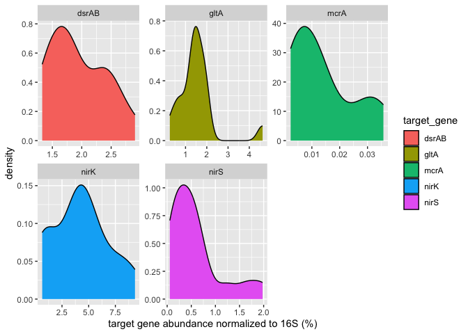<!-- -->

Highest relative abundance targets

``` r
prop_anaerobe %>% arrange(-avg_perc)
```

    ## # A tibble: 85 × 8
    ## # Groups:   site, till, amend, landscape_position [17]
    ##    site  till  amend landscape_position target_gene avg_prop se_prop avg_perc
    ##    <chr> <chr> <chr> <chr>              <chr>          <dbl>   <dbl>    <dbl>
    ##  1 WO    NT    U     <NA>               nirK          0.0934 0.00753     9.34
    ##  2 WO    CT    U     <NA>               nirK          0.0826 0.0155      8.26
    ##  3 SM    UN    U     <NA>               nirK          0.0739 0.0121      7.39
    ##  4 GR    NT    U     C                  nirK          0.0624 0.0133      6.24
    ##  5 GR    NT    U     F                  nirK          0.0554 0.0109      5.54
    ##  6 WO    UN    U     <NA>               nirK          0.0515 0.00684     5.15
    ##  7 CREC  NT    A     <NA>               nirK          0.0466 0.0163      4.66
    ##  8 WO    NT    U     <NA>               gltA          0.0463 0.00663     4.63
    ##  9 GR    NT    U     S                  nirK          0.0450 0.0104      4.50
    ## 10 CREC  NT    U     <NA>               nirK          0.0407 0.00911     4.07
    ## # … with 75 more rows
